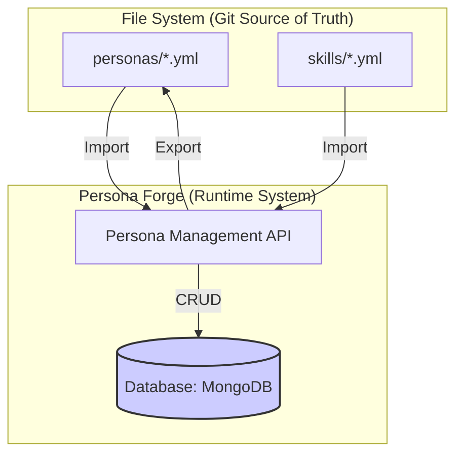

# Persona Forge System Architecture

## 1. Overview

The Persona Forge is a dynamic, database-driven system for managing agent configurations. It bridges the gap between static, version-controlled YAML files and a live, editable runtime environment. It treats agent personas and skills as data that can be loaded, composed, modified, and saved, enabling rapid experimentation and flexible agent creation.

## 2. Core Components



## 3. Database Schema (MongoDB)

We will use two main collections: `skills` and `personas`.

### 3.1. `skills` Collection

Stores the raw, reusable skill components.

```json
{
  "_id": "core-engineering-v1", // (string) a unique slug for the skill
  "name": "Core Engineering", // (string)
  "version": "1.0", // (string)
  "description": "Foundational skills for software engineering agents.",
  "components": {
    "system_prompt": { ... }, // (object) The parsed system-prompt.yml
    "workflow": { ... }      // (object) The parsed workflow.yml
  },
  "createdAt": "...", // (date)
  "updatedAt": "..."  // (date)
}
```

### 3.2. `personas` Collection

Stores the definition of a loadable agent.

```json
{
  "_id": "griot-v1", // (string) a unique slug for the persona
  "name": "Griot - Core Engineer", // (string)
  "version": "1.0", // (string)
  "description": "A general-purpose software engineering agent.",
  "imports": [
    "core-engineering-v1" // (array<string>) List of skill _ids to import
  ],
  "createdAt": "...", // (date)
  "updatedAt": "..."  // (date)
}
```

## 4. Persona Management API (KLF-Compatible)

The API provides endpoints for managing the lifecycle of personas and skills.

### `POST /import`
- **Action**: Scans the `agents/skills` and `agents/personas` directories. Parses all YAML files and upserts them into the MongoDB collections. This is the primary way to sync the database with the Git repository.
- **Response**: `{ "status": "success", "imported_skills": 5, "imported_personas": 2 }`

### `GET /personas/:id`
- **Action**: Retrieves a single persona by its ID. It then **composes** the full persona by retrieving all imported skills and merging their `components` into a single, unified object.
- **Response**: A fully composed persona object, ready to be injected into an agent's context.

### `PUT /personas/:id/live`
- **Action**: This is the "live edit" endpoint. It takes a partial persona object and updates the corresponding document in the database. This does **not** write to the file system.
- **Request Body**: `{ "imports": ["core-engineering-v1", "new-skill-v1"] }`
- **Response**: The updated, composed persona object.

### `POST /personas/:id/export`
- **Action**: Takes the current state of a persona from the database and writes it to the file system. It should create a new version-stamped directory (e.g., `griot-v2`).
- **Response**: `{ "status": "success", "path": "agents/personas/griot-v2" }`

## 5. Implementation Tasks

This architecture will be implemented via the following tasks:

- [ ] Task 1: Set up MongoDB connection and define Mongoose schemas for `Skill` and `Persona`.
- [ ] Task 2: Implement the `/import` service to parse YAML files and populate the database.
- [ ] Task 3: Implement the `GET /personas/:id` endpoint with skill composition logic.
- [ ] Task 4: Implement the `PUT /personas/:id/live` endpoint for dynamic updates.
- [ ] Task 5: Implement the `POST /personas/:id/export` service to write back to the file system.
- [ ] Task 6: Create a command-line interface (CLI) or basic UI to interact with the API.
- [ ] Task 7: Write comprehensive documentation for the Persona Forge system. 