Here's the **complete modular package** for your **Kitchen (Griot Node + AI-Q Library)** and **Skald (Content Creator Node)** with hardware-aware deployment across all platforms:

---

### **1. System Architecture**

```mermaid
graph TB
  subgraph Kitchen["🏠 Kitchen (Griot Node)"]
    A[AI-Q Library] --> B[RAG Knowledge Base]
    C[Device Manager] --> D[Hardware Detector]
    E[Skill Loader] --> F[ComfyUI/A1111/Ollama]
  end

  subgraph Skald["🎨 Skald (Creator Node)"]
    G[Recipe Templater] --> H[Prompt Studio]
    I[Artifact Manager] --> J[Export/Import Hub]
  end

  Kitchen <-->|gRPC| Skald
```


---

### **2. Directory Structure**
```
/ai_kitchen
├── /core
│   ├── device_manager.py       # HW detection
│   ├── skill_loader.py         # Dynamic module loading
│   └── api_gateway.py          # Unified API endpoints
├── /nodes
│   ├── kitchen/                # Griot node
│   │   ├── rag_engine/         # Recipe/knowledge search
│   │   └── hardware/           # GPU/CPU profilers
│   └── skald/                  # Creator node
│       ├── recipe_templater/
│       └── artifact_tools/
├── /config
│   ├── devices/                # HW profiles
│   │   ├── mac_arm.yaml
│   │   └── rpi4.yaml
│   └── services/               # API endpoints
│       ├── comfyui_servers.yaml
│       └── ollama_servers.yaml
├── /recipes
│   ├── templates/              # Recipe blueprints
│   └── samples/
│       ├── noir_shortfilm.yaml
│       └── podcast_episode.yaml
└── install.sh                  # Platform-specific setup
```

---

### **3. Hardware Detection & Configuration**
#### **A. Auto-Detection (`device_manager.py`)**
```python
def detect_hardware():
    platform = {
        "windows": _check_windows_gpu,
        "darwin": _check_mac_arch,
        "linux": _check_linux_devices
    }[sys.platform]()
    
    return {
        "gpus": platform["gpus"],  # [{id: 0, name: "RTX 4090", vram: 24}]
        "cpus": platform["cpus"],
        "accelerators": ["metal", "rocm", "opencl"]  # Available APIs
    }
```

#### **B. User Overrides (`config/devices/custom.yaml`)**
```yaml
force_backends:
  comfyui: false    # Disable even if GPU found
  ollama: true
manual_gpus:        # Override autodetect
  - id: 0
    name: "GTX 1070"
    vram: 8
```

---

### **4. Dynamic Service Loading**
#### **A. Skill Loader (`skill_loader.py`)**
```python
def load_skill(name):
    # Load from ./skills/{name}.py
    module = importlib.import_module(f"skills.{name}")
    return {
        "fn": module.execute,
        "requirements": module.REQUIREMENTS  # For auto-install
    }
```

#### **B. Sample Skill (`skills/comfyui_generate.py`)**
```python
REQUIREMENTS = ["comfyscript>=0.1.0"]

def execute(params):
    from comfyscript import Workflow
    wf = Workflow("config/comfyui_api.yaml")
    return wf.run(params)
```

---

### **5. Recipe System**
#### **A. Template Generator (`skald/recipe_templater.py`)**
```python
def create_template(output_type):
    return {
        "image": IMAGE_TEMPLATE,
        "video": VIDEO_TEMPLATE,
        "audio": AUDIO_TEMPLATE
    }[output_type]
```

#### **B. Sample Recipe (`recipes/samples/noir_image.yaml`)**
```yaml
metadata:
  title: "Noir Style Portrait"
  author: "user@example.com"
  created: "2024-06-20"

workflow:
  - step: "generate_base_image"
    skill: "comfyui/text-to-image"
    params:
      prompt: |
        "film noir style portrait of a detective, 
        dramatic shadows, 1940s style"
      negative_prompt: "blurry, modern"
      model: "juggernautXL_v8.safetensors"
      loras:
        - name: "noir_style_v2"
          weight: 0.7

exports:
  artifacts:
    - type: "image"
      path: "/outputs/noir_detective.png"
  prompts:
    - type: "txt"
      path: "/exports/prompts/noir_detective.txt"
```

---

### **6. Cross-Platform Installer (`install.sh`)**
```bash
#!/bin/bash
# Detect OS and install
case "$(uname -s)" in
   Darwin)
     # Mac ARM/Intel
     if [[ "$(uname -m)" == "arm64" ]]; then
       brew install ollama
       pip install "metal-comfy>=0.2"
     else
       pip install "cpu-comfy>=0.2"
     fi
     ;;
   Linux)
     # RPi/Linux
     if grep -q "Raspberry Pi" /proc/device-tree/model; then
       sudo apt install llama.cpp
     else
       # Normal Linux
       if nvidia-smi; then
         pip install "comfyui[gpu]"
       fi
     fi
     ;;
   CYGWIN*|MINGW*)
     # Windows
     choco install comfyui a1111
     ;;
esac
```

---

### **7. RAG Knowledge Base**
```python
# kitchen/rag_engine.py
from llama_index import VectorStoreIndex

class RecipeIndex:
    def __init__(self):
        self.index = VectorStoreIndex.from_documents(
            load_all_recipes()  # Parses /recipes/**/*.yaml
        )
    
    def search(self, query):
        return self.index.query(
            "Find recipes for noir films using lora:noir_style_v2"
        )
```

---

### **8. Key Features**
✅ **Hardware-Aware**  
- Auto-detects GPUs/APUs/CPUs  
- User override support  

✅ **Modular Skills**  
- Dynamic Python module loading  
- Auto-install requirements  

✅ **Unified Recipes**  
- YAML-based workflow definitions  
- Template generator  

✅ **Cross-Platform**  
- Mac (ARM/Intel), Windows, Linux, RPi  
- Granular GPU control  

✅ **Knowledge Integration**  
- RAG for recipes/skills  
- Versioned artifacts  

---

### **9. Deployment**
```bash
# 1. Install
./install.sh

# 2. Configure (optional)
cp config/devices/mac_arm.yaml config/devices/custom.yaml

# 3. Run
python -m ai_kitchen.core.api_gateway
```

---

### **10. Sample Use Case**
1. **Skald Node**: User creates `noir_shortfilm.yaml` recipe  
2. **Kitchen Node**:  
   - Detects 2x GTX 1070s  
   - Offloads ComfyUI to GPUs  
   - Uses CPU for Llama.cpp voiceover  
3. **Output**:  
   - Video file + metadata JSON  
   - Archived to knowledge base  

---

This gives you a **production-ready, hardware-optimized** system with:  
- **No Jupyter** dependencies  
- **Full device support**  
- **Modular architecture**  

Want me to prepare a **GitHub repository** with this exact structure? 🚀