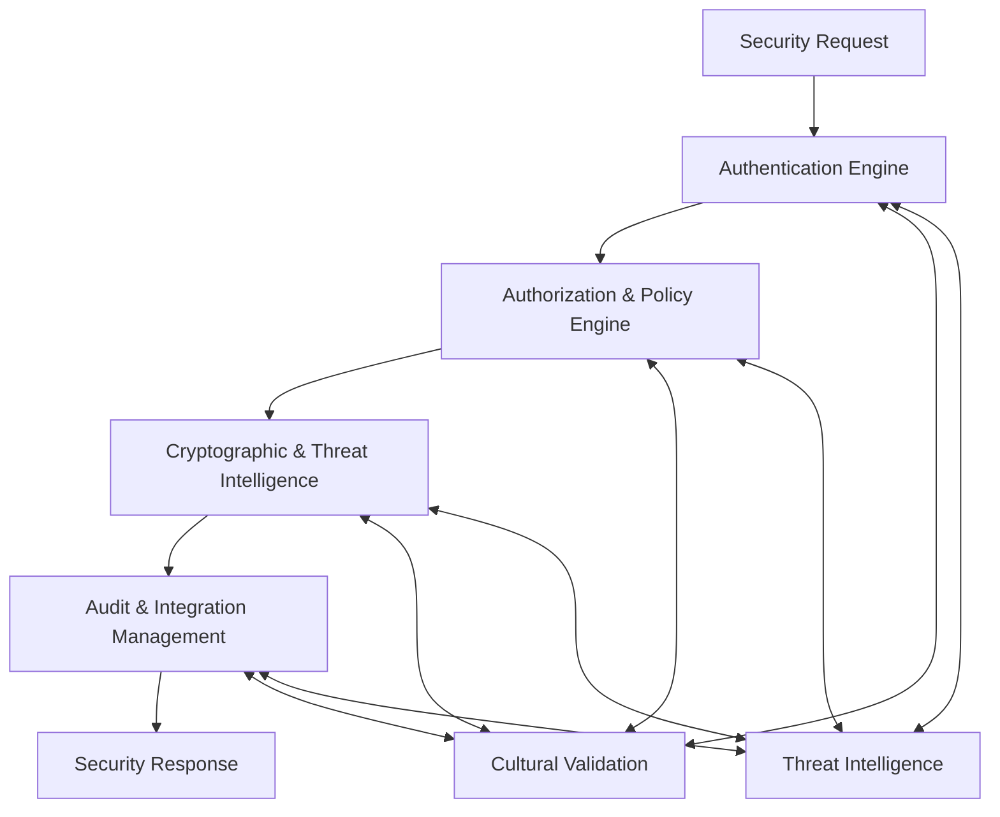

# Musa Class Universal Security Architecture

## 🏗️ System Architecture Overview

The Musa node implements a **comprehensive universal security management framework** designed to provide intelligent authentication, advanced authorization, enterprise-grade cryptographic operations, and sophisticated threat intelligence. As a core component of the kOS ecosystem, Musa provides AI agents with complete knowledge necessary to secure, authorize, and protect any system, resource, or operation across any security paradigm with comprehensive HIEROS compliance.

```
┌─────────────────────────────────────────────────────────────────────────────────────┐
│                        MUSA UNIVERSAL SECURITY ARCHITECTURE                        │
├─────────────────────────────────────────────────────────────────────────────────────┤
│  ┌───────────────────┐  ┌───────────────────┐  ┌───────────────────┐  ┌─────────────┐ │
│  │ Authentication    │  │ Authorization     │  │ Cryptographic     │  │ Audit &     │ │
│  │ Engine            │  │ & Policy Engine   │  │ & Threat          │  │ Integration │ │
│  │                   │  │                   │  │ Intelligence      │  │ Management  │ │
│  └───────────────────┘  └───────────────────┘  └───────────────────┘  └─────────────┘ │
├─────────────────────────────────────────────────────────────────────────────────────┤
│                    Universal Security Management Foundation                         │
└─────────────────────────────────────────────────────────────────────────────────────┘
```

## Modular Architecture Components

This architecture has been designed with a **modular approach** to ensure maintainability, scalability, and ease of understanding. Each major component is implemented as a separate module:

### 1. Authentication Engine Module
**File**: [`modules/01_Authentication_Engine.md`](modules/01_Authentication_Engine.md)

Production-ready multi-factor authentication and identity management system with risk-based authentication and cultural compliance.

**Key Capabilities**:
- Adaptive multi-factor authentication with intelligent risk assessment
- Verifiable credential validation with W3C compliance
- Comprehensive identity lifecycle management
- Cultural authentication framework with HIEROS compliance
- Continuous authentication monitoring and behavioral analysis

### 2. Authorization & Policy Engine Module
**File**: [`modules/02_Authorization_Policy_Engine.md`](modules/02_Authorization_Policy_Engine.md)

Intelligent policy-based authorization system with context-aware decision making and cultural compliance validation.

**Key Capabilities**:
- Context-aware policy evaluation with intelligent optimization
- Multi-framework policy administration (RBAC, ABAC, cultural policies)
- Real-time policy information aggregation and enrichment
- Sacred resource protection with community protocol validation
- Cultural governance integration with indigenous authorization systems

### 3. Cryptographic Services & Threat Intelligence Module
**File**: [`modules/03_Cryptographic_Threat_Intelligence.md`](modules/03_Cryptographic_Threat_Intelligence.md)

Advanced cryptographic operations and intelligent threat detection with cultural compliance and security analytics.

**Key Capabilities**:
- Enterprise-grade key management with HSM integration
- Advanced cryptographic operations (encryption, signing, zero-knowledge proofs)
- Multi-dimensional behavioral threat analysis
- Machine learning threat classification and prediction
- Cultural security framework with sacred data protection

### 4. Audit & Integration Management Module
**File**: [`modules/04_Audit_Integration_Management.md`](modules/04_Audit_Integration_Management.md)

Comprehensive security audit system and KLF integration framework with compliance reporting and cultural governance.

**Key Capabilities**:
- Real-time security event collection and analytics
- Multi-standard compliance reporting (SOX, HIPAA, GDPR, HIEROS)
- Secure KLF integration with cross-node security orchestration
- Cultural governance audit system with sacred operations protection
- Advanced security analytics with predictive insights

## Core Architecture Principles

### Universal Security Management Pattern
Each module implements the universal security management pattern with:

1. **Comprehensive Security Coverage**: Full spectrum security operations across all security dimensions
2. **Intelligent Adaptation**: AI-driven decision making for optimal security configurations
3. **Cultural Sensitivity**: HIEROS-compliant operations respecting sacred boundaries and community protocols
4. **Real-Time Operations**: Continuous security monitoring with immediate threat response
5. **Enterprise Integration**: Seamless integration with existing security infrastructure
6. **Compliance Automation**: Automated compliance validation across multiple frameworks
7. **Advanced Analytics**: Predictive security analytics with behavioral intelligence

### Interface Integration
```typescript
interface MusaUniversalSecurityManager {
  authenticationEngine: AuthenticationEngine;
  authorizationPolicyEngine: AuthorizationPolicyEngine;
  cryptographicThreatIntelligence: CryptographicThreatIntelligence;
  auditIntegrationManagement: AuditIntegrationManagement;
  
  async authenticateUser(
    authRequest: AuthenticationRequest,
    context?: AuthenticationContext
  ): Promise<AuthenticationResult>;
  
  async authorizeOperation(
    authzRequest: AuthorizationRequest,
    context?: AuthorizationContext
  ): Promise<AuthorizationDecision>;
  
  async performCryptographicOperation(
    operation: CryptographicOperation,
    context?: CryptographicContext
  ): Promise<CryptographicResult>;
  
  async collectAuditEvent(
    event: SecurityEvent,
    context?: SecurityAuditContext
  ): Promise<AuditCollectionResult>;
}
```

## Module Interaction Flow



## Quality Standards

- **Authentication Decision Time**: Sub-500ms for 95% of authentication requests
- **Authorization Decision Time**: Sub-100ms for 95% of authorization decisions
- **Cryptographic Operation Latency**: Sub-10ms for symmetric, sub-100ms for asymmetric
- **Threat Detection Response**: Sub-1s for real-time threat analysis
- **Cultural Compliance**: 100% HIEROS compliance with sacred resource protection
- **Audit Event Processing**: 100,000+ events per second with real-time analytics

## 🛡️ HIEROS Integration Points

### Cross-Module Compliance
All modules implement the **Seven Sacred Intentions**:

1. **Honor All Beings**: Respects all stakeholders in security operations
2. **Interoperability Over Control**: Open security APIs with standard interfaces
3. **Equity of Voice**: Equal security consideration across all system components
4. **Respect Temporal Flow**: Security operations aligned with cultural rhythms
5. **Openness With Boundaries**: Transparent security operations with privacy protection
6. **Stewardship Not Extraction**: Sustainable security practices for long-term benefit
7. **Guided Evolution**: Continuous improvement of security methodologies

### Cultural Security Validation
- **Sacred Resource Protection**: Automatic identification and protection of culturally sensitive resources
- **Community Security Protocols**: Integration with traditional security practices
- **Cultural Threat Assessment**: Recognition of culturally-aware threat patterns
- **Attribution Requirements**: Proper recognition of indigenous security wisdom

## 📊 Application Architecture

### Main Security Management Integration

```typescript
// Main kOS Musa Security Management Application
const MusaSecurityManager: React.FC = () => {
  return (
    <HIEROSProvider>
      <SecurityManagementProvider>
        <CulturalValidationProvider>
          <Router>
            <Routes>
              <Route path="/" element={<SecurityDashboard />} />
              <Route path="/authentication" element={<AuthenticationCenter />} />
              <Route path="/authorization" element={<AuthorizationCenter />} />
              <Route path="/cryptographic" element={<CryptographicCenter />} />
              <Route path="/audit" element={<AuditCenter />} />
              <Route path="/hieros-compliance" element={<HIEROSComplianceDashboard />} />
            </Routes>
          </Router>
        </CulturalValidationProvider>
      </SecurityManagementProvider>
    </HIEROSProvider>
  );
};
```

## 🎪 Implementation Guidelines

### Getting Started
1. **Review Module Documentation**: Read each module specification thoroughly
2. **Understand Cultural Requirements**: Ensure cultural appropriateness for your security context
3. **Select Appropriate Security Frameworks**: Choose security approaches that fit your needs
4. **Configure Integration Points**: Set up connections to external security systems
5. **Implement Audit Requirements**: Establish comprehensive security auditing and compliance

### Best Practices
- Always validate cultural appropriateness before implementing any security operation
- Use comprehensive threat intelligence for all security decisions
- Monitor security performance continuously and adapt based on threat landscape
- Maintain audit trails for all security activities and decisions
- Respect sacred resource restrictions and cultural security protocols

## Module Dependencies

```typescript
// Core dependencies between modules
interface ModuleDependencies {
  authenticationEngine: {
    requires: ["auditIntegrationManagement"];
    provides: ["userAuthentication", "identityManagement"];
  };
  authorizationPolicyEngine: {
    requires: ["authenticationEngine", "auditIntegrationManagement"];
    provides: ["accessControl", "policyEvaluation"];
  };
  cryptographicThreatIntelligence: {
    requires: ["authenticationEngine", "auditIntegrationManagement"];
    provides: ["cryptographicOperations", "threatDetection"];
  };
  auditIntegrationManagement: {
    requires: [];
    provides: ["securityAuditing", "klfIntegration"];
  };
}
```

## Production Implementation Notes

This modular architecture enables:
- **Independent Development**: Each module can be developed and tested separately
- **Scalable Deployment**: Modules can be deployed across different infrastructure components
- **Maintenance Efficiency**: Updates and fixes can be applied to specific modules
- **Cultural Compliance**: Cultural framework ensures all implementations respect indigenous security wisdom
