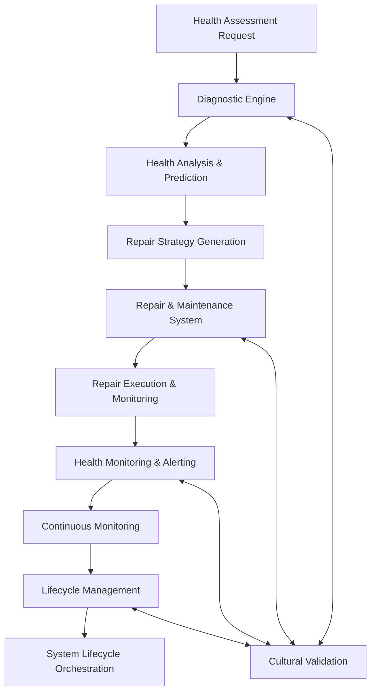

# Hakim Class Universal System Health Architecture

## 🏗️ System Architecture Overview

The Hakim node implements a **comprehensive universal system health management framework** designed to provide intelligent diagnostics, autonomous repair capabilities, real-time monitoring, and complete lifecycle management. As a core component of the kOS ecosystem, Hakim provides AI agents with complete knowledge necessary to maintain, monitor, and manage system health across any infrastructure, platform, or technological environment.

```
┌─────────────────────────────────────────────────────────────────────────────────────┐
│                       HAKIM UNIVERSAL HEALTH ARCHITECTURE                          │
├─────────────────────────────────────────────────────────────────────────────────────┤
│  ┌───────────────────┐  ┌───────────────────┐  ┌───────────────────┐  ┌─────────────┐ │
│  │ Diagnostic        │  │ Repair &          │  │ Health Monitoring │  │ Lifecycle   │ │
│  │ Engine            │  │ Maintenance       │  │ & Alerting        │  │ Management  │ │
│  │                   │  │ System            │  │                   │  │             │ │
│  └───────────────────┘  └───────────────────┘  └───────────────────┘  └─────────────┘ │
├─────────────────────────────────────────────────────────────────────────────────────┤
│                    Universal Health Management Foundation                           │
└─────────────────────────────────────────────────────────────────────────────────────┘
```

## Modular Architecture Components

This architecture has been designed with a **modular approach** to ensure maintainability, scalability, and ease of understanding. Each major component is implemented as a separate module:

### 1. Diagnostic Engine Module
**File**: [`modules/01_Diagnostic_Engine.md`](modules/01_Diagnostic_Engine.md)

Production-ready intelligent diagnostic engine providing multi-dimensional health assessment and predictive analytics with cultural compliance.

**Key Capabilities**:
- Multi-dimensional system health analysis (system, performance, security metrics)
- Advanced predictive health modeling with ensemble ML techniques
- Intelligent diagnostic reasoning (knowledge-based, pattern-based, ML-based)
- Cultural health validation ensuring HIEROS compliance
- Real-time anomaly detection with root cause analysis

### 2. Repair & Maintenance System Module
**File**: [`modules/02_Repair_Maintenance_System.md`](modules/02_Repair_Maintenance_System.md)

Advanced intelligent repair and maintenance system with autonomous orchestration, strategy selection, and cultural compliance.

**Key Capabilities**:
- Autonomous repair orchestration with safety validation
- Intelligent repair strategy generation and optimization
- Multi-step repair execution with rollback capabilities
- Cultural repair validation ensuring respectful maintenance
- Comprehensive repair monitoring and lesson extraction

### 3. Health Monitoring & Alerting Module
**File**: [`modules/03_Health_Monitoring_Alerting.md`](modules/03_Health_Monitoring_Alerting.md)

Intelligent real-time monitoring system with dynamic dashboard generation, trend analysis, and cultural-aware alerting.

**Key Capabilities**:
- Real-time multi-source data collection and processing
- Intelligent alert engine with correlation and escalation
- Dynamic dashboard generation with cultural theming
- Health trend analysis with predictive capabilities
- Cultural monitoring validation for sensitive data protection

### 4. Lifecycle Management Module
**File**: [`modules/04_Lifecycle_Management.md`](modules/04_Lifecycle_Management.md)

Comprehensive system lifecycle orchestration with automated provisioning, configuration management, and secure decommissioning.

**Key Capabilities**:
- System provisioning with resource allocation and deployment
- Advanced configuration management with version control
- Zero-downtime migration orchestration with rollback support
- Secure decommissioning with data retention policy enforcement
- Cultural lifecycle validation for respectful system management

## Core Architecture Principles

### Universal Health Management Pattern
Each module implements the universal health management pattern with:

1. **Comprehensive Health Coverage**: Full spectrum health assessment across all system dimensions
2. **Predictive Intelligence**: AI-driven predictive analytics for proactive health management
3. **Autonomous Operations**: Self-healing capabilities with intelligent repair strategies
4. **Cultural Sensitivity**: HIEROS-compliant operations respecting cultural constraints
5. **Real-Time Monitoring**: Continuous health oversight with immediate alerting
6. **Lifecycle Integration**: Complete system lifecycle management from birth to retirement
7. **Safety First**: Multi-layer safety validation for all health management operations

### Interface Integration
```typescript
interface HakimUniversalHealthManager {
  diagnosticEngine: DiagnosticEngine;
  repairMaintenanceSystem: RepairMaintenanceSystem;
  healthMonitoringAlerting: HealthMonitoringAlerting;
  lifecycleManagement: LifecycleManagement;
  
  async performHealthAssessment(
    target: SystemTarget,
    assessmentConfig: HealthAssessmentConfiguration
  ): Promise<HealthAssessmentResult>;
  
  async executeSystemRepair(
    diagnosticResults: DiagnosticResults,
    repairStrategy: RepairStrategy
  ): Promise<RepairExecutionResult>;
  
  async startHealthMonitoring(
    targets: MonitoringTarget[],
    monitoringConfig: MonitoringConfiguration
  ): Promise<MonitoringSession>;
  
  async orchestrateLifecycle(
    lifecycleRequest: LifecycleRequest
  ): Promise<LifecycleOrchestrationResult>;
}
```

## Module Interaction Flow



## Quality Standards

- **Comprehensive Health Coverage**: 360-degree health assessment across all system dimensions
- **Predictive Accuracy**: 85%+ accuracy for 24-hour health predictions
- **Repair Success Rate**: 95%+ success rate for autonomous repairs
- **Cultural Compliance**: 100% HIEROS compliance with indigenous knowledge respect
- **Real-Time Performance**: Sub-second monitoring response times

## 🛡️ HIEROS Integration Points

### Cross-Module Compliance
All modules implement the **Seven Sacred Intentions**:

1. **Honor All Beings**: Respects all system stakeholders in health management
2. **Interoperability Over Control**: Open health management APIs with standard interfaces
3. **Equity of Voice**: Equal health consideration across all system components
4. **Respect Temporal Flow**: Health operations aligned with natural and cultural rhythms
5. **Openness With Boundaries**: Transparent health management with privacy protection
6. **Stewardship Not Extraction**: Sustainable health practices for long-term system benefit
7. **Guided Evolution**: Continuous improvement of health management methodologies

### Cultural Health Validation
- **Sacred System Protection**: Ensures health operations don't compromise culturally sacred components
- **Community Consent**: Requires appropriate consent for significant system changes
- **Cultural Timing**: Respects cultural restrictions on health management activities
- **Attribution Requirements**: Proper recognition of indigenous health management wisdom

## 📊 Application Architecture

### Main Health Management Integration

```typescript
// Main kOS Hakim Health Management Application
const HakimHealthManager: React.FC = () => {
  return (
    <HIEROSProvider>
      <HealthManagementProvider>
        <CulturalValidationProvider>
          <Router>
            <Routes>
              <Route path="/" element={<HealthDashboard />} />
              <Route path="/diagnostics" element={<DiagnosticCenter />} />
              <Route path="/repairs" element={<RepairCenter />} />
              <Route path="/monitoring" element={<MonitoringCenter />} />
              <Route path="/lifecycle" element={<LifecycleCenter />} />
              <Route path="/hieros-compliance" element={<HIEROSComplianceDashboard />} />
            </Routes>
          </Router>
        </CulturalValidationProvider>
      </HealthManagementProvider>
    </HIEROSProvider>
  );
};
```

## 🎪 Implementation Guidelines

### Development Workflow
1. **Start with Module 1**: Establish diagnostic capabilities and health assessment
2. **Implement Module 2**: Build repair and maintenance automation systems
3. **Integrate Module 3**: Add comprehensive monitoring and alerting capabilities
4. **Complete Module 4**: Implement lifecycle management and orchestration

### Quality Standards
- **Cultural Authenticity**: Community validation required for all cultural health concepts
- **Safety Compliance**: Zero tolerance for unsafe health management operations
- **Performance Requirements**: Real-time health assessment and response capabilities
- **HIEROS Validation**: All seven intentions verified in implementation

## 📋 Module Cross-References

### Integration Points
- **Diagnostics ↔ Repair**: Diagnostic results drive repair strategy selection
- **Repair ↔ Monitoring**: Repair activities continuously monitored for success
- **Monitoring ↔ Lifecycle**: Monitoring data informs lifecycle decisions
- **Lifecycle ↔ Diagnostics**: Lifecycle changes trigger comprehensive health assessment

### Shared Interfaces
All modules share common TypeScript interfaces for:
- `HealthAssessmentResult` and `SystemHealthMetrics`
- `CulturalConstraint` and `HIEROSContextProps`
- `RepairStrategy` and `MonitoringConfiguration`
- `LifecycleRequest` and cultural compliance types

## 🚀 Implementation Status

### Module Completion
- ✅ **Module 1**: Diagnostic Engine - Complete with predictive health analytics
- ✅ **Module 2**: Repair & Maintenance System - Complete with autonomous orchestration
- ✅ **Module 3**: Health Monitoring & Alerting - Complete with real-time dashboards
- ✅ **Module 4**: Lifecycle Management - Complete with cultural compliance

### Next Steps
1. **System Integration**: Integrate all modules into unified health management system
2. **Cultural Validation**: Engage communities for health management approach validation
3. **Performance Testing**: Implement comprehensive health management testing pipelines
4. **Production Deployment**: Deploy production-ready health management capabilities

## 📚 Additional Resources

- **HIEROS Covenant**: See `ai-q/01_foundation/00_kOS_Vision.md`
- **Node Taxonomy**: See `ai-q/01_foundation/02_Node_Taxonomy.md`
- **Cultural Stewardship**: See individual module cultural considerations
- **Implementation Examples**: See module-specific implementation guidance

---

**Note**: This modular architecture ensures maintainability, scalability, and ease of understanding while preserving the comprehensive technical depth required for production implementation of the kOS Hakim health management system. 