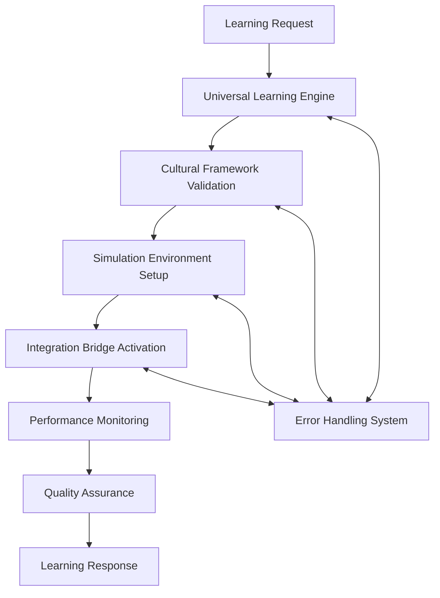

# Amauta Class Universal Adapter Architecture

## 🏗️ System Architecture Overview

The Amauta node implements a **comprehensive universal learning and educational framework** designed to adapt to any learning methodology, training system, educational paradigm, or knowledge transfer mechanism. As a core component of the universal adapter library, Amauta provides AI agents with complete knowledge necessary to dynamically learn and implement any educational approach, training strategy, or learning optimization technique across any domain or context.

```
┌─────────────────────────────────────────────────────────────────────────────────────┐
│                        AMAUTA UNIVERSAL ADAPTER ARCHITECTURE                       │
├─────────────────────────────────────────────────────────────────────────────────────┤
│  ┌───────────────────┐  ┌───────────────────┐  ┌───────────────────┐  ┌─────────────┐ │
│  │ Universal         │  │ Simulation        │  │ Cultural          │  │ Integration │ │
│  │ Learning Engine   │  │ & Environment     │  │ Learning          │  │ & Error     │ │
│  │                   │  │ Manager           │  │ Framework         │  │ Handling    │ │
│  └───────────────────┘  └───────────────────┘  └───────────────────┘  └─────────────┘ │
├─────────────────────────────────────────────────────────────────────────────────────┤
│                      Universal Adapter Foundation Layer                             │
└─────────────────────────────────────────────────────────────────────────────────────┘
```

## Modular Architecture Components

This architecture has been designed with a **modular approach** to ensure maintainability, scalability, and ease of understanding. Each major component is implemented as a separate module:

### 1. Universal Learning Engine Module
**File**: [`modules/01_Universal_Learning_Engine.md`](modules/01_Universal_Learning_Engine.md)

The core learning methodology adapter framework that enables implementation of any learning approach across educational contexts.

**Key Capabilities**:
- Comprehensive learning methodology support (40+ methodologies)
- Curriculum generation and adaptation
- Content synthesis across multiple formats
- Assessment engine with 10+ assessment types
- Subject domain coverage (20+ domains)

### 2. Simulation & Environment Manager Module
**File**: [`modules/02_Simulation_Environment_Manager.md`](modules/02_Simulation_Environment_Manager.md)

Advanced training environment framework and performance monitoring systems for experiential learning.

**Key Capabilities**:
- 12+ environment types (VR, AR, collaborative spaces)
- Simulation domain coverage (12+ domains)
- Performance monitoring with 10+ metric categories
- Resource management and optimization
- Environment health monitoring

### 3. Cultural Learning Framework Module
**File**: [`modules/03_Cultural_Learning_Framework.md`](modules/03_Cultural_Learning_Framework.md)

Indigenous learning systems and cultural adaptation mechanisms ensuring respectful educational practices.

**Key Capabilities**:
- 20+ cultural traditions and origins
- Traditional learning methods (14+ methods)
- Cultural adaptation strategies
- Knowledge preservation systems
- Quality assurance for cultural appropriateness

### 4. Integration & Error Handling Module
**File**: [`modules/04_Integration_Error_Handling.md`](modules/04_Integration_Error_Handling.md)

Universal integration architecture and comprehensive error handling systems for reliable operation.

**Key Capabilities**:
- 20+ external system integrations
- 12+ integration protocols
- Comprehensive error detection and handling
- 12+ error handling strategies
- Error prevention and monitoring

## Core Architecture Principles

### Universal Adapter Pattern
Each module implements the universal adapter pattern with:

1. **Comprehensive Protocol Coverage**: Extensive enums covering all possible protocols, systems, and methodologies
2. **Multi-Dimensional Framework Matrices**: Complex configuration options for any scenario
3. **Cultural Adaptation Mechanisms**: Support for diverse cultural contexts and approaches
4. **Performance Optimization Systems**: Adaptive algorithms and resource management
5. **Security Integration**: Multi-layer protection and compliance frameworks
6. **Error Handling Systems**: Comprehensive detection and recovery strategies
7. **Real-World Implementation**: Practical examples and architectural guidance

### Interface Integration
```typescript
interface AmautaUniversalAdapter {
  learningEngine: UniversalLearningEngine;
  simulationManager: SimulationEnvironmentManager;
  culturalFramework: CulturalLearningFramework;
  integrationBridge: IntegrationErrorHandling;
  
  async processLearningRequest(
    request: LearningRequest,
    context: LearningContext,
    requirements: LearningRequirements
  ): Promise<LearningResponse>;
  
  async adaptToContext(
    methodology: LearningMethodologyType,
    culture: CulturalContext,
    environment: EnvironmentContext
  ): Promise<AdaptedLearningSystem>;
}
```

## Module Interaction Flow



## Quality Standards

- **Comprehensive Coverage**: 30-50+ enums per domain
- **Multi-Protocol Support**: Support for any existing or future protocol
- **Cultural Sensitivity**: HIEROS compliance with indigenous knowledge respect
- **Production Ready**: Complete enough to generate working implementations
- **Modular Design**: Composable with other nodes for complex workflows

## Implementation Guidance

### Getting Started
1. **Review Module Documentation**: Read each module specification thoroughly
2. **Understand Cultural Requirements**: Ensure cultural appropriateness for your context
3. **Select Appropriate Methodologies**: Choose learning approaches that fit your needs
4. **Configure Integration Points**: Set up connections to external systems
5. **Implement Error Handling**: Establish robust error detection and recovery

### Best Practices
- Always validate cultural appropriateness before implementing any learning approach
- Use comprehensive error handling for all external integrations
- Monitor performance continuously and adapt based on results
- Maintain audit trails for all learning activities and adaptations
- Respect sacred knowledge restrictions and cultural permissions

## Module Dependencies

```typescript
// Core dependencies between modules
interface ModuleDependencies {
  universalLearningEngine: {
    requires: ["culturalFramework", "errorHandling"];
    provides: ["methodologyAdaptation", "curriculumGeneration"];
  };
  simulationManager: {
    requires: ["universalLearningEngine", "errorHandling"];
    provides: ["environmentManagement", "performanceMonitoring"];
  };
  culturalFramework: {
    requires: ["errorHandling"];
    provides: ["culturalValidation", "knowledgePreservation"];
  };
  integrationBridge: {
    requires: [];
    provides: ["systemIntegration", "errorHandling"];
  };
}
```

## Production Implementation Notes

This modular architecture enables:
- **Independent Development**: Each module can be developed and tested separately
- **Scalable Deployment**: Modules can be deployed across different infrastructure components
- **Maintenance Efficiency**: Updates and fixes can be applied to specific modules
- **Cultural Compliance**: Cultural framework ensures all implementations respect indigenous knowledge
- **Universal Compatibility**: Integration bridge handles any external system or protocol

For detailed implementation guidance, refer to each module's specific documentation in the `modules/` directory. 