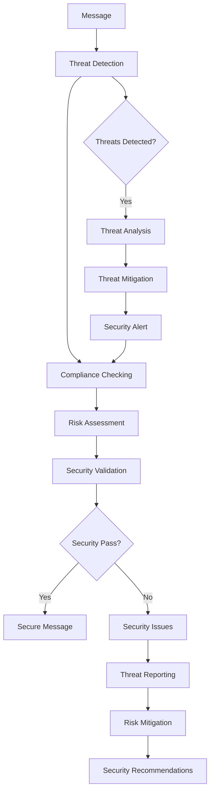
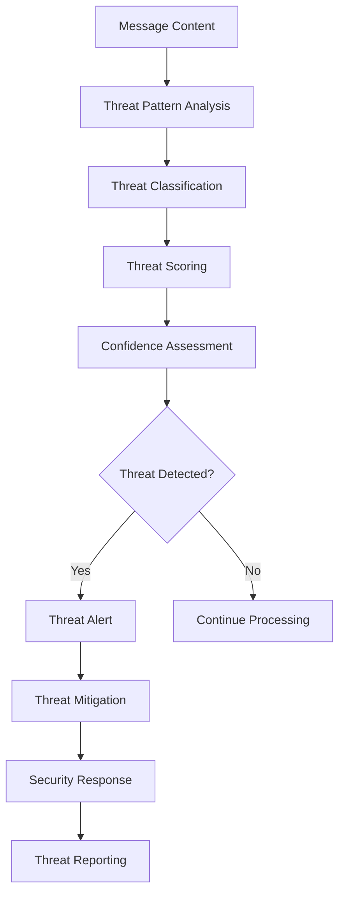

# **Security Validator**

## **Overview**

The Security Validator module provides comprehensive security validation and threat detection capabilities for the kOS ecosystem. This module validates message security, detects threats, and ensures compliance with security standards for secure message processing.

## **Core Principles**

### **Security Validation**
- **Threat Detection**: Detect security threats and malicious content
- **Compliance Checking**: Check compliance with security standards
- **Risk Assessment**: Assess security risks and vulnerabilities
- **Security Monitoring**: Monitor security status and threats

### **High Performance**
- **Fast Validation**: High-speed security validation with minimal latency
- **Efficient Processing**: Efficient validation processing with optimization
- **Resource Management**: Optimize resource usage for validation operations
- **Scalability**: Horizontal and vertical scaling for high-volume validation

### **Intelligent Security**
- **Smart Detection**: Intelligent threat detection with machine learning
- **Adaptive Security**: Adaptive security based on threat patterns
- **Learning Capability**: Machine learning for improved threat detection
- **Security Optimization**: Continuous optimization for security effectiveness

## **Function Specifications**

### **Core Functions**

#### **01. Security Validation**
```typescript
interface SecurityValidationConfig {
  validationTypes: SecurityValidationType[];
  threatDetection: boolean;
  complianceChecking: boolean;
  riskAssessment: boolean;
}

interface SecurityValidationResult {
  isSecure: boolean;
  securityErrors: SecurityValidationError[];
  threats: SecurityThreat[];
  compliance: ComplianceResult;
  risk: RiskAssessment;
}

function validateSecurity(message: ParsedMessage, config: SecurityValidationConfig): Promise<SecurityValidationResult>
```

**Purpose**: Validate message security and detect threats.

**Parameters**:
- `message`: Parsed message to validate security for
- `config`: Security validation configuration and types

**Returns**: Security validation result with threats and compliance

**Error Handling**:
- Security validation failures
- Threat detection errors
- Compliance check failures
- Risk assessment errors

#### **02. Threat Detection**
```typescript
interface ThreatDetectionConfig {
  threatTypes: ThreatType[];
  detectionLevel: DetectionLevel;
  learning: boolean;
  optimization: boolean;
}

interface ThreatDetectionResult {
  threats: SecurityThreat[];
  threatLevel: ThreatLevel;
  confidence: number;
  recommendations: ThreatRecommendation[];
}

function detectThreats(message: ParsedMessage, config: ThreatDetectionConfig): Promise<ThreatDetectionResult>
```

**Purpose**: Detect security threats in messages.

**Parameters**:
- `message`: Parsed message to detect threats in
- `config`: Threat detection configuration and types

**Returns**: Threat detection result with threats and confidence

**Error Handling**:
- Threat detection failures
- Learning algorithm errors
- Optimization failures
- Confidence calculation errors

#### **03. Compliance Checking**
```typescript
interface ComplianceCheckingConfig {
  complianceStandards: ComplianceStandard[];
  strictMode: boolean;
  validation: boolean;
  reporting: boolean;
}

interface ComplianceCheckingResult {
  compliant: boolean;
  violations: ComplianceViolation[];
  compliance: ComplianceResult;
  recommendations: ComplianceRecommendation[];
}

function checkCompliance(message: ParsedMessage, config: ComplianceCheckingConfig): Promise<ComplianceCheckingResult>
```

**Purpose**: Check compliance with security standards.

**Parameters**:
- `message`: Parsed message to check compliance for
- `config`: Compliance checking configuration and standards

**Returns**: Compliance checking result with violations and recommendations

**Error Handling**:
- Compliance check failures
- Standard validation errors
- Reporting failures
- Violation detection errors

#### **04. Risk Assessment**
```typescript
interface RiskAssessmentConfig {
  riskFactors: RiskFactor[];
  assessmentLevel: AssessmentLevel;
  learning: boolean;
  optimization: boolean;
}

interface RiskAssessmentResult {
  riskLevel: RiskLevel;
  riskFactors: RiskFactorResult[];
  assessment: RiskAssessment;
  recommendations: RiskRecommendation[];
}

function assessRisk(message: ParsedMessage, config: RiskAssessmentConfig): Promise<RiskAssessmentResult>
```

**Purpose**: Assess security risks in messages.

**Parameters**:
- `message`: Parsed message to assess risk for
- `config`: Risk assessment configuration and factors

**Returns**: Risk assessment result with risk level and factors

**Error Handling**:
- Risk assessment failures
- Factor calculation errors
- Learning algorithm failures
- Optimization errors

## **Integration Patterns**

### **Security Validation Flow**


### **Threat Detection Flow**


## **Capabilities**

### **Security Types**
- **Threat Detection**: Detect various types of security threats
- **Compliance Checking**: Check compliance with security standards
- **Risk Assessment**: Assess security risks and vulnerabilities
- **Security Monitoring**: Monitor security status and threats
- **Custom Security**: Extensible custom security validation

### **Threat Features**
- **Malware Detection**: Detect malware and malicious content
- **Phishing Detection**: Detect phishing attempts and scams
- **Data Leakage**: Detect data leakage and sensitive information
- **Injection Attacks**: Detect injection attacks and vulnerabilities
- **Custom Threats**: Extensible custom threat detection

### **Compliance Features**
- **Industry Standards**: Compliance with industry security standards
- **Regulatory Compliance**: Compliance with regulatory requirements
- **Security Policies**: Compliance with security policies and procedures
- **Best Practices**: Compliance with security best practices
- **Custom Compliance**: Extensible custom compliance checking

## **Configuration Examples**

### **Basic Security Validation**
```yaml
security_validator:
  security_validation:
    validation_types: ["threat_detection", "compliance_checking"]
    threat_detection: true
    compliance_checking: true
    risk_assessment: false
  threat_detection:
    threat_types: ["malware", "phishing", "injection"]
    detection_level: "basic"
    learning: false
    optimization: false
  compliance_checking:
    compliance_standards: ["basic_security", "data_protection"]
    strict_mode: false
    validation: true
    reporting: false
  performance:
    timeout: "5s"
    caching: true
    parallel_processing: true
  quality:
    error_recovery: true
    threat_reporting: true
    security_metrics: true
```

### **Advanced Security Validation**
```yaml
security_validator:
  security_validation:
    validation_types: ["threat_detection", "compliance_checking", "risk_assessment"]
    threat_detection: true
    compliance_checking: true
    risk_assessment: true
    intelligent_detection: true
  threat_detection:
    threat_types: ["malware", "phishing", "injection", "data_leakage", "custom"]
    detection_level: "advanced"
    learning: true
    optimization: true
    adaptive_detection: true
  compliance_checking:
    compliance_standards: ["iso27001", "gdpr", "sox", "pci_dss", "custom"]
    strict_mode: true
    validation: true
    reporting: true
    continuous_monitoring: true
  risk_assessment:
    risk_factors: ["threat_level", "vulnerability", "impact", "probability"]
    assessment_level: "comprehensive"
    learning: true
    optimization: true
    real_time_assessment: true
  performance:
    timeout: "10s"
    caching: true
    parallel_processing: true
    optimization: true
  quality:
    error_recovery: true
    threat_reporting: true
    security_metrics: true
    learning: true
```

## **Performance Considerations**

### **Security Speed**
- **Optimized Detection**: Use optimized threat detection algorithms
- **Caching**: Cache security validation results for repeated patterns
- **Parallel Processing**: Use parallel processing for multiple validations
- **Early Termination**: Early termination for obvious security threats

### **Security Optimization**
- **Threat Intelligence**: Use threat intelligence for better detection
- **Learning**: Continuous learning for improved threat detection
- **Adaptive Security**: Adaptive security based on threat patterns
- **Optimization**: Continuous optimization for security effectiveness

### **Resource Management**
- **Memory Efficiency**: Optimize memory usage for security operations
- **CPU Optimization**: Optimize CPU usage for detection algorithms
- **Network Efficiency**: Minimize network overhead for security operations
- **Storage Optimization**: Optimize storage for security models

## **Security Considerations**

### **Security Validation**
- **Input Validation**: Validate input before security processing
- **Threat Handling**: Secure threat handling without exposing sensitive data
- **Compliance Security**: Secure compliance checking and reporting
- **Risk Security**: Secure risk assessment and mitigation

### **Access Control**
- **Security Access**: Control access to security validation operations
- **Threat Access**: Control access to threat detection and reporting
- **Compliance Access**: Control access to compliance checking and reporting
- **Risk Access**: Control access to risk assessment and mitigation

## **Monitoring & Observability**

### **Security Metrics**
- **Threat Detection**: Track threat detection accuracy and success rates
- **Security Validation**: Monitor security validation time and performance
- **Compliance Status**: Monitor compliance status and violations
- **Risk Levels**: Track risk levels and assessment accuracy

### **Performance Metrics**
- **Throughput**: Track security validation throughput
- **Latency**: Monitor validation latency and response times
- **Error Rates**: Track validation error rates and types
- **Resource Usage**: Monitor CPU, memory, and network usage

### **Quality Metrics**
- **Threat Quality**: Track threat detection quality and accuracy
- **Compliance Quality**: Monitor compliance checking quality and effectiveness
- **Risk Quality**: Track risk assessment quality and reliability
- **Security Quality**: Monitor overall security quality and effectiveness

---

**Version**: 1.0  
**Module**: Security Validator  
**Status**: ✅ **COMPLETE** - Comprehensive module specification ready for implementation  
**Focus**: Security validation and threat detection for secure message processing 