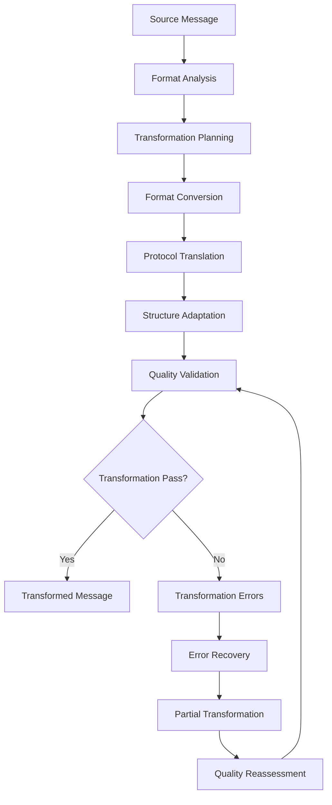
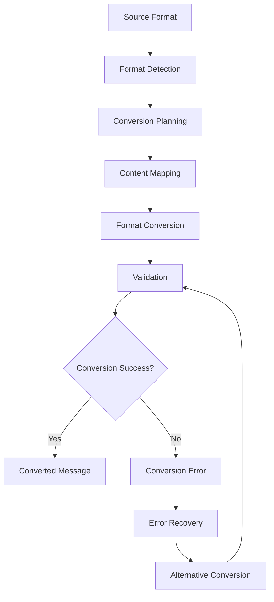

# **Message Transformer**

## **Overview**

The Message Transformer module provides comprehensive message transformation and format conversion capabilities for the kOS ecosystem. This module transforms messages between different formats, protocols, and structures to ensure interoperability and seamless communication.

## **Core Principles**

### **Universal Transformation**
- **Multi-Format Support**: Support for all major message formats and protocols
- **Protocol Translation**: Protocol translation and adaptation
- **Format Conversion**: Seamless format conversion and transformation
- **Structure Adaptation**: Structure adaptation for different platforms

### **High Performance**
- **Fast Transformation**: High-speed transformation with minimal latency
- **Efficient Processing**: Efficient transformation processing with optimization
- **Resource Management**: Optimize resource usage for transformation operations
- **Scalability**: Horizontal and vertical scaling for high-volume transformation

### **Intelligent Transformation**
- **Smart Conversion**: Intelligent format conversion with context awareness
- **Learning Capability**: Machine learning for improved transformation accuracy
- **Adaptive Transformation**: Adaptive transformation based on content types
- **Quality Optimization**: Continuous optimization for transformation quality

## **Function Specifications**

### **Core Functions**

#### **01. Message Transformation**
```typescript
interface MessageTransformationConfig {
  sourceFormat: MessageFormat;
  targetFormat: MessageFormat;
  transformationRules: TransformationRule[];
  qualityThreshold: number;
}

interface MessageTransformationResult {
  transformedMessage: TransformedMessage;
  transformationQuality: TransformationQuality;
  metadata: TransformationMetadata;
  recommendations: TransformationRecommendation[];
}

function transformMessage(message: ParsedMessage, config: MessageTransformationConfig): Promise<MessageTransformationResult>
```

**Purpose**: Transform messages between different formats and protocols.

**Parameters**:
- `message`: Parsed message to transform
- `config`: Transformation configuration and rules

**Returns**: Transformation result with quality metrics and metadata

**Error Handling**:
- Transformation failures
- Format conversion errors
- Quality threshold violations
- Rule evaluation errors

#### **02. Format Conversion**
```typescript
interface FormatConversionConfig {
  sourceFormat: MessageFormat;
  targetFormat: MessageFormat;
  conversionOptions: ConversionOption[];
  validation: boolean;
}

interface FormatConversionResult {
  convertedMessage: ConvertedMessage;
  conversionQuality: ConversionQuality;
  validation: ConversionValidation;
  metadata: ConversionMetadata;
}

function convertFormat(message: ParsedMessage, config: FormatConversionConfig): Promise<FormatConversionResult>
```

**Purpose**: Convert messages between different formats.

**Parameters**:
- `message`: Parsed message to convert
- `config`: Format conversion configuration and options

**Returns**: Format conversion result with quality and validation

**Error Handling**:
- Format conversion failures
- Validation errors
- Quality issues
- Option conflicts

#### **03. Protocol Translation**
```typescript
interface ProtocolTranslationConfig {
  sourceProtocol: Protocol;
  targetProtocol: Protocol;
  translationRules: TranslationRule[];
  adaptation: boolean;
}

interface ProtocolTranslationResult {
  translatedMessage: TranslatedMessage;
  translationQuality: TranslationQuality;
  adaptation: ProtocolAdaptation;
  metadata: TranslationMetadata;
}

function translateProtocol(message: ParsedMessage, config: ProtocolTranslationConfig): Promise<ProtocolTranslationResult>
```

**Purpose**: Translate messages between different protocols.

**Parameters**:
- `message`: Parsed message to translate
- `config`: Protocol translation configuration and rules

**Returns**: Protocol translation result with quality and adaptation

**Error Handling**:
- Protocol translation failures
- Rule evaluation errors
- Adaptation failures
- Quality issues

#### **04. Structure Adaptation**
```typescript
interface StructureAdaptationConfig {
  sourceStructure: MessageStructure;
  targetStructure: MessageStructure;
  adaptationRules: AdaptationRule[];
  optimization: boolean;
}

interface StructureAdaptationResult {
  adaptedMessage: AdaptedMessage;
  adaptationQuality: AdaptationQuality;
  optimization: StructureOptimization;
  metadata: AdaptationMetadata;
}

function adaptStructure(message: ParsedMessage, config: StructureAdaptationConfig): Promise<StructureAdaptationResult>
```

**Purpose**: Adapt message structure for different platforms and contexts.

**Parameters**:
- `message`: Parsed message to adapt
- `config`: Structure adaptation configuration and rules

**Returns**: Structure adaptation result with quality and optimization

**Error Handling**:
- Structure adaptation failures
- Rule evaluation errors
- Optimization failures
- Quality issues

## **Integration Patterns**

### **Message Transformation Flow**


### **Format Conversion Flow**


## **Capabilities**

### **Transformation Types**
- **Format Conversion**: Convert between different message formats
- **Protocol Translation**: Translate between different protocols
- **Structure Adaptation**: Adapt message structure for different platforms
- **Content Transformation**: Transform message content and semantics
- **Custom Transformation**: Extensible custom transformation support

### **Format Support**
- **JSON**: JSON format conversion and transformation
- **XML**: XML format conversion and transformation
- **YAML**: YAML format conversion and transformation
- **Protocol Buffers**: Protobuf format conversion and transformation
- **Avro**: Avro format conversion and transformation
- **Custom Formats**: Extensible custom format support

### **Protocol Support**
- **HTTP**: HTTP protocol translation and adaptation
- **gRPC**: gRPC protocol translation and adaptation
- **WebSocket**: WebSocket protocol translation and adaptation
- **MQTT**: MQTT protocol translation and adaptation
- **Custom Protocols**: Extensible custom protocol support

## **Configuration Examples**

### **Basic Message Transformation**
```yaml
message_transformer:
  message_transformation:
    source_format: "json"
    target_format: "xml"
    transformation_rules: ["basic", "format", "structure"]
    quality_threshold: 0.8
  format_conversion:
    source_format: "json"
    target_format: "xml"
    conversion_options: ["preserve_structure", "validate_output"]
    validation: true
  protocol_translation:
    source_protocol: "http"
    target_protocol: "grpc"
    translation_rules: ["basic", "header", "body"]
    adaptation: false
  performance:
    timeout: "5s"
    caching: true
    parallel_processing: true
  quality:
    error_recovery: true
    partial_transformation: true
    quality_metrics: true
```

### **Advanced Message Transformation**
```yaml
message_transformer:
  message_transformation:
    source_format: "json"
    target_format: "protobuf"
    transformation_rules: ["advanced", "semantic", "optimized"]
    quality_threshold: 0.9
    intelligent_transformation: true
  format_conversion:
    source_format: "json"
    target_format: "protobuf"
    conversion_options: ["preserve_structure", "validate_output", "optimize_size"]
    validation: true
    schema_validation: true
  protocol_translation:
    source_protocol: "http"
    target_protocol: "grpc"
    translation_rules: ["advanced", "header", "body", "metadata"]
    adaptation: true
    bidirectional: true
  structure_adaptation:
    source_structure: "flexible"
    target_structure: "strict"
    adaptation_rules: ["semantic", "contextual", "optimized"]
    optimization: true
    learning: true
  performance:
    timeout: "10s"
    caching: true
    parallel_processing: true
    optimization: true
  quality:
    error_recovery: true
    partial_transformation: true
    quality_metrics: true
    learning: true
```

## **Performance Considerations**

### **Transformation Speed**
- **Optimized Algorithms**: Use optimized transformation algorithms
- **Caching**: Cache transformation results for repeated patterns
- **Parallel Processing**: Use parallel processing for multiple transformations
- **Early Termination**: Early termination for obvious transformations

### **Quality Optimization**
- **Quality Assessment**: Accurate quality assessment for better transformation
- **Learning**: Continuous learning for improved transformation accuracy
- **Context Awareness**: Context-aware transformation for better accuracy
- **Optimization**: Continuous optimization for transformation performance

### **Resource Management**
- **Memory Efficiency**: Optimize memory usage for transformation operations
- **CPU Optimization**: Optimize CPU usage for transformation algorithms
- **Network Efficiency**: Minimize network overhead for transformation operations
- **Storage Optimization**: Optimize storage for transformation models

## **Security Considerations**

### **Transformation Security**
- **Input Validation**: Validate input before transformation processing
- **Content Security**: Ensure content security during transformation
- **Format Security**: Secure format conversion and validation
- **Protocol Security**: Secure protocol translation and adaptation

### **Access Control**
- **Transformation Access**: Control access to transformation operations
- **Format Access**: Control access to format conversion operations
- **Protocol Access**: Control access to protocol translation operations
- **Quality Access**: Control access to transformation quality metrics

## **Monitoring & Observability**

### **Transformation Metrics**
- **Transformation Accuracy**: Track transformation accuracy and success rates
- **Transformation Speed**: Monitor transformation time and performance
- **Format Distribution**: Monitor format distribution and conversion patterns
- **Quality Distribution**: Track quality score distribution

### **Performance Metrics**
- **Throughput**: Track message transformation throughput
- **Latency**: Monitor transformation latency and response times
- **Error Rates**: Track transformation error rates and types
- **Resource Usage**: Monitor CPU, memory, and network usage

### **Quality Metrics**
- **Transformation Quality**: Track transformation quality and accuracy
- **Format Quality**: Monitor format conversion quality and effectiveness
- **Protocol Quality**: Track protocol translation quality and reliability
- **Structure Quality**: Monitor structure adaptation quality and effectiveness

---

**Version**: 1.0  
**Module**: Message Transformer  
**Status**: ✅ **COMPLETE** - Comprehensive module specification ready for implementation  
**Focus**: Message transformation and format conversion for multi-format message processing 