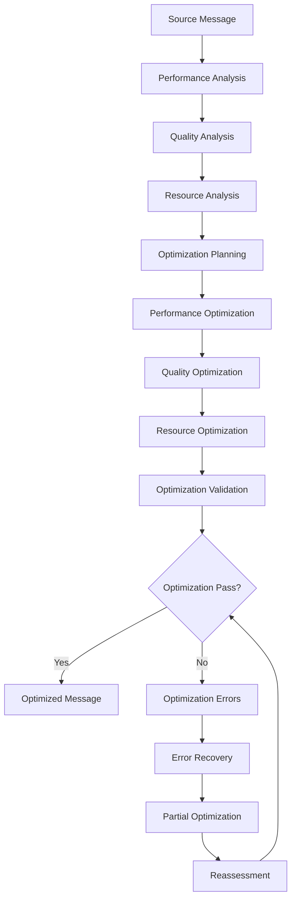
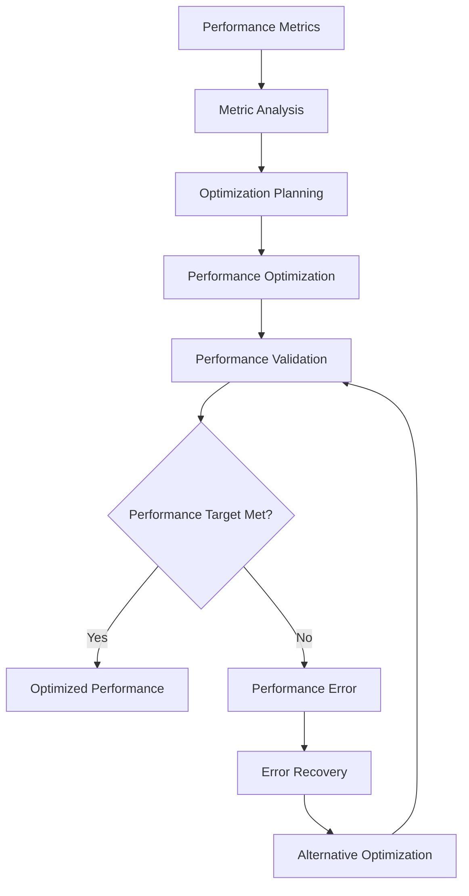

# **Message Optimizer**

## **Overview**

The Message Optimizer module provides comprehensive message optimization and performance enhancement capabilities for the kOS ecosystem. This module optimizes messages for performance, efficiency, and quality to ensure optimal message processing and delivery.

## **Core Principles**

### **Performance Optimization**
- **Speed Optimization**: Optimize message processing speed and latency
- **Efficiency Optimization**: Optimize resource usage and efficiency
- **Quality Optimization**: Optimize message quality and accuracy
- **Scalability Optimization**: Optimize for horizontal and vertical scaling

### **Intelligent Optimization**
- **Smart Optimization**: Intelligent optimization with context awareness
- **Learning Capability**: Machine learning for improved optimization
- **Adaptive Optimization**: Adaptive optimization based on performance metrics
- **Continuous Optimization**: Continuous optimization for sustained performance

### **Multi-Dimensional Optimization**
- **Content Optimization**: Optimize message content and structure
- **Format Optimization**: Optimize message format and encoding
- **Protocol Optimization**: Optimize protocol usage and efficiency
- **Delivery Optimization**: Optimize delivery mechanisms and routing

## **Function Specifications**

### **Core Functions**

#### **01. Message Optimization**
```typescript
interface MessageOptimizationConfig {
  optimizationTypes: OptimizationType[];
  performanceTargets: PerformanceTarget[];
  qualityThreshold: number;
  learning: boolean;
}

interface MessageOptimizationResult {
  optimizedMessage: OptimizedMessage;
  optimizationQuality: OptimizationQuality;
  performance: PerformanceMetrics;
  recommendations: OptimizationRecommendation[];
  metadata: OptimizationMetadata;
}

function optimizeMessage(message: ParsedMessage, config: MessageOptimizationConfig): Promise<MessageOptimizationResult>
```

**Purpose**: Optimize messages for performance, efficiency, and quality.

**Parameters**:
- `message`: Parsed message to optimize
- `config`: Message optimization configuration and targets

**Returns**: Message optimization result with quality and performance metrics

**Error Handling**:
- Message optimization failures
- Performance target violations
- Quality threshold violations
- Learning algorithm errors

#### **02. Performance Optimization**
```typescript
interface PerformanceOptimizationConfig {
  performanceMetrics: PerformanceMetric[];
  optimizationLevel: OptimizationLevel;
  monitoring: boolean;
  adaptation: boolean;
}

interface PerformanceOptimizationResult {
  optimizedPerformance: OptimizedPerformance;
  performanceMetrics: PerformanceMetricResult[];
  monitoring: PerformanceMonitoring;
  adaptation: PerformanceAdaptation;
}

function optimizePerformance(message: ParsedMessage, config: PerformanceOptimizationConfig): Promise<PerformanceOptimizationResult>
```

**Purpose**: Optimize message performance and processing speed.

**Parameters**:
- `message`: Parsed message to optimize performance for
- `config`: Performance optimization configuration and metrics

**Returns**: Performance optimization result with metrics and monitoring

**Error Handling**:
- Performance optimization failures
- Metric calculation errors
- Monitoring failures
- Adaptation errors

#### **03. Quality Optimization**
```typescript
interface QualityOptimizationConfig {
  qualityMetrics: QualityMetric[];
  optimizationStrategy: OptimizationStrategy;
  learning: boolean;
  validation: boolean;
}

interface QualityOptimizationResult {
  optimizedQuality: OptimizedQuality;
  qualityMetrics: QualityMetricResult[];
  learning: QualityLearning;
  validation: QualityValidation;
}

function optimizeQuality(message: ParsedMessage, config: QualityOptimizationConfig): Promise<QualityOptimizationResult>
```

**Purpose**: Optimize message quality and accuracy.

**Parameters**:
- `message`: Parsed message to optimize quality for
- `config`: Quality optimization configuration and metrics

**Returns**: Quality optimization result with metrics and learning

**Error Handling**:
- Quality optimization failures
- Metric calculation errors
- Learning algorithm failures
- Validation errors

#### **04. Resource Optimization**
```typescript
interface ResourceOptimizationConfig {
  resourceTypes: ResourceType[];
  optimizationTargets: ResourceTarget[];
  monitoring: boolean;
  adaptation: boolean;
}

interface ResourceOptimizationResult {
  optimizedResources: OptimizedResources;
  resourceMetrics: ResourceMetricResult[];
  monitoring: ResourceMonitoring;
  adaptation: ResourceAdaptation;
}

function optimizeResources(message: ParsedMessage, config: ResourceOptimizationConfig): Promise<ResourceOptimizationResult>
```

**Purpose**: Optimize resource usage for message processing.

**Parameters**:
- `message`: Parsed message to optimize resources for
- `config`: Resource optimization configuration and targets

**Returns**: Resource optimization result with metrics and monitoring

**Error Handling**:
- Resource optimization failures
- Target violation errors
- Monitoring failures
- Adaptation errors

## **Integration Patterns**

### **Message Optimization Flow**


### **Performance Optimization Flow**


## **Capabilities**

### **Optimization Types**
- **Performance Optimization**: Optimize message processing performance
- **Quality Optimization**: Optimize message quality and accuracy
- **Resource Optimization**: Optimize resource usage and efficiency
- **Format Optimization**: Optimize message format and encoding
- **Custom Optimization**: Extensible custom optimization support

### **Performance Features**
- **Speed Optimization**: Optimize processing speed and latency
- **Throughput Optimization**: Optimize message throughput and capacity
- **Efficiency Optimization**: Optimize processing efficiency and resource usage
- **Scalability Optimization**: Optimize for horizontal and vertical scaling
- **Adaptive Performance**: Adaptive performance optimization

### **Quality Features**
- **Accuracy Optimization**: Optimize message accuracy and precision
- **Completeness Optimization**: Optimize message completeness and integrity
- **Consistency Optimization**: Optimize message consistency and coherence
- **Relevance Optimization**: Optimize message relevance and context
- **Learning Quality**: Machine learning for quality improvement

## **Configuration Examples**

### **Basic Message Optimization**
```yaml
message_optimizer:
  message_optimization:
    optimization_types: ["performance", "quality", "resources"]
    performance_targets: ["speed", "throughput", "efficiency"]
    quality_threshold: 0.8
    learning: false
  performance_optimization:
    performance_metrics: ["latency", "throughput", "cpu_usage"]
    optimization_level: "basic"
    monitoring: true
    adaptation: false
  quality_optimization:
    quality_metrics: ["accuracy", "completeness", "consistency"]
    optimization_strategy: "basic"
    learning: false
    validation: true
  resource_optimization:
    resource_types: ["memory", "cpu", "network"]
    optimization_targets: ["minimize_usage", "maximize_efficiency"]
    monitoring: true
    adaptation: false
  performance:
    timeout: "5s"
    caching: true
    parallel_processing: true
  quality:
    error_recovery: true
    partial_optimization: true
    quality_metrics: true
```

### **Advanced Message Optimization**
```yaml
message_optimizer:
  message_optimization:
    optimization_types: ["performance", "quality", "resources", "format", "protocol"]
    performance_targets: ["speed", "throughput", "efficiency", "scalability"]
    quality_threshold: 0.9
    learning: true
    intelligent_optimization: true
  performance_optimization:
    performance_metrics: ["latency", "throughput", "cpu_usage", "memory_usage", "network_usage"]
    optimization_level: "advanced"
    monitoring: true
    adaptation: true
    adaptive_optimization: true
  quality_optimization:
    quality_metrics: ["accuracy", "completeness", "consistency", "relevance", "context"]
    optimization_strategy: "advanced"
    learning: true
    validation: true
    continuous_learning: true
  resource_optimization:
    resource_types: ["memory", "cpu", "network", "storage", "bandwidth"]
    optimization_targets: ["minimize_usage", "maximize_efficiency", "balance_load"]
    monitoring: true
    adaptation: true
    predictive_optimization: true
  format_optimization:
    format_types: ["json", "xml", "protobuf", "avro"]
    optimization_targets: ["size", "speed", "compatibility"]
    validation: true
    adaptation: true
  performance:
    timeout: "10s"
    caching: true
    parallel_processing: true
    optimization: true
  quality:
    error_recovery: true
    partial_optimization: true
    quality_metrics: true
    learning: true
```

## **Performance Considerations**

### **Optimization Speed**
- **Optimized Algorithms**: Use optimized optimization algorithms
- **Caching**: Cache optimization results for repeated patterns
- **Parallel Processing**: Use parallel processing for multiple optimizations
- **Early Termination**: Early termination for obvious optimizations

### **Quality Optimization**
- **Quality Assessment**: Accurate quality assessment for better optimization
- **Learning**: Continuous learning for improved optimization accuracy
- **Context Awareness**: Context-aware optimization for better accuracy
- **Optimization**: Continuous optimization for sustained performance

### **Resource Management**
- **Memory Efficiency**: Optimize memory usage for optimization operations
- **CPU Optimization**: Optimize CPU usage for optimization algorithms
- **Network Efficiency**: Minimize network overhead for optimization operations
- **Storage Optimization**: Optimize storage for optimization models

## **Security Considerations**

### **Optimization Security**
- **Input Validation**: Validate input before optimization processing
- **Content Security**: Ensure content security during optimization
- **Performance Security**: Secure performance optimization and monitoring
- **Quality Security**: Secure quality optimization and validation

### **Access Control**
- **Optimization Access**: Control access to message optimization operations
- **Performance Access**: Control access to performance optimization operations
- **Quality Access**: Control access to quality optimization operations
- **Resource Access**: Control access to resource optimization operations

## **Monitoring & Observability**

### **Optimization Metrics**
- **Optimization Accuracy**: Track optimization accuracy and success rates
- **Optimization Speed**: Monitor optimization time and performance
- **Performance Distribution**: Monitor performance distribution and trends
- **Quality Distribution**: Track quality score distribution

### **Performance Metrics**
- **Throughput**: Track message optimization throughput
- **Latency**: Monitor optimization latency and response times
- **Error Rates**: Track optimization error rates and types
- **Resource Usage**: Monitor CPU, memory, and network usage

### **Quality Metrics**
- **Optimization Quality**: Track optimization quality and accuracy
- **Performance Quality**: Monitor performance optimization quality and effectiveness
- **Quality Optimization**: Track quality optimization quality and reliability
- **Resource Quality**: Monitor resource optimization quality and efficiency

---

**Version**: 1.0  
**Module**: Message Optimizer  
**Status**: ✅ **COMPLETE** - Comprehensive module specification ready for implementation  
**Focus**: Message optimization and performance enhancement for efficient message processing 