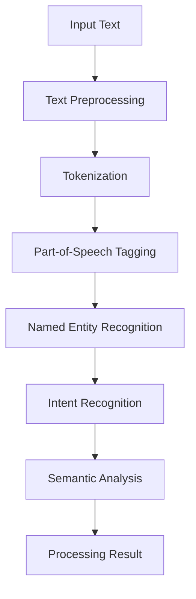
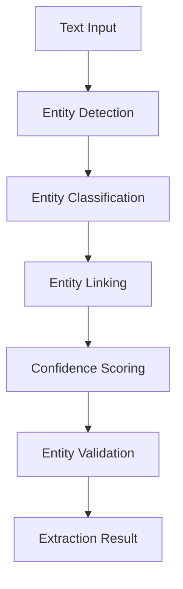
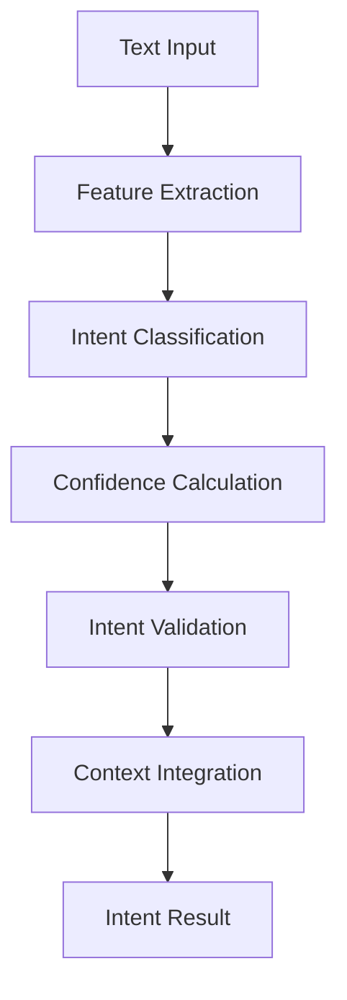

# **Language Processor**

## **Overview**

The Language Processor module provides comprehensive capabilities for natural language processing, intent recognition, entity extraction, and syntax analysis. It forms the foundation for intelligent language understanding and processing across the kOS ecosystem.

## **Core Principles**

### **Natural Language Understanding**
- **Intent Recognition**: Accurate intent recognition and classification
- **Entity Extraction**: Automatic entity and concept extraction
- **Syntax Analysis**: Comprehensive syntax and grammar analysis
- **Semantic Understanding**: Deep semantic understanding and processing

### **High Performance**
- **Fast Processing**: < 200ms processing time for standard content
- **High Accuracy**: High accuracy for intent and entity recognition
- **Real-time Processing**: Real-time processing for live interactions
- **Scalability**: Horizontal and vertical scaling capabilities

### **Intelligent Processing**
- **Context Awareness**: Context-aware language processing
- **Machine Learning**: Machine learning-based processing algorithms
- **Continuous Learning**: Continuous learning and improvement
- **Domain Adaptation**: Domain-specific adaptation and optimization

## **Function Specifications**

### **Primary Functions**

#### **processText(text: string, options?: ProcessingOptions): ProcessingResult**
- **Purpose**: Process text for intent recognition and entity extraction
- **Parameters**:
  - `text`: Input text for processing
  - `options`: Optional processing configuration
- **Returns**: Processing result with intent, entities, and analysis
- **Performance**: < 200ms processing time, comprehensive analysis

#### **extractEntities(text: string, entityTypes?: string[]): EntityExtractionResult**
- **Purpose**: Extract entities and concepts from text
- **Parameters**:
  - `text`: Input text for entity extraction
  - `entityTypes`: Optional entity types to extract
- **Returns**: Extracted entities with types and confidence scores
- **Performance**: < 150ms extraction time, high accuracy

#### **recognizeIntent(text: string, intents?: string[]): IntentRecognitionResult**
- **Purpose**: Recognize and classify user intent
- **Parameters**:
  - `text`: Input text for intent recognition
  - `intents`: Optional intent categories to consider
- **Returns**: Recognized intent with confidence score and metadata
- **Performance**: < 100ms recognition time, high accuracy

#### **analyzeSyntax(text: string): SyntaxAnalysisResult**
- **Purpose**: Analyze syntax and grammar structure
- **Parameters**:
  - `text`: Input text for syntax analysis
- **Returns**: Syntax analysis with structure and grammar information
- **Performance**: < 100ms analysis time, comprehensive analysis

### **Configuration Functions**

#### **configureProcessing(options: ProcessingConfig): void**
- **Purpose**: Configure language processing parameters
- **Parameters**:
  - `options`: Processing configuration object
- **Returns**: void
- **Performance**: < 10ms configuration time

#### **addCustomEntity(entity: CustomEntity): void**
- **Purpose**: Add custom entity recognition rules
- **Parameters**:
  - `entity`: Custom entity configuration
- **Returns**: void
- **Performance**: < 50ms addition time

## **Integration Patterns**

### **Text Processing Flow**


### **Entity Extraction Flow**


### **Intent Recognition Flow**


## **Capabilities**

### **Natural Language Processing**
- **Intent Recognition**: Accurate intent recognition and classification
- **Entity Extraction**: Automatic entity and concept extraction
- **Syntax Analysis**: Comprehensive syntax and grammar analysis
- **Semantic Understanding**: Deep semantic understanding and processing
- **Topic Modeling**: Automatic topic identification and classification

### **Advanced Features**
- **Context Awareness**: Context-aware language processing
- **Machine Learning**: Machine learning-based processing algorithms
- **Continuous Learning**: Continuous learning and improvement
- **Domain Adaptation**: Domain-specific adaptation and optimization
- **Multi-language Support**: Multi-language processing capabilities

### **Entity Recognition**
- **Named Entities**: Recognition of people, places, organizations
- **Custom Entities**: Custom entity recognition and classification
- **Entity Linking**: Linking entities to knowledge bases
- **Entity Validation**: Validation and confidence scoring
- **Entity Relationships**: Recognition of entity relationships

### **Intent Understanding**
- **Intent Classification**: Classification of user intents and goals
- **Intent Confidence**: Confidence scoring for intent recognition
- **Intent Context**: Context-aware intent understanding
- **Intent Validation**: Validation and verification of recognized intents
- **Intent History**: Historical intent tracking and analysis

## **Configuration Examples**

### **Basic Processing Configuration**
```yaml
language_processing:
  nlp_engine: "spacy"
  models:
    intent_recognition: "bert-base"
    entity_extraction: "spacy-large"
    sentiment_analysis: "roberta-base"
  features:
    intent_recognition: true
    entity_extraction: true
    sentiment_analysis: true
    syntax_analysis: true
    topic_modeling: true
  performance:
    model_caching: true
    batch_processing: true
    parallel_workers: 4
    timeout: "30s"
```

### **Advanced Processing Configuration**
```yaml
language_processing:
  models:
    primary_model: "transformer"
    fallback_model: "lstm"
    custom_models: ["domain_specific", "custom_rules"]
  features:
    context_awareness: true
    domain_adaptation: true
    continuous_learning: true
    multi_language: true
  optimization:
    parallel_processing: true
    memory_optimization: true
    gpu_acceleration: true
    model_caching: true
  learning:
    feedback_integration: true
    model_updates: true
    accuracy_tracking: true
    performance_monitoring: true
```

### **Entity Recognition Configuration**
```yaml
entity_recognition:
  entity_types:
    - "PERSON"
    - "ORGANIZATION"
    - "LOCATION"
    - "DATE"
    - "TIME"
    - "MONEY"
    - "PERCENT"
    - "CUSTOM"
  recognition:
    named_entities: true
    custom_entities: true
    entity_linking: true
    relationship_extraction: true
  validation:
    confidence_threshold: 0.8
    entity_validation: true
    relationship_validation: true
    context_validation: true
```

## **Error Handling**

### **Processing Errors**
- **Model Failures**: Automatic model switching and fallback
- **Processing Timeouts**: Timeout handling and partial results
- **Memory Issues**: Memory management and optimization
- **API Errors**: Error isolation and recovery procedures

### **Entity Extraction Errors**
- **Extraction Failures**: Fallback to rule-based extraction
- **Low Confidence**: Request human review for low-confidence entities
- **Entity Conflicts**: Entity conflict resolution and validation
- **Linking Errors**: Entity linking error handling and recovery

### **Intent Recognition Errors**
- **Recognition Failures**: Fallback to statistical recognition methods
- **Low Confidence**: Request clarification for low-confidence intents
- **Intent Conflicts**: Intent conflict resolution and validation
- **Context Errors**: Context validation and correction

### **Configuration Errors**
- **Invalid Configuration**: Configuration validation and error reporting
- **Model Errors**: Automatic model switching and fallback
- **Resource Errors**: Resource management and optimization
- **Performance Errors**: Performance monitoring and optimization

## **Performance Considerations**

### **Processing Performance**
- **Processing Speed**: < 200ms for standard processing
- **Accuracy**: High accuracy for intent and entity recognition
- **Throughput**: 5,000+ documents per hour
- **Scalability**: Horizontal scaling for high-volume processing

### **Entity Extraction Performance**
- **Extraction Speed**: < 150ms for entity extraction
- **Accuracy**: High accuracy for entity recognition and classification
- **Linking Speed**: Fast entity linking to knowledge bases
- **Validation**: Efficient entity validation and confidence scoring

### **Intent Recognition Performance**
- **Recognition Speed**: < 100ms for intent recognition
- **Accuracy**: High accuracy for intent classification
- **Context Integration**: Fast context integration and analysis
- **Validation**: Efficient intent validation and verification

### **Scalability**
- **Horizontal Scaling**: Horizontal scaling for high-volume processing
- **Vertical Scaling**: Vertical scaling for resource optimization
- **Load Balancing**: Intelligent load balancing and distribution
- **Resource Management**: Efficient resource allocation and management

## **Monitoring & Observability**

### **Processing Metrics**
- **Processing Accuracy**: Accuracy rates for different processing tasks
- **Processing Speed**: Average processing time and throughput
- **Model Performance**: Performance metrics for different models
- **Error Rates**: Processing error rates and failure analysis

### **Entity Extraction Metrics**
- **Extraction Accuracy**: Entity extraction accuracy and precision
- **Extraction Speed**: Average extraction time and throughput
- **Entity Types**: Distribution of extracted entity types
- **Linking Performance**: Entity linking performance and accuracy

### **Intent Recognition Metrics**
- **Recognition Accuracy**: Intent recognition accuracy and precision
- **Recognition Speed**: Average recognition time and throughput
- **Intent Distribution**: Distribution of recognized intents
- **Confidence Scores**: Distribution of confidence scores

### **Operational Metrics**
- **System Health**: Overall system health and availability
- **Resource Utilization**: Resource utilization and optimization
- **Error Tracking**: Error tracking and analysis
- **Performance Trends**: Performance trends and optimization

## **Security Considerations**

### **Data Privacy**
- **Text Privacy**: End-to-end encryption for text content
- **Processing Privacy**: Privacy protection for processing data
- **Consent Management**: User consent for language processing
- **Data Retention**: Configurable retention policies

### **Access Control**
- **Authentication**: Strong authentication for processing services
- **Authorization**: Role-based access control for processing functions
- **API Security**: Secure API access and rate limiting
- **Audit Logging**: Comprehensive audit trails for all operations

### **Content Security**
- **Input Validation**: Comprehensive input validation and sanitization
- **Malware Detection**: Detection of malicious content in text
- **Content Filtering**: Automatic filtering of inappropriate content
- **Output Validation**: Validation of processing outputs and results

---

**Version**: 1.0  
**Category**: Communication & Language  
**Subcategory**: Language Services  
**Focus**: Advanced natural language processing and understanding capabilities 