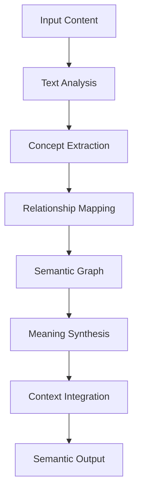
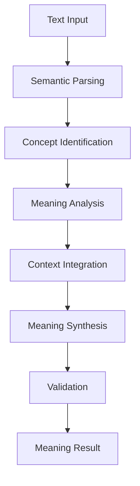
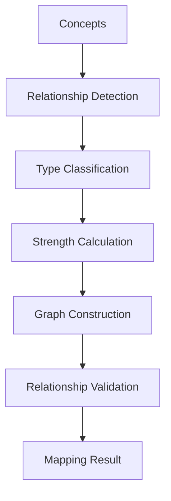

# **Semantic Analyzer**

## **Overview**

The Semantic Analyzer module provides comprehensive capabilities for deep semantic analysis, meaning extraction, relationship mapping, and concept analysis. It enables advanced understanding of text content through semantic modeling and knowledge integration.

## **Core Principles**

### **Deep Semantic Understanding**
- **Meaning Extraction**: Deep meaning extraction and understanding
- **Relationship Mapping**: Map semantic relationships and connections
- **Concept Analysis**: Analyze concepts and their relationships
- **Context Integration**: Context-aware semantic analysis

### **Knowledge Integration**
- **Knowledge Graphs**: Integration with knowledge graphs and databases
- **Concept Databases**: Access to concept databases and ontologies
- **Semantic APIs**: Integration with semantic analysis APIs
- **Knowledge Synthesis**: Synthesis of knowledge from multiple sources

### **High Performance**
- **Fast Analysis**: < 300ms analysis time for standard content
- **Deep Understanding**: Deep semantic analysis with comprehensive coverage
- **Real-time Processing**: Real-time processing for live content
- **Scalability**: Horizontal and vertical scaling capabilities

## **Function Specifications**

### **Primary Functions**

#### **analyzeSemantics(text: string, options?: SemanticOptions): SemanticResult**
- **Purpose**: Perform deep semantic analysis of text content
- **Parameters**:
  - `text`: Input text for semantic analysis
  - `options`: Optional semantic analysis configuration
- **Returns**: Semantic analysis result with meaning, relationships, and concepts
- **Performance**: < 300ms analysis time, deep semantic understanding

#### **extractMeaning(text: string, context?: string): MeaningResult**
- **Purpose**: Extract meaning and semantic content from text
- **Parameters**:
  - `text`: Input text for meaning extraction
  - `context`: Optional context for meaning analysis
- **Returns**: Extracted meaning with semantic content and confidence
- **Performance**: < 200ms extraction time, comprehensive meaning analysis

#### **mapRelationships(concepts: string[]): RelationshipResult**
- **Purpose**: Map relationships between concepts and entities
- **Parameters**:
  - `concepts`: Array of concepts for relationship mapping
- **Returns**: Mapped relationships with types and strengths
- **Performance**: < 250ms mapping time, comprehensive relationship analysis

#### **analyzeConcepts(text: string): ConceptResult**
- **Purpose**: Analyze concepts and their semantic properties
- **Parameters**:
  - `text`: Input text for concept analysis
- **Returns**: Concept analysis with properties and relationships
- **Performance**: < 180ms analysis time, detailed concept analysis

### **Configuration Functions**

#### **configureSemantics(options: SemanticConfig): void**
- **Purpose**: Configure semantic analysis parameters
- **Parameters**:
  - `options`: Semantic configuration object
- **Returns**: void
- **Performance**: < 10ms configuration time

#### **addKnowledgeSource(source: KnowledgeSource): void**
- **Purpose**: Add knowledge source for semantic analysis
- **Parameters**:
  - `source`: Knowledge source configuration
- **Returns**: void
- **Performance**: < 50ms addition time

## **Integration Patterns**

### **Semantic Analysis Flow**


### **Meaning Extraction Flow**


### **Relationship Mapping Flow**


## **Capabilities**

### **Semantic Analysis**
- **Meaning Extraction**: Deep meaning extraction and understanding
- **Relationship Mapping**: Map semantic relationships and connections
- **Concept Analysis**: Analyze concepts and their relationships
- **Context Understanding**: Context-aware semantic analysis
- **Knowledge Integration**: Integrate with knowledge graphs and databases

### **Advanced Features**
- **Semantic Modeling**: Advanced semantic modeling and representation
- **Knowledge Synthesis**: Synthesis of knowledge from multiple sources
- **Concept Linking**: Linking concepts to knowledge bases
- **Semantic Validation**: Validation of semantic analysis results
- **Continuous Learning**: Continuous learning and improvement

### **Knowledge Integration**
- **Knowledge Graphs**: Integration with Wikidata, DBpedia, and other graphs
- **Concept Databases**: Access to WordNet, ConceptNet, and other databases
- **Semantic APIs**: Integration with OpenAI, Cohere, and other semantic APIs
- **Custom Knowledge**: Support for custom knowledge sources and ontologies

### **Analysis Capabilities**
- **Deep Analysis**: Deep semantic analysis with comprehensive coverage
- **Multi-level Analysis**: Multi-level semantic analysis and understanding
- **Context Integration**: Integration of context and background knowledge
- **Semantic Reasoning**: Semantic reasoning and inference capabilities

## **Configuration Examples**

### **Basic Semantic Configuration**
```yaml
semantic_analysis:
  models:
    semantic_model: "sentence-transformers"
    knowledge_graph: "wikidata"
    concept_database: "wordnet"
  analysis:
    meaning_extraction: true
    relationship_mapping: true
    concept_analysis: true
    context_integration: true
  integration:
    knowledge_graphs: ["wikidata", "dbpedia"]
    concept_databases: ["wordnet", "conceptnet"]
    semantic_apis: ["openai", "cohere"]
  performance:
    model_caching: true
    graph_caching: true
    batch_analysis: true
    timeout: "60s"
```

### **Advanced Semantic Configuration**
```yaml
semantic_analysis:
  models:
    primary_model: "transformer"
    knowledge_model: "graph_neural_network"
    concept_model: "hierarchical_embedding"
    reasoning_model: "logical_reasoning"
  features:
    deep_analysis: true
    multi_level_analysis: true
    semantic_reasoning: true
    knowledge_synthesis: true
  integration:
    multiple_sources: true
    source_validation: true
    conflict_resolution: true
    knowledge_fusion: true
  optimization:
    parallel_processing: true
    memory_optimization: true
    gpu_acceleration: true
    model_caching: true
```

### **Knowledge Integration Configuration**
```yaml
knowledge_integration:
  sources:
    wikidata:
      enabled: true
      api_endpoint: "https://query.wikidata.org/sparql"
      cache_ttl: "24h"
    dbpedia:
      enabled: true
      api_endpoint: "http://dbpedia.org/sparql"
      cache_ttl: "24h"
    wordnet:
      enabled: true
      local_database: true
      cache_ttl: "168h"
    conceptnet:
      enabled: true
      api_endpoint: "https://api.conceptnet.io"
      cache_ttl: "12h"
  validation:
    source_validation: true
    conflict_resolution: true
    quality_assessment: true
    confidence_scoring: true
```

## **Error Handling**

### **Analysis Errors**
- **Analysis Failures**: Graceful degradation with partial results
- **Model Errors**: Automatic model switching and fallback
- **Processing Errors**: Error isolation and recovery procedures
- **Timeout Errors**: Timeout handling and partial results

### **Knowledge Integration Errors**
- **Graph Errors**: Graph validation and repair procedures
- **Concept Errors**: Concept validation and alternative analysis
- **Integration Errors**: Error isolation and recovery mechanisms
- **Source Errors**: Source validation and fallback procedures

### **Configuration Errors**
- **Invalid Configuration**: Configuration validation and error reporting
- **Model Errors**: Automatic model switching and fallback
- **Resource Errors**: Resource management and optimization
- **Performance Errors**: Performance monitoring and optimization

### **Integration Errors**
- **API Errors**: API error handling and retry mechanisms
- **Network Errors**: Network error handling and recovery
- **Memory Errors**: Memory management and garbage collection
- **Timeout Errors**: Timeout handling and fallback procedures

## **Performance Considerations**

### **Analysis Performance**
- **Analysis Speed**: < 300ms for standard analysis
- **Depth**: Deep semantic analysis with comprehensive coverage
- **Throughput**: 2,000+ analyses per hour
- **Integration**: Efficient integration with knowledge sources

### **Meaning Extraction Performance**
- **Extraction Speed**: < 200ms for meaning extraction
- **Comprehensiveness**: Comprehensive meaning analysis and understanding
- **Context Integration**: Fast context integration and analysis
- **Validation**: Efficient meaning validation and verification

### **Relationship Mapping Performance**
- **Mapping Speed**: < 250ms for relationship mapping
- **Comprehensiveness**: Comprehensive relationship analysis and mapping
- **Graph Construction**: Fast graph construction and analysis
- **Validation**: Efficient relationship validation and verification

### **Scalability**
- **Horizontal Scaling**: Horizontal scaling for high-volume processing
- **Vertical Scaling**: Vertical scaling for resource optimization
- **Load Balancing**: Intelligent load balancing and distribution
- **Resource Management**: Efficient resource allocation and management

## **Monitoring & Observability**

### **Analysis Metrics**
- **Analysis Quality**: Quality scores for semantic analysis
- **Analysis Speed**: Average analysis time and throughput
- **Integration Performance**: Performance of knowledge integrations
- **Error Rates**: Analysis error rates and failure analysis

### **Performance Metrics**
- **Processing Speed**: Average processing time and throughput
- **Memory Usage**: Memory usage and optimization metrics
- **CPU Usage**: CPU usage and optimization metrics
- **Throughput**: Overall system throughput and capacity

### **Quality Metrics**
- **Semantic Accuracy**: Semantic analysis accuracy and precision
- **Knowledge Integration**: Knowledge integration effectiveness
- **Relationship Quality**: Relationship mapping quality and accuracy
- **Concept Analysis**: Concept analysis quality and comprehensiveness

### **Operational Metrics**
- **System Health**: Overall system health and availability
- **Resource Utilization**: Resource utilization and optimization
- **Error Tracking**: Error tracking and analysis
- **Performance Trends**: Performance trends and optimization

## **Security Considerations**

### **Data Privacy**
- **Content Privacy**: End-to-end encryption for content analysis
- **Semantic Privacy**: Privacy protection for semantic analysis data
- **Knowledge Privacy**: Privacy protection for knowledge integration
- **Data Retention**: Configurable retention policies

### **Access Control**
- **Authentication**: Strong authentication for semantic analysis services
- **Authorization**: Role-based access control for analysis functions
- **API Security**: Secure API access and rate limiting
- **Audit Logging**: Comprehensive audit trails for all operations

### **Content Security**
- **Input Validation**: Comprehensive input validation and sanitization
- **Malware Detection**: Detection of malicious content in text
- **Content Filtering**: Automatic filtering of inappropriate content
- **Output Validation**: Validation of analysis outputs and results

---

**Version**: 1.0  
**Category**: Communication & Language  
**Subcategory**: Language Services  
**Focus**: Deep semantic analysis and meaning extraction with knowledge integration 