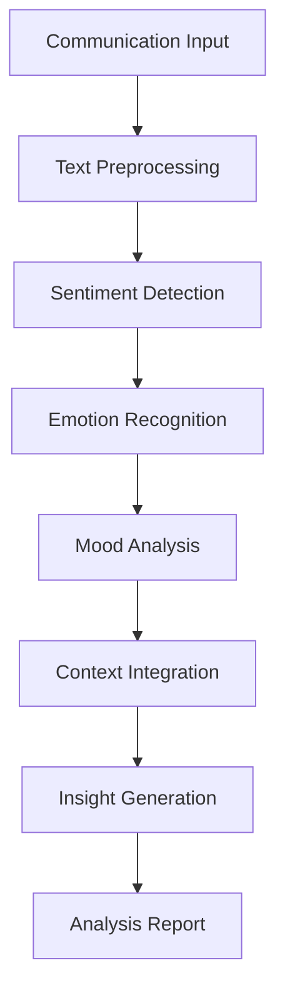
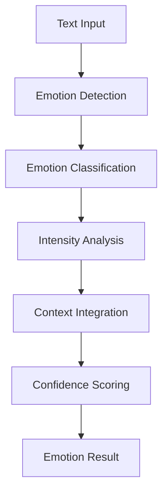
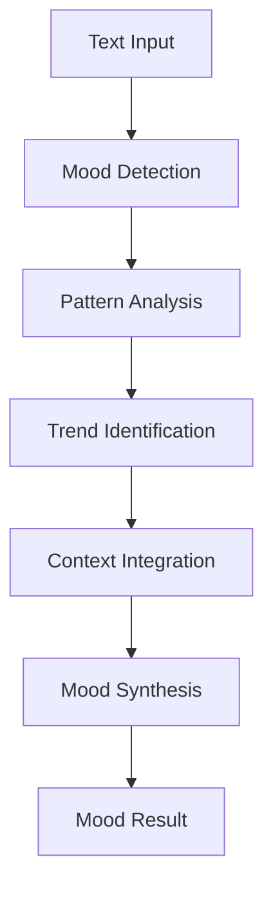

# **Sentiment Analyzer**

## **Overview**

The Sentiment Analyzer module provides comprehensive capabilities for analyzing sentiment, recognizing emotions, tracking mood changes, and providing emotional intelligence insights. It enables data-driven understanding of emotional content in communications.

## **Core Principles**

### **Emotional Intelligence**
- **Sentiment Detection**: Accurate sentiment detection and classification
- **Emotion Recognition**: Recognize and classify emotional states
- **Mood Tracking**: Track mood changes and emotional patterns
- **Emotional Insights**: Provide emotional intelligence insights

### **Real-time Analysis**
- **Fast Analysis**: < 100ms analysis time for real-time processing
- **High Accuracy**: 95%+ accuracy for sentiment and emotion recognition
- **Continuous Monitoring**: Continuous monitoring of emotional content
- **Predictive Analysis**: Predictive sentiment analysis for trends

### **Multi-dimensional Analysis**
- **Context Awareness**: Context-aware sentiment analysis
- **Cultural Sensitivity**: Culturally sensitive emotion recognition
- **Multi-language Support**: Multi-language sentiment analysis
- **Cross-modal Analysis**: Cross-modal sentiment analysis

## **Function Specifications**

### **Primary Functions**

#### **analyzeSentiment(text: string, context?: SentimentContext): SentimentResult**
- **Purpose**: Analyze sentiment and emotional content of text
- **Parameters**:
  - `text`: Input text for sentiment analysis
  - `context`: Optional context for sentiment analysis
- **Returns**: Sentiment analysis result with emotional content and confidence
- **Performance**: < 100ms analysis time, 95%+ accuracy

#### **recognizeEmotions(text: string, emotionTypes?: string[]): EmotionResult**
- **Purpose**: Recognize specific emotions in communication
- **Parameters**:
  - `text`: Input text for emotion recognition
  - `emotionTypes`: Optional emotion types to recognize
- **Returns**: Recognized emotions with confidence scores and intensity
- **Performance**: < 80ms recognition time, high accuracy

#### **trackMood(text: string, userContext?: UserContext): MoodResult**
- **Purpose**: Track mood changes and emotional patterns
- **Parameters**:
  - `text`: Input text for mood tracking
  - `userContext`: Optional user context for mood analysis
- **Returns**: Mood tracking result with patterns and trends
- **Performance**: < 120ms tracking time, comprehensive analysis

#### **predictSentiment(historicalData: SentimentData[]): PredictionResult**
- **Purpose**: Predict sentiment trends and emotional patterns
- **Parameters**:
  - `historicalData`: Historical sentiment data for prediction
- **Returns**: Sentiment prediction with trends and confidence
- **Performance**: < 200ms prediction time, accurate forecasting

### **Configuration Functions**

#### **configureSentiment(options: SentimentConfig): void**
- **Purpose**: Configure sentiment analysis parameters
- **Parameters**:
  - `options`: Sentiment configuration object
- **Returns**: void
- **Performance**: < 10ms configuration time

#### **addEmotionModel(model: EmotionModel): void**
- **Purpose**: Add custom emotion recognition model
- **Parameters**:
  - `model`: Custom emotion model configuration
- **Returns**: void
- **Performance**: < 50ms addition time

## **Integration Patterns**

### **Sentiment Analysis Flow**


### **Emotion Recognition Flow**


### **Mood Tracking Flow**


## **Capabilities**

### **Sentiment Analysis**
- **Real-time Analysis**: Real-time sentiment analysis and emotional intelligence
- **Emotion Recognition**: Recognize and track emotional states and changes
- **Mood Tracking**: Track mood changes and emotional patterns over time
- **Trend Analysis**: Analyze sentiment trends and patterns
- **Predictive Sentiment**: Predictive sentiment analysis for future communications

### **Emotional Intelligence**
- **Emotion Classification**: Classification of emotions and emotional states
- **Intensity Analysis**: Analysis of emotional intensity and strength
- **Emotional Context**: Context-aware emotional analysis
- **Emotional Patterns**: Recognition of emotional patterns and cycles
- **Emotional Insights**: Generation of emotional intelligence insights

### **Advanced Features**
- **Multi-language Sentiment**: Multi-language sentiment analysis and recognition
- **Cultural Sensitivity**: Culturally sensitive emotion recognition
- **Cross-modal Analysis**: Cross-modal sentiment analysis (text, voice, visual)
- **Context Integration**: Integration of context and background information
- **Predictive Analytics**: Predictive analytics for emotional trends

### **Analytics Integration**
- **Sentiment Analytics**: Comprehensive sentiment analytics and reporting
- **Emotional Metrics**: Emotional metrics and KPIs
- **Trend Analysis**: Trend analysis and pattern recognition
- **Performance Monitoring**: Performance monitoring and optimization
- **Insight Generation**: Generation of actionable insights

## **Configuration Examples**

### **Basic Sentiment Configuration**
```yaml
sentiment_analysis:
  models:
    sentiment_model: "bert-base"
    emotion_model: "roberta-base"
    mood_model: "distilbert"
    trend_model: "lstm"
  analysis:
    real_time_analysis: true
    emotion_recognition: true
    mood_tracking: true
    trend_analysis: true
    predictive_analysis: true
  performance:
    analysis_speed: "< 100ms"
    accuracy: "95%+"
    real_time: true
    batch_processing: true
  integration:
    nlp_engines: ["spacy", "nltk"]
    analytics_platforms: ["elasticsearch", "kibana"]
    reporting_tools: ["grafana", "tableau"]
```

### **Advanced Sentiment Configuration**
```yaml
sentiment_analysis:
  models:
    primary_model: "transformer"
    emotion_model: "lstm"
    cultural_model: "multilingual"
    predictive_model: "temporal_convolution"
  features:
    multi_language: true
    cultural_sensitivity: true
    cross_modal: true
    context_integration: true
  learning:
    continuous_learning: true
    feedback_integration: true
    model_updates: true
    accuracy_tracking: true
  analytics:
    sentiment_analytics: true
    emotional_metrics: true
    trend_analysis: true
    insight_generation: true
```

### **Emotion Recognition Configuration**
```yaml
emotion_recognition:
  emotions:
    primary_emotions:
      - "joy"
      - "sadness"
      - "anger"
      - "fear"
      - "surprise"
      - "disgust"
    secondary_emotions:
      - "love"
      - "hate"
      - "anxiety"
      - "excitement"
      - "frustration"
      - "satisfaction"
  recognition:
    emotion_detection: true
    intensity_analysis: true
    context_integration: true
    cultural_adaptation: true
  validation:
    confidence_threshold: 0.8
    emotion_validation: true
    context_validation: true
    cultural_validation: true
```

## **Error Handling**

### **Sentiment Analysis Errors**
- **Analysis Failures**: Fallback to basic sentiment analysis methods
- **Model Errors**: Automatic model switching and fallback
- **Cultural Errors**: Cultural validation and correction procedures
- **Context Errors**: Context validation and correction

### **Emotion Recognition Errors**
- **Recognition Failures**: Fallback to statistical recognition methods
- **Low Confidence**: Request clarification for low-confidence emotions
- **Emotion Conflicts**: Emotion conflict resolution and validation
- **Cultural Errors**: Cultural validation and adaptation

### **Mood Tracking Errors**
- **Tracking Failures**: Graceful degradation with partial results
- **Pattern Errors**: Pattern validation and correction
- **Trend Errors**: Trend validation and correction
- **Context Errors**: Context validation and integration

### **Configuration Errors**
- **Invalid Configuration**: Configuration validation and error reporting
- **Model Errors**: Automatic model switching and fallback
- **Resource Errors**: Resource management and optimization
- **Performance Errors**: Performance monitoring and optimization

## **Performance Considerations**

### **Sentiment Analysis Performance**
- **Analysis Speed**: < 100ms for real-time sentiment analysis
- **Accuracy**: 95%+ accuracy for sentiment and emotion recognition
- **Throughput**: 10,000+ analyses per hour
- **Real-time Processing**: Real-time processing for live communications

### **Emotion Recognition Performance**
- **Recognition Speed**: < 80ms for emotion recognition
- **Accuracy**: High accuracy for emotion classification
- **Intensity Analysis**: Fast intensity analysis and scoring
- **Context Integration**: Fast context integration and analysis

### **Mood Tracking Performance**
- **Tracking Speed**: < 120ms for mood tracking
- **Pattern Analysis**: Fast pattern analysis and recognition
- **Trend Analysis**: Fast trend analysis and identification
- **Predictive Analysis**: Fast predictive analysis and forecasting

### **Scalability**
- **Horizontal Scaling**: Horizontal scaling for high-volume processing
- **Vertical Scaling**: Vertical scaling for resource optimization
- **Load Balancing**: Intelligent load balancing and distribution
- **Resource Management**: Efficient resource allocation and management

## **Monitoring & Observability**

### **Sentiment Analysis Metrics**
- **Analysis Accuracy**: Sentiment and emotion analysis accuracy rates
- **Processing Speed**: Average processing time and throughput
- **Model Performance**: Performance metrics for different models
- **Error Rates**: Analysis error rates and failure analysis

### **Performance Metrics**
- **Processing Speed**: Average processing time and throughput
- **Memory Usage**: Memory usage and optimization metrics
- **CPU Usage**: CPU usage and optimization metrics
- **Throughput**: Overall system throughput and capacity

### **Quality Metrics**
- **Sentiment Accuracy**: Sentiment analysis accuracy and precision
- **Emotion Recognition**: Emotion recognition accuracy and precision
- **Mood Tracking**: Mood tracking accuracy and reliability
- **Predictive Accuracy**: Predictive analysis accuracy and reliability

### **Operational Metrics**
- **System Health**: Overall system health and availability
- **Resource Utilization**: Resource utilization and optimization
- **Error Tracking**: Error tracking and analysis
- **Performance Trends**: Performance trends and optimization

## **Security Considerations**

### **Data Privacy**
- **Sentiment Privacy**: End-to-end encryption for sentiment analysis data
- **Emotion Privacy**: Privacy protection for emotion recognition data
- **Mood Privacy**: Privacy protection for mood tracking data
- **Data Retention**: Configurable retention policies

### **Access Control**
- **Authentication**: Strong authentication for sentiment analysis services
- **Authorization**: Role-based access control for analysis functions
- **API Security**: Secure API access and rate limiting
- **Audit Logging**: Comprehensive audit trails for all operations

### **Content Security**
- **Input Validation**: Comprehensive input validation and sanitization
- **Content Filtering**: Automatic filtering of inappropriate content
- **Cultural Sensitivity**: Cultural sensitivity and appropriateness checking
- **Output Validation**: Validation of analysis outputs and results

---

**Version**: 1.0  
**Category**: Communication & Language  
**Subcategory**: Communication Analytics  
**Focus**: Comprehensive sentiment analysis and emotional intelligence 