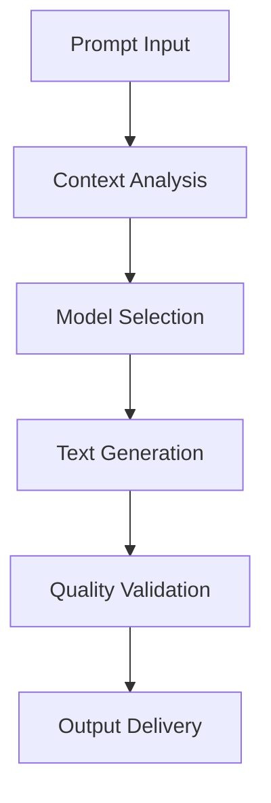

# **Text Generator**

## **Purpose**

The Text Generator provides advanced text generation capabilities using natural language processing and AI models. It supports multi-language output, style adaptation, tone control, and context-aware content creation for a wide range of applications.

## **Core Principles**

- **High-Quality Output**: Generate professional, contextually relevant text
- **Multi-Language Support**: Support for 100+ languages
- **Style & Tone Adaptation**: Adapt writing style and tone to user needs
- **User-Centric Design**: Focus on user intent and requirements
- **Continuous Improvement**: Learn from feedback to improve output

## **Function Specifications**

### **Core Functions**

#### **generateText(prompt: string, options?: TextGenOptions): Promise<TextGenResult>**
Generates text based on a prompt and optional parameters.

**Parameters:**
- `prompt`: Input prompt or context
- `options`: Optional generation options (language, style, tone, length, etc.)

**Returns:**
- `TextGenResult`: Generated text and metadata

**Example:**
```typescript
const result = await textGenerator.generateText(
  "Write a summary of the kOS project in 100 words.",
  { language: "en", style: "formal", tone: "neutral", length: 100 }
);
console.log(result.text);
```

#### **suggestCompletions(prefix: string, options?: TextGenOptions): Promise<string[]>**
Suggests possible text completions for a given prefix.

**Parameters:**
- `prefix`: Text prefix to complete
- `options`: Optional generation options

**Returns:**
- `string[]`: Array of suggested completions

**Example:**
```typescript
const suggestions = await textGenerator.suggestCompletions("The future of AI is", { language: "en" });
suggestions.forEach(s => console.log(s));
```

#### **analyzeTextQuality(text: string): Promise<TextQualityReport>**
Analyzes the quality of generated text.

**Parameters:**
- `text`: Text to analyze

**Returns:**
- `TextQualityReport`: Quality metrics and improvement suggestions

**Example:**
```typescript
const report = await textGenerator.analyzeTextQuality(result.text);
console.log(report.metrics);
```

## **Integration Patterns**

### **Text Generation Flow**


## **Capabilities**

- **Multi-Language Generation**: Output in 100+ languages
- **Style & Tone Control**: Adapt to various writing styles and tones
- **Length Optimization**: Generate text of specified length
- **Context Awareness**: Use context for relevant output
- **Quality Assessment**: Built-in quality analysis and feedback

## **Configuration Examples**

```yaml
text_generator:
  default_language: "en"
  style_adaptation: true
  tone_control: true
  quality_threshold: 0.8
  max_length: 1000
  model: "gpt-4"
```

## **Error Handling**

- **Model Failure**: Retry with fallback model
- **Input Too Long**: Return error with max length info
- **Unsupported Language**: Return error with supported languages
- **Quality Below Threshold**: Suggest improvements

## **Performance Considerations**

- **Generation Latency**: Optimized for < 500ms
- **Batch Generation**: Support for batch text generation
- **Resource Usage**: Efficient memory and CPU usage

## **Security Considerations**

- **Content Filtering**: Filter unsafe or inappropriate content
- **Access Control**: Restrict access to sensitive generation features
- **Audit Logging**: Log all generation requests

## **Monitoring & Observability**

- **Generation Metrics**: Track request count, latency, and errors
- **Quality Metrics**: Track quality scores and feedback
- **Alerting**: Alerts for model failures or quality issues

---

**Version**: 1.0
**Focus**: Advanced, context-aware text generation for kOS ecosystem 