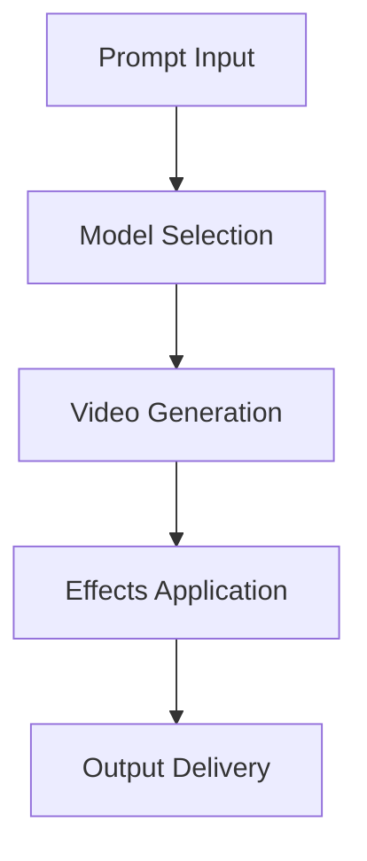

# **Video Generator**

## **Purpose**

The Video Generator provides advanced video content generation and editing capabilities. It supports video synthesis, editing, effects, optimization, and multi-format output for a wide range of applications.

## **Core Principles**

- **High-Quality Output**: Generate professional, high-resolution video
- **Multi-Format Support**: Output in multiple video formats
- **Video Effects**: Support for effects, transitions, and overlays
- **User-Centric Design**: Focus on user requirements and creative intent
- **Continuous Improvement**: Learn from feedback to improve output

## **Function Specifications**

### **Core Functions**

#### **generateVideo(prompt: string, options?: VideoGenOptions): Promise<VideoGenResult>**
Generates video based on a prompt and optional parameters.

**Parameters:**
- `prompt`: Input prompt or description
- `options`: Optional generation options (style, resolution, format, etc.)

**Returns:**
- `VideoGenResult`: Generated video and metadata

**Example:**
```typescript
const result = await videoGenerator.generateVideo(
  "A 30-second explainer video about kOS.",
  { style: "animated", resolution: "1080p", format: "mp4" }
);
console.log(result.videoUrl);
```

#### **applyEffects(video: Buffer, effects: VideoEffects): Promise<VideoGenResult>**
Applies effects or transitions to a video.

**Parameters:**
- `video`: Input video buffer
- `effects`: Effects or transitions to apply

**Returns:**
- `VideoGenResult`: Edited video and metadata

**Example:**
```typescript
const edited = await videoGenerator.applyEffects(videoBuffer, { transition: "fade-in" });
console.log(edited.videoUrl);
```

## **Integration Patterns**

### **Video Generation Flow**


## **Capabilities**

- **Video Synthesis**: AI-generated video content
- **Editing & Effects**: Add effects, transitions, overlays
- **Multi-Format Output**: MP4, AVI, MOV, WEBM, etc.
- **Batch Generation**: Generate multiple videos in parallel
- **Resolution Optimization**: Up to 4K output

## **Configuration Examples**

```yaml
video_generator:
  default_style: "animated"
  max_resolution: "4K"
  format_support: ["mp4", "avi", "mov", "webm"]
  batch_generation: true
```

## **Error Handling**

- **Model Failure**: Retry with fallback model
- **Unsupported Format**: Return error with supported formats
- **Resolution Too High**: Return error with max resolution info
- **Effects Not Found**: Return error with available effects

## **Performance Considerations**

- **Generation Latency**: Optimized for < 5s
- **Batch Generation**: Support for batch video generation
- **Resource Usage**: Efficient GPU and memory usage

## **Security Considerations**

- **Content Filtering**: Filter unsafe or inappropriate video
- **Access Control**: Restrict access to sensitive generation features
- **Audit Logging**: Log all generation requests

## **Monitoring & Observability**

- **Generation Metrics**: Track request count, latency, and errors
- **Quality Metrics**: Track quality scores and feedback
- **Alerting**: Alerts for model failures or quality issues

---

**Version**: 1.0
**Focus**: Advanced, creative video generation for kOS ecosystem 