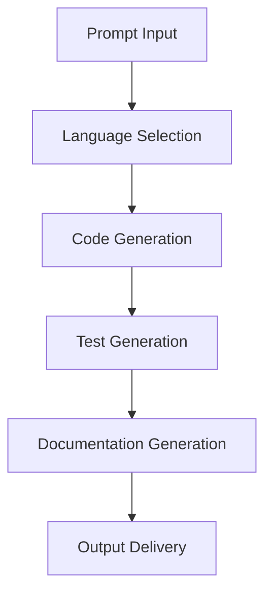

# **Code Generator**

## **Purpose**

The Code Generator provides intelligent code generation and development capabilities. It supports multi-language code generation, testing, documentation, and integration with popular frameworks for rapid software development and automation.

## **Core Principles**

- **Multi-Language Support**: Generate code in multiple programming languages
- **Best Practices**: Follow coding standards and best practices
- **Testing Integration**: Generate comprehensive test suites
- **Documentation**: Generate code documentation and comments
- **Continuous Improvement**: Learn from feedback to improve output

## **Function Specifications**

### **Core Functions**

#### **generateCode(prompt: string, options?: CodeGenOptions): Promise<CodeGenResult>**
Generates code based on a prompt and optional parameters.

**Parameters:**
- `prompt`: Input prompt or description
- `options`: Optional generation options (language, framework, style, etc.)

**Returns:**
- `CodeGenResult`: Generated code and metadata

**Example:**
```typescript
const result = await codeGenerator.generateCode(
  "Create a REST API endpoint in TypeScript for user login.",
  { language: "typescript", framework: "express", style: "modular" }
);
console.log(result.code);
```

#### **generateTests(code: string, options?: TestGenOptions): Promise<TestGenResult>**
Generates test cases for the provided code.

**Parameters:**
- `code`: Source code to generate tests for
- `options`: Optional test generation options

**Returns:**
- `TestGenResult`: Generated test code and metadata

**Example:**
```typescript
const tests = await codeGenerator.generateTests(result.code, { framework: "jest" });
console.log(tests.code);
```

#### **generateDocs(code: string, options?: DocGenOptions): Promise<DocGenResult>**
Generates documentation for the provided code.

**Parameters:**
- `code`: Source code to document
- `options`: Optional documentation options

**Returns:**
- `DocGenResult`: Generated documentation and metadata

**Example:**
```typescript
const docs = await codeGenerator.generateDocs(result.code);
console.log(docs.documentation);
```

## **Integration Patterns**

### **Code Generation Flow**


## **Capabilities**

- **Multi-Language Generation**: Output in Python, JavaScript, TypeScript, Java, etc.
- **Framework Integration**: Generate code for popular frameworks
- **Testing Integration**: Generate test suites for code
- **Documentation**: Generate code documentation and comments
- **Batch Generation**: Generate multiple code files in parallel

## **Configuration Examples**

```yaml
code_generator:
  language_support: ["python", "javascript", "typescript", "java"]
  framework_support: ["express", "django", "react", "spring"]
  testing_integration: true
  documentation: true
  best_practices: true
```

## **Error Handling**

- **Model Failure**: Retry with fallback model
- **Unsupported Language**: Return error with supported languages
- **Syntax Error**: Return error with details and suggestions
- **Test Generation Failure**: Return error with details

## **Performance Considerations**

- **Generation Latency**: Optimized for < 2s
- **Batch Generation**: Support for batch code generation
- **Resource Usage**: Efficient CPU and memory usage

## **Security Considerations**

- **Code Safety**: Scan generated code for vulnerabilities
- **Access Control**: Restrict access to sensitive generation features
- **Audit Logging**: Log all generation requests

## **Monitoring & Observability**

- **Generation Metrics**: Track request count, latency, and errors
- **Quality Metrics**: Track code quality and feedback
- **Alerting**: Alerts for model failures or quality issues

---

**Version**: 1.0
**Focus**: Intelligent, multi-language code generation for kOS ecosystem 