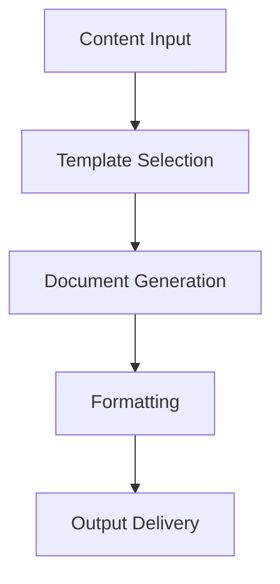

# **Document Generator**

## **Purpose**

The Document Generator provides professional document creation and formatting capabilities. It supports report generation, formatting, template management, and multi-format output for a wide range of business and technical documents.

## **Core Principles**

- **Professional Formatting**: Generate professionally formatted documents
- **Template Support**: Use and manage custom templates
- **Multi-Format Output**: Output in PDF, DOCX, HTML, etc.
- **Content Assembly**: Assemble documents from multiple sources
- **Version Control**: Support document versioning and change tracking

## **Function Specifications**

### **Core Functions**

#### **generateDocument(content: string | DocumentParts, options?: DocGenOptions): Promise<DocGenResult>**
Generates a document from content or parts with optional parameters.

**Parameters:**
- `content`: Content string or structured document parts
- `options`: Optional generation options (template, format, metadata, etc.)

**Returns:**
- `DocGenResult`: Generated document and metadata

**Example:**
```typescript
const result = await documentGenerator.generateDocument(
  "Quarterly financial report for Q1 2025.",
  { template: "financial", format: "pdf" }
);
console.log(result.documentUrl);
```

#### **applyTemplate(document: Buffer, template: string): Promise<DocGenResult>**
Applies a template to a document.

**Parameters:**
- `document`: Input document buffer
- `template`: Template to apply

**Returns:**
- `DocGenResult`: Formatted document and metadata

**Example:**
```typescript
const formatted = await documentGenerator.applyTemplate(documentBuffer, "business");
console.log(formatted.documentUrl);
```

## **Integration Patterns**

### **Document Generation Flow**


## **Capabilities**

- **Professional Formatting**: Output in business and technical formats
- **Template Management**: Use and manage custom templates
- **Multi-Format Output**: PDF, DOCX, HTML, etc.
- **Batch Generation**: Generate multiple documents in parallel
- **Version Control**: Track document versions and changes

## **Configuration Examples**

```yaml
document_generator:
  template_support: true
  multi_format: true
  professional_formatting: true
  version_control: true
```

## **Error Handling**

- **Template Not Found**: Return error with available templates
- **Format Not Supported**: Return error with supported formats
- **Generation Failure**: Return error with details
- **Version Conflict**: Return error with conflict details

## **Performance Considerations**

- **Generation Latency**: Optimized for < 2s
- **Batch Generation**: Support for batch document generation
- **Resource Usage**: Efficient CPU and memory usage

## **Security Considerations**

- **Content Validation**: Validate input content for safety
- **Access Control**: Restrict access to sensitive generation features
- **Audit Logging**: Log all generation requests

## **Monitoring & Observability**

- **Generation Metrics**: Track request count, latency, and errors
- **Quality Metrics**: Track formatting quality and feedback
- **Alerting**: Alerts for generation failures or quality issues

---

**Version**: 1.0
**Focus**: Professional, multi-format document generation for kOS ecosystem 