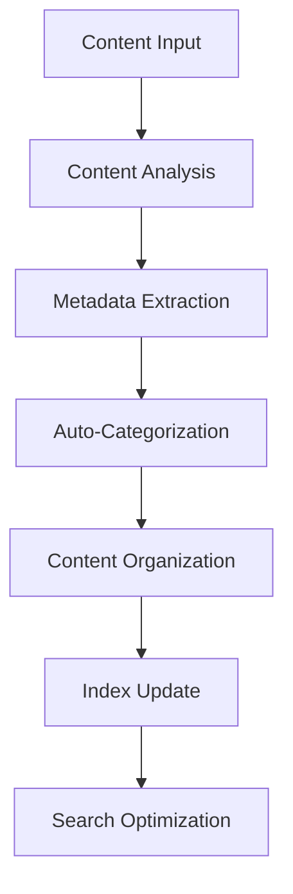
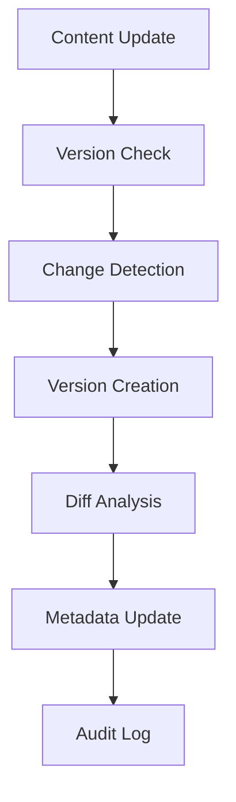
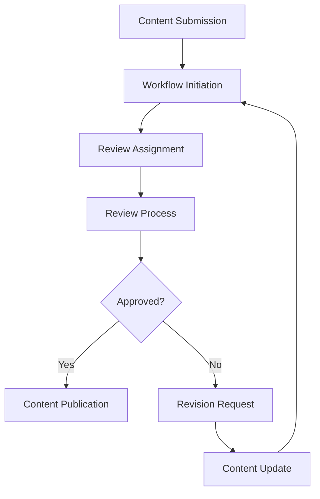

# **Content Management**

## **Overview**

The Content Management subcategory provides comprehensive capabilities for organizing, versioning, categorizing, and managing the lifecycle of content across the kOS ecosystem. This subcategory ensures efficient content organization, retrieval, and maintenance.

## **Core Principles**

### **Organized Content Structure**
- **Hierarchical Organization**: Organize content in logical hierarchical structures
- **Metadata Management**: Comprehensive metadata management for content discovery
- **Categorization**: Intelligent content categorization and tagging
- **Search Optimization**: Optimize content for efficient search and retrieval

### **Version Control & History**
- **Version Management**: Complete version control for all content types
- **Change Tracking**: Track all changes and modifications to content
- **Rollback Capabilities**: Support content rollback to previous versions
- **Audit Trails**: Maintain comprehensive audit trails for content changes

### **Lifecycle Management**
- **Content Lifecycle**: Manage complete content lifecycle from creation to archival
- **Workflow Integration**: Integrate content management with business workflows
- **Approval Processes**: Support content approval and review processes
- **Retention Policies**: Implement configurable content retention policies

## **Modules**

### **01. Content Organizer** ⏳ **PENDING**
- **Status**: Module specification needed
- **Focus**: Intelligent content organization and categorization
- **Capabilities**: Auto-categorization, metadata extraction, hierarchical organization

### **02. Content Version Manager** ⏳ **PENDING**
- **Status**: Module specification needed
- **Focus**: Version control and change management for content
- **Capabilities**: Version tracking, diff analysis, rollback management

### **03. Content Metadata Manager** ⏳ **PENDING**
- **Status**: Module specification needed
- **Focus**: Metadata management and enrichment
- **Capabilities**: Metadata extraction, tagging, search optimization

### **04. Content Workflow Manager** ⏳ **PENDING**
- **Status**: Module specification needed
- **Focus**: Content workflow and approval processes
- **Capabilities**: Workflow automation, approval routing, status tracking

### **05. Content Archive Manager** ⏳ **PENDING**
- **Status**: Module specification needed
- **Focus**: Content archival and retention management
- **Capabilities**: Archival policies, retention management, storage optimization

### **06. Content Search Engine** ⏳ **PENDING**
- **Status**: Module specification needed
- **Focus**: Advanced content search and discovery
- **Capabilities**: Full-text search, semantic search, faceted search

### **07. Content Analytics Manager** ⏳ **PENDING**
- **Status**: Module specification needed
- **Focus**: Content analytics and insights
- **Capabilities**: Usage analytics, performance metrics, content optimization

### **08. Content Collaboration Manager** ⏳ **PENDING**
- **Status**: Module specification needed
- **Focus**: Collaborative content management
- **Capabilities**: Team collaboration, access control, conflict resolution

## **Integration Patterns**

### **Content Organization Flow**


### **Version Management Flow**


### **Workflow Management Flow**


## **Capabilities**

### **Content Organization**
- **Hierarchical Structure**: Organize content in logical hierarchical structures
- **Auto-Categorization**: Automatically categorize content based on content analysis
- **Tag Management**: Comprehensive tagging and labeling system
- **Folder Management**: Intelligent folder and directory management
- **Content Relationships**: Manage relationships between different content pieces

### **Version Control**
- **Version Tracking**: Track all versions of content with detailed history
- **Change Detection**: Automatically detect and track content changes
- **Diff Analysis**: Provide detailed difference analysis between versions
- **Rollback Support**: Support rollback to any previous version
- **Branch Management**: Support content branching and merging

### **Metadata Management**
- **Metadata Extraction**: Automatically extract metadata from content
- **Metadata Enrichment**: Enhance metadata with additional information
- **Search Optimization**: Optimize metadata for efficient search
- **Schema Management**: Manage metadata schemas and standards
- **Validation**: Validate metadata quality and completeness

### **Workflow Management**
- **Process Automation**: Automate content workflow processes
- **Approval Routing**: Route content through approval workflows
- **Status Tracking**: Track content status throughout workflows
- **Notification System**: Notify stakeholders of workflow events
- **Integration**: Integrate with external workflow systems

## **Configuration Examples**

### **Basic Content Management Configuration**
```yaml
content_management:
  organization:
    auto_categorization: true
    hierarchical_structure: true
    metadata_extraction: true
    search_optimization: true
  version_control:
    version_tracking: true
    change_detection: true
    rollback_support: true
    audit_logging: true
  workflow:
    process_automation: true
    approval_routing: true
    status_tracking: true
    notification_system: true
  archival:
    retention_policies: true
    storage_optimization: true
    access_control: true
    compliance_tracking: true
```

### **Advanced Content Management Configuration**
```yaml
content_management:
  organization:
    ai_categorization: true
    semantic_analysis: true
    relationship_mapping: true
    intelligent_foldering: true
  versioning:
    distributed_versioning: true
    conflict_resolution: true
    merge_capabilities: true
    version_analytics: true
  workflow:
    adaptive_workflows: true
    machine_learning_routing: true
    predictive_analytics: true
    integration_apis: true
  analytics:
    usage_analytics: true
    performance_metrics: true
    content_optimization: true
    predictive_insights: true
```

## **Performance Considerations**

### **Organization Performance**
- **Categorization Speed**: < 1 second for content categorization
- **Metadata Extraction**: < 2 seconds for metadata extraction
- **Search Response**: < 100ms for search queries
- **Index Updates**: Real-time index updates for new content

### **Version Control Performance**
- **Version Creation**: < 500ms for version creation
- **Diff Analysis**: < 1 second for diff analysis
- **Rollback Operations**: < 2 seconds for rollback operations
- **History Retrieval**: < 100ms for version history retrieval

### **Workflow Performance**
- **Workflow Initiation**: < 1 second for workflow initiation
- **Approval Routing**: < 500ms for approval routing
- **Status Updates**: Real-time status updates
- **Notification Delivery**: < 100ms for notification delivery

### **Scalability**
- **Content Volume**: Support millions of content pieces
- **Concurrent Users**: Support 1000+ concurrent users
- **Storage Efficiency**: Optimize storage usage and costs
- **Performance Scaling**: Horizontal scaling for performance

## **Security Considerations**

### **Access Control**
- **Role-Based Access**: Implement role-based access control for content
- **Permission Management**: Fine-grained permission management
- **Authentication**: Strong authentication for content access
- **Authorization**: Comprehensive authorization for content operations

### **Data Protection**
- **Encryption**: Encrypt content at rest and in transit
- **Privacy Protection**: Protect sensitive content and metadata
- **Audit Logging**: Comprehensive audit trails for all operations
- **Compliance**: Ensure compliance with data protection regulations

### **Content Security**
- **Content Validation**: Validate content for security threats
- **Malware Detection**: Detect and prevent malware in content
- **Access Monitoring**: Monitor content access and usage patterns
- **Security Alerts**: Alert on suspicious content activities

## **Monitoring & Observability**

### **Organization Metrics**
- **Categorization Accuracy**: Track categorization accuracy and quality
- **Search Performance**: Monitor search performance and user satisfaction
- **Metadata Quality**: Track metadata quality and completeness
- **Organization Efficiency**: Monitor organization efficiency and effectiveness

### **Version Control Metrics**
- **Version Creation Rate**: Track version creation frequency
- **Rollback Frequency**: Monitor rollback frequency and reasons
- **Change Patterns**: Analyze content change patterns and trends
- **Version Storage**: Monitor version storage usage and optimization

### **Workflow Metrics**
- **Workflow Efficiency**: Track workflow efficiency and completion rates
- **Approval Times**: Monitor approval times and bottlenecks
- **Process Automation**: Track automation effectiveness and savings
- **User Satisfaction**: Monitor user satisfaction with workflows

### **Operational Metrics**
- **System Performance**: Monitor overall system performance and health
- **Storage Usage**: Track storage usage and optimization
- **Error Rates**: Monitor error rates and failure analysis
- **Performance Trends**: Track performance trends and optimization

---

**Version**: 1.0  
**Subcategory**: Content Management  
**Status**: ⏳ **PENDING** - Subcategory index complete, modules need implementation  
**Focus**: Comprehensive content organization, versioning, and lifecycle management 