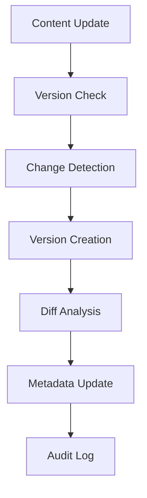

# **Content Version Manager**

## **Purpose**

The Content Version Manager provides version control and change management for all content types. It supports version tracking, diff analysis, rollback management, and audit trails for efficient content lifecycle management.

## **Core Principles**

- **Version Tracking**: Track all versions of content with detailed history
- **Change Detection**: Automatically detect and track content changes
- **Rollback Support**: Support rollback to previous versions
- **Audit Trails**: Maintain comprehensive audit trails for content changes
- **Branch Management**: Support content branching and merging

## **Function Specifications**

### **Core Functions**

#### **createVersion(content: ContentItem, options?: VersionOptions): Promise<VersionResult>**
Creates a new version of a content item.

**Parameters:**
- `content`: Content item to version
- `options`: Optional versioning options (metadata, branch, etc.)

**Returns:**
- `VersionResult`: Version creation result and metadata

**Example:**
```typescript
const version = await contentVersionManager.createVersion(contentItem, { branch: "main" });
console.log(version.versionId);
```

#### **getDiff(versionA: string, versionB: string): Promise<DiffResult>**
Gets the difference between two content versions.

**Parameters:**
- `versionA`: First version identifier
- `versionB`: Second version identifier

**Returns:**
- `DiffResult`: Difference analysis result

**Example:**
```typescript
const diff = await contentVersionManager.getDiff("v1.0", "v1.1");
console.log(diff.changes);
```

#### **rollbackVersion(contentId: string, targetVersion: string): Promise<RollbackResult>**
Rolls back content to a previous version.

**Parameters:**
- `contentId`: Content identifier
- `targetVersion`: Version to roll back to

**Returns:**
- `RollbackResult`: Rollback result and metadata

**Example:**
```typescript
const rollback = await contentVersionManager.rollbackVersion("content123", "v1.0");
console.log(rollback.status);
```

## **Integration Patterns**

### **Version Management Flow**


## **Capabilities**

- **Version Tracking**: Track all versions and changes
- **Diff Analysis**: Analyze differences between versions
- **Rollback Support**: Roll back to previous versions
- **Branch Management**: Support branching and merging
- **Audit Trails**: Maintain audit logs for all changes

## **Configuration Examples**

```yaml
content_version_manager:
  version_tracking: true
  change_detection: true
  rollback_support: true
  branch_management: true
  audit_logging: true
```

## **Error Handling**

- **Version Creation Failure**: Return error with details
- **Diff Analysis Failure**: Return error with details
- **Rollback Failure**: Return error with details
- **Branch Conflict**: Return error with conflict details

## **Performance Considerations**

- **Versioning Latency**: Optimized for < 1s
- **Batch Versioning**: Support for batch version creation
- **Resource Usage**: Efficient CPU and memory usage

## **Security Considerations**

- **Access Control**: Restrict access to version management features
- **Audit Logging**: Log all versioning actions
- **Version Privacy**: Protect sensitive version data

## **Monitoring & Observability**

- **Versioning Metrics**: Track request count, latency, and errors
- **Change Metrics**: Track change detection and diff analysis
- **Alerting**: Alerts for versioning failures or conflicts

---

**Version**: 1.0
**Focus**: Robust, auditable content version management for kOS ecosystem 