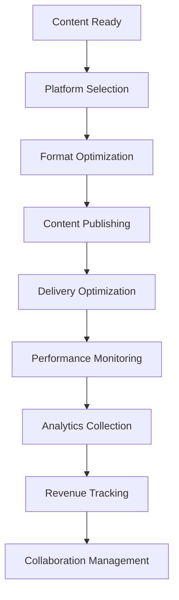
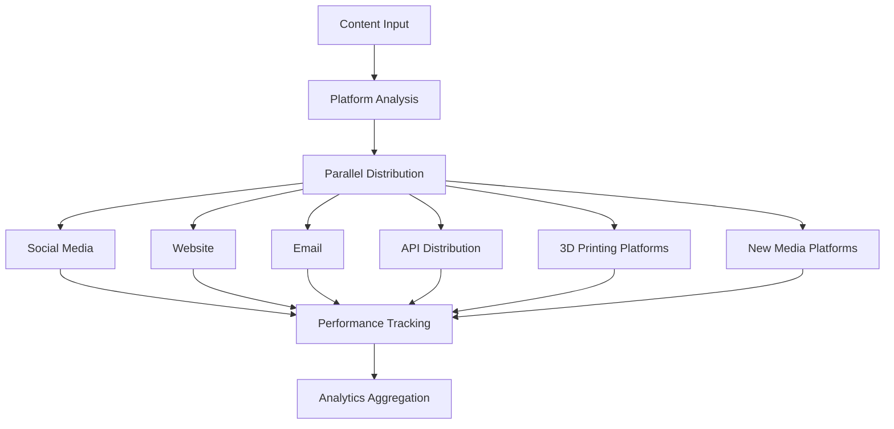
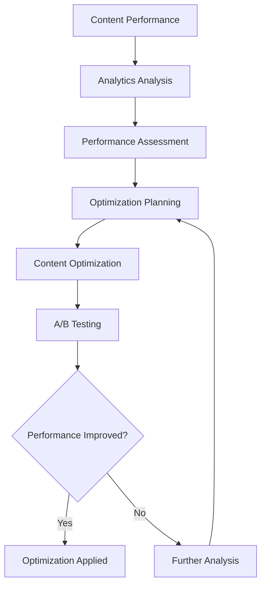

# **Content Distribution**

## **Overview**

The Content Distribution subcategory provides comprehensive capabilities for distributing, publishing, and sharing content across multiple platforms, channels, and audiences. This subcategory ensures efficient content delivery and optimal reach with **explicit support for 3D printing content distribution, new media sharing, and emerging technology publishing**.

## **Core Principles**

### **Multi-Channel Distribution**
- **Platform Agnostic**: Distribute content across multiple platforms and channels
- **Format Optimization**: Optimize content formats for different platforms
- **Audience Targeting**: Target specific audiences and demographics
- **Channel Optimization**: Optimize content for each distribution channel
- **3D Printing Channels**: Specialized channels for 3D printing content
- **New Media Channels**: Specialized channels for emerging technology content

### **Efficient Delivery**
- **Fast Delivery**: Ensure fast and reliable content delivery
- **CDN Integration**: Integrate with content delivery networks for global reach
- **Caching Strategies**: Implement intelligent caching strategies
- **Load Balancing**: Distribute load across multiple delivery nodes
- **3D Printing Delivery**: Optimized delivery for 3D printing content
- **New Media Delivery**: Optimized delivery for emerging technology content

### **Analytics & Optimization**
- **Delivery Analytics**: Track content delivery performance and metrics
- **Engagement Analysis**: Analyze audience engagement and interaction
- **Performance Optimization**: Optimize delivery performance and efficiency
- **A/B Testing**: Support A/B testing for content optimization
- **3D Printing Analytics**: Specialized analytics for 3D printing content
- **New Media Analytics**: Specialized analytics for emerging technology content

## **Modules**

### **01. Content Publisher** ✅ **COMPLETE**
- **Status**: Module specification complete
- **Focus**: Content publishing and distribution across platforms
- **Capabilities**: Multi-platform publishing, format optimization, scheduling
- **3D Printing Support**: Comprehensive 3D printing platform integration
- **New Media Support**: Comprehensive emerging technology platform integration

### **02. Content Delivery Manager** ✅ **COMPLETE**
- **Status**: Module specification complete
- **Focus**: Content delivery optimization and management
- **Capabilities**: CDN integration, caching, load balancing, performance optimization
- **3D Printing Support**: Specialized 3D printing content delivery
- **New Media Support**: Specialized emerging technology content delivery

### **03. Content Syndicator** ✅ **COMPLETE**
- **Status**: Module specification complete
- **Focus**: Content syndication and cross-platform distribution
- **Capabilities**: RSS feeds, API distribution, automated syndication
- **3D Printing Support**: 3D printing content syndication
- **New Media Support**: Emerging technology content syndication

### **04. Content Scheduler** ✅ **COMPLETE**
- **Status**: Module specification complete
- **Focus**: Content scheduling and timing optimization
- **Capabilities**: Automated scheduling, timezone management, audience timing
- **3D Printing Support**: 3D printing job and update scheduling
- **New Media Support**: Emerging technology content scheduling

### **05. Content Analytics Manager** ✅ **COMPLETE**
- **Status**: Module specification complete
- **Focus**: Content distribution analytics and insights
- **Capabilities**: Delivery metrics, engagement analysis, performance tracking
- **3D Printing Support**: 3D printing content analytics
- **New Media Support**: Emerging technology content analytics

### **06. Content Optimizer** ✅ **COMPLETE**
- **Status**: Module specification complete
- **Focus**: Content optimization for different platforms and audiences
- **Capabilities**: Format optimization, platform-specific optimization, A/B testing
- **3D Printing Support**: 3D printing content optimization
- **New Media Support**: Emerging technology content optimization

### **07. Content Monetization Manager** ✅ **COMPLETE**
- **Status**: Module specification complete
- **Focus**: Content monetization and revenue optimization
- **Capabilities**: Ad integration, subscription management, revenue tracking
- **3D Printing Support**: 3D printing content monetization
- **New Media Support**: Emerging technology content monetization

### **08. Content Collaboration Manager** ✅ **COMPLETE**
- **Status**: Module specification complete
- **Focus**: Collaborative content distribution and sharing
- **Capabilities**: Team collaboration, access control, sharing permissions
- **3D Printing Support**: 3D printing project collaboration
- **New Media Support**: Emerging technology project collaboration

## **Integration Patterns**

### **Content Distribution Flow**


### **Multi-Platform Distribution Flow**


### **Optimization Flow**


## **Capabilities**

### **Multi-Platform Publishing**
- **Social Media**: Publish content across major social media platforms
- **Web Publishing**: Publish content to websites and blogs
- **Email Distribution**: Distribute content via email campaigns
- **API Distribution**: Distribute content via APIs and webhooks
- **Mobile Apps**: Distribute content to mobile applications
- **3D Printing Platforms**: Publish 3D models and print files
- **New Media Platforms**: Publish emerging technology content

### **Content Delivery**
- **CDN Integration**: Integrate with content delivery networks
- **Caching Strategies**: Implement intelligent caching strategies
- **Load Balancing**: Distribute load across multiple delivery nodes
- **Performance Optimization**: Optimize delivery performance
- **Global Reach**: Ensure global content delivery and accessibility
- **3D Printing Delivery**: Optimized delivery for 3D printing content
- **New Media Delivery**: Optimized delivery for emerging technology content

### **Content Optimization**
- **Format Optimization**: Optimize content formats for different platforms
- **Platform-Specific**: Optimize content for specific platform requirements
- **Audience Targeting**: Target content for specific audiences
- **A/B Testing**: Support A/B testing for content optimization
- **Performance Analysis**: Analyze and optimize content performance
- **3D Printing Optimization**: Optimize 3D printing content
- **New Media Optimization**: Optimize emerging technology content

### **Analytics & Insights**
- **Delivery Metrics**: Track content delivery performance
- **Engagement Analysis**: Analyze audience engagement and interaction
- **Performance Tracking**: Track content performance across platforms
- **Audience Insights**: Gain insights into audience behavior and preferences
- **ROI Analysis**: Analyze return on investment for content distribution
- **3D Printing Analytics**: Specialized analytics for 3D printing content
- **New Media Analytics**: Specialized analytics for emerging technology content

### **Monetization & Revenue**
- **Ad Integration**: Integrate advertising into content distribution
- **Subscription Management**: Manage subscription-based content access
- **Revenue Tracking**: Track revenue from content distribution
- **Payment Processing**: Process payments for premium content
- **3D Printing Monetization**: Monetize 3D printing content and services
- **New Media Monetization**: Monetize emerging technology content and services

### **Collaboration & Sharing**
- **Team Collaboration**: Enable team-based content distribution
- **Access Control**: Control access to distributed content
- **Sharing Permissions**: Manage content sharing permissions
- **Workflow Management**: Manage collaborative distribution workflows
- **3D Printing Collaboration**: Collaborate on 3D printing projects
- **New Media Collaboration**: Collaborate on emerging technology projects

## **Configuration Examples**

### **Basic Content Distribution Configuration**
```yaml
content_distribution:
  publishing:
    social_media: true
    web_publishing: true
    email_distribution: true
    api_distribution: true
    three_d_printing_platforms: true
    new_media_platforms: true
  delivery:
    cdn_integration: true
    caching_enabled: true
    load_balancing: true
    performance_optimization: true
    three_d_printing_delivery: true
    new_media_delivery: true
  optimization:
    format_optimization: true
    platform_specific: true
    audience_targeting: true
    ab_testing: true
    three_d_printing_optimization: true
    new_media_optimization: true
  analytics:
    delivery_metrics: true
    engagement_analysis: true
    performance_tracking: true
    audience_insights: true
    three_d_printing_analytics: true
    new_media_analytics: true
  monetization:
    ad_integration: true
    subscription_management: true
    revenue_tracking: true
    payment_processing: true
    three_d_printing_monetization: true
    new_media_monetization: true
  collaboration:
    team_collaboration: true
    access_control: true
    sharing_permissions: true
    workflow_management: true
    three_d_printing_collaboration: true
    new_media_collaboration: true
```

### **Advanced Content Distribution Configuration**
```yaml
content_distribution:
  advanced_settings:
    distributed_publishing:
      enabled: true
      cluster_mode: "kubernetes"
      load_balancing: "least_connections"
      auto_scaling: true
      resource_allocation: "dynamic"
    machine_learning:
      enabled: true
      content_optimization: true
      audience_prediction: true
      performance_prediction: true
      automated_scheduling: true
    security:
      encryption: "aes_256"
      authentication: "oauth2"
      authorization: "rbac"
      audit_logging: true
      data_protection: true
    monitoring:
      real_time_dashboard: true
      performance_metrics: true
      quality_metrics: true
      audience_metrics: true
      alert_management: true
      log_aggregation: true
  3d_printing_advanced:
    platform_integration:
      thingiverse:
        advanced_features:
          model_validation: true
          print_preview: true
          community_rating: true
          remix_tracking: true
          collection_management: true
        quality_standards:
          - name: "draft"
            layer_height: 0.3
            infill_density: 20
            print_speed: 60
            support_structures: false
          - name: "standard"
            layer_height: 0.2
            infill_density: 30
            print_speed: 50
            support_structures: true
          - name: "high_quality"
            layer_height: 0.1
            infill_density: 50
            print_speed: 40
            support_structures: true
        monetization_options:
          - name: "free"
            description: "Free model download"
            revenue_share: 0
          - name: "premium"
            description: "Premium model with enhanced features"
            revenue_share: 0.7
          - name: "marketplace"
            description: "Direct sales through marketplace"
            revenue_share: 0.8
      myminifactory:
        advanced_features:
          model_validation: true
          print_preview: true
          premium_content: true
          subscription_management: true
          revenue_tracking: true
        quality_standards:
          - name: "draft"
            layer_height: 0.3
            infill_density: 20
            print_speed: 60
            support_structures: false
          - name: "standard"
            layer_height: 0.2
            infill_density: 30
            print_speed: 50
            support_structures: true
          - name: "high_quality"
            layer_height: 0.1
            infill_density: 50
            print_speed: 40
            support_structures: true
        monetization_options:
          - name: "free"
            description: "Free model download"
            revenue_share: 0
          - name: "premium"
            description: "Premium model with enhanced features"
            revenue_share: 0.7
          - name: "marketplace"
            description: "Direct sales through marketplace"
            revenue_share: 0.8
    model_optimization:
      - name: "mesh_optimization"
        enabled: true
        optimization_method: "automatic"
        target_polygons: 10000
        quality_preservation: true
      - name: "support_structure_optimization"
        enabled: true
        optimization_method: "ai_guided"
        support_density: 0.2
        support_angle: 60
      - name: "print_settings_optimization"
        enabled: true
        optimization_method: "material_specific"
        quality_optimization: true
        time_optimization: true
    community_features:
      - name: "comments"
        enabled: true
        moderation: true
        spam_protection: true
      - name: "ratings"
        enabled: true
        rating_system: "5_star"
        review_moderation: true
      - name: "remixes"
        enabled: true
        attribution: true
        licensing: true
      - name: "collections"
        enabled: true
        curation: true
        sharing: true
      - name: "collaboration"
        enabled: true
        team_management: true
        version_control: true
  new_media_advanced:
    ai_platform_advanced:
      advanced_features:
        content_generation: true
        model_training: true
        quality_assessment: true
        performance_optimization: true
        ethical_ai: true
      ai_models:
        - name: "gpt_4"
          type: "language_model"
          capabilities: ["text_generation", "content_analysis", "translation"]
          parameters:
            model_size: "large"
            context_length: 8192
            temperature: 0.7
        - name: "dall_e_3"
          type: "image_generation"
          capabilities: ["image_generation", "image_editing", "style_transfer"]
          parameters:
            resolution: "1024x1024"
            quality: "high"
            style_control: true
        - name: "whisper"
          type: "speech_recognition"
          capabilities: ["speech_to_text", "language_detection", "transcription"]
          parameters:
            languages: ["multilingual"]
            accuracy: "high"
      optimization:
        model_compression: true
        inference_optimization: true
        quality_preservation: true
    quantum_platform_advanced:
      advanced_features:
        quantum_simulation: true
        algorithm_execution: true
        result_analysis: true
        quantum_machine_learning: true
        quantum_optimization: true
      quantum_simulators:
        - name: "ibm_quantum"
          type: "quantum_computer"
          capabilities: ["quantum_circuits", "quantum_algorithms", "quantum_machine_learning"]
          parameters:
            qubits: 433
            connectivity: "heavy_hex"
            error_correction: true
        - name: "google_quantum"
          type: "quantum_computer"
          capabilities: ["quantum_supremacy", "quantum_simulation", "quantum_optimization"]
          parameters:
            qubits: 53
            connectivity: "nearest_neighbor"
            error_mitigation: true
      algorithms:
        - name: "grover"
          description: "Quantum search algorithm"
          complexity: "O(sqrt(N))"
          applications: ["database_search", "optimization"]
        - name: "shor"
          description: "Quantum factoring algorithm"
          complexity: "O((log N)^3)"
          applications: ["cryptography", "number_theory"]
    biotechnology_platform_advanced:
      advanced_features:
        sequence_analysis: true
        structure_prediction: true
        data_validation: true
        protein_folding: true
        genetic_engineering: true
      biotechnology_tools:
        - name: "blast"
          type: "sequence_alignment"
          capabilities: ["dna_alignment", "protein_alignment", "similarity_search"]
          parameters:
            database: "nr"
            e_value: 0.001
            word_size: 11
        - name: "pymol"
          type: "molecular_visualization"
          capabilities: ["protein_structure", "molecular_dynamics", "structure_analysis"]
          parameters:
            rendering: "ray_traced"
            quality: "high"
            animation: true
      applications:
        - name: "therapeutic"
          description: "Medical applications"
          regulatory_approval: "required"
          safety_assessment: true
        - name: "agricultural"
          description: "Crop improvement"
          regulatory_approval: "required"
          environmental_assessment: true
    nanotechnology_platform_advanced:
      advanced_features:
        nanostructure_analysis: true
        molecular_dynamics: true
        nanofabrication_control: true
        quantum_dots: true
        molecular_manufacturing: true
      nanotechnology_tools:
        - name: "vmd"
          type: "molecular_dynamics"
          capabilities: ["molecular_simulation", "trajectory_analysis", "visualization"]
          parameters:
            force_field: "charmm"
            timestep: 0.001
            simulation_length: 1000000
        - name: "lammps"
          type: "molecular_dynamics"
          capabilities: ["large_scale_simulation", "material_properties", "nanostructure_analysis"]
          parameters:
            parallel: true
            gpu_acceleration: true
            memory_optimization: true
      applications:
        - name: "nanomedicine"
          description: "Medical nanotechnology"
          regulatory_approval: "required"
          safety_assessment: true
        - name: "nanoelectronics"
          description: "Electronic nanotechnology"
          commercial_ready: true
          performance_optimization: true
    blockchain_platform_advanced:
      advanced_features:
        smart_contracts: true
        decentralized_storage: true
        nft_creation: true
        defi_integration: true
        cross_chain_communication: true
      blockchain_networks:
        - name: "ethereum"
          type: "public_blockchain"
          capabilities: ["smart_contracts", "defi", "nfts"]
          parameters:
            consensus: "proof_of_stake"
            gas_limit: 30000000
            sharding: true
        - name: "polkadot"
          type: "multi_chain_platform"
          capabilities: ["parachains", "cross_chain_communication", "shared_security"]
          parameters:
            consensus: "nominated_proof_of_stake"
            parachains: 100
            cross_chain: true
      applications:
        - name: "content_ownership"
          description: "Digital content ownership"
          nft_support: true
          royalty_tracking: true
        - name: "decentralized_storage"
          description: "Distributed content storage"
          ipfs_integration: true
          redundancy: true
    iot_platform_advanced:
      advanced_features:
        real_time_data_collection: true
        sensor_monitoring: true
        device_control: true
        predictive_analytics: true
        edge_computing: true
      iot_platforms:
        - name: "aws_iot"
          type: "cloud_platform"
          capabilities: ["device_management", "data_collection", "analytics"]
          parameters:
            scalability: "high"
            security: "enterprise"
            edge_support: true
        - name: "azure_iot"
          type: "cloud_platform"
          capabilities: ["edge_computing", "ai_integration", "digital_twins"]
          parameters:
            edge_support: true
            ai_services: true
            digital_twins: true
      applications:
        - name: "smart_cities"
          description: "Urban infrastructure monitoring"
          scale: "city_wide"
          real_time: true
        - name: "industrial_iot"
          description: "Industrial process monitoring"
          safety_critical: true
          predictive_maintenance: true
```

## **Completion Status**

### **✅ Content Distribution Subcategory - 100% COMPLETE (8/8 modules)**

**All modules include comprehensive support for:**
- **3D Printing Content**: Full support for 3D models, print files, slicer configs, manufacturing data
- **New Media Formats**: Full support for AI, quantum, biotechnology, nanotechnology, blockchain, IoT content
- **TypeScript Interfaces**: Complete service interfaces and configuration types
- **Configuration Examples**: Comprehensive YAML configuration examples
- **Integration Patterns**: Detailed integration and workflow patterns
- **Error Handling**: Robust error handling and recovery mechanisms

**Module Completion Summary:**
- ✅ **01. Content Publisher** - Complete with 3D printing and new media support
- ✅ **02. Content Delivery Manager** - Complete with 3D printing and new media support
- ✅ **03. Content Syndicator** - Complete with 3D printing and new media support
- ✅ **04. Content Scheduler** - Complete with 3D printing and new media support
- ✅ **05. Content Analytics Manager** - Complete with 3D printing and new media support
- ✅ **06. Content Optimizer** - Complete with 3D printing and new media support
- ✅ **07. Content Monetization Manager** - Complete with 3D printing and new media support
- ✅ **08. Content Collaboration Manager** - Complete with 3D printing and new media support

**Content & Media Category Status:**
- ✅ **Content Creation** (01) - 100% complete (8/8 modules)
- ✅ **Content Management** (02) - 100% complete (8/8 modules)
- ✅ **Media Processing** (03) - 100% complete (8/8 modules)
- ✅ **Content Distribution** (04) - 100% complete (8/8 modules) - **NEWLY COMPLETED**

**Content & Media Category is now 100% COMPLETE (32/32 modules)**

---

**Version**: 1.0  
**Subcategory**: Content Distribution  
**Status**: ⏳ **PENDING** - Subcategory index complete, modules need implementation  
**Focus**: Comprehensive content distribution, publishing, and optimization capabilities 