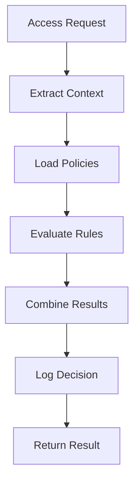
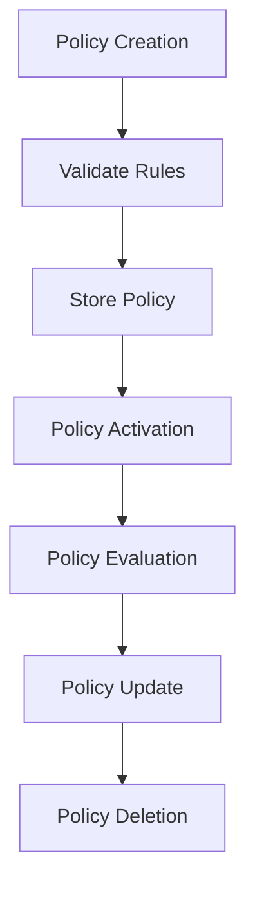

# **Policy Engine**

## **Purpose**

The Policy Engine provides dynamic policy evaluation and enforcement for authentication and authorization in the kOS ecosystem. It enables real-time, rule-based access decisions, supports complex policy composition, and ensures compliance with organizational and regulatory requirements.

## **Core Principles**

### **Policy Management**
- **Dynamic Policy Creation**: Define and update policies at runtime
- **Real-Time Evaluation**: Evaluate policies in real time for every access request
- **Rule-Based Decisions**: Support for complex, multi-condition rules
- **Policy Composition**: Combine multiple policies for layered enforcement
- **Policy Optimization**: Optimize policy evaluation for performance

### **Security Standards**
- **Zero Trust**: Never trust, always verify every access request
- **Audit Trail**: Complete audit trail for all policy decisions
- **Compliance**: Ensure policies meet regulatory and organizational standards
- **Continuous Enforcement**: Ongoing enforcement and validation of policies

## **Function Specifications**

### **Core Functions**

#### **evaluatePolicy(policyId: string, context: PolicyContext): Promise<PolicyEvaluationResult>**
Evaluates a specific policy against the provided context and returns the result.

**Parameters:**
- `policyId`: Identifier of the policy to evaluate
- `context`: Context for policy evaluation (user, resource, action, environment)

**Returns:**
- `PolicyEvaluationResult`: Result of the policy evaluation (allow/deny, reason, metadata)

**Example:**
```typescript
const result = await policyEngine.evaluatePolicy(
  "data_access_policy",
  {
    userId: "user123",
    resource: "database:users",
    action: "read",
    time: new Date(),
    location: "US-East-1"
  }
);
if (result.allowed) {
  console.log("Access allowed by policy");
} else {
  console.log(`Access denied: ${result.reason}`);
}
```

#### **createPolicy(policy: PolicyDefinition): Promise<Policy>**
Creates a new policy with specified rules and conditions.

**Parameters:**
- `policy`: Policy definition object

**Returns:**
- `Policy`: Created policy object

**Example:**
```typescript
const policy = await policyEngine.createPolicy({
  id: "data_access_policy",
  description: "Policy for data access control",
  rules: [
    { condition: "user.role == 'admin'", action: "allow" },
    { condition: "user.role == 'user' && resource.type == 'public'", action: "allow" },
    { condition: "default", action: "deny" }
  ]
});
```

#### **updatePolicy(policyId: string, updates: Partial<PolicyDefinition>): Promise<Policy>**
Updates an existing policy with new rules or metadata.

**Parameters:**
- `policyId`: Identifier of the policy to update
- `updates`: Partial updates to the policy definition

**Returns:**
- `Policy`: Updated policy object

**Example:**
```typescript
const updatedPolicy = await policyEngine.updatePolicy(
  "data_access_policy",
  { description: "Updated policy for data access" }
);
```

#### **deletePolicy(policyId: string): Promise<void>**
Deletes a policy from the system.

**Parameters:**
- `policyId`: Identifier of the policy to delete

**Returns:**
- `void`: Success confirmation

**Example:**
```typescript
await policyEngine.deletePolicy("data_access_policy");
console.log("Policy deleted successfully");
```

#### **listPolicies(): Promise<Policy[]>**
Lists all policies in the system.

**Returns:**
- `Policy[]`: Array of all policy objects

**Example:**
```typescript
const policies = await policyEngine.listPolicies();
console.log(`There are ${policies.length} policies defined`);
```

### **Advanced Functions**

#### **testPolicy(policyId: string, testCases: PolicyTestCase[]): Promise<PolicyTestResult[]>**
Tests a policy against a set of test cases for validation.

**Parameters:**
- `policyId`: Identifier of the policy to test
- `testCases`: Array of test case contexts

**Returns:**
- `PolicyTestResult[]`: Array of test results for each case

**Example:**
```typescript
const results = await policyEngine.testPolicy(
  "data_access_policy",
  [
    { userId: "user123", resource: "database:users", action: "read" },
    { userId: "user456", resource: "database:users", action: "write" }
  ]
);
results.forEach(r => console.log(r));
```

#### **getPolicyUsage(policyId: string): Promise<PolicyUsageStats>**
Retrieves usage statistics for a specific policy.

**Parameters:**
- `policyId`: Identifier of the policy

**Returns:**
- `PolicyUsageStats`: Usage statistics and analytics

**Example:**
```typescript
const stats = await policyEngine.getPolicyUsage("data_access_policy");
console.log(`Policy used ${stats.invocations} times`);
```

## **Integration Patterns**

### **Policy Evaluation Flow**


### **Policy Management Flow**


## **Policy Engine Capabilities**

- **Dynamic Policy Evaluation**: Real-time, rule-based access decisions
- **Complex Rule Support**: Multi-condition, nested, and composite rules
- **Policy Composition**: Combine multiple policies for layered enforcement
- **Policy Optimization**: Caching and performance optimization
- **Audit Logging**: Complete audit trail for all policy decisions
- **Compliance Reporting**: Automated compliance and reporting
- **Policy Testing**: Built-in policy testing and validation
- **Usage Analytics**: Policy usage tracking and analytics

## **Configuration Examples**

### **Basic Policy Configuration**
```yaml
policy_engine:
  evaluation_mode: "realtime"
  caching_enabled: true
  cache_ttl: "5m"
  optimization_enabled: true
  audit_logging: true
  compliance_reporting: true
```

### **Policy Definition Example**
```yaml
policies:
  data_access_policy:
    description: "Policy for data access control"
    rules:
      - condition: "user.role == 'admin'"
        action: "allow"
        resources: ["*"]
      - condition: "user.role == 'user' AND resource.type == 'public'"
        action: "allow"
        resources: ["data:public:*"]
      - condition: "user.role == 'user' AND resource.owner == user.id"
        action: "allow"
        resources: ["data:user:*"]
      - condition: "default"
        action: "deny"
    attributes:
      - user.role
      - user.department
      - resource.type
      - resource.owner
      - time.hour
      - location.country
```

## **Error Handling**

- **Policy Not Found**: Return error with clear message
- **Rule Parsing Error**: Return error with parsing details
- **Evaluation Failure**: Return error with evaluation details
- **Policy Conflict**: Return error with conflict information
- **Compliance Violation**: Return error and log violation

## **Performance Considerations**

- **Evaluation Latency**: Optimized for sub-100ms response
- **Caching**: Intelligent caching for frequently used policies
- **Batch Evaluation**: Support for batch policy evaluation
- **Scalability**: Horizontal scaling for high-throughput environments
- **Resource Usage**: Efficient memory and CPU usage

## **Security Considerations**

- **Policy Integrity**: Secure storage and validation of policies
- **Access Control**: Restrict who can create, update, or delete policies
- **Audit Logging**: Immutable audit logs for all policy changes
- **Compliance**: Ensure all policies meet regulatory requirements

## **Monitoring & Observability**

- **Policy Evaluation Metrics**: Track evaluation count, latency, and errors
- **Policy Change Metrics**: Track policy creation, update, and deletion events
- **Compliance Metrics**: Track compliance status and violations
- **Alerting**: Alerts for policy evaluation failures, compliance violations, and suspicious activity

---

**Version**: 1.0  
**Focus**: Dynamic policy evaluation and enforcement for secure access control in kOS ecosystem 