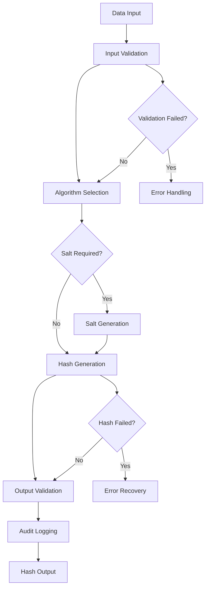

# Base Hash Generator

## Purpose
Provides the core hashing interface and common functionality for all hash generation operations in the kOS ecosystem. This base class defines the standard interface that all specific hash implementations must follow, ensuring consistent behavior, security practices, and performance optimization across all hashing modules. The Base Hash Generator supports various hash algorithms for data integrity, password hashing, digital signatures, and cryptographic operations.

## Capabilities
- **Standardized Hashing Interface**: Provides consistent interface for all hash generation operations
- **Multiple Algorithm Support**: Supports various hash algorithms (SHA-256, SHA-512, BCrypt, etc.)
- **Salt Generation**: Automatic generation of cryptographically secure salts
- **Key Derivation**: Support for key derivation functions (PBKDF2, Argon2, etc.)
- **Performance Optimization**: Optimized hashing performance with configurable settings
- **Security Validation**: Validates hash parameters and security requirements
- **Audit Logging**: Logs all hash operations for security auditing
- **Data Integrity**: Ensures data integrity through hash verification
- **Compliance Support**: Supports various hashing compliance requirements

## Integration Points
- **Input**: Data to hash, algorithm selection, and hashing parameters
- **Output**: Generated hash, salt (if applicable), and operation metadata
- **Dependencies**: Secure random generator for salt generation

## Configuration
```yaml
base_hash_generator:
  default_algorithm: "SHA-256"
  salt_generation:
    enabled: true
    salt_length: 32
    secure_random: true
  key_derivation:
    default_algorithm: "PBKDF2"
    iterations: 100000
    key_length: 32
  performance:
    chunk_size: 1048576  # 1MB chunks
    parallel_processing: true
    max_concurrent_operations: 20
    memory_limit: 512  # MB
  security:
    minimum_salt_length: 16
    minimum_iterations: 10000
    require_secure_random: true
    validate_parameters: true
  audit:
    log_all_operations: true
    include_metadata: true
    retention_period: "7y"
  algorithms:
    sha256:
      enabled: true
      output_length: 32
    sha512:
      enabled: true
      output_length: 64
    bcrypt:
      enabled: true
      cost_factor: 12
    pbkdf2:
      enabled: true
      default_iterations: 100000
```

## Example Workflow


## Core Capabilities

### **1. Standardized Hashing Interface**
- **Description**: Provides consistent interface for all hash generation operations
- **Input**: Data to hash and hashing parameters
- **Output**: Generated hash and metadata
- **Dependencies**: None (base interface)

### **2. Multiple Algorithm Support**
- **Description**: Supports various hash algorithms with automatic selection
- **Input**: Algorithm specification and data type
- **Output**: Algorithm-specific hash and configuration
- **Dependencies**: Algorithm registry and validation

### **3. Salt Generation**
- **Description**: Automatic generation of cryptographically secure salts
- **Input**: Salt requirements and security parameters
- **Output**: Generated salt and salt metadata
- **Dependencies**: Secure random generator

### **4. Key Derivation**
- **Description**: Support for key derivation functions and password hashing
- **Input**: Password, salt, and derivation parameters
- **Output**: Derived key and derivation metadata
- **Dependencies**: Key derivation algorithms

## Module Interface

### **Input Interface**
```typescript
interface BaseHashGeneratorInput {
  data: string | Buffer;
  algorithm?: string;
  salt?: string | Buffer;
  parameters?: HashParameters;
  metadata?: Record<string, any>;
}

interface HashParameters {
  saltLength?: number;
  iterations?: number;
  keyLength?: number;
  costFactor?: number;
  memoryCost?: number;
  parallelism?: number;
}
```

### **Output Interface**
```typescript
interface BaseHashGeneratorOutput {
  hash: Buffer;
  algorithm: string;
  salt?: Buffer;
  parameters: HashParameters;
  metadata: HashMetadata;
  status: HashStatus;
}

interface HashMetadata {
  timestamp: Date;
  operationId: string;
  performanceMetrics: PerformanceMetrics;
  securityLevel: string;
  inputSize: number;
  outputSize: number;
}

interface HashStatus {
  success: boolean;
  error?: string;
  warnings?: string[];
}
```

### **Configuration Interface**
```typescript
interface BaseHashGeneratorConfig {
  defaultAlgorithm: string;
  saltGeneration: SaltGenerationConfig;
  keyDerivation: KeyDerivationConfig;
  performance: PerformanceConfig;
  security: SecurityConfig;
  audit: AuditConfig;
  algorithms: AlgorithmConfig;
}

interface SaltGenerationConfig {
  enabled: boolean;
  saltLength: number;
  secureRandom: boolean;
}

interface KeyDerivationConfig {
  defaultAlgorithm: string;
  iterations: number;
  keyLength: number;
}

interface PerformanceConfig {
  chunkSize: number;
  parallelProcessing: boolean;
  maxConcurrentOperations: number;
  memoryLimit: number;
}

interface SecurityConfig {
  minimumSaltLength: number;
  minimumIterations: number;
  requireSecureRandom: boolean;
  validateParameters: boolean;
}

interface AuditConfig {
  logAllOperations: boolean;
  includeMetadata: boolean;
  retentionPeriod: string;
}

interface AlgorithmConfig {
  sha256: AlgorithmSettings;
  sha512: AlgorithmSettings;
  bcrypt: AlgorithmSettings;
  pbkdf2: AlgorithmSettings;
}

interface AlgorithmSettings {
  enabled: boolean;
  outputLength?: number;
  costFactor?: number;
  defaultIterations?: number;
}
```

## Module Dependencies

### **Required Dependencies**
- **Secure Random Generator**: For generating cryptographically secure random values
- **Configuration Manager**: For managing hash generation configuration settings
- **Performance Monitor**: For monitoring hash generation performance

### **Optional Dependencies**
- **Hardware Security Module (HSM)**: For enhanced security when available
- **Audit Logger**: For comprehensive audit logging when available
- **Memory Manager**: For advanced memory management when available

## Module Implementation

### **Core Components**

#### **1. Hash Engine**
```typescript
class HashEngine {
  private config: BaseHashGeneratorConfig;
  private algorithmRegistry: AlgorithmRegistry;
  private saltGenerator: SaltGenerator;
  private performanceMonitor: PerformanceMonitor;
  
  constructor(config: BaseHashGeneratorConfig) {
    this.config = config;
    this.algorithmRegistry = new AlgorithmRegistry(config.algorithms);
    this.saltGenerator = new SaltGenerator(config.saltGeneration);
    this.performanceMonitor = new PerformanceMonitor();
  }
  
  async generateHash(input: BaseHashGeneratorInput): Promise<BaseHashGeneratorOutput> {
    // Validate input parameters
    this.validateInput(input);
    
    // Select hash algorithm
    const algorithm = this.selectAlgorithm(input.algorithm);
    
    // Generate salt if required
    const salt = await this.generateSaltIfRequired(input.salt, algorithm);
    
    // Perform hash generation
    const result = await this.performHashGeneration(input.data, salt, algorithm, input.parameters);
    
    // Log operation for audit
    await this.logOperation(input, result);
    
    return result;
  }
  
  private validateInput(input: BaseHashGeneratorInput): void {
    if (!input.data || input.data.length === 0) {
      throw new HashGenerationError('Data input is required');
    }
    
    if (this.config.security.validateParameters) {
      this.validateSecurityParameters(input);
    }
  }
  
  private async performHashGeneration(
    data: string | Buffer,
    salt: Buffer | undefined,
    algorithm: HashAlgorithm,
    parameters: HashParameters
  ): Promise<BaseHashGeneratorOutput> {
    const startTime = Date.now();
    
    try {
      const hash = await algorithm.hash(data, salt, parameters);
      
      const performanceMetrics = this.performanceMonitor.captureMetrics(startTime);
      
      return {
        hash,
        algorithm: algorithm.name,
        salt,
        parameters,
        metadata: {
          timestamp: new Date(),
          operationId: this.generateOperationId(),
          performanceMetrics,
          securityLevel: algorithm.securityLevel,
          inputSize: data.length,
          outputSize: hash.length
        },
        status: { success: true }
      };
    } catch (error) {
      throw new HashGenerationError(`Hash generation failed: ${error.message}`, error);
    }
  }
}
```

#### **2. Salt Generator**
```typescript
class SaltGenerator {
  private config: SaltGenerationConfig;
  private secureRandom: SecureRandomGenerator;
  
  constructor(config: SaltGenerationConfig) {
    this.config = config;
    this.secureRandom = new SecureRandomGenerator();
  }
  
  async generateSalt(length?: number): Promise<Buffer> {
    const saltLength = length || this.config.saltLength;
    
    if (saltLength < this.config.minimumSaltLength) {
      throw new HashGenerationError(`Salt length must be at least ${this.config.minimumSaltLength} bytes`);
    }
    
    return await this.secureRandom.generateRandomBytes(saltLength);
  }
  
  async generateSaltIfRequired(
    providedSalt: string | Buffer | undefined,
    algorithm: HashAlgorithm
  ): Promise<Buffer | undefined> {
    if (providedSalt) {
      return Buffer.isBuffer(providedSalt) ? providedSalt : Buffer.from(providedSalt);
    }
    
    if (algorithm.requiresSalt) {
      return await this.generateSalt();
    }
    
    return undefined;
  }
}
```

#### **3. Algorithm Registry**
```typescript
class AlgorithmRegistry {
  private algorithms: Map<string, HashAlgorithm>;
  private config: AlgorithmConfig;
  
  constructor(config: AlgorithmConfig) {
    this.config = config;
    this.algorithms = new Map();
    this.registerAlgorithms();
  }
  
  private registerAlgorithms(): void {
    if (this.config.sha256.enabled) {
      this.algorithms.set('SHA-256', new SHA256Algorithm(this.config.sha256));
    }
    
    if (this.config.sha512.enabled) {
      this.algorithms.set('SHA-512', new SHA512Algorithm(this.config.sha512));
    }
    
    if (this.config.bcrypt.enabled) {
      this.algorithms.set('BCrypt', new BCryptAlgorithm(this.config.bcrypt));
    }
    
    if (this.config.pbkdf2.enabled) {
      this.algorithms.set('PBKDF2', new PBKDF2Algorithm(this.config.pbkdf2));
    }
  }
  
  getAlgorithm(name: string): HashAlgorithm {
    const algorithm = this.algorithms.get(name);
    if (!algorithm) {
      throw new HashGenerationError(`Unsupported hash algorithm: ${name}`);
    }
    return algorithm;
  }
  
  getDefaultAlgorithm(): HashAlgorithm {
    return this.getAlgorithm('SHA-256');
  }
}
```

### **Integration Points**

#### **1. Secure Random Integration**
- **Description**: Provides cryptographically secure random number generation
- **Protocol**: Secure random generation protocols
- **Authentication**: Random number quality validation
- **Rate Limiting**: Random generation rate limiting for security

#### **2. Algorithm Registry Integration**
- **Description**: Manages available hash algorithms and their configurations
- **Protocol**: Registry pattern with algorithm registration and lookup
- **Authentication**: Algorithm validation and security verification
- **Rate Limiting**: Algorithm-specific performance constraints

## Performance Characteristics

### **Throughput**
- **Hash Speed**: 500MB/s for SHA-256 on standard hardware
- **Salt Generation**: 1000 salts/second for standard salt lengths
- **Parallel Processing**: Support for up to 20 concurrent hash operations
- **Memory Efficiency**: < 50MB memory footprint for standard operations

### **Reliability**
- **Error Rate**: < 0.0001% hash generation failures
- **Recovery Time**: < 50ms for recoverable errors
- **Availability**: 99.99% uptime for hash generation services
- **Data Integrity**: 100% data integrity preservation

### **Scalability**
- **Horizontal Scaling**: Support for distributed hash generation across multiple nodes
- **Vertical Scaling**: Linear performance improvement with additional CPU cores
- **Memory Usage**: Efficient memory usage with configurable limits
- **Batch Processing**: Support for batch hash generation operations

## Security Considerations

### **Cryptographic Security**
- **Algorithm Strength**: Only approved cryptographic hash algorithms are supported
- **Salt Security**: Cryptographically secure salt generation
- **Random Number Generation**: Secure random number generation for salts
- **Parameter Validation**: All hash parameters are validated for security

### **Access Control**
- **Operation Authorization**: Authorization required for hash operations
- **Audit Trail**: Complete audit trail for all hash operations
- **Compliance**: Support for various security compliance requirements
- **Data Protection**: Secure handling of sensitive data during hashing

### **Key Derivation Security**
- **Iteration Count**: Configurable iteration counts for key derivation
- **Memory Hardness**: Support for memory-hard algorithms (Argon2)
- **Time Complexity**: Configurable time complexity for brute force resistance
- **Salt Requirements**: Enforced salt requirements for password hashing

## Error Handling

### **Error Types**
- **Invalid Input**: Invalid data or parameters provided
- **Algorithm Errors**: Unsupported or invalid hash algorithms
- **Salt Errors**: Salt generation or validation failures
- **Performance Errors**: Timeout or resource exhaustion errors
- **Security Errors**: Security validation or compliance failures

### **Error Recovery**
- **Automatic Retry**: Automatic retry for transient errors
- **Fallback Algorithms**: Fallback to alternative hash algorithms
- **Parameter Adjustment**: Automatic parameter adjustment for performance issues
- **Graceful Degradation**: Graceful degradation for resource constraints

## Testing Strategy

### **Unit Testing**
- **Input Validation**: Test all input validation scenarios
- **Algorithm Testing**: Test all supported hash algorithms
- **Salt Generation**: Test salt generation and validation
- **Error Handling**: Test all error conditions and recovery

### **Integration Testing**
- **End-to-End Hashing**: Test complete hash generation workflows
- **Performance Testing**: Test performance under various load conditions
- **Security Testing**: Test security measures and compliance
- **Algorithm Compatibility**: Test algorithm compatibility and interoperability

### **Load Testing**
- **Concurrent Operations**: Test multiple concurrent hash operations
- **Large Data Sets**: Test hashing of large data sets
- **Memory Usage**: Test memory usage under high load
- **Performance Degradation**: Test performance under resource constraints

## Deployment Considerations

### **Resource Requirements**
- **CPU**: Minimum 1 core, recommended 2+ cores for high-performance operations
- **Memory**: Minimum 256MB, recommended 1GB+ for large operations
- **Storage**: Minimum 100MB for audit logs and temporary data
- **Network**: Standard network for distributed operations

### **Configuration**
- **Environment Variables**: Configuration through environment variables
- **Configuration Files**: Support for configuration file-based setup
- **Runtime Configuration**: Dynamic configuration updates
- **Validation**: Configuration validation on startup

### **Monitoring**
- **Performance Metrics**: Monitor hash generation performance and throughput
- **Error Rates**: Monitor hash generation error rates and types
- **Security Events**: Monitor security-related events and alerts
- **Resource Usage**: Monitor CPU, memory, and storage usage

## Usage Examples

### **Basic Usage**
```typescript
import { BaseHashGenerator } from './BaseHashGenerator';

const hashGenerator = new BaseHashGenerator(config);

const input: BaseHashGeneratorInput = {
  data: 'Data to hash',
  algorithm: 'SHA-256'
};

const result = await hashGenerator.generateHash(input);
console.log('Hash:', result.hash.toString('hex'));
```

### **Password Hashing**
```typescript
import { BaseHashGenerator } from './BaseHashGenerator';

const hashGenerator = new BaseHashGenerator(config);

const input: BaseHashGeneratorInput = {
  data: 'user_password',
  algorithm: 'BCrypt',
  parameters: {
    costFactor: 12
  }
};

const result = await hashGenerator.generateHash(input);
console.log('Password hash:', result.hash.toString('base64'));
console.log('Salt:', result.salt?.toString('base64'));
```

### **Key Derivation**
```typescript
import { BaseHashGenerator } from './BaseHashGenerator';

const hashGenerator = new BaseHashGenerator(config);

const input: BaseHashGeneratorInput = {
  data: 'master_password',
  algorithm: 'PBKDF2',
  parameters: {
    iterations: 100000,
    keyLength: 32
  }
};

const result = await hashGenerator.generateHash(input);
console.log('Derived key:', result.hash.toString('hex'));
```

### **Advanced Usage with Custom Parameters**
```typescript
import { BaseHashGenerator } from './BaseHashGenerator';

const hashGenerator = new BaseHashGenerator(config);

const input: BaseHashGeneratorInput = {
  data: Buffer.from('large_data_to_hash'),
  algorithm: 'SHA-512',
  parameters: {
    saltLength: 64
  },
  metadata: {
    userId: 'user123',
    dataType: 'document',
    compliance: 'FIPS'
  }
};

const result = await hashGenerator.generateHash(input);
console.log('Hash successful:', result.status.success);
console.log('Algorithm used:', result.algorithm);
console.log('Operation ID:', result.metadata.operationId);
```

## Future Enhancements

### **Planned Features**
- **Quantum-Resistant Algorithms**: Support for post-quantum hash algorithms
- **Hardware Acceleration**: Integration with hardware security modules
- **Advanced Key Derivation**: Enhanced key derivation with Argon2 and scrypt
- **Compliance Automation**: Automated compliance checking and reporting

### **Performance Improvements**
- **GPU Acceleration**: GPU-accelerated hashing for large data sets
- **Advanced Streaming**: Real-time streaming hash generation
- **Batch Processing**: Optimized batch hash generation operations
- **Caching**: Intelligent caching for frequently used hash results

---

**Version**: 1.0  
**Focus**: Core hashing interface and common functionality for all hash generation operations 