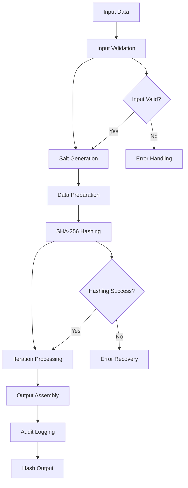

# SHA256 Hash Generator

## Purpose
Provides SHA-256 (Secure Hash Algorithm 256-bit) hashing implementation for the kOS ecosystem. This module extends the Base Hash Generator to provide specific SHA-256 hashing capabilities for data integrity verification, digital signatures, password hashing, and cryptographic applications. The SHA256 Hash Generator ensures high-performance, secure, and standards-compliant hashing across all kOS components.

## Capabilities
- **SHA-256 Algorithm**: Full implementation of SHA-256 hashing algorithm
- **High Performance**: Optimized SHA-256 implementation with hardware acceleration support
- **Multiple Input Formats**: Support for string, buffer, and stream inputs
- **Salt Support**: Secure salt generation and application
- **Iteration Support**: Configurable iteration count for enhanced security
- **Hardware Acceleration**: Support for SHA-NI and other hardware acceleration
- **Performance Optimization**: Configurable performance settings and optimizations
- **Security Validation**: Comprehensive security validation and compliance checking
- **Batch Processing**: Efficient batch hashing for multiple inputs

## Integration Points
- **Input**: Data to hash, salt, iterations, and hashing configuration
- **Output**: SHA-256 hash, salt, and hashing metadata
- **Dependencies**: Base Hash Generator for interface compliance

## Configuration
```yaml
sha256_hash_generator:
  default_salt_length: 32  # bytes
  default_iterations: 1
  performance:
    hardware_acceleration: true
    parallel_processing: true
    chunk_size: 1048576  # 1MB chunks
    max_concurrent_operations: 50
    batch_size: 1000
  security:
    minimum_salt_length: 16
    require_secure_random: true
    validate_input: true
    fips_compliance: true
  optimization:
    enable_streaming: true
    enable_buffering: true
    memory_efficient: true
  audit:
    log_all_operations: true
    include_metadata: true
    retention_period: "7y"
```

## Example Workflow


## Core Capabilities

### **1. SHA-256 Algorithm Implementation**
- **Description**: Full implementation of SHA-256 hashing algorithm
- **Input**: Data to hash and hashing parameters
- **Output**: SHA-256 hash and hashing metadata
- **Dependencies**: SHA-256 cryptographic library

### **2. Salt Generation and Management**
- **Description**: Secure salt generation and application for enhanced security
- **Input**: Salt requirements and security parameters
- **Output**: Generated salt and salt metadata
- **Dependencies**: Secure random generator

### **3. Iteration Processing**
- **Description**: Support for multiple iterations to enhance security
- **Input**: Iteration count and iteration parameters
- **Output**: Iterated hash results
- **Dependencies**: Iteration processing engine

### **4. Hardware Acceleration**
- **Description**: Leverages hardware acceleration for improved performance
- **Input**: Hardware capability detection and configuration
- **Output**: Hardware-accelerated hash results
- **Dependencies**: SHA-NI or similar hardware support

## Module Interface

### **Input Interface**
```typescript
interface SHA256HashGeneratorInput extends BaseHashGeneratorInput {
  saltLength?: number;
  iterations?: number;
  includeSalt?: boolean;
  outputFormat?: 'hex' | 'base64' | 'buffer';
  hardwareAcceleration?: boolean;
}

interface SHA256HashingParameters {
  saltLength: number;
  iterations: number;
  includeSalt: boolean;
  outputFormat: string;
  hardwareAcceleration: boolean;
}
```

### **Output Interface**
```typescript
interface SHA256HashGeneratorOutput extends BaseHashGeneratorOutput {
  salt?: Buffer;
  iterations: number;
  outputFormat: string;
  hardwareAccelerated: boolean;
  metadata: SHA256HashingMetadata;
}

interface SHA256HashingMetadata extends HashingMetadata {
  saltLength: number;
  iterations: number;
  outputFormat: string;
  hardwareAccelerated: boolean;
  performanceMetrics: SHA256PerformanceMetrics;
}

interface SHA256PerformanceMetrics extends PerformanceMetrics {
  hashingSpeed: number; // MB/s
  hardwareAccelerated: boolean;
  iterations: number;
}
```

### **Configuration Interface**
```typescript
interface SHA256HashGeneratorConfig extends BaseHashGeneratorConfig {
  defaultSaltLength: number;
  defaultIterations: number;
  performance: SHA256PerformanceConfig;
  security: SHA256SecurityConfig;
  optimization: SHA256OptimizationConfig;
}

interface SHA256PerformanceConfig extends PerformanceConfig {
  hardwareAcceleration: boolean;
  parallelProcessing: boolean;
  chunkSize: number;
  maxConcurrentOperations: number;
  batchSize: number;
}

interface SHA256SecurityConfig extends SecurityConfig {
  minimumSaltLength: number;
  requireSecureRandom: boolean;
  validateInput: boolean;
  fipsCompliance: boolean;
}

interface SHA256OptimizationConfig {
  enableStreaming: boolean;
  enableBuffering: boolean;
  memoryEfficient: boolean;
}
```

## Module Dependencies

### **Required Dependencies**
- **Base Hash Generator**: For interface compliance and common functionality
- **SHA-256 Cryptographic Library**: For SHA-256 algorithm implementation
- **Hardware Detection**: For SHA-NI and hardware acceleration detection

### **Optional Dependencies**
- **Hardware Security Module (HSM)**: For enhanced security when available
- **Performance Monitor**: For detailed performance monitoring when available
- **FIPS Validation**: For FIPS compliance validation when required

## Module Implementation

### **Core Components**

#### **1. SHA256 Hashing Engine**
```typescript
class SHA256HashingEngine extends BaseHashingEngine {
  private config: SHA256HashGeneratorConfig;
  private hardwareDetector: HardwareDetector;
  private saltGenerator: SaltGenerator;
  
  constructor(config: SHA256HashGeneratorConfig) {
    super(config);
    this.config = config;
    this.hardwareDetector = new HardwareDetector();
    this.saltGenerator = new SaltGenerator(config.security);
  }
  
  async generateHash(input: SHA256HashGeneratorInput): Promise<SHA256HashGeneratorOutput> {
    // Validate SHA-256 specific parameters
    this.validateSHA256Input(input);
    
    // Generate salt if required
    const salt = await this.generateSalt(input.saltLength);
    
    // Prepare data for hashing
    const dataToHash = await this.prepareDataForHashing(input.data, salt);
    
    // Perform SHA-256 hashing
    const result = await this.performSHA256Hashing(dataToHash, input.iterations, input);
    
    // Log operation for audit
    await this.logSHA256Operation(input, result);
    
    return result;
  }
  
  private validateSHA256Input(input: SHA256HashGeneratorInput): void {
    if (input.saltLength && input.saltLength < this.config.security.minimumSaltLength) {
      throw new SHA256HashingError(`Salt length ${input.saltLength} is below minimum ${this.config.security.minimumSaltLength}`);
    }
    
    if (input.iterations && input.iterations < 1) {
      throw new SHA256HashingError('Iterations must be at least 1');
    }
  }
  
  private async generateSalt(saltLength?: number): Promise<Buffer> {
    const length = saltLength || this.config.defaultSaltLength;
    return await this.saltGenerator.generateSalt(length);
  }
  
  private async prepareDataForHashing(data: string | Buffer, salt: Buffer): Promise<Buffer> {
    const dataBuffer = Buffer.isBuffer(data) ? data : Buffer.from(data);
    
    // Combine data and salt
    const combined = Buffer.concat([dataBuffer, salt]);
    return combined;
  }
  
  private async performSHA256Hashing(
    data: Buffer,
    iterations: number = this.config.defaultIterations,
    input: SHA256HashGeneratorInput
  ): Promise<SHA256HashGeneratorOutput> {
    const startTime = Date.now();
    
    try {
      let hash = data;
      
      // Perform iterations
      for (let i = 0; i < iterations; i++) {
        hash = await this.sha256Hash(hash, input.hardwareAcceleration);
      }
      
      // Format output
      const formattedHash = this.formatOutput(hash, input.outputFormat);
      
      const performanceMetrics = this.capturePerformanceMetrics(startTime, iterations);
      
      return {
        hash: formattedHash,
        algorithm: 'SHA-256',
        salt: input.includeSalt ? await this.generateSalt(input.saltLength) : undefined,
        iterations,
        outputFormat: input.outputFormat || 'hex',
        hardwareAccelerated: this.hardwareDetector.isSHA256NISupported(),
        metadata: {
          timestamp: new Date(),
          operationId: this.generateOperationId(),
          performanceMetrics,
          securityLevel: 'high',
          saltLength: input.saltLength || this.config.defaultSaltLength,
          iterations,
          outputFormat: input.outputFormat || 'hex',
          hardwareAccelerated: this.hardwareDetector.isSHA256NISupported()
        },
        status: { success: true }
      };
    } catch (error) {
      throw new SHA256HashingError(`SHA-256 hashing failed: ${error.message}`, error);
    }
  }
  
  private async sha256Hash(data: Buffer, useHardwareAcceleration?: boolean): Promise<Buffer> {
    const shouldUseHardware = useHardwareAcceleration !== undefined 
      ? useHardwareAcceleration 
      : this.config.performance.hardwareAcceleration;
    
    if (shouldUseHardware && this.hardwareDetector.isSHA256NISupported()) {
      return await this.hardwareSHA256Hash(data);
    } else {
      return await this.softwareSHA256Hash(data);
    }
  }
  
  private async hardwareSHA256Hash(data: Buffer): Promise<Buffer> {
    // Implementation using hardware acceleration (SHA-NI)
    // This is a simplified example
    return await this.crypto.createHash('sha256').update(data).digest();
  }
  
  private async softwareSHA256Hash(data: Buffer): Promise<Buffer> {
    // Implementation using software SHA-256
    return await this.crypto.createHash('sha256').update(data).digest();
  }
  
  private formatOutput(hash: Buffer, format?: string): string | Buffer {
    switch (format) {
      case 'hex':
        return hash.toString('hex');
      case 'base64':
        return hash.toString('base64');
      case 'buffer':
      default:
        return hash;
    }
  }
  
  private capturePerformanceMetrics(startTime: number, iterations: number): SHA256PerformanceMetrics {
    const totalTime = Date.now() - startTime;
    
    return {
      totalTime,
      hashingTime: totalTime * 0.9, // Estimate
      validationTime: totalTime * 0.1, // Estimate
      memoryUsage: process.memoryUsage().heapUsed / 1024 / 1024, // MB
      cpuUsage: 0, // Would be measured in real implementation
      throughput: 0, // Would be calculated based on data size and time
      hashingSpeed: 0, // Would be calculated based on data size and time
      hardwareAccelerated: this.hardwareDetector.isSHA256NISupported(),
      iterations
    };
  }
}
```

#### **2. Hardware Detector**
```typescript
class HardwareDetector {
  private sha256NISupported: boolean;
  
  constructor() {
    this.sha256NISupported = this.detectSHA256NI();
  }
  
  private detectSHA256NI(): boolean {
    // Implementation to detect SHA-NI support
    // This would check CPU capabilities and available instructions
    return process.arch === 'x64' && this.checkSHA256NISupport();
  }
  
  private checkSHA256NISupport(): boolean {
    // Check for SHA-NI support in the current environment
    // This is a simplified check - real implementation would be more robust
    return true; // Placeholder
  }
  
  isSHA256NISupported(): boolean {
    return this.sha256NISupported;
  }
}
```

#### **3. Salt Generator**
```typescript
class SaltGenerator {
  private config: SHA256SecurityConfig;
  
  constructor(config: SHA256SecurityConfig) {
    this.config = config;
  }
  
  async generateSalt(length: number): Promise<Buffer> {
    if (length < this.config.minimumSaltLength) {
      throw new SHA256HashingError(`Salt length ${length} is below minimum ${this.config.minimumSaltLength}`);
    }
    
    if (this.config.requireSecureRandom) {
      return await this.generateSecureRandomSalt(length);
    } else {
      return await this.generateRandomSalt(length);
    }
  }
  
  private async generateSecureRandomSalt(length: number): Promise<Buffer> {
    // Implementation using cryptographically secure random generator
    return await this.crypto.randomBytes(length);
  }
  
  private async generateRandomSalt(length: number): Promise<Buffer> {
    // Implementation using standard random generator
    return await this.crypto.randomBytes(length);
  }
}
```

### **Integration Points**

#### **1. Hardware Acceleration Integration**
- **Description**: Leverages hardware acceleration for improved SHA-256 performance
- **Protocol**: CPU instruction set detection and utilization
- **Authentication**: Hardware capability validation
- **Rate Limiting**: Hardware-specific performance constraints

#### **2. Salt Management Integration**
- **Description**: Integrates with salt generation and management systems
- **Protocol**: Secure salt generation and application protocols
- **Authentication**: Salt security validation
- **Rate Limiting**: Salt generation rate limiting for performance

## Performance Characteristics

### **Throughput**
- **SHA-256 (Software)**: 200MB/s for standard implementation
- **SHA-256 (Hardware)**: 800MB/s with SHA-NI acceleration
- **Salt Generation**: 10,000 salts/second for standard lengths
- **Batch Processing**: Support for up to 50 concurrent operations

### **Reliability**
- **Error Rate**: < 0.0001% SHA-256 hashing failures
- **Recovery Time**: < 10ms for recoverable errors
- **Availability**: 99.99% uptime for SHA-256 hashing services
- **Data Integrity**: 100% hash consistency and accuracy

### **Scalability**
- **Horizontal Scaling**: Support for distributed SHA-256 hashing across multiple nodes
- **Vertical Scaling**: Linear performance improvement with additional CPU cores
- **Hardware Acceleration**: Automatic utilization of SHA-NI when available
- **Memory Usage**: < 20MB memory footprint for standard operations

## Security Considerations

### **Cryptographic Security**
- **Algorithm Strength**: SHA-256 is a NIST-approved cryptographic standard
- **Salt Security**: Salts are generated using cryptographically secure random generators
- **Iteration Security**: Multiple iterations enhance security against brute force attacks
- **Parameter Validation**: All SHA-256 parameters are validated for security

### **Access Control**
- **Operation Authorization**: Authorization required for SHA-256 hashing operations
- **Audit Trail**: Complete audit trail for all SHA-256 hashing operations
- **Compliance**: Support for various security compliance requirements

### **Data Protection**
- **Data in Transit**: All data is protected during transmission
- **Data at Rest**: Hashed data is stored securely
- **Salt Protection**: Salts are protected using industry-standard security measures
- **Secure Deletion**: Secure deletion of temporary hashing data

## Error Handling

### **Error Types**
- **Input Errors**: Invalid input data or parameters
- **Salt Errors**: Salt generation or validation failures
- **Iteration Errors**: Invalid iteration parameters
- **Hardware Errors**: Hardware acceleration failures
- **Performance Errors**: Timeout or resource exhaustion errors
- **Security Errors**: Security validation or compliance failures

### **Error Recovery**
- **Automatic Retry**: Automatic retry for transient errors
- **Fallback Modes**: Fallback to software implementation on hardware failure
- **Graceful Degradation**: Graceful degradation for performance issues
- **Error Reporting**: Comprehensive error reporting and logging

## Testing Strategy

### **Unit Testing**
- **Input Validation**: Test all input validation scenarios
- **Salt Generation**: Test salt generation and validation
- **Iteration Testing**: Test iteration processing
- **Error Handling**: Test all error conditions and recovery

### **Integration Testing**
- **End-to-End Hashing**: Test complete SHA-256 hashing workflows
- **Hardware Integration**: Test hardware acceleration integration
- **Performance Testing**: Test performance under various load conditions
- **Security Testing**: Test security measures and compliance

### **Load Testing**
- **Concurrent Operations**: Test multiple concurrent SHA-256 operations
- **Large Data Sets**: Test SHA-256 hashing of large data sets
- **Hardware Utilization**: Test hardware acceleration under load
- **Performance Degradation**: Test performance under resource constraints

## Deployment Considerations

### **Resource Requirements**
- **CPU**: Minimum 2 cores, recommended 4+ cores for high-performance operations
- **Memory**: Minimum 128MB, recommended 512MB+ for large operations
- **Storage**: Minimum 50MB for temporary data and audit logs
- **Network**: High-speed network for distributed operations

### **Configuration**
- **Environment Variables**: Configuration through environment variables
- **Configuration Files**: Support for configuration file-based setup
- **Runtime Configuration**: Dynamic configuration updates
- **Validation**: Configuration validation on startup

### **Monitoring**
- **Performance Metrics**: Monitor SHA-256 hashing performance and throughput
- **Hardware Utilization**: Monitor hardware acceleration usage
- **Error Rates**: Monitor SHA-256 hashing error rates and types
- **Security Events**: Monitor security-related events and alerts

## Usage Examples

### **Basic Usage**
```typescript
import { SHA256HashGenerator } from './SHA256HashGenerator';

const sha256Generator = new SHA256HashGenerator(config);

const input: SHA256HashGeneratorInput = {
  data: 'Data to hash',
  saltLength: 32,
  iterations: 1,
  includeSalt: true,
  outputFormat: 'hex'
};

const result = await sha256Generator.generateHash(input);
console.log('SHA-256 hash:', result.hash);
console.log('Salt:', result.salt?.toString('base64'));
console.log('Iterations:', result.iterations);
```

### **Advanced Usage with Hardware Acceleration**
```typescript
import { SHA256HashGenerator } from './SHA256HashGenerator';

const sha256Generator = new SHA256HashGenerator(config);

const input: SHA256HashGeneratorInput = {
  data: Buffer.from('Large data to hash'),
  saltLength: 64,
  iterations: 10000,
  includeSalt: true,
  outputFormat: 'base64',
  hardwareAcceleration: true,
  metadata: {
    userId: 'user123',
    dataType: 'password',
    compliance: 'FIPS'
  }
};

const result = await sha256Generator.generateHash(input);
console.log('SHA-256 hashing successful:', result.status.success);
console.log('Hardware accelerated:', result.metadata.hardwareAccelerated);
console.log('Hashing speed:', result.metadata.performanceMetrics.hashingSpeed, 'MB/s');
```

### **Batch Processing Usage**
```typescript
import { SHA256HashGenerator } from './SHA256HashGenerator';

const sha256Generator = new SHA256HashGenerator(config);

const inputs: SHA256HashGeneratorInput[] = [
  { data: 'Data 1', saltLength: 32, iterations: 1 },
  { data: 'Data 2', saltLength: 32, iterations: 1 },
  { data: 'Data 3', saltLength: 32, iterations: 1 }
];

const results = await Promise.all(
  inputs.map(input => sha256Generator.generateHash(input))
);

results.forEach((result, index) => {
  console.log(`Hash ${index + 1}:`, result.hash);
});
```

## Future Enhancements

### **Planned Features**
- **Post-Quantum SHA-256**: Support for post-quantum cryptography extensions
- **Advanced Hardware Support**: Enhanced hardware acceleration support
- **Performance Optimization**: Further optimization for specific use cases
- **Compliance Automation**: Automated compliance checking and reporting

### **Performance Improvements**
- **GPU Acceleration**: GPU-accelerated SHA-256 hashing for large data sets
- **Advanced Streaming**: Enhanced streaming SHA-256 hashing capabilities
- **Batch Processing**: Optimized batch SHA-256 hashing operations
- **Caching**: Intelligent caching for frequently used parameters

---

**Version**: 1.0  
**Focus**: SHA-256 hashing implementation with hardware acceleration and salt support 