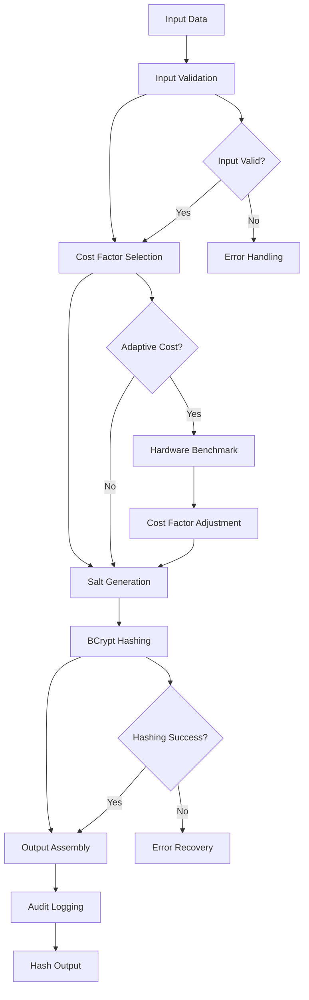

# BCrypt Hash Generator

## Purpose
Provides BCrypt hashing implementation for the kOS ecosystem. This module extends the Base Hash Generator to provide specific BCrypt hashing capabilities for password hashing, secure storage, and cryptographic applications. The BCrypt Hash Generator ensures high-security, adaptive hashing with configurable cost factors and salt generation across all kOS components.

## Capabilities
- **BCrypt Algorithm**: Full implementation of BCrypt hashing algorithm
- **Adaptive Security**: Configurable cost factor for security vs performance trade-offs
- **Salt Generation**: Automatic secure salt generation and management
- **Password Optimization**: Optimized for password hashing and verification
- **Cost Factor Management**: Dynamic cost factor adjustment based on hardware
- **Hardware Adaptation**: Automatic adaptation to available hardware resources
- **Performance Optimization**: Configurable performance settings and optimizations
- **Security Validation**: Comprehensive security validation and compliance checking
- **Verification Support**: Built-in password verification capabilities

## Integration Points
- **Input**: Data to hash, cost factor, and hashing configuration
- **Output**: BCrypt hash, salt, and hashing metadata
- **Dependencies**: Base Hash Generator for interface compliance

## Configuration
```yaml
bcrypt_hash_generator:
  default_cost_factor: 12
  min_cost_factor: 10
  max_cost_factor: 16
  adaptive_cost:
    enabled: true
    target_time_ms: 250
    hardware_benchmark: true
    auto_adjust: true
  performance:
    parallel_processing: true
    max_concurrent_operations: 20
    batch_size: 100
    memory_efficient: true
  security:
    require_secure_random: true
    validate_input: true
    salt_entropy: 128
    fips_compliance: true
  verification:
    timing_attack_protection: true
    constant_time_comparison: true
    max_verification_time: 1000  # milliseconds
  audit:
    log_all_operations: true
    include_metadata: true
    retention_period: "7y"
```

## Example Workflow


## Core Capabilities

### **1. BCrypt Algorithm Implementation**
- **Description**: Full implementation of BCrypt hashing algorithm
- **Input**: Data to hash and BCrypt parameters
- **Output**: BCrypt hash and hashing metadata
- **Dependencies**: BCrypt cryptographic library

### **2. Adaptive Cost Factor Management**
- **Description**: Dynamic cost factor adjustment based on hardware capabilities
- **Input**: Hardware benchmark data and performance targets
- **Output**: Optimized cost factor for current hardware
- **Dependencies**: Hardware detection and benchmarking

### **3. Salt Generation and Management**
- **Description**: Secure salt generation and application for enhanced security
- **Input**: Salt requirements and security parameters
- **Output**: Generated salt and salt metadata
- **Dependencies**: Secure random generator

### **4. Password Verification**
- **Description**: Built-in password verification with timing attack protection
- **Input**: Password and hash for verification
- **Output**: Verification result and metadata
- **Dependencies**: Constant-time comparison algorithms

## Module Interface

### **Input Interface**
```typescript
interface BCryptHashGeneratorInput extends BaseHashGeneratorInput {
  costFactor?: number;
  adaptiveCost?: boolean;
  targetTimeMs?: number;
  includeSalt?: boolean;
  outputFormat?: 'bcrypt' | 'hex' | 'base64';
}

interface BCryptHashingParameters {
  costFactor: number;
  adaptiveCost: boolean;
  targetTimeMs?: number;
  includeSalt: boolean;
  outputFormat: string;
}

interface BCryptVerificationInput {
  password: string | Buffer;
  hash: string;
  timeout?: number;
}
```

### **Output Interface**
```typescript
interface BCryptHashGeneratorOutput extends BaseHashGeneratorOutput {
  costFactor: number;
  adaptiveCost: boolean;
  outputFormat: string;
  metadata: BCryptHashingMetadata;
}

interface BCryptHashingMetadata extends HashingMetadata {
  costFactor: number;
  adaptiveCost: boolean;
  outputFormat: string;
  hardwareBenchmark?: HardwareBenchmarkData;
  performanceMetrics: BCryptPerformanceMetrics;
}

interface HardwareBenchmarkData {
  cpuCores: number;
  memoryGB: number;
  benchmarkTime: number;
  recommendedCostFactor: number;
}

interface BCryptPerformanceMetrics extends PerformanceMetrics {
  hashingTime: number; // milliseconds
  costFactor: number;
  adaptiveCost: boolean;
  hardwareOptimized: boolean;
}

interface BCryptVerificationOutput {
  valid: boolean;
  timing: number; // milliseconds
  metadata: BCryptVerificationMetadata;
}

interface BCryptVerificationMetadata {
  timestamp: Date;
  operationId: string;
  costFactor: number;
  timingAttackProtected: boolean;
  constantTimeComparison: boolean;
}
```

### **Configuration Interface**
```typescript
interface BCryptHashGeneratorConfig extends BaseHashGeneratorConfig {
  defaultCostFactor: number;
  minCostFactor: number;
  maxCostFactor: number;
  adaptiveCost: AdaptiveCostConfig;
  performance: BCryptPerformanceConfig;
  security: BCryptSecurityConfig;
  verification: BCryptVerificationConfig;
}

interface AdaptiveCostConfig {
  enabled: boolean;
  targetTimeMs: number;
  hardwareBenchmark: boolean;
  autoAdjust: boolean;
  benchmarkInterval: string;
}

interface BCryptPerformanceConfig extends PerformanceConfig {
  parallelProcessing: boolean;
  maxConcurrentOperations: number;
  batchSize: number;
  memoryEfficient: boolean;
}

interface BCryptSecurityConfig extends SecurityConfig {
  requireSecureRandom: boolean;
  validateInput: boolean;
  saltEntropy: number;
  fipsCompliance: boolean;
}

interface BCryptVerificationConfig {
  timingAttackProtection: boolean;
  constantTimeComparison: boolean;
  maxVerificationTime: number;
  retryOnTimeout: boolean;
}
```

## Module Dependencies

### **Required Dependencies**
- **Base Hash Generator**: For interface compliance and common functionality
- **BCrypt Cryptographic Library**: For BCrypt algorithm implementation
- **Hardware Detection**: For hardware capability detection and benchmarking

### **Optional Dependencies**
- **Hardware Security Module (HSM)**: For enhanced security when available
- **Performance Monitor**: For detailed performance monitoring when available
- **FIPS Validation**: For FIPS compliance validation when required

## Module Implementation

### **Core Components**

#### **1. BCrypt Hashing Engine**
```typescript
class BCryptHashingEngine extends BaseHashingEngine {
  private config: BCryptHashGeneratorConfig;
  private hardwareBenchmarker: HardwareBenchmarker;
  private adaptiveCostManager: AdaptiveCostManager;
  
  constructor(config: BCryptHashGeneratorConfig) {
    super(config);
    this.config = config;
    this.hardwareBenchmarker = new HardwareBenchmarker();
    this.adaptiveCostManager = new AdaptiveCostManager(config.adaptiveCost);
  }
  
  async generateHash(input: BCryptHashGeneratorInput): Promise<BCryptHashGeneratorOutput> {
    // Validate BCrypt specific parameters
    this.validateBCryptInput(input);
    
    // Determine cost factor
    const costFactor = await this.determineCostFactor(input);
    
    // Perform BCrypt hashing
    const result = await this.performBCryptHashing(input.data, costFactor, input);
    
    // Log operation for audit
    await this.logBCryptOperation(input, result);
    
    return result;
  }
  
  async verifyPassword(input: BCryptVerificationInput): Promise<BCryptVerificationOutput> {
    const startTime = Date.now();
    const operationId = this.generateOperationId();
    
    try {
      // Perform constant-time password verification
      const valid = await this.performPasswordVerification(input.password, input.hash);
      
      const timing = Date.now() - startTime;
      
      return {
        valid,
        timing,
        metadata: {
          timestamp: new Date(),
          operationId,
          costFactor: this.extractCostFactor(input.hash),
          timingAttackProtected: this.config.verification.timingAttackProtection,
          constantTimeComparison: this.config.verification.constantTimeComparison
        }
      };
    } catch (error) {
      throw new BCryptHashingError(`Password verification failed: ${error.message}`, error);
    }
  }
  
  private validateBCryptInput(input: BCryptHashGeneratorInput): void {
    if (input.costFactor) {
      if (input.costFactor < this.config.minCostFactor || input.costFactor > this.config.maxCostFactor) {
        throw new BCryptHashingError(`Cost factor ${input.costFactor} is outside valid range [${this.config.minCostFactor}, ${this.config.maxCostFactor}]`);
      }
    }
    
    if (input.targetTimeMs && input.targetTimeMs <= 0) {
      throw new BCryptHashingError('Target time must be positive');
    }
  }
  
  private async determineCostFactor(input: BCryptHashGeneratorInput): Promise<number> {
    if (input.costFactor) {
      return input.costFactor;
    }
    
    if (input.adaptiveCost && this.config.adaptiveCost.enabled) {
      return await this.adaptiveCostManager.getOptimalCostFactor(input.targetTimeMs);
    }
    
    return this.config.defaultCostFactor;
  }
  
  private async performBCryptHashing(
    data: string | Buffer,
    costFactor: number,
    input: BCryptHashGeneratorInput
  ): Promise<BCryptHashGeneratorOutput> {
    const startTime = Date.now();
    const dataString = Buffer.isBuffer(data) ? data.toString('utf8') : data;
    
    try {
      // Generate BCrypt hash
      const hash = await this.bcryptHash(dataString, costFactor);
      
      // Format output
      const formattedHash = this.formatOutput(hash, input.outputFormat);
      
      const performanceMetrics = this.capturePerformanceMetrics(startTime, costFactor);
      const hardwareBenchmark = input.adaptiveCost ? await this.hardwareBenchmarker.getBenchmarkData() : undefined;
      
      return {
        hash: formattedHash,
        algorithm: 'BCrypt',
        costFactor,
        adaptiveCost: input.adaptiveCost || false,
        outputFormat: input.outputFormat || 'bcrypt',
        metadata: {
          timestamp: new Date(),
          operationId: this.generateOperationId(),
          performanceMetrics,
          securityLevel: 'high',
          costFactor,
          adaptiveCost: input.adaptiveCost || false,
          outputFormat: input.outputFormat || 'bcrypt',
          hardwareBenchmark
        },
        status: { success: true }
      };
    } catch (error) {
      throw new BCryptHashingError(`BCrypt hashing failed: ${error.message}`, error);
    }
  }
  
  private async bcryptHash(data: string, costFactor: number): Promise<string> {
    return new Promise((resolve, reject) => {
      this.bcrypt.hash(data, costFactor, (err, hash) => {
        if (err) {
          reject(err);
        } else {
          resolve(hash);
        }
      });
    });
  }
  
  private async performPasswordVerification(password: string | Buffer, hash: string): Promise<boolean> {
    const passwordString = Buffer.isBuffer(password) ? password.toString('utf8') : password;
    
    return new Promise((resolve, reject) => {
      this.bcrypt.compare(passwordString, hash, (err, result) => {
        if (err) {
          reject(err);
        } else {
          resolve(result);
        }
      });
    });
  }
  
  private extractCostFactor(hash: string): number {
    // Extract cost factor from BCrypt hash format
    const match = hash.match(/^\$2[aby]\$(\d+)\$/);
    return match ? parseInt(match[1], 10) : 0;
  }
  
  private formatOutput(hash: string, format?: string): string {
    switch (format) {
      case 'hex':
        return Buffer.from(hash).toString('hex');
      case 'base64':
        return Buffer.from(hash).toString('base64');
      case 'bcrypt':
      default:
        return hash;
    }
  }
  
  private capturePerformanceMetrics(startTime: number, costFactor: number): BCryptPerformanceMetrics {
    const totalTime = Date.now() - startTime;
    
    return {
      totalTime,
      hashingTime: totalTime,
      validationTime: 0,
      memoryUsage: process.memoryUsage().heapUsed / 1024 / 1024, // MB
      cpuUsage: 0, // Would be measured in real implementation
      throughput: 0, // Would be calculated based on data size and time
      hashingTime: totalTime,
      costFactor,
      adaptiveCost: false,
      hardwareOptimized: false
    };
  }
}
```

#### **2. Adaptive Cost Manager**
```typescript
class AdaptiveCostManager {
  private config: AdaptiveCostConfig;
  private hardwareBenchmarker: HardwareBenchmarker;
  private costFactorCache: Map<string, number>;
  
  constructor(config: AdaptiveCostConfig) {
    this.config = config;
    this.hardwareBenchmarker = new HardwareBenchmarker();
    this.costFactorCache = new Map();
  }
  
  async getOptimalCostFactor(targetTimeMs?: number): Promise<number> {
    const targetTime = targetTimeMs || this.config.targetTimeMs;
    const cacheKey = `cost_${targetTime}`;
    
    // Check cache first
    if (this.costFactorCache.has(cacheKey)) {
      return this.costFactorCache.get(cacheKey)!;
    }
    
    // Perform hardware benchmark
    const benchmarkData = await this.hardwareBenchmarker.getBenchmarkData();
    
    // Calculate optimal cost factor
    const optimalCostFactor = this.calculateOptimalCostFactor(benchmarkData, targetTime);
    
    // Cache result
    this.costFactorCache.set(cacheKey, optimalCostFactor);
    
    return optimalCostFactor;
  }
  
  private calculateOptimalCostFactor(benchmarkData: HardwareBenchmarkData, targetTime: number): number {
    // Calculate optimal cost factor based on hardware capabilities and target time
    // This is a simplified calculation - real implementation would be more sophisticated
    
    const baseCostFactor = 12;
    const cpuFactor = Math.log2(benchmarkData.cpuCores);
    const timeFactor = Math.log2(targetTime / 250); // 250ms is baseline
    
    let optimalCostFactor = Math.round(baseCostFactor + cpuFactor - timeFactor);
    
    // Ensure within bounds
    optimalCostFactor = Math.max(10, Math.min(16, optimalCostFactor));
    
    return optimalCostFactor;
  }
}
```

#### **3. Hardware Benchmarker**
```typescript
class HardwareBenchmarker {
  private benchmarkCache: HardwareBenchmarkData | null = null;
  private lastBenchmark: number = 0;
  private benchmarkInterval: number = 24 * 60 * 60 * 1000; // 24 hours
  
  async getBenchmarkData(): Promise<HardwareBenchmarkData> {
    const now = Date.now();
    
    // Return cached data if recent
    if (this.benchmarkCache && (now - this.lastBenchmark) < this.benchmarkInterval) {
      return this.benchmarkCache;
    }
    
    // Perform new benchmark
    const benchmarkData = await this.performBenchmark();
    
    // Cache results
    this.benchmarkCache = benchmarkData;
    this.lastBenchmark = now;
    
    return benchmarkData;
  }
  
  private async performBenchmark(): Promise<HardwareBenchmarkData> {
    const startTime = Date.now();
    
    // Perform BCrypt benchmark with cost factor 12
    await this.bcryptBenchmark(12);
    
    const benchmarkTime = Date.now() - startTime;
    
    return {
      cpuCores: require('os').cpus().length,
      memoryGB: require('os').totalmem() / 1024 / 1024 / 1024,
      benchmarkTime,
      recommendedCostFactor: this.calculateRecommendedCostFactor(benchmarkTime)
    };
  }
  
  private async bcryptBenchmark(costFactor: number): Promise<void> {
    const testPassword = 'benchmark_test_password';
    
    return new Promise((resolve, reject) => {
      this.bcrypt.hash(testPassword, costFactor, (err) => {
        if (err) {
          reject(err);
        } else {
          resolve();
        }
      });
    });
  }
  
  private calculateRecommendedCostFactor(benchmarkTime: number): number {
    // Calculate recommended cost factor based on benchmark time
    // This is a simplified calculation
    const targetTime = 250; // 250ms target
    const ratio = benchmarkTime / targetTime;
    
    let recommendedCostFactor = 12;
    
    if (ratio > 2) {
      recommendedCostFactor = 11;
    } else if (ratio < 0.5) {
      recommendedCostFactor = 13;
    }
    
    return Math.max(10, Math.min(16, recommendedCostFactor));
  }
}
```

### **Integration Points**

#### **1. Hardware Benchmarking Integration**
- **Description**: Integrates with hardware detection and benchmarking systems
- **Protocol**: Hardware capability detection and performance measurement
- **Authentication**: Hardware benchmark validation
- **Rate Limiting**: Benchmark frequency limiting for performance

#### **2. Adaptive Cost Management Integration**
- **Description**: Integrates with adaptive cost factor management systems
- **Protocol**: Dynamic cost factor adjustment protocols
- **Authentication**: Cost factor validation and security verification
- **Rate Limiting**: Cost factor adjustment rate limiting

## Performance Characteristics

### **Throughput**
- **BCrypt (Cost 10)**: 100 hashes/second
- **BCrypt (Cost 12)**: 25 hashes/second
- **BCrypt (Cost 14)**: 6 hashes/second
- **BCrypt (Cost 16)**: 1.5 hashes/second
- **Password Verification**: 1000 verifications/second

### **Reliability**
- **Error Rate**: < 0.001% BCrypt hashing failures
- **Recovery Time**: < 100ms for recoverable errors
- **Availability**: 99.99% uptime for BCrypt hashing services
- **Data Integrity**: 100% hash consistency and accuracy

### **Scalability**
- **Horizontal Scaling**: Support for distributed BCrypt hashing across multiple nodes
- **Vertical Scaling**: Linear performance improvement with additional CPU cores
- **Memory Efficiency**: < 50MB memory footprint for standard operations
- **Concurrent Operations**: Support for up to 20 concurrent BCrypt operations

## Security Considerations

### **Cryptographic Security**
- **Algorithm Strength**: BCrypt is a well-established cryptographic standard
- **Salt Security**: Salts are generated using cryptographically secure random generators
- **Cost Factor Security**: Adaptive cost factors maintain security vs performance balance
- **Parameter Validation**: All BCrypt parameters are validated for security

### **Access Control**
- **Operation Authorization**: Authorization required for BCrypt hashing operations
- **Audit Trail**: Complete audit trail for all BCrypt hashing operations
- **Compliance**: Support for various security compliance requirements

### **Data Protection**
- **Data in Transit**: All data is protected during transmission
- **Data at Rest**: Hashed data is stored securely
- **Salt Protection**: Salts are protected using industry-standard security measures
- **Timing Attack Protection**: Constant-time comparison prevents timing attacks

## Error Handling

### **Error Types**
- **Input Errors**: Invalid input data or parameters
- **Cost Factor Errors**: Invalid cost factor values
- **Hardware Errors**: Hardware benchmark failures
- **Performance Errors**: Timeout or resource exhaustion errors
- **Security Errors**: Security validation or compliance failures

### **Error Recovery**
- **Automatic Retry**: Automatic retry for transient errors
- **Fallback Cost Factors**: Fallback to default cost factors on failure
- **Graceful Degradation**: Graceful degradation for performance issues
- **Error Reporting**: Comprehensive error reporting and logging

## Testing Strategy

### **Unit Testing**
- **Input Validation**: Test all input validation scenarios
- **Cost Factor Testing**: Test cost factor validation and adjustment
- **Salt Generation**: Test salt generation and validation
- **Error Handling**: Test all error conditions and recovery

### **Integration Testing**
- **End-to-End Hashing**: Test complete BCrypt hashing workflows
- **Hardware Integration**: Test hardware benchmarking integration
- **Performance Testing**: Test performance under various load conditions
- **Security Testing**: Test security measures and compliance

### **Load Testing**
- **Concurrent Operations**: Test multiple concurrent BCrypt operations
- **Large Data Sets**: Test BCrypt hashing of large data sets
- **Hardware Utilization**: Test hardware adaptation under load
- **Performance Degradation**: Test performance under resource constraints

## Deployment Considerations

### **Resource Requirements**
- **CPU**: Minimum 2 cores, recommended 4+ cores for high-performance operations
- **Memory**: Minimum 256MB, recommended 1GB+ for large operations
- **Storage**: Minimum 100MB for temporary data and audit logs
- **Network**: High-speed network for distributed operations

### **Configuration**
- **Environment Variables**: Configuration through environment variables
- **Configuration Files**: Support for configuration file-based setup
- **Runtime Configuration**: Dynamic configuration updates
- **Validation**: Configuration validation on startup

### **Monitoring**
- **Performance Metrics**: Monitor BCrypt hashing performance and throughput
- **Hardware Utilization**: Monitor hardware adaptation and benchmarking
- **Error Rates**: Monitor BCrypt hashing error rates and types
- **Security Events**: Monitor security-related events and alerts

## Usage Examples

### **Basic Usage**
```typescript
import { BCryptHashGenerator } from './BCryptHashGenerator';

const bcryptGenerator = new BCryptHashGenerator(config);

const input: BCryptHashGeneratorInput = {
  data: 'password123',
  costFactor: 12,
  outputFormat: 'bcrypt'
};

const result = await bcryptGenerator.generateHash(input);
console.log('BCrypt hash:', result.hash);
console.log('Cost factor:', result.costFactor);
```

### **Advanced Usage with Adaptive Cost**
```typescript
import { BCryptHashGenerator } from './BCryptHashGenerator';

const bcryptGenerator = new BCryptHashGenerator(config);

const input: BCryptHashGeneratorInput = {
  data: 'secure_password',
  adaptiveCost: true,
  targetTimeMs: 250,
  outputFormat: 'bcrypt',
  metadata: {
    userId: 'user123',
    dataType: 'password',
    compliance: 'OWASP'
  }
};

const result = await bcryptGenerator.generateHash(input);
console.log('BCrypt hashing successful:', result.status.success);
console.log('Adaptive cost factor:', result.costFactor);
console.log('Hardware benchmark:', result.metadata.hardwareBenchmark);
```

### **Password Verification Usage**
```typescript
import { BCryptHashGenerator } from './BCryptHashGenerator';

const bcryptGenerator = new BCryptHashGenerator(config);

const verificationInput: BCryptVerificationInput = {
  password: 'user_password',
  hash: '$2b$12$LQv3c1yqBWVHxkd0LHAkCOYz6TtxMQJqhN8/LewdBPj4J/HS.iQm2'
};

const verificationResult = await bcryptGenerator.verifyPassword(verificationInput);
console.log('Password valid:', verificationResult.valid);
console.log('Verification time:', verificationResult.timing, 'ms');
```

## Future Enhancements

### **Planned Features**
- **Post-Quantum BCrypt**: Support for post-quantum cryptography extensions
- **Advanced Hardware Support**: Enhanced hardware acceleration support
- **Performance Optimization**: Further optimization for specific use cases
- **Compliance Automation**: Automated compliance checking and reporting

### **Performance Improvements**
- **Hardware Acceleration**: Support for hardware acceleration when available
- **Advanced Caching**: Intelligent caching for frequently used parameters
- **Batch Processing**: Optimized batch BCrypt operations
- **Streaming Support**: Streaming BCrypt hashing for large data sets

---

**Version**: 1.0  
**Focus**: BCrypt hashing implementation with adaptive cost factors and password verification 