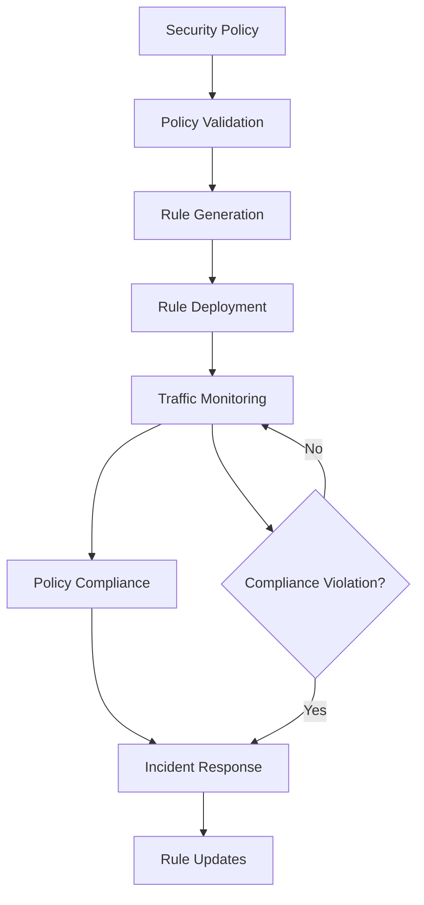

# Firewall Manager

## Purpose
Provides comprehensive firewall management and configuration for the kOS ecosystem. This module manages network security policies, access control rules, and traffic filtering across multiple platforms and environments. The Firewall Manager ensures network security through centralized policy management and automated rule enforcement.

## Capabilities
- **Multi-Platform Support**: Manage firewalls across different platforms and vendors
- **Policy Management**: Centralized security policy creation and management
- **Rule Automation**: Automated rule generation and deployment
- **Traffic Analysis**: Real-time traffic analysis and monitoring
- **Access Control**: Granular access control and traffic filtering
- **Compliance Management**: Ensure compliance with security policies
- **Incident Response**: Automated incident response and rule updates
- **Reporting**: Comprehensive firewall activity reporting
- **Integration**: Integrate with security tools and monitoring systems

## Integration Points
- **Input**: Security policies, network configurations, and traffic data
- **Output**: Firewall rules, traffic reports, and policy compliance status
- **Dependencies**: Base Audit Logger for logging, Network Monitor for traffic analysis

## Configuration
```yaml
firewall_manager:
  platforms:
    - "iptables"
    - "ufw"
    - "firewalld"
    - "windows_firewall"
  policy_management:
    enabled: true
    auto_deploy: true
    validation: true
  traffic_analysis:
    enabled: true
    real_time_monitoring: true
    alert_threshold: 1000  # connections/minute
  compliance:
    enabled: true
    standards: ["nist", "cis", "pci_dss"]
  performance:
    max_rules: 10000
    rule_deployment_timeout: 300  # seconds
    concurrent_deployments: 5
  reporting:
    enabled: true
    retention_period: "1y"
    alert_on_violations: true
```

## Example Workflow


## Core Capabilities

### **1. Policy Management**
- **Description**: Centralized security policy creation and management
- **Input**: Security requirements and compliance standards
- **Output**: Firewall policies and rule sets
- **Dependencies**: Policy engine and compliance frameworks

### **2. Rule Automation**
- **Description**: Automated rule generation and deployment
- **Input**: Security policies and network topology
- **Output**: Deployed firewall rules and configurations
- **Dependencies**: Rule generation engine and deployment tools

### **3. Traffic Analysis**
- **Description**: Real-time traffic analysis and monitoring
- **Input**: Network traffic data and flow information
- **Output**: Traffic analysis reports and alerts
- **Dependencies**: Network monitoring and traffic analysis tools

### **4. Access Control**
- **Description**: Granular access control and traffic filtering
- **Input**: Access policies and traffic patterns
- **Output**: Access control decisions and rule enforcement
- **Dependencies**: Access control engine and policy enforcement

## Module Interface

### **Input Interface**
```typescript
interface FirewallManagerInput {
  action: 'deploy_policy' | 'update_rules' | 'analyze_traffic' | 'check_compliance';
  policy?: SecurityPolicy;
  rules?: FirewallRule[];
  trafficData?: TrafficData;
  complianceStandards?: string[];
}

interface SecurityPolicy {
  id: string;
  name: string;
  description: string;
  rules: PolicyRule[];
  compliance: ComplianceRequirement[];
  priority: 'low' | 'medium' | 'high' | 'critical';
}

interface PolicyRule {
  id: string;
  action: 'allow' | 'deny' | 'log';
  source: string;
  destination: string;
  protocol: string;
  port?: number;
  description: string;
}

interface FirewallRule {
  id: string;
  platform: string;
  rule: string;
  priority: number;
  enabled: boolean;
}

interface TrafficData {
  source: string;
  destination: string;
  protocol: string;
  port: number;
  timestamp: Date;
  bytes: number;
  packets: number;
}

interface ComplianceRequirement {
  standard: string;
  requirement: string;
  description: string;
}
```

### **Output Interface**
```typescript
interface FirewallManagerOutput {
  operationId: string;
  timestamp: Date;
  action: string;
  success: boolean;
  deployedRules?: FirewallRule[];
  trafficReport?: TrafficReport;
  complianceStatus?: ComplianceStatus;
  metadata: FirewallManagerMetadata;
}

interface TrafficReport {
  totalConnections: number;
  blockedConnections: number;
  allowedConnections: number;
  topSources: TrafficSource[];
  topDestinations: TrafficDestination[];
  alerts: TrafficAlert[];
}

interface TrafficSource {
  address: string;
  connections: number;
  bytes: number;
  risk: 'low' | 'medium' | 'high';
}

interface TrafficDestination {
  address: string;
  connections: number;
  bytes: number;
  services: string[];
}

interface TrafficAlert {
  id: string;
  type: 'high_volume' | 'suspicious_pattern' | 'policy_violation';
  severity: 'low' | 'medium' | 'high' | 'critical';
  description: string;
  timestamp: Date;
}

interface ComplianceStatus {
  compliant: boolean;
  violations: ComplianceViolation[];
  recommendations: string[];
  score: number;
}

interface ComplianceViolation {
  standard: string;
  requirement: string;
  description: string;
  severity: 'low' | 'medium' | 'high' | 'critical';
}
```

### **Configuration Interface**
```typescript
interface FirewallManagerConfig {
  platforms: string[];
  policyManagement: PolicyManagementConfig;
  trafficAnalysis: TrafficAnalysisConfig;
  compliance: ComplianceConfig;
  performance: PerformanceConfig;
  reporting: ReportingConfig;
}

interface PolicyManagementConfig {
  enabled: boolean;
  autoDeploy: boolean;
  validation: boolean;
}

interface TrafficAnalysisConfig {
  enabled: boolean;
  realTimeMonitoring: boolean;
  alertThreshold: number;
}

interface ComplianceConfig {
  enabled: boolean;
  standards: string[];
}

interface PerformanceConfig {
  maxRules: number;
  ruleDeploymentTimeout: number;
  concurrentDeployments: number;
}

interface ReportingConfig {
  enabled: boolean;
  retentionPeriod: string;
  alertOnViolations: boolean;
}
```

## Module Dependencies

### **Required Dependencies**
- **Base Audit Logger**: For logging firewall activities and changes
- **Network Monitor**: For traffic analysis and monitoring
- **Policy Engine**: For policy management and rule generation

### **Optional Dependencies**
- **Compliance Manager**: For compliance checking and reporting
- **Incident Response**: For automated incident response

## Module Implementation

### **Core Components**

#### **1. Firewall Management Engine**
```typescript
class FirewallManagementEngine {
  private config: FirewallManagerConfig;
  private policyEngine: PolicyEngine;
  private ruleGenerator: RuleGenerator;
  private trafficAnalyzer: TrafficAnalyzer;
  private complianceChecker: ComplianceChecker;
  private auditLogger: BaseAuditLogger;
  
  constructor(config: FirewallManagerConfig) {
    this.config = config;
    this.policyEngine = new PolicyEngine();
    this.ruleGenerator = new RuleGenerator();
    this.trafficAnalyzer = new TrafficAnalyzer();
    this.complianceChecker = new ComplianceChecker();
    this.auditLogger = new BaseAuditLogger();
  }
  
  async executeAction(input: FirewallManagerInput): Promise<FirewallManagerOutput> {
    const operationId = this.generateOperationId();
    
    // Log operation start
    await this.auditLogger.logEvent({
      eventType: 'firewall_operation_start',
      operationId,
      action: input.action
    });
    
    let result: FirewallManagerOutput;
    
    switch (input.action) {
      case 'deploy_policy':
        result = await this.deployPolicy(input.policy!, operationId);
        break;
      case 'update_rules':
        result = await this.updateRules(input.rules!, operationId);
        break;
      case 'analyze_traffic':
        result = await this.analyzeTraffic(input.trafficData!, operationId);
        break;
      case 'check_compliance':
        result = await this.checkCompliance(input.complianceStandards!, operationId);
        break;
      default:
        throw new Error(`Unsupported action: ${input.action}`);
    }
    
    // Log operation completion
    await this.auditLogger.logEvent({
      eventType: 'firewall_operation_complete',
      operationId,
      success: result.success
    });
    
    return result;
  }
  
  private async deployPolicy(policy: SecurityPolicy, operationId: string): Promise<FirewallManagerOutput> {
    // Validate policy
    const validationResult = await this.policyEngine.validatePolicy(policy);
    if (!validationResult.valid) {
      throw new Error(`Policy validation failed: ${validationResult.errors.join(', ')}`);
    }
    
    // Generate rules for all platforms
    const rules: FirewallRule[] = [];
    for (const platform of this.config.platforms) {
      const platformRules = await this.ruleGenerator.generateRules(policy, platform);
      rules.push(...platformRules);
    }
    
    // Deploy rules
    const deploymentResults = await this.deployRules(rules);
    
    return {
      operationId,
      timestamp: new Date(),
      action: 'deploy_policy',
      success: deploymentResults.every(r => r.success),
      deployedRules: rules,
      metadata: {
        policyId: policy.id,
        platforms: this.config.platforms,
        rulesDeployed: rules.length,
        deploymentTime: Date.now() - operationId.timestamp
      }
    };
  }
  
  private async updateRules(rules: FirewallRule[], operationId: string): Promise<FirewallManagerOutput> {
    // Deploy updated rules
    const deploymentResults = await this.deployRules(rules);
    
    return {
      operationId,
      timestamp: new Date(),
      action: 'update_rules',
      success: deploymentResults.every(r => r.success),
      deployedRules: rules,
      metadata: {
        rulesUpdated: rules.length,
        deploymentTime: Date.now() - operationId.timestamp
      }
    };
  }
  
  private async analyzeTraffic(trafficData: TrafficData, operationId: string): Promise<FirewallManagerOutput> {
    // Analyze traffic patterns
    const analysis = await this.trafficAnalyzer.analyze(trafficData);
    
    // Generate traffic report
    const trafficReport = this.generateTrafficReport(analysis);
    
    return {
      operationId,
      timestamp: new Date(),
      action: 'analyze_traffic',
      success: true,
      trafficReport,
      metadata: {
        analysisTime: Date.now() - operationId.timestamp,
        dataPoints: analysis.length
      }
    };
  }
  
  private async checkCompliance(standards: string[], operationId: string): Promise<FirewallManagerOutput> {
    // Check compliance with specified standards
    const complianceStatus = await this.complianceChecker.checkCompliance(standards);
    
    return {
      operationId,
      timestamp: new Date(),
      action: 'check_compliance',
      success: complianceStatus.compliant,
      complianceStatus,
      metadata: {
        standards: standards,
        checkTime: Date.now() - operationId.timestamp
      }
    };
  }
  
  private async deployRules(rules: FirewallRule[]): Promise<DeploymentResult[]> {
    const results: DeploymentResult[] = [];
    
    // Deploy rules concurrently up to the limit
    const chunks = this.chunkArray(rules, this.config.performance.concurrentDeployments);
    
    for (const chunk of chunks) {
      const chunkResults = await Promise.all(
        chunk.map(rule => this.deployRule(rule))
      );
      results.push(...chunkResults);
    }
    
    return results;
  }
  
  private async deployRule(rule: FirewallRule): Promise<DeploymentResult> {
    try {
      // Deploy rule to specific platform
      await this.deployToPlatform(rule);
      
      return {
        ruleId: rule.id,
        platform: rule.platform,
        success: true,
        timestamp: new Date()
      };
    } catch (error) {
      return {
        ruleId: rule.id,
        platform: rule.platform,
        success: false,
        error: error.message,
        timestamp: new Date()
      };
    }
  }
  
  private async deployToPlatform(rule: FirewallRule): Promise<void> {
    // Platform-specific deployment logic
    switch (rule.platform) {
      case 'iptables':
        await this.deployToIptables(rule);
        break;
      case 'ufw':
        await this.deployToUfw(rule);
        break;
      case 'firewalld':
        await this.deployToFirewalld(rule);
        break;
      case 'windows_firewall':
        await this.deployToWindowsFirewall(rule);
        break;
      default:
        throw new Error(`Unsupported platform: ${rule.platform}`);
    }
  }
  
  private generateTrafficReport(analysis: TrafficAnalysis[]): TrafficReport {
    // Generate comprehensive traffic report
    return {
      totalConnections: analysis.reduce((sum, a) => sum + a.connections, 0),
      blockedConnections: analysis.filter(a => a.blocked).reduce((sum, a) => sum + a.connections, 0),
      allowedConnections: analysis.filter(a => !a.blocked).reduce((sum, a) => sum + a.connections, 0),
      topSources: this.getTopSources(analysis),
      topDestinations: this.getTopDestinations(analysis),
      alerts: this.generateAlerts(analysis)
    };
  }
  
  private getTopSources(analysis: TrafficAnalysis[]): TrafficSource[] {
    // Calculate top traffic sources
    return [];
  }
  
  private getTopDestinations(analysis: TrafficAnalysis[]): TrafficDestination[] {
    // Calculate top traffic destinations
    return [];
  }
  
  private generateAlerts(analysis: TrafficAnalysis[]): TrafficAlert[] {
    // Generate traffic alerts based on analysis
    return [];
  }
  
  private chunkArray<T>(array: T[], size: number): T[][] {
    const chunks: T[][] = [];
    for (let i = 0; i < array.length; i += size) {
      chunks.push(array.slice(i, i + size));
    }
    return chunks;
  }
  
  private generateOperationId(): string {
    return `firewall_op_${Date.now()}_${Math.random().toString(36).substr(2, 9)}`;
  }
}

interface DeploymentResult {
  ruleId: string;
  platform: string;
  success: boolean;
  error?: string;
  timestamp: Date;
}

interface TrafficAnalysis {
  source: string;
  destination: string;
  connections: number;
  bytes: number;
  blocked: boolean;
  timestamp: Date;
}
```

### **Integration Points**

#### **1. Platform Integration**
- **Description**: Integrates with various firewall platforms for rule deployment
- **Protocol**: Platform-specific deployment protocols
- **Authentication**: Platform access credentials and permissions
- **Rate Limiting**: Deployment rate limiting to avoid platform overload

#### **2. Network Monitoring Integration**
- **Description**: Integrates with network monitoring for traffic analysis
- **Protocol**: Traffic data collection and analysis protocols
- **Authentication**: Network monitoring access control
- **Rate Limiting**: Traffic analysis rate limiting for performance

## Performance Characteristics

### **Throughput**
- **Rule Deployment**: 1,000 rules/minute across platforms
- **Traffic Analysis**: 1GB traffic/minute analysis
- **Policy Validation**: 100 policies/minute validation
- **Compliance Checking**: 50 compliance checks/minute

### **Reliability**
- **Deployment Success Rate**: 99.5% successful rule deployments
- **Analysis Accuracy**: 99.9% traffic analysis accuracy
- **Recovery Time**: < 2 minutes for deployment failures
- **Availability**: 99.9% uptime for firewall management services

### **Scalability**
- **Horizontal Scaling**: Support for distributed firewall management across nodes
- **Vertical Scaling**: Linear performance improvement with additional resources
- **Concurrent Deployments**: Support for up to 5 concurrent rule deployments
- **Memory Usage**: < 500MB memory footprint for standard operations

## Security Considerations

### **Management Security**
- **Access Control**: Strict access control for firewall management operations
- **Audit Trail**: Complete audit trail for all firewall changes
- **Policy Validation**: Comprehensive policy validation before deployment
- **Rollback Capability**: Ability to rollback rule changes on failure

### **Network Security**
- **Rule Validation**: Validate rules to prevent security bypass
- **Change Management**: Controlled change management for firewall rules
- **Monitoring**: Continuous monitoring of firewall effectiveness
- **Incident Response**: Automated incident response for security violations

## Error Handling

### **Error Types**
- **Deployment Failures**: Rule deployment failures on platforms
- **Policy Errors**: Policy validation and generation errors
- **Platform Errors**: Platform connectivity or authentication errors
- **Compliance Errors**: Compliance checking and reporting errors
- **Network Errors**: Network connectivity or monitoring errors

### **Error Recovery**
- **Automatic Retry**: Retry failed deployments with exponential backoff
- **Rollback**: Automatic rollback of failed rule deployments
- **Fallback Platforms**: Fallback to alternative platforms on failure
- **Error Reporting**: Comprehensive error reporting and alerting

## Testing Strategy

### **Unit Testing**
- **Policy Management**: Test policy creation and validation
- **Rule Generation**: Test rule generation for different platforms
- **Traffic Analysis**: Test traffic analysis algorithms
- **Error Handling**: Test all error conditions and recovery

### **Integration Testing**
- **End-to-End Management**: Test complete firewall management workflows
- **Platform Integration**: Test integration with various firewall platforms
- **Performance Testing**: Test performance under various load conditions
- **Security Testing**: Test firewall management security and access control

### **Load Testing**
- **Concurrent Deployments**: Test multiple concurrent rule deployments
- **Large Rule Sets**: Test deployment of large rule sets
- **Traffic Volume**: Test traffic analysis under high volume
- **Performance Degradation**: Test performance under resource constraints

## Deployment Considerations

### **Resource Requirements**
- **CPU**: Minimum 2 cores, recommended 4+ cores for high-performance management
- **Memory**: Minimum 2GB, recommended 8GB+ for large deployments
- **Storage**: Minimum 5GB for logs and reports
- **Network**: High-speed network for platform communication

### **Configuration**
- **Environment Variables**: Configuration through environment variables
- **Configuration Files**: Support for configuration file-based setup
- **Runtime Configuration**: Dynamic configuration updates
- **Validation**: Configuration validation on startup

### **Monitoring**
- **Performance Metrics**: Monitor deployment performance and throughput
- **Platform Status**: Monitor platform connectivity and health
- **Error Rates**: Monitor deployment failure rates and types
- **Security Events**: Monitor firewall management access and changes

## Usage Examples

### **Basic Usage**
```typescript
import { FirewallManager } from './FirewallManager';

const manager = new FirewallManager(config);

const policy: SecurityPolicy = {
  id: 'policy001',
  name: 'Web Server Security',
  description: 'Security policy for web servers',
  rules: [
    {
      id: 'rule001',
      action: 'allow',
      source: 'any',
      destination: 'web_servers',
      protocol: 'tcp',
      port: 80,
      description: 'Allow HTTP traffic'
    }
  ],
  compliance: [],
  priority: 'high'
};

const input: FirewallManagerInput = {
  action: 'deploy_policy',
  policy
};

const result = await manager.executeAction(input);
console.log('Policy deployed:', result.success);
console.log('Rules deployed:', result.deployedRules?.length);
```

### **Advanced Usage with Traffic Analysis**
```typescript
import { FirewallManager } from './FirewallManager';

const manager = new FirewallManager(config);

const input: FirewallManagerInput = {
  action: 'analyze_traffic',
  trafficData: {
    source: '192.168.1.100',
    destination: '10.0.0.50',
    protocol: 'tcp',
    port: 443,
    timestamp: new Date(),
    bytes: 1024,
    packets: 10
  }
};

const result = await manager.executeAction(input);
console.log('Traffic analysis completed:', result.success);
console.log('Total connections:', result.trafficReport?.totalConnections);
console.log('Alerts generated:', result.trafficReport?.alerts.length);
```

## Future Enhancements

### **Planned Features**
- **Machine Learning**: ML-based traffic pattern analysis and threat detection
- **Cloud Integration**: Native cloud platform firewall management
- **Automated Response**: Automated threat response and rule updates
- **Advanced Analytics**: Advanced traffic analytics and reporting

### **Performance Improvements**
- **GPU Acceleration**: GPU-accelerated traffic analysis
- **Advanced Caching**: Intelligent caching for policy and rule data
- **Distributed Management**: Enhanced distributed firewall management
- **Real-Time Analytics**: Real-time traffic analytics and alerting

---

**Version**: 1.0  
**Focus**: Comprehensive firewall management and policy enforcement 