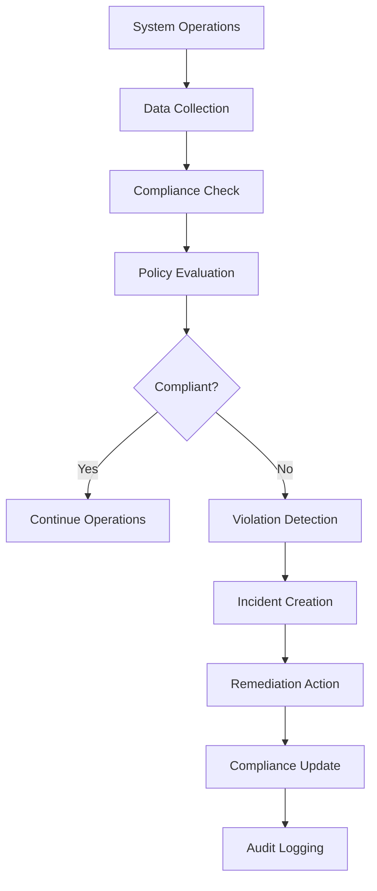
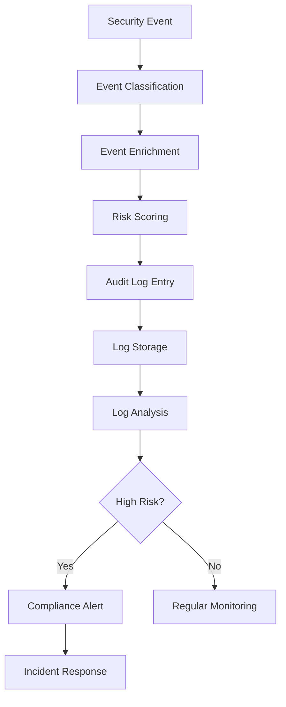
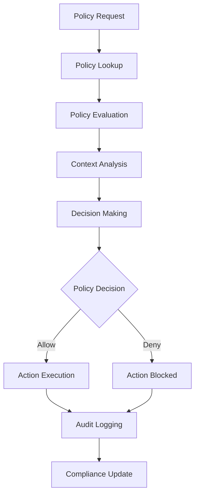

# **Compliance Management Index**

## **Purpose**

This subcategory provides comprehensive compliance management and governance capabilities for the kOS ecosystem. It handles regulatory compliance, audit trails, policy management, governance structures, and compliance reporting with automated compliance monitoring and enforcement capabilities.

## **Core Principles**

### **Regulatory Compliance**
- **Multi-Framework Support**: Support for GDPR, SOX, HIPAA, PCI DSS, and other frameworks
- **Automated Compliance**: Automated compliance checking and enforcement
- **Continuous Monitoring**: Continuous compliance monitoring and reporting
- **Audit Readiness**: Continuous audit readiness and evidence collection

### **Policy Management**
- **Policy Automation**: Automated policy creation, deployment, and enforcement
- **Policy Governance**: Centralized policy governance and lifecycle management
- **Policy Compliance**: Automated policy compliance checking and reporting
- **Policy Optimization**: Policy performance optimization and effectiveness measurement

### **Governance & Risk**
- **Risk Assessment**: Automated risk assessment and management
- **Governance Structures**: Clear governance structures and accountability
- **Compliance Reporting**: Comprehensive compliance reporting and dashboards
- **Incident Management**: Compliance incident management and remediation

## **Function Specifications**

### **Audit & Compliance**
1. **[Base Audit Logger](01_Base_Audit_Logger.md)** - Core audit logging interface and common functionality
2. **[Security Audit Logger](02_Security_Audit_Logger.md)** - Security-specific audit logging with compliance features
3. **[Access Audit Logger](03_Access_Audit_Logger.md)** - Access control audit logging with detailed tracking
4. **[Compliance Auditor](04_Compliance_Auditor.md)** - Automated compliance auditing and reporting

### **Policy Management**
5. **[Policy Manager](05_Policy_Manager.md)** - Centralized policy management and lifecycle
6. **[Policy Engine](06_Policy_Engine.md)** - Dynamic policy evaluation and enforcement
7. **[Policy Compliance](07_Policy_Compliance.md)** - Policy compliance checking and reporting
8. **[Policy Optimization](08_Policy_Optimization.md)** - Policy performance optimization and effectiveness

### **Governance & Risk**
9. **[Risk Manager](09_Risk_Manager.md)** - Risk assessment and management framework
10. **[Governance Manager](10_Governance_Manager.md)** - Governance structures and accountability
11. **[Compliance Reporter](11_Compliance_Reporter.md)** - Compliance reporting and dashboards
12. **[Incident Manager](12_Incident_Manager.md)** - Compliance incident management and remediation

### **Regulatory Frameworks**
13. **[GDPR Compliance](13_GDPR_Compliance.md)** - GDPR compliance management and reporting
14. **[SOX Compliance](14_SOX_Compliance.md)** - SOX compliance management and reporting
15. **[HIPAA Compliance](15_HIPAA_Compliance.md)** - HIPAA compliance management and reporting
16. **[PCI DSS Compliance](16_PCI_DSS_Compliance.md)** - PCI DSS compliance management and reporting

## **Integration Patterns**

### **Compliance Monitoring Flow**


### **Audit Trail Flow**


### **Policy Enforcement Flow**


## **Compliance Capabilities**

### **Regulatory Compliance**
- **GDPR Compliance**: Complete GDPR compliance management and reporting
- **SOX Compliance**: SOX compliance management and financial reporting
- **HIPAA Compliance**: HIPAA compliance management and healthcare data protection
- **PCI DSS Compliance**: PCI DSS compliance management and payment security
- **Custom Frameworks**: Support for custom compliance frameworks and requirements

### **Audit Management**
- **Audit Logging**: Comprehensive audit logging across all systems
- **Audit Analysis**: Advanced audit analysis and correlation
- **Audit Reporting**: Automated audit reporting and dashboards
- **Audit Retention**: Configurable audit retention and archival
- **Audit Security**: Secure audit data protection and integrity

### **Policy Management**
- **Policy Creation**: Dynamic policy creation and management
- **Policy Deployment**: Automated policy deployment and enforcement
- **Policy Compliance**: Real-time policy compliance checking
- **Policy Optimization**: Policy performance optimization and effectiveness
- **Policy Governance**: Centralized policy governance and lifecycle

### **Risk Management**
- **Risk Assessment**: Automated risk assessment and scoring
- **Risk Monitoring**: Continuous risk monitoring and alerting
- **Risk Mitigation**: Automated risk mitigation and remediation
- **Risk Reporting**: Comprehensive risk reporting and dashboards
- **Risk Governance**: Risk governance and accountability framework

## **Configuration Examples**

### **Audit Logging Configuration**
```yaml
audit_logging:
  security_events:
    enabled: true
    log_level: "detailed"
    retention_period: "7y"
    encryption: true
    compression: true
  access_events:
    enabled: true
    log_failed_attempts: true
    log_successful_access: true
    include_context: true
    session_tracking: true
  compliance:
    gdpr: true
    sox: true
    hipaa: true
    pci_dss: true
    retention_policies:
      security: "7y"
      access: "3y"
      changes: "5y"
  analysis:
    real_time: true
    correlation: true
    machine_learning: true
    alerting: true
```

### **Policy Management Configuration**
```yaml
policy_management:
  policy_engine:
    evaluation_mode: "realtime"
    caching_enabled: true
    cache_ttl: "5m"
    optimization_enabled: true
  policy_lifecycle:
    creation: true
    review: true
    approval: true
    deployment: true
    monitoring: true
    retirement: true
  compliance_checking:
    automated: true
    frequency: "continuous"
    reporting: true
    remediation: true
  governance:
    approval_workflow: true
    change_management: true
    version_control: true
    rollback: true
```

### **Risk Management Configuration**
```yaml
risk_management:
  risk_assessment:
    automated: true
    frequency: "weekly"
    scoring_model: "custom"
    threshold_alerts: true
  risk_monitoring:
    continuous: true
    real_time_alerts: true
    trend_analysis: true
    predictive_modeling: true
  risk_mitigation:
    automated: true
    priority_based: true
    resource_allocation: true
    effectiveness_tracking: true
  reporting:
    executive_dashboards: true
    detailed_reports: true
    trend_analysis: true
    compliance_mapping: true
```

### **Regulatory Compliance Configuration**
```yaml
regulatory_compliance:
  gdpr:
    enabled: true
    data_protection: true
    consent_management: true
    data_portability: true
    breach_notification: true
  sox:
    enabled: true
    financial_reporting: true
    internal_controls: true
    audit_trails: true
    certification: true
  hipaa:
    enabled: true
    phi_protection: true
    privacy_rule: true
    security_rule: true
    breach_notification: true
  pci_dss:
    enabled: true
    card_data_protection: true
    access_control: true
    monitoring: true
    incident_response: true
```

## **Error Handling**

### **Compliance Errors**
- **Policy Violations**: Automatic policy violation detection and remediation
- **Audit Failures**: Audit failure recovery and data integrity checks
- **Reporting Errors**: Automated reporting error recovery and retry mechanisms
- **Framework Errors**: Framework-specific error handling and compliance recovery
- **Data Integrity Errors**: Data integrity verification and corruption detection

### **Policy Errors**
- **Policy Evaluation Failures**: Default deny with audit logging and administrator notification
- **Policy Deployment Failures**: Rollback procedures and manual intervention
- **Policy Compliance Failures**: Automatic compliance violation reporting and remediation
- **Policy Optimization Errors**: Performance degradation alerts and manual optimization
- **Policy Governance Errors**: Governance violation alerts and escalation procedures

### **Risk Management Errors**
- **Risk Assessment Failures**: Manual risk assessment with administrator notification
- **Risk Monitoring Failures**: Alternative monitoring methods and alert escalation
- **Risk Mitigation Failures**: Manual mitigation procedures and incident response
- **Risk Reporting Errors**: Alternative reporting methods and data recovery
- **Risk Governance Errors**: Governance violation alerts and accountability procedures

## **Performance Considerations**

### **Compliance Performance**
- **Audit Performance**: Optimized audit logging with minimal system impact
- **Policy Performance**: Fast policy evaluation with intelligent caching
- **Risk Performance**: Efficient risk assessment with parallel processing
- **Reporting Performance**: Fast report generation with data aggregation
- **Monitoring Performance**: Real-time monitoring with minimal latency

### **Resource Optimization**
- **Storage Optimization**: Efficient audit log storage with compression and rotation
- **Processing Optimization**: Optimized compliance processing with parallel execution
- **Memory Optimization**: Efficient memory usage with optimized data structures
- **Network Optimization**: Efficient network usage with compression and filtering
- **Power Optimization**: Power-efficient operation for mobile and IoT devices

### **Scalability Considerations**
- **Horizontal Scaling**: Horizontal scaling for high-volume compliance operations
- **Load Balancing**: Load balancing for compliance processing and reporting
- **Caching Strategies**: Intelligent caching for frequently accessed compliance data
- **Data Partitioning**: Data partitioning for large-scale compliance operations
- **Performance Monitoring**: Continuous performance monitoring and optimization

## **Monitoring & Observability**

### **Compliance Metrics**
- **Compliance Status**: Track overall compliance status across all frameworks
- **Policy Compliance**: Monitor policy compliance rates and violations
- **Audit Completeness**: Track audit log completeness and quality
- **Risk Metrics**: Monitor risk assessment scores and mitigation effectiveness
- **Incident Metrics**: Track compliance incidents and resolution times

### **Performance Metrics**
- **Audit Performance**: Monitor audit logging performance and throughput
- **Policy Performance**: Track policy evaluation performance and response times
- **Risk Performance**: Monitor risk assessment performance and accuracy
- **Reporting Performance**: Track report generation performance and delivery
- **System Performance**: Monitor overall system performance and resource utilization

### **Operational Metrics**
- **System Availability**: Track system availability and uptime
- **Data Quality**: Monitor data quality and integrity
- **User Experience**: Track user experience and system transparency
- **Maintenance Windows**: Monitor maintenance windows and impact
- **Capacity Planning**: Track capacity utilization and planning effectiveness

### **Alerting**
- **Compliance Alerts**: Real-time alerts for compliance violations and policy breaches
- **Performance Alerts**: Alerts for performance degradation and resource issues
- **Risk Alerts**: Alerts for high-risk events and mitigation failures
- **System Alerts**: Alerts for system health issues and maintenance requirements
- **Framework Alerts**: Alerts for framework-specific compliance issues

## **Security Considerations**

### **Compliance Security**
- **Data Protection**: Protection of compliance data and audit logs
- **Access Control**: Strict access control for compliance systems and data
- **Audit Security**: Secure audit data protection and integrity
- **Policy Security**: Secure policy management and enforcement
- **Reporting Security**: Secure compliance reporting and data transmission

### **Risk Security**
- **Risk Data Protection**: Protection of risk assessment data and reports
- **Risk Access Control**: Strict access control for risk management systems
- **Risk Audit Security**: Secure risk audit trails and evidence
- **Risk Communication Security**: Secure risk communication and reporting
- **Risk Governance Security**: Secure risk governance and accountability

### **Governance Security**
- **Governance Data Protection**: Protection of governance data and structures
- **Governance Access Control**: Strict access control for governance systems
- **Governance Audit Security**: Secure governance audit trails and evidence
- **Governance Communication Security**: Secure governance communication and reporting
- **Governance Accountability Security**: Secure governance accountability and oversight

---

**Version**: 1.0  
**Focus**: Comprehensive compliance management and governance capabilities for kOS ecosystem 