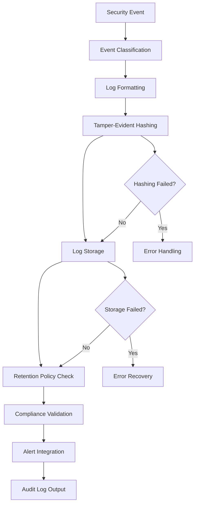

# Base Audit Logger

## Purpose
Provides the core audit logging interface and common functionality for all audit logging operations in the kOS ecosystem. This base class defines the standard interface that all specific audit logger implementations must follow, ensuring consistent behavior, security, compliance, and performance optimization across all audit logging modules. The Base Audit Logger supports secure, tamper-evident, and compliant logging of all security-relevant events.

## Capabilities
- **Standardized Audit Logging Interface**: Consistent interface for all audit logging operations
- **Event Classification**: Supports classification and categorization of audit events
- **Structured Logging**: Structured, machine-readable log formats (JSON, etc.)
- **Tamper-Evident Logging**: Supports tamper-evident and immutable log storage
- **Compliance Logging**: Meets regulatory and compliance requirements (GDPR, SOX, HIPAA, PCI DSS)
- **Performance Optimization**: Optimized logging performance with configurable settings
- **Security Validation**: Validates log integrity and access controls
- **Audit Trail Management**: Manages retention, archival, and retrieval of audit logs
- **Alert Integration**: Integrates with alerting and monitoring systems

## Integration Points
- **Input**: Security events, access events, system changes, and log metadata
- **Output**: Structured audit log entries, log storage status, and operation metadata
- **Dependencies**: Secure storage backend, time synchronization service

## Configuration
```yaml
base_audit_logger:
  log_format: "json"
  storage_backend: "secure_database"
  retention_policy:
    enabled: true
    retention_period: "7y"
    archive_on_expiry: true
    archive_location: "/secure/audit/archive"
  tamper_evident:
    enabled: true
    hash_algorithm: "SHA-256"
    chain_logs: true
  compliance:
    gdpr: true
    sox: true
    hipaa: true
    pci_dss: true
  performance:
    async_logging: true
    batch_size: 100
    flush_interval: 5000  # ms
  security:
    access_control:
      enabled: true
      roles: ["admin", "auditor"]
    encryption:
      enabled: true
      algorithm: "AES-256-GCM"
    integrity_check:
      enabled: true
      frequency: "daily"
  alerting:
    enabled: true
    alert_on_high_risk: true
    alert_channels: ["email", "slack"]
```

## Example Workflow


## Core Capabilities

### **1. Standardized Audit Logging Interface**
- **Description**: Provides a consistent interface for all audit logging operations
- **Input**: Security events, access events, and metadata
- **Output**: Structured log entries and operation status
- **Dependencies**: None (base interface)

### **2. Tamper-Evident Logging**
- **Description**: Ensures logs are tamper-evident and immutable
- **Input**: Log entries and hash chain
- **Output**: Tamper-evident log storage and verification
- **Dependencies**: Hash generator and secure storage

### **3. Compliance Logging**
- **Description**: Meets regulatory and compliance requirements
- **Input**: Compliance configuration and log entries
- **Output**: Compliance-validated logs and reports
- **Dependencies**: Compliance rules engine

### **4. Alert Integration**
- **Description**: Integrates with alerting and monitoring systems
- **Input**: High-risk events and alert configuration
- **Output**: Alerts and notifications
- **Dependencies**: Alerting system

## Module Interface

### **Input Interface**
```typescript
interface BaseAuditLoggerInput {
  eventType: string;
  eventData: Record<string, any>;
  userId?: string;
  timestamp?: Date;
  riskLevel?: string;
  metadata?: Record<string, any>;
}
```

### **Output Interface**
```typescript
interface BaseAuditLoggerOutput {
  logEntryId: string;
  status: AuditLogStatus;
  storageLocation: string;
  timestamp: Date;
  compliance: ComplianceStatus;
  integrity: IntegrityStatus;
}

interface AuditLogStatus {
  success: boolean;
  error?: string;
  warnings?: string[];
}

interface ComplianceStatus {
  gdpr: boolean;
  sox: boolean;
  hipaa: boolean;
  pci_dss: boolean;
  details?: string;
}

interface IntegrityStatus {
  tamperEvident: boolean;
  hash?: string;
  chainValid: boolean;
  lastChecked: Date;
}
```

### **Configuration Interface**
```typescript
interface BaseAuditLoggerConfig {
  logFormat: string;
  storageBackend: string;
  retentionPolicy: RetentionPolicyConfig;
  tamperEvident: TamperEvidentConfig;
  compliance: ComplianceConfig;
  performance: PerformanceConfig;
  security: SecurityConfig;
  alerting: AlertingConfig;
}

interface RetentionPolicyConfig {
  enabled: boolean;
  retentionPeriod: string;
  archiveOnExpiry: boolean;
  archiveLocation: string;
}

interface TamperEvidentConfig {
  enabled: boolean;
  hashAlgorithm: string;
  chainLogs: boolean;
}

interface ComplianceConfig {
  gdpr: boolean;
  sox: boolean;
  hipaa: boolean;
  pci_dss: boolean;
}

interface PerformanceConfig {
  asyncLogging: boolean;
  batchSize: number;
  flushInterval: number;
}

interface SecurityConfig {
  accessControl: AccessControlConfig;
  encryption: EncryptionConfig;
  integrityCheck: IntegrityCheckConfig;
}

interface AccessControlConfig {
  enabled: boolean;
  roles: string[];
}

interface EncryptionConfig {
  enabled: boolean;
  algorithm: string;
}

interface IntegrityCheckConfig {
  enabled: boolean;
  frequency: string;
}

interface AlertingConfig {
  enabled: boolean;
  alertOnHighRisk: boolean;
  alertChannels: string[];
}
```

## Module Dependencies

### **Required Dependencies**
- **Secure Storage Backend**: For tamper-evident and compliant log storage
- **Hash Generator**: For tamper-evident log chaining
- **Time Synchronization Service**: For accurate event timestamps
- **Compliance Rules Engine**: For compliance validation

### **Optional Dependencies**
- **Alerting System**: For high-risk event notifications
- **Archival Service**: For long-term log retention
- **Monitoring System**: For log monitoring and analytics

## Module Implementation

### **Core Components**

#### **1. Audit Log Engine**
```typescript
class AuditLogEngine {
  private config: BaseAuditLoggerConfig;
  private storage: SecureStorageBackend;
  private hashGenerator: HashGenerator;
  private complianceEngine: ComplianceRulesEngine;
  private alertingSystem: AlertingSystem;
  
  constructor(config: BaseAuditLoggerConfig) {
    this.config = config;
    this.storage = new SecureStorageBackend(config.storageBackend);
    this.hashGenerator = new HashGenerator(config.tamperEvident.hashAlgorithm);
    this.complianceEngine = new ComplianceRulesEngine(config.compliance);
    this.alertingSystem = new AlertingSystem(config.alerting);
  }
  
  async logEvent(input: BaseAuditLoggerInput): Promise<BaseAuditLoggerOutput> {
    // Classify and format event
    const formattedEvent = this.formatEvent(input);
    
    // Generate tamper-evident hash
    const hash = this.hashGenerator.generateHash(formattedEvent);
    
    // Store log entry
    const logEntryId = await this.storage.storeLog(formattedEvent, hash);
    
    // Validate compliance
    const compliance = this.complianceEngine.validate(formattedEvent);
    
    // Alert on high-risk events
    if (input.riskLevel === 'high' && this.config.alerting.enabled) {
      await this.alertingSystem.sendAlert(formattedEvent);
    }
    
    return {
      logEntryId,
      status: { success: true },
      storageLocation: this.storage.getLocation(),
      timestamp: new Date(),
      compliance,
      integrity: {
        tamperEvident: true,
        hash,
        chainValid: true,
        lastChecked: new Date()
      }
    };
  }
}
```

#### **2. Retention Policy Manager**
```typescript
class RetentionPolicyManager {
  private config: RetentionPolicyConfig;
  private storage: SecureStorageBackend;
  
  constructor(config: RetentionPolicyConfig, storage: SecureStorageBackend) {
    this.config = config;
    this.storage = storage;
  }
  
  async enforcePolicy(): Promise<void> {
    // Archive or delete logs based on retention policy
    if (this.config.enabled) {
      await this.storage.archiveExpiredLogs(this.config.retentionPeriod, this.config.archiveLocation);
    }
  }
}
```

### **Integration Points**

#### **1. Secure Storage Integration**
- **Description**: Provides secure, tamper-evident, and compliant log storage
- **Protocol**: Secure storage protocols with encryption and access control
- **Authentication**: Role-based access control for log retrieval
- **Rate Limiting**: Storage operation rate limiting for performance

#### **2. Alerting Integration**
- **Description**: Sends alerts for high-risk events
- **Protocol**: Integration with email, Slack, and other alert channels
- **Authentication**: Alert channel authentication and authorization
- **Rate Limiting**: Alert rate limiting to prevent alert fatigue

## Performance Characteristics

### **Throughput**
- **Log Write Speed**: 10,000 entries/second (async, batched)
- **Batch Processing**: Up to 100 entries per batch
- **Flush Interval**: 5 seconds (configurable)

### **Reliability**
- **Error Rate**: < 0.001% log write failures
- **Recovery Time**: < 100ms for recoverable errors
- **Availability**: 99.99% uptime for audit logging services
- **Data Integrity**: 100% log integrity with tamper-evident storage

### **Scalability**
- **Horizontal Scaling**: Support for distributed audit logging across multiple nodes
- **Vertical Scaling**: Linear performance improvement with additional CPU cores
- **Batch Processing**: Efficient batch log processing for high-volume environments

## Security Considerations

### **Log Integrity & Tamper Evidence**
- **Hash Chaining**: All logs are chained with cryptographic hashes
- **Immutable Storage**: Logs are stored in immutable, append-only storage
- **Integrity Checks**: Regular integrity checks and validation

### **Access Control**
- **Role-Based Access**: Only authorized roles can access or retrieve logs
- **Audit Trail**: All log access is itself logged for traceability
- **Encryption**: All logs are encrypted at rest and in transit

### **Compliance**
- **Retention Policies**: Enforced retention and archival for compliance
- **Regulatory Support**: Meets requirements for GDPR, SOX, HIPAA, PCI DSS
- **Forensic Readiness**: Logs are suitable for forensic analysis

## Error Handling

### **Error Types**
- **Storage Errors**: Log storage or retrieval failures
- **Hashing Errors**: Tamper-evident hash generation or validation failures
- **Compliance Errors**: Compliance validation or reporting failures
- **Performance Errors**: Timeout or resource exhaustion errors
- **Security Errors**: Unauthorized access or integrity check failures

### **Error Recovery**
- **Automatic Retry**: Automatic retry for transient errors
- **Fallback Storage**: Fallback to alternative storage on failure
- **Alert on Failure**: Alerting for critical log failures
- **Graceful Degradation**: Graceful degradation for performance issues

## Testing Strategy

### **Unit Testing**
- **Input Validation**: Test all input validation scenarios
- **Log Formatting**: Test log formatting and structure
- **Hashing**: Test tamper-evident hash generation and chaining
- **Error Handling**: Test all error conditions and recovery

### **Integration Testing**
- **End-to-End Logging**: Test complete audit logging workflows
- **Storage Integration**: Test integration with secure storage backends
- **Alerting Integration**: Test alerting on high-risk events
- **Compliance Testing**: Test compliance validation and reporting

### **Load Testing**
- **Concurrent Operations**: Test multiple concurrent log operations
- **High Volume**: Test logging under high event volume
- **Batch Processing**: Test batch log processing and performance

## Deployment Considerations

### **Resource Requirements**
- **CPU**: Minimum 2 cores, recommended 4+ cores for high-performance operations
- **Memory**: Minimum 512MB, recommended 2GB+ for large log volumes
- **Storage**: Minimum 10GB for audit logs and archives
- **Network**: High-speed network for distributed logging and alerting

### **Configuration**
- **Environment Variables**: Configuration through environment variables
- **Configuration Files**: Support for configuration file-based setup
- **Runtime Configuration**: Dynamic configuration updates
- **Validation**: Configuration validation on startup

### **Monitoring**
- **Performance Metrics**: Monitor log write speed and throughput
- **Error Rates**: Monitor log error rates and types
- **Security Events**: Monitor unauthorized access and integrity failures
- **Resource Usage**: Monitor CPU, memory, and storage usage

## Usage Examples

### **Basic Usage**
```typescript
import { BaseAuditLogger } from './BaseAuditLogger';

const auditLogger = new BaseAuditLogger(config);

const input: BaseAuditLoggerInput = {
  eventType: 'security_event',
  eventData: { action: 'login', user: 'alice' },
  userId: 'alice',
  riskLevel: 'medium'
};

const result = await auditLogger.logEvent(input);
console.log('Audit log entry ID:', result.logEntryId);
```

### **High-Risk Event Logging**
```typescript
import { BaseAuditLogger } from './BaseAuditLogger';

const auditLogger = new BaseAuditLogger(config);

const input: BaseAuditLoggerInput = {
  eventType: 'access_violation',
  eventData: { resource: 'admin_panel', user: 'bob' },
  userId: 'bob',
  riskLevel: 'high'
};

const result = await auditLogger.logEvent(input);
console.log('Audit log entry ID:', result.logEntryId);
console.log('Alert sent:', result.status.success);
```

## Future Enhancements

### **Planned Features**
- **Blockchain-Based Logging**: Support for blockchain-backed immutable audit logs
- **Advanced Analytics**: Integration with analytics platforms for log analysis
- **Automated Compliance Reporting**: Automated generation of compliance reports
- **Real-Time Forensics**: Real-time forensic analysis and anomaly detection

### **Performance Improvements**
- **Distributed Logging**: Enhanced distributed logging for large-scale systems
- **Adaptive Batching**: Intelligent batching based on event volume
- **Compression**: Log compression for storage efficiency
- **Streaming Export**: Real-time streaming export to SIEM platforms

---

**Version**: 1.0  
**Focus**: Core audit logging interface and common functionality for all audit logging operations 