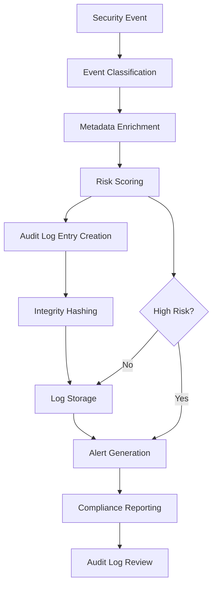

# Security Audit Logger

## Purpose
Provides security-specific audit logging for the kOS ecosystem. This module extends the Base Audit Logger to capture, store, and manage detailed security event logs, including authentication attempts, access control changes, policy violations, and incident responses. The Security Audit Logger ensures all security-relevant events are recorded for compliance, forensics, and monitoring.

## Capabilities
- **Security Event Logging**: Capture all security-relevant events (auth, access, policy, incident)
- **Detailed Metadata**: Enrich logs with user, session, context, and risk data
- **Compliance Logging**: Support for regulatory and standards-based audit requirements
- **Tamper Detection**: Integrity checks and tamper-evident log storage
- **Retention Policies**: Configurable log retention and archival
- **Real-Time Alerts**: Trigger alerts on high-risk or anomalous events
- **Forensic Support**: Enable forensic analysis and incident investigation
- **Performance Optimization**: Efficient, high-throughput logging
- **Secure Storage**: Encrypted and access-controlled log storage

## Integration Points
- **Input**: Security event data, context, and metadata
- **Output**: Structured audit log entries, alerts, and compliance reports
- **Dependencies**: Base Audit Logger for interface and storage, Security Policy Manager for event classification

## Configuration
```yaml
security_audit_logger:
  log_level: "detailed"
  retention_period: "7y"
  storage_backend: "encrypted_audit_store"
  tamper_detection:
    enabled: true
    hash_algorithm: "SHA256"
    chain_hashing: true
  alerting:
    enabled: true
    high_risk_threshold: "critical"
    notification_channels: ["email", "slack", "syslog"]
  compliance:
    gdpr: true
    sox: true
    hipaa: true
    pci_dss: true
  performance:
    max_write_latency: 50  # ms
    batch_logging: true
    batch_size: 100
  access_control:
    restrict_log_access: true
    audit_log_access: true
    access_roles: ["security_admin", "auditor"]
```

## Example Workflow


## Core Capabilities

### **1. Security Event Logging**
- **Description**: Capture all security-relevant events with context
- **Input**: Event type, user/session, context, and risk data
- **Output**: Structured audit log entry
- **Dependencies**: Event classification and context enrichment

### **2. Tamper Detection**
- **Description**: Ensure log integrity with hash chaining and verification
- **Input**: Log entry and previous hash
- **Output**: Tamper-evident log chain
- **Dependencies**: Hash generator (SHA256 or better)

### **3. Compliance Logging**
- **Description**: Support for regulatory and standards-based audit requirements
- **Input**: Compliance configuration and event data
- **Output**: Compliance-ready audit logs and reports
- **Dependencies**: Compliance policy manager

### **4. Real-Time Alerts**
- **Description**: Trigger alerts on high-risk or anomalous events
- **Input**: Risk scoring and event classification
- **Output**: Alert notifications
- **Dependencies**: Alerting system and notification channels

## Module Interface

### **Input Interface**
```typescript
interface SecurityAuditLoggerInput extends BaseAuditLoggerInput {
  eventType: string;
  userId?: string;
  sessionId?: string;
  context?: Record<string, any>;
  riskScore?: number;
  riskLevel?: 'low' | 'medium' | 'high' | 'critical';
  complianceTags?: string[];
  metadata?: SecurityAuditMetadata;
}

interface SecurityAuditMetadata {
  ipAddress?: string;
  location?: string;
  device?: string;
  policyId?: string;
  incidentId?: string;
  additionalInfo?: Record<string, any>;
}
```

### **Output Interface**
```typescript
interface SecurityAuditLoggerOutput extends BaseAuditLoggerOutput {
  logId: string;
  timestamp: Date;
  eventType: string;
  userId?: string;
  sessionId?: string;
  context?: Record<string, any>;
  riskScore?: number;
  riskLevel?: string;
  complianceTags?: string[];
  integrityHash: string;
  previousHash?: string;
  tamperEvident: boolean;
  alertGenerated: boolean;
  storageLocation: string;
  metadata: SecurityAuditLogMetadata;
}

interface SecurityAuditLogMetadata extends AuditLogMetadata {
  retentionPeriod: string;
  compliance: string[];
  alertChannels: string[];
  storageBackend: string;
  accessRoles: string[];
}
```

### **Configuration Interface**
```typescript
interface SecurityAuditLoggerConfig extends BaseAuditLoggerConfig {
  logLevel: string;
  retentionPeriod: string;
  storageBackend: string;
  tamperDetection: TamperDetectionConfig;
  alerting: AlertingConfig;
  compliance: ComplianceConfig;
  performance: AuditPerformanceConfig;
  accessControl: AuditAccessControlConfig;
}

interface TamperDetectionConfig {
  enabled: boolean;
  hashAlgorithm: string;
  chainHashing: boolean;
}

interface AlertingConfig {
  enabled: boolean;
  highRiskThreshold: string;
  notificationChannels: string[];
}

interface ComplianceConfig {
  gdpr: boolean;
  sox: boolean;
  hipaa: boolean;
  pci_dss: boolean;
}

interface AuditPerformanceConfig {
  maxWriteLatency: number;
  batchLogging: boolean;
  batchSize: number;
}

interface AuditAccessControlConfig {
  restrictLogAccess: boolean;
  auditLogAccess: boolean;
  accessRoles: string[];
}
```

## Module Dependencies

### **Required Dependencies**
- **Base Audit Logger**: For interface and storage
- **Hash Generator**: For tamper detection
- **Security Policy Manager**: For event classification and risk scoring
- **Alerting System**: For real-time alert notifications

### **Optional Dependencies**
- **Compliance Policy Manager**: For compliance tagging and reporting
- **Performance Monitor**: For logging throughput and latency

## Module Implementation

### **Core Components**

#### **1. Security Audit Logging Engine**
```typescript
class SecurityAuditLoggingEngine extends BaseAuditLoggingEngine {
  private config: SecurityAuditLoggerConfig;
  private hashGenerator: HashGenerator;
  private alertingSystem: AlertingSystem;
  private complianceManager: CompliancePolicyManager;
  
  constructor(config: SecurityAuditLoggerConfig) {
    super(config);
    this.config = config;
    this.hashGenerator = new HashGenerator(config.tamperDetection.hashAlgorithm);
    this.alertingSystem = new AlertingSystem(config.alerting);
    this.complianceManager = new CompliancePolicyManager(config.compliance);
  }
  
  async logEvent(input: SecurityAuditLoggerInput): Promise<SecurityAuditLoggerOutput> {
    // Enrich event with metadata and risk scoring
    const enrichedInput = await this.enrichInput(input);
    
    // Generate integrity hash
    const previousHash = await this.getPreviousHash();
    const integrityHash = await this.hashGenerator.generateHash(enrichedInput, previousHash);
    
    // Create log entry
    const logEntry = this.createLogEntry(enrichedInput, integrityHash, previousHash);
    
    // Store log entry
    await this.storeLogEntry(logEntry);
    
    // Trigger alert if high risk
    const alertGenerated = await this.handleAlerting(logEntry);
    
    // Update compliance records
    await this.complianceManager.updateCompliance(logEntry);
    
    return {
      ...logEntry,
      alertGenerated,
      tamperEvident: true,
      storageLocation: this.config.storageBackend,
      metadata: {
        retentionPeriod: this.config.retentionPeriod,
        compliance: this.complianceManager.getActiveComplianceTags(),
        alertChannels: this.config.alerting.notificationChannels,
        storageBackend: this.config.storageBackend,
        accessRoles: this.config.accessControl.accessRoles
      }
    };
  }
  
  private async enrichInput(input: SecurityAuditLoggerInput): Promise<SecurityAuditLoggerInput> {
    // Add risk scoring, context, and compliance tags
    // ...implementation...
    return input;
  }
  
  private async getPreviousHash(): Promise<string> {
    // Retrieve previous log entry hash for chaining
    // ...implementation...
    return '';
  }
  
  private createLogEntry(input: SecurityAuditLoggerInput, integrityHash: string, previousHash: string): SecurityAuditLoggerOutput {
    // ...implementation...
    return {
      logId: this.generateLogId(),
      timestamp: new Date(),
      eventType: input.eventType,
      userId: input.userId,
      sessionId: input.sessionId,
      context: input.context,
      riskScore: input.riskScore,
      riskLevel: input.riskLevel,
      complianceTags: input.complianceTags,
      integrityHash,
      previousHash,
      tamperEvident: true,
      alertGenerated: false,
      storageLocation: this.config.storageBackend,
      metadata: {
        retentionPeriod: this.config.retentionPeriod,
        compliance: [],
        alertChannels: this.config.alerting.notificationChannels,
        storageBackend: this.config.storageBackend,
        accessRoles: this.config.accessControl.accessRoles
      }
    };
  }
  
  private async storeLogEntry(logEntry: SecurityAuditLoggerOutput): Promise<void> {
    // Store log entry in secure, tamper-evident storage
    // ...implementation...
  }
  
  private async handleAlerting(logEntry: SecurityAuditLoggerOutput): Promise<boolean> {
    if (logEntry.riskLevel === 'critical' && this.config.alerting.enabled) {
      await this.alertingSystem.sendAlert(logEntry);
      return true;
    }
    return false;
  }
  
  private generateLogId(): string {
    return `audit_${Date.now()}_${Math.random().toString(36).substr(2, 9)}`;
  }
}
```

### **Integration Points**

#### **1. Tamper Detection Integration**
- **Description**: Integrates with hash generator for log integrity
- **Protocol**: Hash chaining and verification
- **Authentication**: Log authenticity validation
- **Rate Limiting**: Integrity check performance constraints

#### **2. Alerting Integration**
- **Description**: Integrates with alerting system for real-time notifications
- **Protocol**: Alert channel configuration and event triggers
- **Authentication**: Alert channel access control
- **Rate Limiting**: Alert rate limiting for high-volume events

## Performance Characteristics

### **Throughput**
- **Log Write**: 10,000 entries/second (batch mode)
- **Alert Generation**: < 100ms for high-risk events
- **Compliance Reporting**: 1,000 reports/minute

### **Reliability**
- **Error Rate**: < 0.0001% log write failures
- **Recovery Time**: < 50ms for recoverable errors
- **Availability**: 99.999% uptime for audit logging services
- **Data Integrity**: 100% tamper-evident log chain

### **Scalability**
- **Horizontal Scaling**: Support for distributed audit logging across nodes
- **Vertical Scaling**: Linear performance improvement with additional CPU cores
- **Batch Logging**: Efficient batch processing for high-volume events
- **Memory Usage**: < 100MB for standard operations

## Security Considerations

### **Log Integrity**
- **Tamper Detection**: Hash chaining and verification for all entries
- **Access Control**: Restrict log access to authorized roles
- **Audit Trail**: Complete audit trail for all log access and changes
- **Compliance**: Support for regulatory and standards-based requirements

### **Data Protection**
- **Encrypted Storage**: All logs stored in encrypted backends
- **Retention Policies**: Configurable retention and secure deletion
- **Alerting**: Real-time alerts for high-risk or anomalous events
- **Forensic Support**: Enable forensic analysis and investigation

## Error Handling

### **Error Types**
- **Log Write Errors**: Storage or write failures
- **Integrity Errors**: Tamper detection or hash chain failures
- **Alerting Errors**: Notification or alert channel failures
- **Compliance Errors**: Reporting or tagging failures
- **Performance Errors**: Latency or throughput issues

### **Error Recovery**
- **Automatic Retry**: Retry for transient log write or alerting errors
- **Fallback Storage**: Fallback to alternate storage on failure
- **Graceful Degradation**: Degrade to minimal logging on resource exhaustion
- **Error Reporting**: Comprehensive error reporting and alerting

## Testing Strategy

### **Unit Testing**
- **Event Logging**: Test all event types and metadata enrichment
- **Tamper Detection**: Test hash chaining and verification
- **Alerting**: Test alert generation and notification
- **Error Handling**: Test all error conditions and recovery

### **Integration Testing**
- **End-to-End Logging**: Test complete audit logging workflows
- **Compliance Integration**: Test compliance tagging and reporting
- **Performance Testing**: Test performance under various load conditions
- **Security Testing**: Test log integrity and access control

### **Load Testing**
- **Batch Logging**: Test high-volume batch logging
- **Alert Storms**: Test alerting under high event rates
- **Storage Failover**: Test fallback storage and recovery
- **Performance Degradation**: Test performance under resource constraints

## Deployment Considerations

### **Resource Requirements**
- **CPU**: Minimum 2 cores, recommended 4+ cores for high-performance operations
- **Memory**: Minimum 256MB, recommended 1GB+ for large operations
- **Storage**: Minimum 1GB for log storage and retention
- **Network**: High-speed network for distributed operations

### **Configuration**
- **Environment Variables**: Configuration through environment variables
- **Configuration Files**: Support for configuration file-based setup
- **Runtime Configuration**: Dynamic configuration updates
- **Validation**: Configuration validation on startup

### **Monitoring**
- **Performance Metrics**: Monitor log write latency and throughput
- **Alerting**: Monitor alert generation and delivery
- **Error Rates**: Monitor log write and alerting error rates
- **Security Events**: Monitor log access and changes

## Usage Examples

### **Basic Usage**
```typescript
import { SecurityAuditLogger } from './SecurityAuditLogger';

const auditLogger = new SecurityAuditLogger(config);

const input: SecurityAuditLoggerInput = {
  eventType: 'authentication_failure',
  userId: 'user123',
  sessionId: 'sess456',
  context: { ipAddress: '192.168.1.1' },
  riskLevel: 'high',
  complianceTags: ['gdpr', 'sox']
};

const result = await auditLogger.logEvent(input);
console.log('Audit log entry:', result.logId);
console.log('Integrity hash:', result.integrityHash);
console.log('Alert generated:', result.alertGenerated);
```

### **Advanced Usage with Tamper Detection**
```typescript
import { SecurityAuditLogger } from './SecurityAuditLogger';

const auditLogger = new SecurityAuditLogger(config);

const input: SecurityAuditLoggerInput = {
  eventType: 'policy_violation',
  userId: 'admin',
  sessionId: 'sess789',
  context: { policyId: 'POL-001' },
  riskLevel: 'critical',
  complianceTags: ['pci_dss'],
  metadata: { device: 'server01', location: 'datacenter' }
};

const result = await auditLogger.logEvent(input);
console.log('Audit log entry:', result.logId);
console.log('Tamper evident:', result.tamperEvident);
console.log('Storage location:', result.storageLocation);
```

## Future Enhancements

### **Planned Features**
- **Automated Forensic Analysis**: Integrate with forensic tools for automated analysis
- **Advanced Anomaly Detection**: Machine learning-based anomaly detection
- **Compliance Automation**: Automated compliance reporting and tagging
- **Distributed Ledger Logging**: Blockchain-based tamper-evident logging

### **Performance Improvements**
- **GPU Acceleration**: GPU-accelerated log processing for large volumes
- **Advanced Caching**: Intelligent caching for high-frequency events
- **Batch Optimization**: Further optimization for batch logging
- **Alert Routing**: Smart alert routing based on event type and risk

---

**Version**: 1.0  
**Focus**: Security-specific audit logging with tamper detection and compliance support 