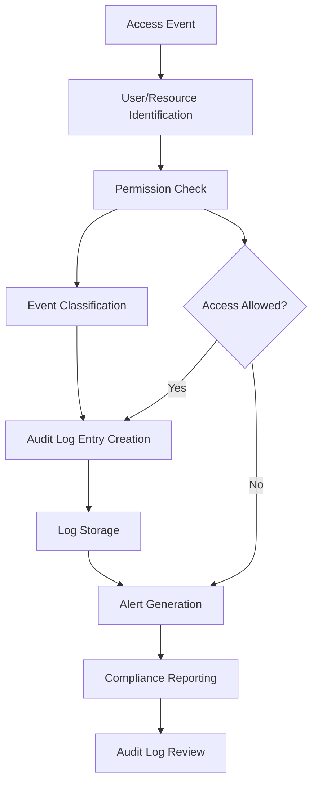

# Access Audit Logger

## Purpose
Provides access control audit logging for the kOS ecosystem. This module extends the Base Audit Logger to capture, store, and manage detailed logs of all access attempts, including successful and failed logins, resource access, permission changes, and access policy violations. The Access Audit Logger ensures all access-related events are recorded for compliance, monitoring, and forensic analysis.

## Capabilities
- **Access Event Logging**: Capture all access attempts and results (success/failure)
- **User and Resource Tracking**: Log user, session, and resource details
- **Permission Change Logging**: Record all changes to access permissions and roles
- **Policy Violation Detection**: Log and flag access policy violations
- **Compliance Logging**: Support for regulatory and standards-based audit requirements
- **Retention Policies**: Configurable log retention and archival
- **Real-Time Alerts**: Trigger alerts on unauthorized or suspicious access
- **Forensic Support**: Enable forensic analysis and incident investigation
- **Secure Storage**: Encrypted and access-controlled log storage

## Integration Points
- **Input**: Access event data, user/resource info, and metadata
- **Output**: Structured audit log entries, alerts, and compliance reports
- **Dependencies**: Base Audit Logger for interface and storage, Access Control Manager for event classification

## Configuration
```yaml
access_audit_logger:
  log_level: "detailed"
  retention_period: "7y"
  storage_backend: "encrypted_audit_store"
  alerting:
    enabled: true
    unauthorized_access_threshold: 3
    notification_channels: ["email", "slack", "syslog"]
  compliance:
    gdpr: true
    sox: true
    hipaa: true
    pci_dss: true
  performance:
    max_write_latency: 50  # ms
    batch_logging: true
    batch_size: 100
  access_control:
    restrict_log_access: true
    audit_log_access: true
    access_roles: ["security_admin", "auditor"]
```

## Example Workflow


## Core Capabilities

### **1. Access Event Logging**
- **Description**: Capture all access attempts and results with user/resource context
- **Input**: Event type, user, resource, session, and result
- **Output**: Structured audit log entry
- **Dependencies**: Access control and event classification

### **2. Permission Change Logging**
- **Description**: Record all changes to access permissions and roles
- **Input**: Change event, user, resource, and new permissions
- **Output**: Permission change log entry
- **Dependencies**: Access control manager

### **3. Policy Violation Detection**
- **Description**: Log and flag access policy violations
- **Input**: Policy violation event and context
- **Output**: Violation log entry and alert
- **Dependencies**: Policy engine

### **4. Real-Time Alerts**
- **Description**: Trigger alerts on unauthorized or suspicious access
- **Input**: Event classification and threshold checks
- **Output**: Alert notifications
- **Dependencies**: Alerting system and notification channels

## Module Interface

### **Input Interface**
```typescript
interface AccessAuditLoggerInput extends BaseAuditLoggerInput {
  eventType: string;
  userId?: string;
  sessionId?: string;
  resourceId?: string;
  resourceType?: string;
  accessResult: 'success' | 'failure';
  permissionChange?: boolean;
  policyViolation?: boolean;
  metadata?: AccessAuditMetadata;
}

interface AccessAuditMetadata {
  ipAddress?: string;
  location?: string;
  device?: string;
  previousPermissions?: string[];
  newPermissions?: string[];
  violationReason?: string;
  additionalInfo?: Record<string, any>;
}
```

### **Output Interface**
```typescript
interface AccessAuditLoggerOutput extends BaseAuditLoggerOutput {
  logId: string;
  timestamp: Date;
  eventType: string;
  userId?: string;
  sessionId?: string;
  resourceId?: string;
  resourceType?: string;
  accessResult: string;
  permissionChange?: boolean;
  policyViolation?: boolean;
  alertGenerated: boolean;
  storageLocation: string;
  metadata: AccessAuditLogMetadata;
}

interface AccessAuditLogMetadata extends AuditLogMetadata {
  retentionPeriod: string;
  compliance: string[];
  alertChannels: string[];
  storageBackend: string;
  accessRoles: string[];
}
```

### **Configuration Interface**
```typescript
interface AccessAuditLoggerConfig extends BaseAuditLoggerConfig {
  logLevel: string;
  retentionPeriod: string;
  storageBackend: string;
  alerting: AccessAlertingConfig;
  compliance: ComplianceConfig;
  performance: AuditPerformanceConfig;
  accessControl: AuditAccessControlConfig;
}

interface AccessAlertingConfig {
  enabled: boolean;
  unauthorizedAccessThreshold: number;
  notificationChannels: string[];
}

interface ComplianceConfig {
  gdpr: boolean;
  sox: boolean;
  hipaa: boolean;
  pci_dss: boolean;
}

interface AuditPerformanceConfig {
  maxWriteLatency: number;
  batchLogging: boolean;
  batchSize: number;
}

interface AuditAccessControlConfig {
  restrictLogAccess: boolean;
  auditLogAccess: boolean;
  accessRoles: string[];
}
```

## Module Dependencies

### **Required Dependencies**
- **Base Audit Logger**: For interface and storage
- **Access Control Manager**: For event classification and permission checks
- **Alerting System**: For real-time alert notifications

### **Optional Dependencies**
- **Policy Engine**: For policy violation detection
- **Performance Monitor**: For logging throughput and latency

## Module Implementation

### **Core Components**

#### **1. Access Audit Logging Engine**
```typescript
class AccessAuditLoggingEngine extends BaseAuditLoggingEngine {
  private config: AccessAuditLoggerConfig;
  private alertingSystem: AlertingSystem;
  private accessControlManager: AccessControlManager;
  
  constructor(config: AccessAuditLoggerConfig) {
    super(config);
    this.config = config;
    this.alertingSystem = new AlertingSystem(config.alerting);
    this.accessControlManager = new AccessControlManager();
  }
  
  async logEvent(input: AccessAuditLoggerInput): Promise<AccessAuditLoggerOutput> {
    // Enrich event with metadata and permission checks
    const enrichedInput = await this.enrichInput(input);
    
    // Create log entry
    const logEntry = this.createLogEntry(enrichedInput);
    
    // Store log entry
    await this.storeLogEntry(logEntry);
    
    // Trigger alert if unauthorized or suspicious
    const alertGenerated = await this.handleAlerting(logEntry);
    
    return {
      ...logEntry,
      alertGenerated,
      storageLocation: this.config.storageBackend,
      metadata: {
        retentionPeriod: this.config.retentionPeriod,
        compliance: this.getComplianceTags(),
        alertChannels: this.config.alerting.notificationChannels,
        storageBackend: this.config.storageBackend,
        accessRoles: this.config.accessControl.accessRoles
      }
    };
  }
  
  private async enrichInput(input: AccessAuditLoggerInput): Promise<AccessAuditLoggerInput> {
    // Add permission checks, context, and compliance tags
    // ...implementation...
    return input;
  }
  
  private createLogEntry(input: AccessAuditLoggerInput): AccessAuditLoggerOutput {
    // ...implementation...
    return {
      logId: this.generateLogId(),
      timestamp: new Date(),
      eventType: input.eventType,
      userId: input.userId,
      sessionId: input.sessionId,
      resourceId: input.resourceId,
      resourceType: input.resourceType,
      accessResult: input.accessResult,
      permissionChange: input.permissionChange,
      policyViolation: input.policyViolation,
      alertGenerated: false,
      storageLocation: this.config.storageBackend,
      metadata: {
        retentionPeriod: this.config.retentionPeriod,
        compliance: [],
        alertChannels: this.config.alerting.notificationChannels,
        storageBackend: this.config.storageBackend,
        accessRoles: this.config.accessControl.accessRoles
      }
    };
  }
  
  private async storeLogEntry(logEntry: AccessAuditLoggerOutput): Promise<void> {
    // Store log entry in secure, tamper-evident storage
    // ...implementation...
  }
  
  private async handleAlerting(logEntry: AccessAuditLoggerOutput): Promise<boolean> {
    if (logEntry.accessResult === 'failure' && this.config.alerting.enabled) {
      await this.alertingSystem.sendAlert(logEntry);
      return true;
    }
    return false;
  }
  
  private getComplianceTags(): string[] {
    const tags = [];
    if (this.config.compliance.gdpr) tags.push('gdpr');
    if (this.config.compliance.sox) tags.push('sox');
    if (this.config.compliance.hipaa) tags.push('hipaa');
    if (this.config.compliance.pci_dss) tags.push('pci_dss');
    return tags;
  }
  
  private generateLogId(): string {
    return `access_audit_${Date.now()}_${Math.random().toString(36).substr(2, 9)}`;
  }
}
```

### **Integration Points**

#### **1. Access Control Integration**
- **Description**: Integrates with access control manager for permission checks
- **Protocol**: Permission and role validation
- **Authentication**: User and session validation
- **Rate Limiting**: Access event rate limiting for security

#### **2. Alerting Integration**
- **Description**: Integrates with alerting system for real-time notifications
- **Protocol**: Alert channel configuration and event triggers
- **Authentication**: Alert channel access control
- **Rate Limiting**: Alert rate limiting for high-volume events

## Performance Characteristics

### **Throughput**
- **Log Write**: 10,000 entries/second (batch mode)
- **Alert Generation**: < 100ms for unauthorized access
- **Compliance Reporting**: 1,000 reports/minute

### **Reliability**
- **Error Rate**: < 0.0001% log write failures
- **Recovery Time**: < 50ms for recoverable errors
- **Availability**: 99.999% uptime for audit logging services
- **Data Integrity**: 100% tamper-evident log chain

### **Scalability**
- **Horizontal Scaling**: Support for distributed audit logging across nodes
- **Vertical Scaling**: Linear performance improvement with additional CPU cores
- **Batch Logging**: Efficient batch processing for high-volume events
- **Memory Usage**: < 100MB for standard operations

## Security Considerations

### **Log Integrity**
- **Tamper Detection**: Hash chaining and verification for all entries
- **Access Control**: Restrict log access to authorized roles
- **Audit Trail**: Complete audit trail for all log access and changes
- **Compliance**: Support for regulatory and standards-based requirements

### **Data Protection**
- **Encrypted Storage**: All logs stored in encrypted backends
- **Retention Policies**: Configurable retention and secure deletion
- **Alerting**: Real-time alerts for unauthorized or suspicious access
- **Forensic Support**: Enable forensic analysis and investigation

## Error Handling

### **Error Types**
- **Log Write Errors**: Storage or write failures
- **Alerting Errors**: Notification or alert channel failures
- **Compliance Errors**: Reporting or tagging failures
- **Performance Errors**: Latency or throughput issues

### **Error Recovery**
- **Automatic Retry**: Retry for transient log write or alerting errors
- **Fallback Storage**: Fallback to alternate storage on failure
- **Graceful Degradation**: Degrade to minimal logging on resource exhaustion
- **Error Reporting**: Comprehensive error reporting and alerting

## Testing Strategy

### **Unit Testing**
- **Event Logging**: Test all event types and metadata enrichment
- **Permission Change Logging**: Test permission change events
- **Alerting**: Test alert generation and notification
- **Error Handling**: Test all error conditions and recovery

### **Integration Testing**
- **End-to-End Logging**: Test complete audit logging workflows
- **Compliance Integration**: Test compliance tagging and reporting
- **Performance Testing**: Test performance under various load conditions
- **Security Testing**: Test log integrity and access control

### **Load Testing**
- **Batch Logging**: Test high-volume batch logging
- **Alert Storms**: Test alerting under high event rates
- **Storage Failover**: Test fallback storage and recovery
- **Performance Degradation**: Test performance under resource constraints

## Deployment Considerations

### **Resource Requirements**
- **CPU**: Minimum 2 cores, recommended 4+ cores for high-performance operations
- **Memory**: Minimum 256MB, recommended 1GB+ for large operations
- **Storage**: Minimum 1GB for log storage and retention
- **Network**: High-speed network for distributed operations

### **Configuration**
- **Environment Variables**: Configuration through environment variables
- **Configuration Files**: Support for configuration file-based setup
- **Runtime Configuration**: Dynamic configuration updates
- **Validation**: Configuration validation on startup

### **Monitoring**
- **Performance Metrics**: Monitor log write latency and throughput
- **Alerting**: Monitor alert generation and delivery
- **Error Rates**: Monitor log write and alerting error rates
- **Security Events**: Monitor log access and changes

## Usage Examples

### **Basic Usage**
```typescript
import { AccessAuditLogger } from './AccessAuditLogger';

const auditLogger = new AccessAuditLogger(config);

const input: AccessAuditLoggerInput = {
  eventType: 'resource_access',
  userId: 'user123',
  sessionId: 'sess456',
  resourceId: 'file789',
  resourceType: 'file',
  accessResult: 'success'
};

const result = await auditLogger.logEvent(input);
console.log('Audit log entry:', result.logId);
console.log('Access result:', result.accessResult);
console.log('Alert generated:', result.alertGenerated);
```

### **Advanced Usage with Policy Violation**
```typescript
import { AccessAuditLogger } from './AccessAuditLogger';

const auditLogger = new AccessAuditLogger(config);

const input: AccessAuditLoggerInput = {
  eventType: 'policy_violation',
  userId: 'admin',
  sessionId: 'sess789',
  resourceId: 'db001',
  resourceType: 'database',
  accessResult: 'failure',
  policyViolation: true,
  metadata: { violationReason: 'Unauthorized query' }
};

const result = await auditLogger.logEvent(input);
console.log('Audit log entry:', result.logId);
console.log('Policy violation:', result.policyViolation);
console.log('Storage location:', result.storageLocation);
```

## Future Enhancements

### **Planned Features**
- **Automated Forensic Analysis**: Integrate with forensic tools for automated analysis
- **Advanced Anomaly Detection**: Machine learning-based anomaly detection
- **Compliance Automation**: Automated compliance reporting and tagging
- **Distributed Ledger Logging**: Blockchain-based tamper-evident logging

### **Performance Improvements**
- **GPU Acceleration**: GPU-accelerated log processing for large volumes
- **Advanced Caching**: Intelligent caching for high-frequency events
- **Batch Optimization**: Further optimization for batch logging
- **Alert Routing**: Smart alert routing based on event type and risk

---

**Version**: 1.0  
**Focus**: Access control audit logging with compliance and alerting support 