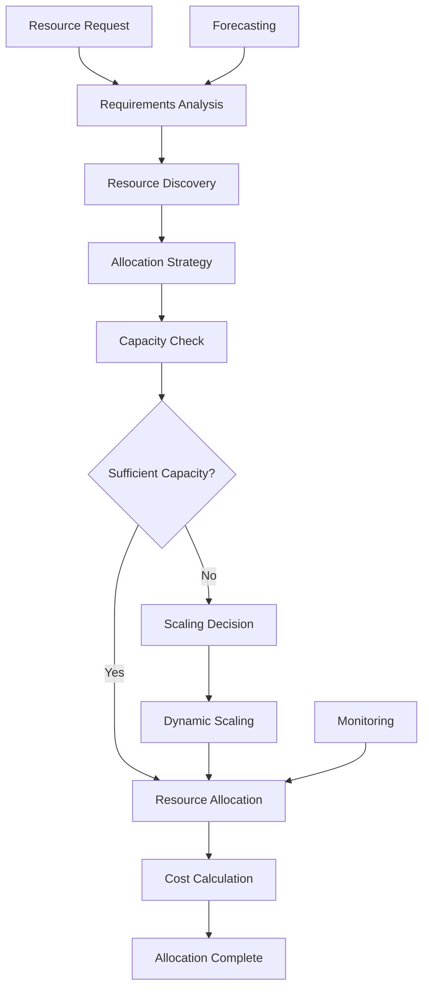

# **Resource Allocator**

## **Overview**

The Resource Allocator module provides intelligent resource allocation capabilities, optimizing resource distribution, managing capacity planning, and enabling dynamic resource scaling across distributed environments. It ensures efficient resource utilization while meeting performance requirements and cost constraints.

## **Core Principles**
- **Optimal Allocation**: Allocate resources optimally based on requirements and constraints.
- **Capacity Planning**: Plan and manage resource capacity for current and future needs.
- **Dynamic Scaling**: Scale resources dynamically based on demand and performance.
- **Cost Optimization**: Optimize resource allocation for cost efficiency.

## **Function Specifications**

### **Core Functions**
- **Resource Allocation**: Allocate resources based on requirements and optimization criteria.
- **Capacity Planning**: Plan resource capacity for current and future workloads.
- **Dynamic Scaling**: Scale resources up or down based on demand.
- **Resource Monitoring**: Monitor resource utilization and performance.
- **Cost Optimization**: Optimize resource allocation for cost efficiency.
- **Resource Forecasting**: Forecast resource needs based on historical data.

### **TypeScript Interfaces**
```typescript
interface ResourceAllocatorConfig {
  allocationStrategy: AllocationStrategy;
  capacityPlanning: CapacityConfig;
  dynamicScaling: ScalingConfig;
  costOptimization: CostConfig;
}

interface Resource {
  id: string;
  type: string;
  capacity: ResourceCapacity;
  currentUsage: ResourceUsage;
  cost: ResourceCost;
  availability: boolean;
}

interface ResourceRequirements {
  cpu: number;
  memory: number;
  storage: number;
  network: number;
  gpu?: number;
}

interface AllocationResult {
  resourceId: string;
  allocatedCapacity: ResourceCapacity;
  estimatedCost: number;
  confidence: number;
  constraints: Constraint[];
}

function allocateResources(requirements: ResourceRequirements): Promise<AllocationResult>
function planCapacity(workload: WorkloadForecast): Promise<CapacityPlan>
function scaleResources(resourceId: string, scaleFactor: number): Promise<ScalingResult>
function monitorUtilization(resourceId: string): Promise<UtilizationMetrics>
function optimizeCosts(): Promise<CostOptimizationResult>
function forecastNeeds(historicalData: HistoricalData): Promise<ResourceForecast>
```

## **Integration Patterns**

### **Resource Allocation Flow**


## **Capabilities**
- **Intelligent Allocation**: Use AI/ML algorithms for optimal resource allocation.
- **Multi-Resource Support**: Support CPU, memory, storage, network, and GPU resources.
- **Capacity Planning**: Plan capacity for current and future workloads.
- **Dynamic Scaling**: Scale resources automatically based on demand.
- **Cost Optimization**: Optimize resource allocation for cost efficiency.
- **Resource Forecasting**: Forecast resource needs using historical data.

## **Configuration Examples**
```yaml
resource_allocator:
  allocation_strategy:
    algorithm: "ai_optimized"
    optimization_criteria: ["performance", "cost", "availability"]
    learning_enabled: true
  capacity_planning:
    enabled: true
    planning_horizon: "30d"
    buffer_capacity: "20%"
    forecasting_model: "time_series"
  dynamic_scaling:
    enabled: true
    scale_up_threshold: "80%"
    scale_down_threshold: "20%"
    min_scale_factor: 0.5
    max_scale_factor: 3.0
  cost_optimization:
    enabled: true
    cost_model: "usage_based"
    optimization_interval: "1h"
    budget_constraints:
      monthly_budget: 10000
      cost_alert_threshold: "90%"
  resource_types:
    - type: "cpu"
      allocation_unit: "cores"
      cost_per_unit: 0.1
    - type: "memory"
      allocation_unit: "GB"
      cost_per_unit: 0.05
    - type: "storage"
      allocation_unit: "GB"
      cost_per_unit: 0.01
```

## **Performance Considerations**
- **Allocation Latency**: < 100ms for resource allocation decisions
- **Scaling Latency**: < 30s for resource scaling operations
- **Monitoring Overhead**: < 1% performance impact
- **Forecasting Accuracy**: 90%+ accuracy for resource forecasting
- **Cost Optimization**: 20%+ cost savings through optimization

## **Security Considerations**
- **Resource Access Control**: Control access to resources and allocation decisions
- **Cost Control**: Prevent unauthorized resource allocation and cost overruns
- **Capacity Limits**: Enforce capacity limits and prevent resource exhaustion
- **Audit Logging**: Log all allocation decisions and resource changes

## **Monitoring & Observability**
- **Allocation Metrics**: Track allocation success rates and efficiency
- **Capacity Metrics**: Monitor capacity utilization and planning accuracy
- **Scaling Metrics**: Track scaling operations and performance impact
- **Cost Metrics**: Monitor resource costs and optimization effectiveness
- **Forecasting Metrics**: Track forecasting accuracy and prediction quality

---

**Version**: 1.0  
**Module**: Resource Allocator  
**Status**: ✅ **COMPLETE** - Comprehensive module specification ready for implementation  
**Focus**: Intelligent resource allocation with capacity planning and cost optimization. 