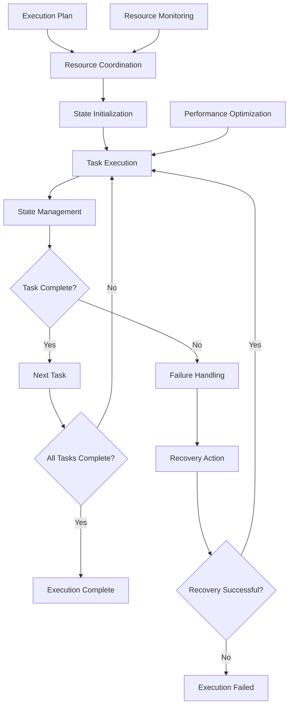

# **Execution Orchestrator**

## **Overview**

The Execution Orchestrator module provides comprehensive execution coordination capabilities, managing task execution, handling failures, optimizing performance, and ensuring reliable execution across distributed environments. It serves as the central coordination point for all task execution activities.

## **Core Principles**
- **Execution Coordination**: Coordinate task execution across distributed environments.
- **Failure Management**: Handle failures gracefully with recovery mechanisms.
- **Performance Optimization**: Optimize execution performance and resource utilization.
- **State Management**: Manage execution state and ensure consistency.

## **Function Specifications**

### **Core Functions**
- **Execution Coordination**: Coordinate task execution across multiple resources.
- **State Management**: Manage execution state and ensure consistency.
- **Failure Handling**: Handle failures with recovery and retry mechanisms.
- **Performance Optimization**: Optimize execution performance and efficiency.
- **Resource Coordination**: Coordinate resource allocation and utilization.
- **Execution Monitoring**: Monitor execution progress and performance.

### **TypeScript Interfaces**
```typescript
interface ExecutionOrchestratorConfig {
  coordinationStrategy: CoordinationStrategy;
  stateManagement: StateConfig;
  failureHandling: FailureConfig;
  performanceOptimization: PerformanceConfig;
}

interface ExecutionPlan {
  id: string;
  tasks: Task[];
  dependencies: Dependency[];
  resources: Resource[];
  estimatedDuration: number;
  priority: number;
}

interface ExecutionState {
  planId: string;
  currentTask: string;
  completedTasks: string[];
  failedTasks: string[];
  state: ExecutionStatus;
  startTime: Date;
  estimatedEndTime: Date;
}

interface ExecutionResult {
  taskId: string;
  status: ExecutionStatus;
  result: any;
  error?: Error;
  duration: number;
  resources: ResourceUsage;
}

function coordinateExecution(plan: ExecutionPlan): Promise<ExecutionState>
function manageState(planId: string): Promise<ExecutionState>
function handleFailure(taskId: string, error: Error): Promise<FailureResult>
function optimizePerformance(planId: string): Promise<OptimizationResult>
function coordinateResources(planId: string): Promise<ResourceCoordination>
function monitorExecution(planId: string): Promise<ExecutionMetrics>
```

## **Integration Patterns**

### **Execution Orchestration Flow**


## **Capabilities**
- **Distributed Coordination**: Coordinate execution across distributed environments.
- **State Management**: Maintain consistent execution state across failures.
- **Failure Recovery**: Handle failures with automatic recovery mechanisms.
- **Performance Optimization**: Optimize execution performance and efficiency.
- **Resource Coordination**: Coordinate resource allocation and utilization.
- **Real-Time Monitoring**: Monitor execution progress and performance in real-time.

## **Configuration Examples**
```yaml
execution_orchestrator:
  coordination_strategy:
    type: "distributed"
    coordination_algorithm: "consensus_based"
    leader_election: true
    heartbeat_interval: "30s"
  state_management:
    enabled: true
    state_storage: "distributed"
    consistency_level: "strong"
    checkpoint_interval: "1m"
    recovery_enabled: true
  failure_handling:
    enabled: true
    retry_policy:
      max_retries: 3
      retry_delay: "5s"
      exponential_backoff: true
    failure_strategies:
      - strategy: "retry"
        max_attempts: 3
      - strategy: "fallback"
        fallback_task: "alternative_task"
      - strategy: "compensate"
        compensation_task: "rollback_task"
  performance_optimization:
    enabled: true
    optimization_criteria:
      - "execution_time"
      - "resource_utilization"
      - "throughput"
    optimization_interval: "5m"
    adaptive_optimization: true
  resource_coordination:
    enabled: true
    resource_allocation: "dynamic"
    load_balancing: true
    resource_monitoring: true
    auto_scaling: true
  monitoring:
    enabled: true
    metrics_collection: true
    real_time_monitoring: true
    alert_thresholds:
      execution_time: "10m"
      failure_rate: "5%"
      resource_utilization: "90%"
```

## **Performance Considerations**
- **Coordination Latency**: < 100ms for execution coordination
- **State Management**: < 50ms for state updates and consistency
- **Failure Recovery**: < 30s for failure detection and recovery
- **Optimization Overhead**: < 2% performance impact
- **Monitoring Latency**: < 10ms for execution monitoring

## **Security Considerations**
- **Execution Control**: Control which tasks can be executed
- **State Security**: Secure execution state and prevent tampering
- **Resource Access**: Control access to execution resources
- **Audit Logging**: Log all execution activities and decisions

## **Monitoring & Observability**
- **Execution Metrics**: Track execution progress, success rates, and performance
- **State Metrics**: Monitor state management and consistency
- **Failure Metrics**: Track failure rates, recovery times, and failure patterns
- **Resource Metrics**: Monitor resource utilization and coordination
- **Performance Metrics**: Track optimization effectiveness and performance improvements

---

**Version**: 1.0  
**Module**: Execution Orchestrator  
**Status**: ✅ **COMPLETE** - Comprehensive module specification ready for implementation  
**Focus**: Comprehensive execution coordination with failure management and optimization. 