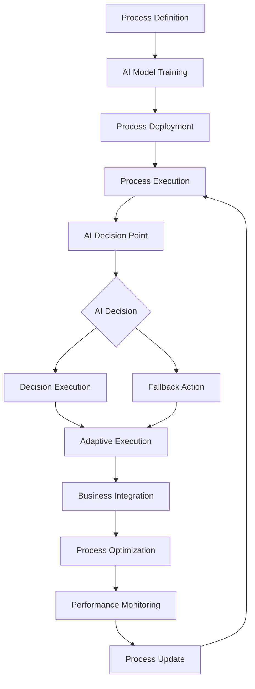

# **Process Automator**

## **Overview**

The Process Automator module provides intelligent process automation capabilities, enabling the automation of complex business processes, workflows, and operational tasks. It combines AI-driven decision making, adaptive execution, and intelligent process optimization to streamline operations and improve efficiency.

## **Core Principles**
- **Intelligent Automation**: Use AI/ML to automate complex decision-making processes.
- **Adaptive Execution**: Adapt process execution based on changing conditions and requirements.
- **Process Optimization**: Continuously optimize processes for efficiency and effectiveness.
- **Business Integration**: Seamlessly integrate with existing business systems and workflows.

## **Function Specifications**

### **Core Functions**
- **Process Definition**: Define and model complex business processes.
- **AI-Driven Decision Making**: Use AI/ML for intelligent decision making within processes.
- **Adaptive Execution**: Adapt process execution based on real-time conditions.
- **Process Optimization**: Optimize processes for efficiency and effectiveness.
- **Business Integration**: Integrate with existing business systems and APIs.
- **Process Monitoring**: Monitor process execution and performance.

### **TypeScript Interfaces**
```typescript
interface ProcessAutomatorConfig {
  aiEngine: AIEngineConfig;
  adaptiveExecution: AdaptiveConfig;
  optimizationPolicy: OptimizationPolicy;
  businessIntegration: IntegrationConfig;
}

interface Process {
  id: string;
  name: string;
  definition: ProcessDefinition;
  aiDecisions: AIDecision[];
  adaptiveRules: AdaptiveRule[];
  businessRules: BusinessRule[];
  performance: PerformanceMetrics;
}

interface ProcessDefinition {
  steps: ProcessStep[];
  decisions: DecisionPoint[];
  integrations: Integration[];
  errorHandling: ErrorHandling;
}

interface AIDecision {
  id: string;
  type: DecisionType;
  model: AIModel;
  confidence: number;
  fallback: FallbackAction;
}

function defineProcess(definition: ProcessDefinition): Promise<Process>
function makeAIDecision(decisionId: string, context: Context): Promise<DecisionResult>
function adaptExecution(processId: string, conditions: Conditions): Promise<AdaptationResult>
function optimizeProcess(processId: string): Promise<OptimizationResult>
function integrateBusiness(integrationId: string, data: any): Promise<IntegrationResult>
function monitorProcess(processId: string): Promise<ProcessMetrics>
```

## **Integration Patterns**

### **Process Automation Flow**


## **Capabilities**
- **Complex Process Automation**: Automate complex, multi-step business processes.
- **AI-Driven Decisions**: Use AI/ML for intelligent decision making within processes.
- **Adaptive Execution**: Adapt process execution based on changing conditions.
- **Business Integration**: Integrate with existing business systems and APIs.
- **Process Optimization**: Continuously optimize processes for efficiency.
- **Real-Time Monitoring**: Monitor process execution and performance in real-time.

## **Configuration Examples**
```yaml
process_automator:
  ai_engine:
    enabled: true
    model_type: "ensemble"
    training_data_source: "process_history"
    decision_confidence_threshold: 0.8
    fallback_strategy: "rule_based"
  adaptive_execution:
    enabled: true
    adaptation_triggers:
      - trigger: "performance_degradation"
        threshold: "20%"
        action: "optimize_execution"
      - trigger: "business_rule_change"
        action: "update_process"
      - trigger: "resource_constraint"
        action: "scale_resources"
  optimization_policy:
    enabled: true
    optimization_criteria:
      - "execution_time"
      - "resource_utilization"
      - "business_value"
      - "error_rate"
    optimization_interval: "1h"
    learning_rate: 0.1
  business_integration:
    enabled: true
    integration_types:
      - type: "api"
        authentication: "oauth2"
        rate_limiting: true
      - type: "database"
        connection_pooling: true
        transaction_management: true
      - type: "message_queue"
        reliability: "at_least_once"
        ordering: "fifo"
  processes:
    - id: "order_processing"
      name: "Order Processing Automation"
      ai_decisions:
        - decision: "fraud_detection"
          model: "fraud_detection_model"
          confidence_threshold: 0.9
        - decision: "inventory_allocation"
          model: "inventory_optimization_model"
          confidence_threshold: 0.8
      adaptive_rules:
        - rule: "peak_hour_scaling"
          condition: "order_volume > 1000"
          action: "scale_processing_capacity"
      business_rules:
        - rule: "premium_customer_priority"
          condition: "customer_tier == 'premium'"
          action: "expedite_processing"
```

## **Performance Considerations**
- **Process Execution**: < 1s for simple process execution
- **AI Decision Making**: < 100ms for AI-driven decisions
- **Adaptive Execution**: < 500ms for process adaptation
- **Business Integration**: < 200ms for business system integration
- **Optimization Overhead**: < 2% performance impact

## **Security Considerations**
- **Process Security**: Secure process definitions and execution
- **AI Model Security**: Secure AI models and decision-making processes
- **Business Integration Security**: Secure integration with business systems
- **Data Privacy**: Ensure data privacy and compliance in process automation

## **Monitoring & Observability**
- **Process Metrics**: Track process execution, success rates, and performance
- **AI Decision Metrics**: Monitor AI decision accuracy and confidence
- **Adaptation Metrics**: Track process adaptation and effectiveness
- **Integration Metrics**: Monitor business integration performance
- **Optimization Metrics**: Track process optimization and improvements

---

**Version**: 1.0  
**Module**: Process Automator  
**Status**: ✅ **COMPLETE** - Comprehensive module specification ready for implementation  
**Focus**: Intelligent process automation with AI-driven decision making and adaptive execution. 