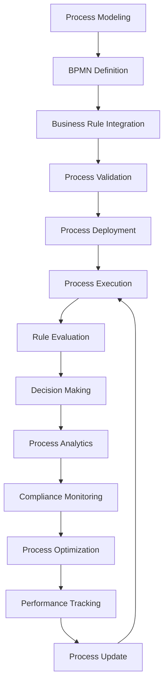

# **Business Process Manager**

## **Overview**

The Business Process Manager module provides comprehensive business process management capabilities, including process modeling, execution, monitoring, and optimization. It supports BPMN (Business Process Model and Notation), business rule integration, and advanced process analytics to streamline business operations and improve efficiency.

## **Core Principles**
- **Process Modeling**: Model business processes using standard BPMN notation.
- **Business Rule Integration**: Integrate business rules and policies into process execution.
- **Process Analytics**: Provide comprehensive analytics and insights for process optimization.
- **Compliance Management**: Ensure process compliance with business policies and regulations.

## **Function Specifications**

### **Core Functions**
- **Process Modeling**: Create and manage business process models using BPMN.
- **Process Execution**: Execute business processes with rule-based decision making.
- **Business Rule Management**: Manage and integrate business rules into processes.
- **Process Analytics**: Provide analytics and insights for process optimization.
- **Compliance Monitoring**: Monitor process compliance with business policies.
- **Process Optimization**: Optimize processes based on analytics and performance data.

### **TypeScript Interfaces**
```typescript
interface BusinessProcessManagerConfig {
  bpmnEngine: BPMNEngineConfig;
  businessRules: BusinessRuleConfig;
  analytics: AnalyticsConfig;
  compliance: ComplianceConfig;
}

interface BusinessProcess {
  id: string;
  name: string;
  bpmnDefinition: BPMNDefinition;
  businessRules: BusinessRule[];
  performance: PerformanceMetrics;
  compliance: ComplianceStatus;
}

interface BPMNDefinition {
  processId: string;
  activities: Activity[];
  gateways: Gateway[];
  events: Event[];
  flows: Flow[];
  lanes: Lane[];
}

interface BusinessRule {
  id: string;
  name: string;
  condition: RuleCondition;
  action: RuleAction;
  priority: number;
  enabled: boolean;
}

function modelProcess(bpmnDefinition: BPMNDefinition): Promise<BusinessProcess>
function executeProcess(processId: string, data: any): Promise<ExecutionResult>
function manageBusinessRule(rule: BusinessRule): Promise<RuleResult>
function analyzeProcess(processId: string): Promise<AnalyticsResult>
function monitorCompliance(processId: string): Promise<ComplianceResult>
function optimizeProcess(processId: string): Promise<OptimizationResult>
```

## **Integration Patterns**

### **Business Process Management Flow**


## **Capabilities**
- **BPMN Support**: Full support for BPMN 2.0 notation and execution.
- **Business Rule Engine**: Advanced business rule engine with complex rule evaluation.
- **Process Analytics**: Comprehensive analytics and reporting capabilities.
- **Compliance Management**: Built-in compliance monitoring and reporting.
- **Process Optimization**: AI-driven process optimization and improvement.
- **Integration Support**: Extensive integration with business systems and APIs.

## **Configuration Examples**
```yaml
business_process_manager:
  bpmn_engine:
    enabled: true
    version: "2.0"
    execution_mode: "synchronous"
    persistence_enabled: true
    history_level: "full"
  business_rules:
    enabled: true
    rule_engine: "drools"
    rule_repository: "database"
    rule_versioning: true
    rule_testing: true
  analytics:
    enabled: true
    analytics_engine: "real_time"
    metrics_collection: true
    reporting_interval: "1h"
    dashboards_enabled: true
  compliance:
    enabled: true
    compliance_framework: "sox"
    audit_trail: true
    compliance_reporting: true
    alert_thresholds:
      violation_count: 5
      compliance_score: 0.9
  processes:
    - id: "order_to_cash"
      name: "Order to Cash Process"
      bpmn_file: "order_to_cash.bpmn"
      business_rules:
        - rule: "credit_check"
          condition: "order_amount > 10000"
          action: "require_approval"
        - rule: "inventory_check"
          condition: "item_available == false"
          action: "backorder_process"
      compliance_rules:
        - rule: "sox_approval"
          condition: "transaction_amount > 50000"
          action: "require_dual_approval"
      analytics:
        kpis:
          - "cycle_time"
          - "error_rate"
          - "customer_satisfaction"
          - "cost_per_transaction"
```

## **Performance Considerations**
- **Process Execution**: < 5s for complex process execution
- **Rule Evaluation**: < 100ms for business rule evaluation
- **Analytics Processing**: < 1s for analytics data processing
- **Compliance Monitoring**: < 500ms for compliance checks
- **Optimization Overhead**: < 3% performance impact

## **Security Considerations**
- **Process Security**: Secure process definitions and execution
- **Business Rule Security**: Secure business rules and decision logic
- **Data Privacy**: Ensure data privacy and compliance in process execution
- **Access Control**: Control access to process management functions

## **Monitoring & Observability**
- **Process Metrics**: Track process execution, success rates, and performance
- **Rule Metrics**: Monitor business rule evaluation and effectiveness
- **Analytics Metrics**: Track analytics processing and insights generation
- **Compliance Metrics**: Monitor compliance status and violations
- **Optimization Metrics**: Track process optimization and improvements

---

**Version**: 1.0  
**Module**: Business Process Manager  
**Status**: ✅ **COMPLETE** - Comprehensive module specification ready for implementation  
**Focus**: Comprehensive business process management with BPMN support and business rule integration. 