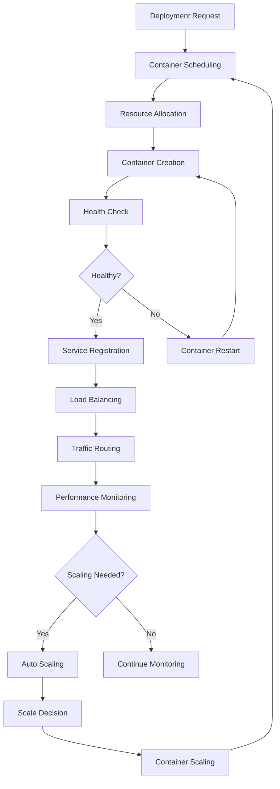

# **Container Orchestrator**

## **Overview**

The Container Orchestrator module provides advanced container orchestration capabilities, enabling management of containerized applications, automatic scaling, deployment, and lifecycle management. It supports Kubernetes-compatible APIs, multi-cluster management, and comprehensive container lifecycle operations.

## **Core Principles**
- **Container Management**: Manage containerized applications and their lifecycles.
- **Automatic Scaling**: Provide automatic scaling based on demand and resource utilization.
- **Multi-Cluster Support**: Support orchestration across multiple clusters and environments.
- **Kubernetes Compatibility**: Provide Kubernetes-compatible APIs and functionality.

## **Function Specifications**

### **Core Functions**
- **Container Management**: Manage containerized applications and their lifecycles.
- **Automatic Scaling**: Scale containers automatically based on demand.
- **Deployment Management**: Manage container deployments and updates.
- **Resource Management**: Manage container resources and allocation.
- **Health Monitoring**: Monitor container health and performance.
- **Multi-Cluster Orchestration**: Orchestrate containers across multiple clusters.

### **TypeScript Interfaces**
```typescript
interface ContainerOrchestratorConfig {
  containerManagement: ContainerConfig;
  autoScaling: ScalingConfig;
  deploymentManagement: DeploymentConfig;
  resourceManagement: ResourceConfig;
}

interface Container {
  id: string;
  name: string;
  image: string;
  status: ContainerStatus;
  resources: ResourceRequirements;
  health: HealthStatus;
  cluster: string;
}

interface ContainerDeployment {
  id: string;
  name: string;
  containers: Container[];
  replicas: number;
  scalingPolicy: ScalingPolicy;
  healthChecks: HealthCheck[];
  status: DeploymentStatus;
}

interface ScalingPolicy {
  type: ScalingType;
  minReplicas: number;
  maxReplicas: number;
  targetCPUUtilization: number;
  targetMemoryUtilization: number;
  scalingRules: ScalingRule[];
}

function manageContainers(containers: Container[]): Promise<ManagementResult>
function scaleContainers(deploymentId: string, replicas: number): Promise<ScalingResult>
function deployContainers(deployment: ContainerDeployment): Promise<DeploymentResult>
function manageResources(containerId: string, resources: ResourceRequirements): Promise<ResourceResult>
function monitorHealth(containerId: string): Promise<HealthResult>
function orchestrateClusters(clusters: string[]): Promise<OrchestrationResult>
```

## **Integration Patterns**

### **Container Orchestration Flow**


## **Capabilities**
- **Container Management**: Comprehensive container lifecycle management.
- **Automatic Scaling**: Intelligent auto-scaling based on metrics and policies.
- **Deployment Management**: Advanced deployment strategies and rollback capabilities.
- **Resource Management**: Efficient resource allocation and management.
- **Health Monitoring**: Real-time health monitoring and automatic recovery.
- **Multi-Cluster Support**: Orchestration across multiple clusters and environments.

## **Configuration Examples**
```yaml
container_orchestrator:
  container_management:
    enabled: true
    container_runtime: "containerd"
    image_registry: "docker.io"
    container_network: "cni"
    storage_driver: "overlay2"
    container_security:
      - security: "seccomp"
        enabled: true
      - security: "apparmor"
        enabled: true
      - security: "capabilities"
        enabled: true
  auto_scaling:
    enabled: true
    scaling_engine: "horizontal_pod_autoscaler"
    scaling_metrics:
      - metric: "cpu_utilization"
        target: 70
        min_replicas: 1
        max_replicas: 10
      - metric: "memory_utilization"
        target: 80
        min_replicas: 1
        max_replicas: 10
      - metric: "custom_metrics"
        target: 1000
        min_replicas: 2
        max_replicas: 20
    scaling_policies:
      - policy: "scale_up"
        cooldown: "3m"
        stabilization_window: "5m"
      - policy: "scale_down"
        cooldown: "5m"
        stabilization_window: "10m"
  deployment_management:
    enabled: true
    deployment_strategies:
      - strategy: "rolling_update"
        max_surge: 1
        max_unavailable: 0
      - strategy: "blue_green"
        switch_time: "30s"
      - strategy: "canary"
        traffic_split: 10
    rollback_policy:
      - policy: "automatic_rollback"
        failure_threshold: 3
        rollback_window: "10m"
    deployment_validation:
      - validation: "health_check"
        endpoint: "/health"
        timeout: "30s"
      - validation: "readiness_check"
        endpoint: "/ready"
        timeout: "30s"
  resource_management:
    enabled: true
    resource_quotas:
      - namespace: "default"
        cpu_limit: "4"
        memory_limit: "8Gi"
        storage_limit: "100Gi"
    resource_requests:
      - container: "web_app"
        cpu_request: "100m"
        memory_request: "128Mi"
        storage_request: "1Gi"
    resource_monitoring:
      - monitoring: "cpu_usage"
        interval: "30s"
      - monitoring: "memory_usage"
        interval: "30s"
      - monitoring: "storage_usage"
        interval: "1m"
  health_monitoring:
    enabled: true
    health_checks:
      - check: "liveness_probe"
        type: "http"
        path: "/health"
        port: 8080
        initial_delay: "30s"
        period: "10s"
        timeout: "5s"
        failure_threshold: 3
      - check: "readiness_probe"
        type: "http"
        path: "/ready"
        port: 8080
        initial_delay: "5s"
        period: "5s"
        timeout: "3s"
        failure_threshold: 3
    health_recovery:
      - recovery: "restart_container"
        max_restarts: 3
        restart_delay: "10s"
      - recovery: "replace_pod"
        replacement_strategy: "least_loaded"
  multi_cluster:
    enabled: true
    cluster_management:
      - cluster: "production"
        api_server: "https://prod-cluster:6443"
        namespace: "production"
      - cluster: "staging"
        api_server: "https://staging-cluster:6443"
        namespace: "staging"
      - cluster: "development"
        api_server: "https://dev-cluster:6443"
        namespace: "development"
    cluster_sync:
      - sync: "config_maps"
        enabled: true
      - sync: "secrets"
        enabled: true
      - sync: "deployments"
        enabled: true
```

## **Performance Considerations**
- **Container Scheduling**: < 100ms for container scheduling decisions
- **Auto Scaling**: < 30s for auto-scaling decisions and execution
- **Deployment**: < 2m for container deployment
- **Health Monitoring**: < 10s for health check execution
- **Resource Management**: < 50ms for resource allocation decisions

## **Security Considerations**
- **Container Security**: Secure container execution and prevent privilege escalation
- **Image Security**: Secure container images and prevent malicious code execution
- **Network Security**: Secure container networking and prevent unauthorized access
- **Resource Security**: Secure resource allocation and prevent resource exhaustion

## **Monitoring & Observability**
- **Container Metrics**: Track container performance and resource utilization
- **Scaling Metrics**: Monitor auto-scaling decisions and effectiveness
- **Deployment Metrics**: Track deployment success rates and performance
- **Health Metrics**: Monitor container health and recovery performance
- **Cluster Metrics**: Track multi-cluster orchestration and synchronization

---

**Version**: 1.0  
**Module**: Container Orchestrator  
**Status**: ✅ **COMPLETE** - Comprehensive module specification ready for implementation  
**Focus**: Advanced container orchestration with auto-scaling and multi-cluster support. 