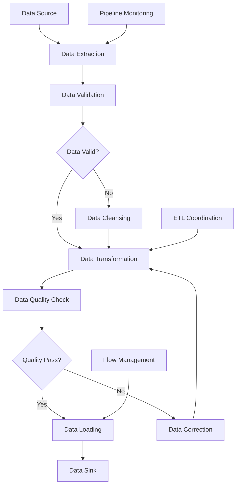

# **Data Orchestrator**

## **Overview**

The Data Orchestrator module provides comprehensive data orchestration capabilities, enabling management of data pipelines, ETL processes, data transformation, and data flow coordination across distributed data systems. It ensures reliable data processing, transformation, and delivery while maintaining data quality and consistency.

## **Core Principles**
- **Data Pipeline Management**: Manage complex data pipelines and ETL processes.
- **Data Transformation**: Coordinate data transformation and processing workflows.
- **Data Quality Assurance**: Ensure data quality and consistency throughout the pipeline.
- **Distributed Data Coordination**: Coordinate data operations across distributed systems.

## **Function Specifications**

### **Core Functions**
- **Data Pipeline Management**: Manage and orchestrate data pipelines.
- **ETL Process Coordination**: Coordinate ETL (Extract, Transform, Load) processes.
- **Data Transformation**: Manage data transformation and processing workflows.
- **Data Quality Management**: Ensure data quality and consistency.
- **Data Flow Coordination**: Coordinate data flow across distributed systems.
- **Data Monitoring**: Monitor data processing and pipeline performance.

### **TypeScript Interfaces**
```typescript
interface DataOrchestratorConfig {
  pipelineManagement: PipelineConfig;
  etlCoordination: ETLConfig;
  dataTransformation: TransformationConfig;
  qualityManagement: QualityConfig;
}

interface DataPipeline {
  id: string;
  name: string;
  stages: PipelineStage[];
  dataSources: DataSource[];
  dataSinks: DataSink[];
  schedule: Schedule;
  status: PipelineStatus;
}

interface PipelineStage {
  id: string;
  name: string;
  type: StageType;
  transformation: Transformation;
  dependencies: string[];
  validation: ValidationRule[];
}

interface DataTransformation {
  id: string;
  name: string;
  type: TransformationType;
  rules: TransformationRule[];
  validation: ValidationRule[];
  output: DataSchema;
}

function managePipeline(pipeline: DataPipeline): Promise<PipelineResult>
function coordinateETL(etlProcess: ETLProcess): Promise<ETLResult>
function transformData(transformation: DataTransformation): Promise<TransformationResult>
function assureQuality(dataId: string): Promise<QualityResult>
function coordinateFlow(flowId: string): Promise<FlowResult>
function monitorData(pipelineId: string): Promise<DataMetrics>
```

## **Integration Patterns**

### **Data Orchestration Flow**


## **Capabilities**
- **Data Pipeline Management**: Comprehensive management of complex data pipelines.
- **ETL Process Coordination**: Advanced ETL process coordination and optimization.
- **Data Transformation**: Sophisticated data transformation and processing capabilities.
- **Data Quality Management**: Comprehensive data quality assurance and monitoring.
- **Data Flow Coordination**: Intelligent coordination of data flow across distributed systems.
- **Real-Time Monitoring**: Real-time monitoring of data processing and pipeline performance.

## **Configuration Examples**
```yaml
data_orchestrator:
  pipeline_management:
    enabled: true
    pipeline_engine: "apache_airflow"
    pipeline_scheduling: "cron_based"
    pipeline_monitoring: true
    pipeline_retry:
      max_retries: 3
      retry_delay: "5m"
      exponential_backoff: true
    pipeline_dependencies:
      - dependency: "data_availability"
        check_interval: "1m"
      - dependency: "resource_availability"
        check_interval: "30s"
  etl_coordination:
    enabled: true
    etl_strategy: "batch_processing"
    etl_scheduling:
      - schedule: "hourly"
        cron_expression: "0 * * * *"
      - schedule: "daily"
        cron_expression: "0 0 * * *"
      - schedule: "real_time"
        trigger: "event_based"
    etl_optimization:
      - optimization: "parallel_processing"
        max_parallel_jobs: 10
      - optimization: "data_partitioning"
        partition_strategy: "hash_based"
      - optimization: "memory_optimization"
        memory_limit: "8GB"
  data_transformation:
    enabled: true
    transformation_engine: "spark"
    transformation_types:
      - type: "data_cleansing"
        rules:
          - rule: "remove_duplicates"
            enabled: true
          - rule: "handle_missing_values"
            strategy: "interpolation"
          - rule: "outlier_detection"
            method: "iqr"
      - type: "data_enrichment"
        sources:
          - source: "external_api"
            endpoint: "https://api.example.com"
          - source: "reference_data"
            location: "s3://reference-data/"
      - type: "data_aggregation"
        functions:
          - function: "sum"
            group_by: ["category", "date"]
          - function: "average"
            group_by: ["region", "product"]
    transformation_validation:
      - validation: "schema_validation"
        schema_file: "data_schema.json"
      - validation: "business_rules"
        rules_file: "business_rules.json"
  quality_management:
    enabled: true
    quality_metrics:
      - metric: "completeness"
        threshold: 0.95
        measurement: "percentage"
      - metric: "accuracy"
        threshold: 0.98
        measurement: "percentage"
      - metric: "consistency"
        threshold: 0.90
        measurement: "percentage"
      - metric: "timeliness"
        threshold: "5m"
        measurement: "time"
    quality_monitoring:
      - monitoring: "real_time"
        interval: "1m"
      - monitoring: "batch"
        interval: "1h"
    quality_actions:
      - action: "data_cleansing"
        trigger: "quality_threshold_below"
        threshold: 0.8
      - action: "alert_notification"
        trigger: "quality_threshold_below"
        threshold: 0.7
      - action: "pipeline_pause"
        trigger: "quality_threshold_below"
        threshold: 0.5
  data_flow:
    enabled: true
    flow_coordination:
      - coordination: "event_driven"
        event_source: "kafka"
        event_topic: "data_events"
      - coordination: "schedule_driven"
        schedule: "cron_based"
        cron_expression: "*/15 * * * *"
    flow_monitoring:
      - monitoring: "throughput"
        measurement: "records_per_second"
        alert_threshold: 1000
      - monitoring: "latency"
        measurement: "processing_time"
        alert_threshold: "30s"
      - monitoring: "error_rate"
        measurement: "percentage"
        alert_threshold: "5%"
  data_sources:
    - source: "database"
      type: "postgresql"
      connection: "postgresql://localhost:5432/database"
      tables: ["users", "orders", "products"]
    - source: "file_system"
      type: "s3"
      bucket: "data-lake"
      prefix: "raw-data/"
    - source: "api"
      type: "rest"
      endpoint: "https://api.example.com/data"
      authentication: "oauth2"
  data_sinks:
    - sink: "data_warehouse"
      type: "snowflake"
      connection: "snowflake://account.snowflakecomputing.com"
      database: "analytics"
    - sink: "data_lake"
      type: "s3"
      bucket: "processed-data"
      format: "parquet"
    - sink: "streaming"
      type: "kafka"
      topic: "processed_events"
      partition_strategy: "hash"
```

## **Performance Considerations**
- **Pipeline Execution**: < 5m for complex data pipeline execution
- **ETL Processing**: < 10m for large-scale ETL processing
- **Data Transformation**: < 2m for data transformation operations
- **Quality Checking**: < 30s for data quality validation
- **Flow Coordination**: < 100ms for data flow coordination

## **Security Considerations**
- **Data Security**: Secure data processing and prevent unauthorized access
- **Pipeline Security**: Secure pipeline execution and prevent data leakage
- **Transformation Security**: Secure data transformation and prevent data corruption
- **Quality Security**: Secure quality monitoring and prevent data tampering

## **Monitoring & Observability**
- **Pipeline Metrics**: Track pipeline execution and performance
- **ETL Metrics**: Monitor ETL processing and optimization
- **Transformation Metrics**: Track data transformation and processing
- **Quality Metrics**: Monitor data quality and consistency
- **Flow Metrics**: Track data flow coordination and performance

---

**Version**: 1.0  
**Module**: Data Orchestrator  
**Status**: ✅ **COMPLETE** - Comprehensive module specification ready for implementation  
**Focus**: Comprehensive data orchestration with ETL coordination and quality management. 