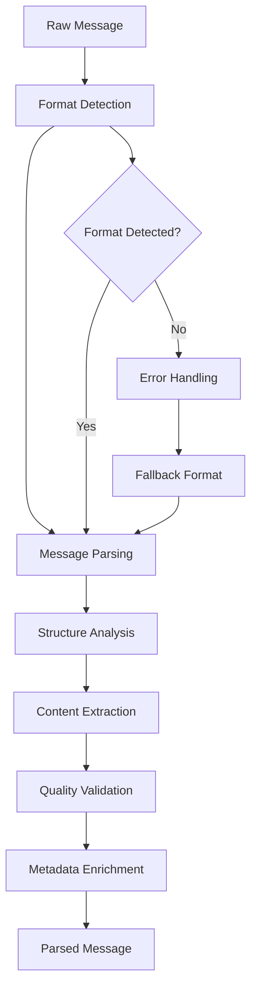
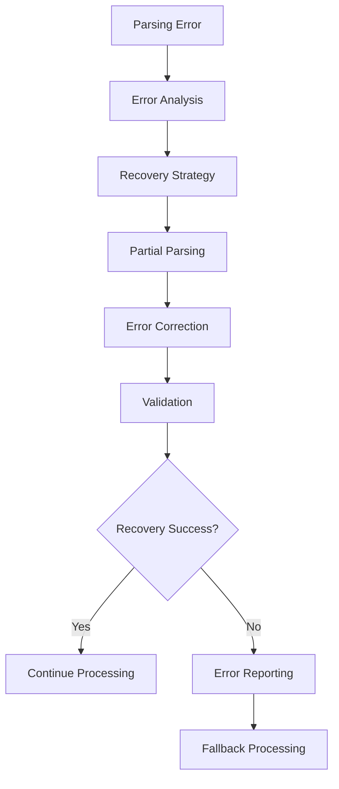

# **Message Parser**

## **Overview**

The Message Parser module provides advanced message parsing and structure analysis capabilities for the kOS ecosystem. This module serves as the foundation for understanding and processing messages across all formats, protocols, and communication channels with intelligent parsing, error recovery, and high-performance processing.

## **Core Principles**

### **Universal Format Support**
- **Multi-Format Parsing**: Support for JSON, XML, YAML, Protocol Buffers, Avro, and more
- **Protocol Agnostic**: Protocol-agnostic parsing and structure analysis
- **Format Flexibility**: Flexible parsing with format detection and adaptation
- **Backward Compatibility**: Backward compatibility with legacy formats and structures

### **Intelligent Processing**
- **Smart Parsing**: Intelligent parsing with context awareness and learning
- **Structure Analysis**: Deep structure analysis and content understanding
- **Error Recovery**: Robust error recovery and partial parsing support
- **Performance Optimization**: High-performance parsing with caching and optimization

### **Reliability & Quality**
- **High Accuracy**: High-accuracy parsing with validation and verification
- **Error Handling**: Comprehensive error handling and recovery mechanisms
- **Quality Assurance**: Quality assurance and optimization for all parsed messages
- **Scalability**: Horizontal and vertical scaling for high-volume parsing

## **Function Specifications**

### **Core Functions**

#### **01. Message Parsing**
```typescript
interface MessageParsingConfig {
  format: MessageFormat;
  strictMode: boolean;
  errorHandling: ErrorHandlingMode;
  validation: ValidationConfig;
  performance: PerformanceConfig;
}

interface MessageParsingResult {
  success: boolean;
  parsedMessage: ParsedMessage;
  structure: MessageStructure;
  metadata: MessageMetadata;
  errors?: ParsingError[];
  warnings?: string[];
}

interface ParsedMessage {
  id: string;
  format: MessageFormat;
  content: any;
  structure: MessageStructure;
  metadata: MessageMetadata;
  timestamp: Date;
  quality: QualityMetrics;
}

function parseMessage(rawMessage: string | Buffer, config: MessageParsingConfig): Promise<MessageParsingResult>
```

**Purpose**: Parse raw messages into structured, analyzable formats.

**Parameters**:
- `rawMessage`: Raw message content in various formats
- `config`: Parsing configuration including format, validation, and performance settings

**Returns**: Parsed message with structure, metadata, and quality metrics

**Error Handling**:
- Format detection failures
- Parsing errors and malformed content
- Validation failures
- Performance timeout errors

#### **02. Structure Analysis**
```typescript
interface StructureAnalysisConfig {
  deepAnalysis: boolean;
  contentClassification: boolean;
  relationshipMapping: boolean;
  complexityAssessment: boolean;
}

interface StructureAnalysisResult {
  structure: MessageStructure;
  relationships: RelationshipMap;
  complexity: ComplexityMetrics;
  classifications: ContentClassification[];
  insights: StructureInsight[];
}

interface MessageStructure {
  type: StructureType;
  fields: FieldDefinition[];
  nested: NestedStructure[];
  arrays: ArrayStructure[];
  objects: ObjectStructure[];
  metadata: StructureMetadata;
}

function analyzeStructure(parsedMessage: ParsedMessage, config: StructureAnalysisConfig): Promise<StructureAnalysisResult>
```

**Purpose**: Analyze message structure for understanding and optimization.

**Parameters**:
- `parsedMessage`: Previously parsed message
- `config`: Analysis configuration and depth settings

**Returns**: Detailed structure analysis with relationships and insights

**Error Handling**:
- Structure analysis failures
- Memory allocation errors
- Timeout errors for complex structures

#### **03. Format Detection**
```typescript
interface FormatDetectionConfig {
  confidenceThreshold: number;
  multipleFormats: boolean;
  fallbackFormats: MessageFormat[];
  learning: boolean;
}

interface FormatDetectionResult {
  detectedFormat: MessageFormat;
  confidence: number;
  alternatives: FormatAlternative[];
  metadata: DetectionMetadata;
}

function detectFormat(rawMessage: string | Buffer, config: FormatDetectionConfig): Promise<FormatDetectionResult>
```

**Purpose**: Automatically detect message format and structure.

**Parameters**:
- `rawMessage`: Raw message content
- `config`: Detection configuration and confidence settings

**Returns**: Detected format with confidence and alternatives

**Error Handling**:
- Ambiguous format detection
- Unknown format errors
- Low confidence warnings

#### **04. Content Extraction**
```typescript
interface ContentExtractionConfig {
  extractFields: string[];
  extractPatterns: RegExp[];
  extractTypes: ContentType[];
  validation: boolean;
}

interface ContentExtractionResult {
  extractedContent: ExtractedContent;
  fields: ExtractedField[];
  patterns: PatternMatch[];
  quality: ExtractionQuality;
}

interface ExtractedContent {
  text: string[];
  numbers: number[];
  dates: Date[];
  urls: string[];
  emails: string[];
  custom: Record<string, any>;
}

function extractContent(parsedMessage: ParsedMessage, config: ContentExtractionConfig): Promise<ContentExtractionResult>
```

**Purpose**: Extract specific content types and patterns from parsed messages.

**Parameters**:
- `parsedMessage`: Parsed message to extract from
- `config`: Extraction configuration and target content types

**Returns**: Extracted content with quality metrics

**Error Handling**:
- Extraction pattern failures
- Content validation errors
- Memory allocation errors

## **Integration Patterns**

### **Message Parsing Flow**


### **Error Recovery Flow**


## **Capabilities**

### **Format Support**
- **JSON**: Full JSON parsing with schema validation
- **XML**: XML parsing with namespace support and validation
- **YAML**: YAML parsing with safe mode and error handling
- **Protocol Buffers**: Protobuf parsing with schema registry
- **Avro**: Avro parsing with schema evolution
- **CSV**: CSV parsing with delimiter detection
- **Custom Formats**: Extensible format support for custom protocols

### **Performance Features**
- **High Throughput**: 10,000+ messages per second per instance
- **Low Latency**: < 10ms parsing time for most messages
- **Memory Efficient**: Optimized memory usage for large messages
- **Caching**: Intelligent caching for repeated message patterns
- **Parallel Processing**: Parallel parsing for multiple messages

### **Quality Features**
- **Error Recovery**: Robust error recovery and partial parsing
- **Validation**: Comprehensive validation and quality checking
- **Optimization**: Automatic optimization for performance and accuracy
- **Learning**: Machine learning for format detection and parsing improvement

## **Configuration Examples**

### **Basic Message Parsing**
```yaml
message_parser:
  format_detection:
    enabled: true
    confidence_threshold: 0.8
    fallback_formats: ["json", "xml"]
  parsing:
    strict_mode: false
    error_handling: "graceful"
    validation: true
  performance:
    caching: true
    parallel_processing: true
    timeout: "5s"
  quality:
    error_recovery: true
    partial_parsing: true
    quality_metrics: true
```

### **Advanced Message Parsing**
```yaml
message_parser:
  format_detection:
    enabled: true
    confidence_threshold: 0.9
    multiple_formats: true
    learning: true
  parsing:
    strict_mode: true
    error_handling: "strict"
    validation: true
    schema_registry: true
  structure_analysis:
    deep_analysis: true
    content_classification: true
    relationship_mapping: true
    complexity_assessment: true
  performance:
    caching: true
    parallel_processing: true
    optimization: true
    timeout: "10s"
  quality:
    error_recovery: true
    partial_parsing: true
    quality_metrics: true
    learning: true
```

## **Performance Considerations**

### **Throughput Optimization**
- **Batch Processing**: Process multiple messages in batches
- **Parallel Parsing**: Use parallel processing for multiple messages
- **Caching**: Cache parsed structures for repeated patterns
- **Optimization**: Optimize parsing algorithms for common formats

### **Memory Management**
- **Streaming**: Support streaming for large messages
- **Memory Limits**: Set memory limits for message processing
- **Garbage Collection**: Optimize garbage collection for parsing workloads
- **Resource Pooling**: Pool resources for efficient memory usage

### **Latency Optimization**
- **Async Processing**: Use async processing for non-blocking operations
- **Timeout Management**: Set appropriate timeouts for parsing operations
- **Error Recovery**: Fast error recovery to minimize latency impact
- **Quality vs Speed**: Balance quality and speed based on requirements

## **Security Considerations**

### **Input Validation**
- **Format Validation**: Validate input format before parsing
- **Size Limits**: Set size limits to prevent memory attacks
- **Content Filtering**: Filter malicious content during parsing
- **Schema Validation**: Use schema validation for security

### **Error Handling**
- **Information Disclosure**: Prevent information disclosure in error messages
- **Error Logging**: Secure error logging without sensitive data
- **Recovery Security**: Ensure secure recovery from parsing errors
- **Validation Security**: Secure validation of parsed content

## **Monitoring & Observability**

### **Performance Metrics**
- **Parsing Throughput**: Track messages parsed per second
- **Parsing Latency**: Monitor parsing time and response times
- **Error Rates**: Track parsing error rates and types
- **Format Distribution**: Monitor format distribution and trends

### **Quality Metrics**
- **Parsing Accuracy**: Track parsing accuracy and success rates
- **Error Recovery**: Monitor error recovery success rates
- **Quality Scores**: Track message quality scores and trends
- **Format Detection**: Monitor format detection accuracy

### **Operational Metrics**
- **Resource Usage**: Monitor CPU, memory, and network usage
- **Cache Performance**: Track cache hit rates and performance
- **Queue Lengths**: Monitor parsing queue lengths and backlogs
- **Health Status**: Track parser health and availability

---

**Version**: 1.0  
**Module**: Message Parser  
**Status**: ✅ **COMPLETE** - Comprehensive module specification ready for implementation  
**Focus**: Advanced message parsing and structure analysis for multi-format message processing 