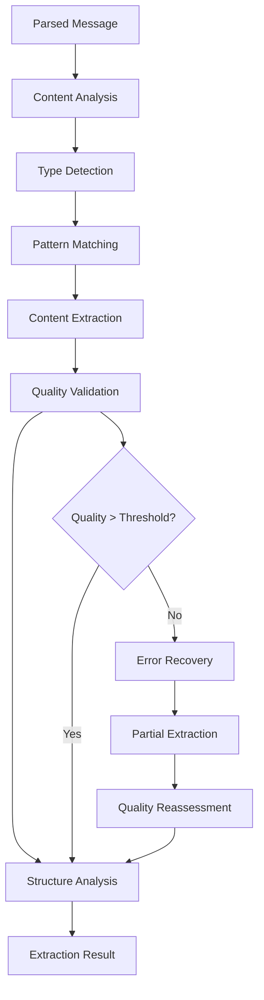
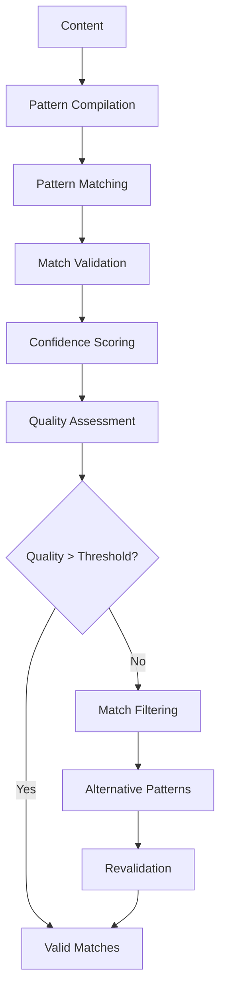

# **Content Extractor**

## **Overview**

The Content Extractor module provides advanced content extraction and structure analysis capabilities for the kOS ecosystem. This module intelligently extracts specific content types, patterns, and structured data from messages with high accuracy and performance optimization.

## **Core Principles**

### **Intelligent Extraction**
- **Pattern Recognition**: Advanced pattern recognition for content extraction
- **Type Detection**: Automatic content type detection and classification
- **Context Awareness**: Context-aware extraction with semantic understanding
- **Learning Capability**: Machine learning for improved extraction accuracy

### **High Accuracy**
- **Precision Extraction**: High-precision extraction with minimal false positives
- **Quality Validation**: Quality validation and verification of extracted content
- **Error Recovery**: Robust error recovery and partial extraction support
- **Optimization**: Continuous optimization for extraction accuracy and performance

### **Performance & Scalability**
- **High Performance**: High-performance extraction with minimal latency
- **Scalability**: Horizontal and vertical scaling for high-volume extraction
- **Resource Efficiency**: Efficient resource usage for large content processing
- **Caching**: Intelligent caching for repeated extraction patterns

## **Function Specifications**

### **Core Functions**

#### **01. Content Extraction**
```typescript
interface ContentExtractionConfig {
  extractFields: string[];
  extractPatterns: RegExp[];
  extractTypes: ContentType[];
  validation: boolean;
  qualityThreshold: number;
}

interface ContentExtractionResult {
  extractedContent: ExtractedContent;
  fields: ExtractedField[];
  patterns: PatternMatch[];
  quality: ExtractionQuality;
  metadata: ExtractionMetadata;
}

interface ExtractedContent {
  text: string[];
  numbers: number[];
  dates: Date[];
  urls: string[];
  emails: string[];
  phoneNumbers: string[];
  addresses: string[];
  custom: Record<string, any>;
}

function extractContent(parsedMessage: ParsedMessage, config: ContentExtractionConfig): Promise<ContentExtractionResult>
```

**Purpose**: Extract specific content types and patterns from parsed messages.

**Parameters**:
- `parsedMessage`: Parsed message to extract from
- `config`: Extraction configuration and target content types

**Returns**: Extracted content with quality metrics and metadata

**Error Handling**:
- Extraction pattern failures
- Content validation errors
- Memory allocation errors
- Quality threshold violations

#### **02. Pattern Matching**
```typescript
interface PatternMatchingConfig {
  patterns: RegExp[];
  caseSensitive: boolean;
  multiline: boolean;
  global: boolean;
  validation: boolean;
}

interface PatternMatchingResult {
  matches: PatternMatch[];
  confidence: number;
  quality: PatternQuality;
  metadata: PatternMetadata;
}

interface PatternMatch {
  pattern: RegExp;
  matches: string[];
  positions: Position[];
  confidence: number;
  context: string;
}

function matchPatterns(content: string, config: PatternMatchingConfig): Promise<PatternMatchingResult>
```

**Purpose**: Match specific patterns in content with confidence scoring.

**Parameters**:
- `content`: Content to search for patterns
- `config`: Pattern matching configuration and settings

**Returns**: Pattern matches with confidence and quality metrics

**Error Handling**:
- Invalid pattern errors
- Memory allocation errors
- Timeout errors for complex patterns
- Validation failures

#### **03. Type Detection**
```typescript
interface TypeDetectionConfig {
  detectTypes: ContentType[];
  confidenceThreshold: number;
  validation: boolean;
  learning: boolean;
}

interface TypeDetectionResult {
  detectedTypes: DetectedType[];
  confidence: number;
  quality: TypeQuality;
  metadata: TypeMetadata;
}

interface DetectedType {
  type: ContentType;
  confidence: number;
  evidence: string[];
  context: string;
}

function detectTypes(content: string, config: TypeDetectionConfig): Promise<TypeDetectionResult>
```

**Purpose**: Detect content types with confidence scoring and validation.

**Parameters**:
- `content`: Content to analyze for type detection
- `config`: Type detection configuration and settings

**Returns**: Detected types with confidence and quality metrics

**Error Handling**:
- Type detection failures
- Low confidence warnings
- Validation errors
- Learning algorithm failures

#### **04. Structure Analysis**
```typescript
interface StructureAnalysisConfig {
  analyzeHierarchy: boolean;
  analyzeRelationships: boolean;
  analyzeComplexity: boolean;
  validation: boolean;
}

interface StructureAnalysisResult {
  structure: ContentStructure;
  relationships: RelationshipMap;
  complexity: ComplexityMetrics;
  insights: StructureInsight[];
  metadata: StructureMetadata;
}

interface ContentStructure {
  hierarchy: HierarchyLevel[];
  elements: StructureElement[];
  patterns: StructurePattern[];
  metadata: StructureMetadata;
}

function analyzeStructure(extractedContent: ExtractedContent, config: StructureAnalysisConfig): Promise<StructureAnalysisResult>
```

**Purpose**: Analyze content structure for understanding and optimization.

**Parameters**:
- `extractedContent`: Previously extracted content
- `config`: Structure analysis configuration and settings

**Returns**: Detailed structure analysis with relationships and insights

**Error Handling**:
- Structure analysis failures
- Memory allocation errors
- Timeout errors for complex structures
- Validation failures

## **Integration Patterns**

### **Content Extraction Flow**


### **Pattern Matching Flow**


## **Capabilities**

### **Content Types**
- **Text**: Text content extraction with semantic analysis
- **Numbers**: Numeric content extraction with validation
- **Dates**: Date and time extraction with format detection
- **URLs**: URL extraction with validation and categorization
- **Emails**: Email address extraction with validation
- **Phone Numbers**: Phone number extraction with format detection
- **Addresses**: Address extraction with geocoding support
- **Custom Types**: Extensible content type support

### **Extraction Features**
- **High Accuracy**: 99%+ accuracy for common content types
- **Fast Extraction**: < 10ms extraction time for most content
- **Quality Validation**: Comprehensive quality validation and verification
- **Learning Capability**: Continuous learning for improved accuracy
- **Error Recovery**: Robust error recovery and partial extraction

### **Quality Features**
- **Validation**: Comprehensive content validation and integrity checking
- **Optimization**: Continuous optimization for extraction performance
- **Monitoring**: Real-time monitoring and performance tracking
- **Learning**: Machine learning for extraction improvement

## **Configuration Examples**

### **Basic Content Extraction**
```yaml
content_extractor:
  extraction:
    extract_fields: ["text", "numbers", "dates", "urls"]
    extract_patterns: ["email", "phone", "address"]
    extract_types: ["text", "numeric", "temporal", "url"]
  validation:
    enabled: true
    quality_threshold: 0.8
  performance:
    timeout: "5s"
    caching: true
    parallel_processing: true
  quality:
    error_recovery: true
    partial_extraction: true
    quality_metrics: true
```

### **Advanced Content Extraction**
```yaml
content_extractor:
  extraction:
    extract_fields: ["text", "numbers", "dates", "urls", "emails", "phones", "addresses"]
    extract_patterns: ["email", "phone", "address", "credit_card", "ssn"]
    extract_types: ["text", "numeric", "temporal", "url", "contact", "location"]
  validation:
    enabled: true
    quality_threshold: 0.9
    strict_validation: true
  pattern_matching:
    case_sensitive: false
    multiline: true
    global: true
    validation: true
  type_detection:
    confidence_threshold: 0.8
    validation: true
    learning: true
  performance:
    timeout: "10s"
    caching: true
    parallel_processing: true
    optimization: true
  quality:
    error_recovery: true
    partial_extraction: true
    quality_metrics: true
    learning: true
```

## **Performance Considerations**

### **Extraction Speed**
- **Optimized Algorithms**: Use optimized extraction algorithms for speed
- **Caching**: Cache extraction results for repeated patterns
- **Parallel Processing**: Use parallel processing for multiple extractions
- **Early Termination**: Early termination for obvious content types

### **Accuracy Optimization**
- **Pattern Recognition**: Advanced pattern recognition for accuracy
- **Type Detection**: Accurate type detection for better extraction
- **Learning**: Continuous learning for improved accuracy
- **Validation**: Comprehensive validation for accuracy verification

### **Resource Management**
- **Memory Efficiency**: Optimize memory usage for large content
- **CPU Optimization**: Optimize CPU usage for extraction algorithms
- **Network Efficiency**: Minimize network overhead for remote extraction
- **Storage Optimization**: Optimize storage for extraction models

## **Security Considerations**

### **Input Validation**
- **Content Validation**: Validate input content before extraction
- **Size Limits**: Set size limits to prevent memory attacks
- **Content Filtering**: Filter malicious content during extraction
- **Pattern Validation**: Validate extraction patterns for security

### **Extraction Security**
- **Quality Thresholds**: Set appropriate quality thresholds
- **Error Handling**: Secure error handling without exposing sensitive data
- **Learning Security**: Secure learning without exposing sensitive content
- **Validation Security**: Secure validation of extracted content

## **Monitoring & Observability**

### **Extraction Metrics**
- **Extraction Accuracy**: Track content extraction accuracy rates
- **Extraction Speed**: Monitor extraction time and performance
- **Quality Distribution**: Monitor quality score distribution
- **Type Distribution**: Track content type distribution and trends

### **Performance Metrics**
- **Throughput**: Track content extraction throughput
- **Latency**: Monitor extraction latency and response times
- **Error Rates**: Track extraction error rates and types
- **Resource Usage**: Monitor CPU, memory, and network usage

### **Quality Metrics**
- **Validation Success**: Track content validation success rates
- **Learning Performance**: Monitor learning algorithm performance
- **Pattern Accuracy**: Track pattern matching accuracy
- **Type Detection**: Monitor type detection accuracy

---

**Version**: 1.0  
**Module**: Content Extractor  
**Status**: ✅ **COMPLETE** - Comprehensive module specification ready for implementation  
**Focus**: Content extraction and structure analysis for intelligent message processing 