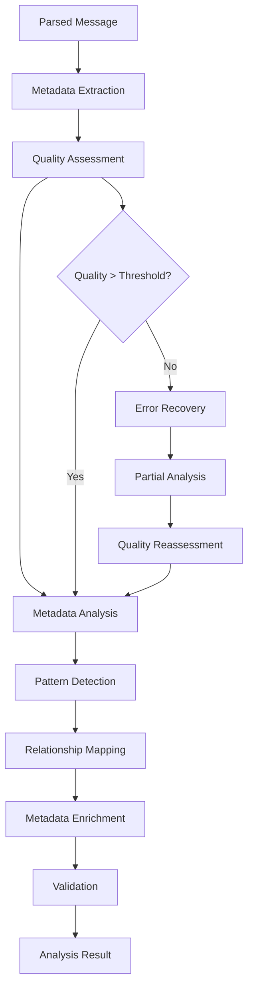
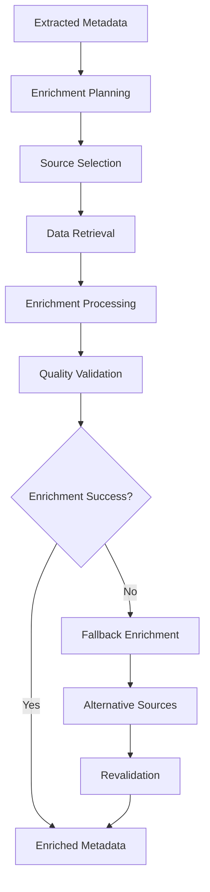

# **Metadata Analyzer**

## **Overview**

The Metadata Analyzer module provides comprehensive message metadata analysis and enrichment capabilities for the kOS ecosystem. This module extracts, analyzes, and enriches message metadata to provide context, improve processing accuracy, and enable intelligent message handling.

## **Core Principles**

### **Comprehensive Analysis**
- **Multi-Source Metadata**: Extract metadata from multiple sources and formats
- **Context Enrichment**: Enrich metadata with contextual information
- **Quality Assessment**: Assess metadata quality and completeness
- **Intelligent Inference**: Infer missing metadata from available information

### **High Accuracy**
- **Precision Analysis**: High-precision metadata analysis with validation
- **Error Recovery**: Robust error recovery for incomplete metadata
- **Quality Validation**: Quality validation and verification of metadata
- **Optimization**: Continuous optimization for analysis accuracy

### **Performance & Scalability**
- **High Performance**: High-performance analysis with minimal latency
- **Scalability**: Horizontal and vertical scaling for high-volume analysis
- **Resource Efficiency**: Efficient resource usage for large metadata processing
- **Caching**: Intelligent caching for repeated analysis patterns

## **Function Specifications**

### **Core Functions**

#### **01. Metadata Extraction**
```typescript
interface MetadataExtractionConfig {
  extractSources: MetadataSource[];
  extractTypes: MetadataType[];
  validation: boolean;
  enrichment: boolean;
}

interface MetadataExtractionResult {
  extractedMetadata: ExtractedMetadata;
  quality: MetadataQuality;
  enrichment: MetadataEnrichment;
  validation: ValidationResult;
}

interface ExtractedMetadata {
  headers: Record<string, string>;
  timestamps: TimestampMetadata;
  source: SourceMetadata;
  format: FormatMetadata;
  content: ContentMetadata;
  custom: Record<string, any>;
}

function extractMetadata(message: ParsedMessage, config: MetadataExtractionConfig): Promise<MetadataExtractionResult>
```

**Purpose**: Extract metadata from messages with quality assessment.

**Parameters**:
- `message`: Parsed message to extract metadata from
- `config`: Extraction configuration and target metadata types

**Returns**: Extracted metadata with quality metrics and enrichment

**Error Handling**:
- Metadata extraction failures
- Quality validation errors
- Enrichment failures
- Validation errors

#### **02. Metadata Analysis**
```typescript
interface MetadataAnalysisConfig {
  analyzePatterns: boolean;
  analyzeRelationships: boolean;
  analyzeQuality: boolean;
  learning: boolean;
}

interface MetadataAnalysisResult {
  analysis: MetadataAnalysis;
  patterns: MetadataPattern[];
  relationships: MetadataRelationship[];
  quality: QualityMetrics;
  insights: AnalysisInsight[];
}

function analyzeMetadata(extractedMetadata: ExtractedMetadata, config: MetadataAnalysisConfig): Promise<MetadataAnalysisResult>
```

**Purpose**: Analyze metadata for patterns, relationships, and insights.

**Parameters**:
- `extractedMetadata`: Previously extracted metadata
- `config`: Analysis configuration and settings

**Returns**: Detailed metadata analysis with patterns and insights

**Error Handling**:
- Analysis algorithm failures
- Pattern detection errors
- Relationship mapping errors
- Learning failures

#### **03. Metadata Enrichment**
```typescript
interface MetadataEnrichmentConfig {
  enrichSources: EnrichmentSource[];
  enrichTypes: EnrichmentType[];
  validation: boolean;
  qualityThreshold: number;
}

interface MetadataEnrichmentResult {
  enrichedMetadata: EnrichedMetadata;
  enrichment: EnrichmentData;
  quality: EnrichmentQuality;
  validation: ValidationResult;
}

function enrichMetadata(extractedMetadata: ExtractedMetadata, config: MetadataEnrichmentConfig): Promise<MetadataEnrichmentResult>
```

**Purpose**: Enrich metadata with additional context and information.

**Parameters**:
- `extractedMetadata`: Previously extracted metadata
- `config`: Enrichment configuration and sources

**Returns**: Enriched metadata with quality metrics and validation

**Error Handling**:
- Enrichment source failures
- Quality threshold violations
- Validation errors
- External service errors

#### **04. Metadata Validation**
```typescript
interface MetadataValidationConfig {
  validateCompleteness: boolean;
  validateConsistency: boolean;
  validateAccuracy: boolean;
  strictMode: boolean;
}

interface MetadataValidationResult {
  isValid: boolean;
  completeness: CompletenessMetrics;
  consistency: ConsistencyMetrics;
  accuracy: AccuracyMetrics;
  issues: ValidationIssue[];
}

function validateMetadata(enrichedMetadata: EnrichedMetadata, config: MetadataValidationConfig): Promise<MetadataValidationResult>
```

**Purpose**: Validate metadata completeness, consistency, and accuracy.

**Parameters**:
- `enrichedMetadata`: Enriched metadata to validate
- `config`: Validation configuration and settings

**Returns**: Validation result with detailed metrics and issues

**Error Handling**:
- Validation algorithm failures
- Consistency check errors
- Accuracy assessment errors
- Completeness analysis failures

## **Integration Patterns**

### **Metadata Analysis Flow**


### **Metadata Enrichment Flow**


## **Capabilities**

### **Metadata Types**
- **Headers**: Message headers and protocol metadata
- **Timestamps**: Temporal metadata and timing information
- **Source**: Source identification and routing metadata
- **Format**: Format and structure metadata
- **Content**: Content-related metadata and attributes
- **Custom**: Extensible custom metadata support

### **Analysis Features**
- **Pattern Recognition**: Advanced pattern recognition in metadata
- **Relationship Mapping**: Map relationships between metadata elements
- **Quality Assessment**: Comprehensive quality assessment and scoring
- **Intelligent Inference**: Infer missing metadata from available information
- **Learning Capability**: Machine learning for improved analysis

### **Enrichment Features**
- **Multi-Source Enrichment**: Enrich from multiple external sources
- **Context Enrichment**: Add contextual information and relationships
- **Quality Validation**: Validate enrichment quality and accuracy
- **Fallback Support**: Graceful fallback for enrichment failures

## **Configuration Examples**

### **Basic Metadata Analysis**
```yaml
metadata_analyzer:
  extraction:
    extract_sources: ["headers", "timestamps", "source", "format"]
    extract_types: ["basic", "temporal", "routing", "structural"]
    validation: true
    enrichment: false
  analysis:
    analyze_patterns: true
    analyze_relationships: true
    analyze_quality: true
    learning: false
  performance:
    timeout: "5s"
    caching: true
    parallel_processing: true
  quality:
    error_recovery: true
    partial_analysis: true
    quality_metrics: true
```

### **Advanced Metadata Analysis**
```yaml
metadata_analyzer:
  extraction:
    extract_sources: ["headers", "timestamps", "source", "format", "content", "custom"]
    extract_types: ["basic", "temporal", "routing", "structural", "semantic", "custom"]
    validation: true
    enrichment: true
  analysis:
    analyze_patterns: true
    analyze_relationships: true
    analyze_quality: true
    learning: true
  enrichment:
    enrich_sources: ["external_apis", "databases", "knowledge_bases"]
    enrich_types: ["context", "relationships", "semantics", "quality"]
    validation: true
    quality_threshold: 0.8
  validation:
    validate_completeness: true
    validate_consistency: true
    validate_accuracy: true
    strict_mode: false
  performance:
    timeout: "10s"
    caching: true
    parallel_processing: true
    optimization: true
  quality:
    error_recovery: true
    partial_analysis: true
    quality_metrics: true
    learning: true
```

## **Performance Considerations**

### **Analysis Speed**
- **Optimized Algorithms**: Use optimized analysis algorithms for speed
- **Caching**: Cache analysis results for repeated patterns
- **Parallel Processing**: Use parallel processing for multiple analyses
- **Early Termination**: Early termination for obvious patterns

### **Accuracy Optimization**
- **Pattern Recognition**: Advanced pattern recognition for accuracy
- **Quality Assessment**: Accurate quality assessment for better analysis
- **Learning**: Continuous learning for improved accuracy
- **Validation**: Comprehensive validation for accuracy verification

### **Resource Management**
- **Memory Efficiency**: Optimize memory usage for large metadata
- **CPU Optimization**: Optimize CPU usage for analysis algorithms
- **Network Efficiency**: Minimize network overhead for external enrichment
- **Storage Optimization**: Optimize storage for analysis models

## **Security Considerations**

### **Input Validation**
- **Metadata Validation**: Validate input metadata before analysis
- **Size Limits**: Set size limits to prevent memory attacks
- **Content Filtering**: Filter malicious content during analysis
- **Source Validation**: Validate enrichment sources for security

### **Analysis Security**
- **Quality Thresholds**: Set appropriate quality thresholds
- **Error Handling**: Secure error handling without exposing sensitive data
- **Learning Security**: Secure learning without exposing sensitive metadata
- **Validation Security**: Secure validation of analyzed metadata

## **Monitoring & Observability**

### **Analysis Metrics**
- **Analysis Accuracy**: Track metadata analysis accuracy rates
- **Analysis Speed**: Monitor analysis time and performance
- **Quality Distribution**: Monitor quality score distribution
- **Pattern Distribution**: Track pattern distribution and trends

### **Performance Metrics**
- **Throughput**: Track metadata analysis throughput
- **Latency**: Monitor analysis latency and response times
- **Error Rates**: Track analysis error rates and types
- **Resource Usage**: Monitor CPU, memory, and network usage

### **Quality Metrics**
- **Validation Success**: Track metadata validation success rates
- **Learning Performance**: Monitor learning algorithm performance
- **Enrichment Quality**: Track enrichment quality and accuracy
- **Pattern Accuracy**: Monitor pattern detection accuracy

---

**Version**: 1.0  
**Module**: Metadata Analyzer  
**Status**: ✅ **COMPLETE** - Comprehensive module specification ready for implementation  
**Focus**: Message metadata analysis and enrichment for intelligent message processing 