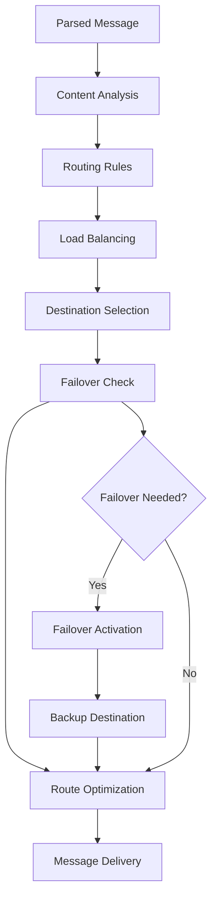
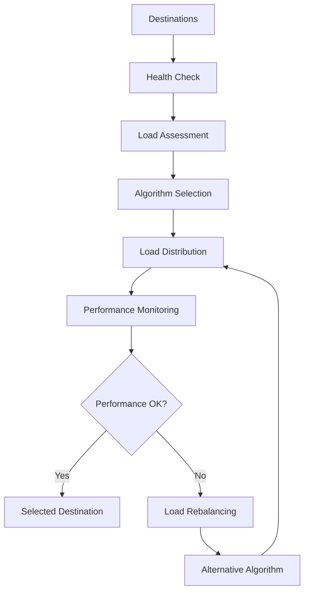

# **Message Router**

## **Overview**

The Message Router module provides intelligent message routing and distribution capabilities for the kOS ecosystem. This module routes messages to appropriate destinations based on content analysis, routing rules, load balancing, and intelligent decision-making.

## **Core Principles**

### **Intelligent Routing**
- **Content-Aware Routing**: Route based on message content and context
- **Rule-Based Routing**: Flexible rule-based routing with priority management
- **Load Balancing**: Intelligent load balancing across multiple destinations
- **Failover Support**: Automatic failover and redundancy management

### **High Performance**
- **Fast Routing**: High-speed routing with minimal latency
- **Scalability**: Horizontal and vertical scaling for high-volume routing
- **Resource Efficiency**: Efficient resource usage for routing operations
- **Optimization**: Continuous optimization for routing performance

### **Reliability & Quality**
- **Reliable Delivery**: Reliable message delivery with error handling
- **Quality Assurance**: Quality assurance and validation for routing decisions
- **Monitoring**: Real-time monitoring and performance tracking
- **Learning**: Machine learning for improved routing decisions

## **Function Specifications**

### **Core Functions**

#### **01. Message Routing**
```typescript
interface MessageRoutingConfig {
  routingRules: RoutingRule[];
  loadBalancing: LoadBalancingConfig;
  failover: FailoverConfig;
  validation: boolean;
}

interface MessageRoutingResult {
  route: Route;
  destination: Destination;
  loadBalancing: LoadBalancingResult;
  failover: FailoverResult;
  quality: RoutingQuality;
}

function routeMessage(message: ParsedMessage, config: MessageRoutingConfig): Promise<MessageRoutingResult>
```

**Purpose**: Route messages to appropriate destinations with load balancing and failover.

**Parameters**:
- `message`: Parsed message to route
- `config`: Routing configuration and rules

**Returns**: Routing result with destination and quality metrics

**Error Handling**:
- Routing rule failures
- Load balancing errors
- Failover failures
- Validation errors

#### **02. Load Balancing**
```typescript
interface LoadBalancingConfig {
  algorithm: LoadBalancingAlgorithm;
  healthChecking: boolean;
  dynamicAdjustment: boolean;
  failover: boolean;
}

interface LoadBalancingResult {
  selectedDestination: Destination;
  loadDistribution: LoadDistribution;
  healthStatus: HealthStatus;
  performance: PerformanceMetrics;
}

function balanceLoad(destinations: Destination[], config: LoadBalancingConfig): Promise<LoadBalancingResult>
```

**Purpose**: Balance load across multiple destinations with health monitoring.

**Parameters**:
- `destinations`: Available destinations for load balancing
- `config`: Load balancing configuration and algorithm

**Returns**: Load balancing result with selected destination and metrics

**Error Handling**:
- Load balancing algorithm failures
- Health check errors
- Performance degradation
- Destination failures

#### **03. Failover Management**
```typescript
interface FailoverConfig {
  automatic: boolean;
  redundancy: boolean;
  recoveryTime: number;
  healthMonitoring: boolean;
}

interface FailoverResult {
  primaryDestination: Destination;
  backupDestinations: Destination[];
  failoverStatus: FailoverStatus;
  recoveryMetrics: RecoveryMetrics;
}

function manageFailover(destinations: Destination[], config: FailoverConfig): Promise<FailoverResult>
```

**Purpose**: Manage failover and redundancy for reliable message delivery.

**Parameters**:
- `destinations`: Primary and backup destinations
- `config`: Failover configuration and settings

**Returns**: Failover result with status and recovery metrics

**Error Handling**:
- Failover trigger failures
- Recovery failures
- Health monitoring errors
- Redundancy issues

#### **04. Route Optimization**
```typescript
interface RouteOptimizationConfig {
  optimizePerformance: boolean;
  optimizeCost: boolean;
  optimizeQuality: boolean;
  learning: boolean;
}

interface RouteOptimizationResult {
  optimizedRoute: Route;
  optimizationMetrics: OptimizationMetrics;
  recommendations: OptimizationRecommendation[];
  learning: LearningResult;
}

function optimizeRoute(route: Route, config: RouteOptimizationConfig): Promise<RouteOptimizationResult>
```

**Purpose**: Optimize routes for performance, cost, and quality.

**Parameters**:
- `route`: Current route to optimize
- `config`: Optimization configuration and objectives

**Returns**: Optimized route with metrics and recommendations

**Error Handling**:
- Optimization algorithm failures
- Performance degradation
- Cost calculation errors
- Learning failures

## **Integration Patterns**

### **Message Routing Flow**


### **Load Balancing Flow**


## **Capabilities**

### **Routing Features**
- **Content-Aware Routing**: Route based on message content and context
- **Rule-Based Routing**: Flexible rule-based routing with priority management
- **Dynamic Routing**: Dynamic routing based on real-time conditions
- **Multi-Destination Routing**: Route to multiple destinations simultaneously
- **Priority Routing**: Priority-based routing for urgent messages

### **Load Balancing Features**
- **Round Robin**: Simple round-robin load balancing
- **Weighted Round Robin**: Weighted round-robin with priority
- **Least Connections**: Route to destination with least connections
- **Response Time**: Route based on response time
- **Health-Based**: Route based on destination health

### **Failover Features**
- **Automatic Failover**: Automatic failover on destination failure
- **Redundancy**: Multiple backup destinations for reliability
- **Health Monitoring**: Continuous health monitoring of destinations
- **Recovery Management**: Automatic recovery and restoration
- **Performance Tracking**: Track failover performance and metrics

## **Configuration Examples**

### **Basic Message Routing**
```yaml
message_router:
  routing:
    routing_rules: ["content_based", "priority_based", "destination_based"]
    load_balancing: "round_robin"
    failover: "automatic"
    validation: true
  load_balancing:
    algorithm: "round_robin"
    health_checking: true
    dynamic_adjustment: false
    failover: true
  performance:
    timeout: "5s"
    caching: true
    parallel_processing: true
  quality:
    error_recovery: true
    failover_support: true
    quality_metrics: true
```

### **Advanced Message Routing**
```yaml
message_router:
  routing:
    routing_rules: ["content_based", "priority_based", "destination_based", "custom_rules"]
    load_balancing: "weighted_least_connections"
    failover: "automatic"
    validation: true
    optimization: true
  load_balancing:
    algorithm: "weighted_least_connections"
    health_checking: true
    dynamic_adjustment: true
    failover: true
    performance_monitoring: true
  failover:
    automatic: true
    redundancy: true
    recovery_time: "30s"
    health_monitoring: true
    performance_tracking: true
  optimization:
    optimize_performance: true
    optimize_cost: true
    optimize_quality: true
    learning: true
  performance:
    timeout: "10s"
    caching: true
    parallel_processing: true
    optimization: true
  quality:
    error_recovery: true
    failover_support: true
    quality_metrics: true
    learning: true
```

## **Performance Considerations**

### **Routing Speed**
- **Optimized Algorithms**: Use optimized routing algorithms for speed
- **Caching**: Cache routing decisions for repeated patterns
- **Parallel Processing**: Use parallel processing for multiple routes
- **Early Termination**: Early termination for obvious routes

### **Load Balancing Optimization**
- **Health Monitoring**: Continuous health monitoring for optimal distribution
- **Performance Tracking**: Track performance for load balancing decisions
- **Dynamic Adjustment**: Dynamic adjustment based on real-time conditions
- **Algorithm Selection**: Select optimal algorithm based on conditions

### **Resource Management**
- **Memory Efficiency**: Optimize memory usage for routing operations
- **CPU Optimization**: Optimize CPU usage for routing algorithms
- **Network Efficiency**: Minimize network overhead for routing decisions
- **Storage Optimization**: Optimize storage for routing models

## **Security Considerations**

### **Routing Security**
- **Route Validation**: Validate routes for security and compliance
- **Destination Security**: Ensure destination security and authentication
- **Failover Security**: Secure failover without exposing sensitive data
- **Load Balancing Security**: Secure load balancing decisions

### **Access Control**
- **Route Access Control**: Control access to routing decisions
- **Destination Access**: Control access to destinations
- **Failover Access**: Control access to failover mechanisms
- **Monitoring Access**: Control access to routing monitoring

## **Monitoring & Observability**

### **Routing Metrics**
- **Routing Accuracy**: Track routing accuracy and success rates
- **Routing Speed**: Monitor routing time and performance
- **Load Distribution**: Monitor load distribution across destinations
- **Failover Usage**: Track failover usage and performance

### **Performance Metrics**
- **Throughput**: Track message routing throughput
- **Latency**: Monitor routing latency and response times
- **Error Rates**: Track routing error rates and types
- **Resource Usage**: Monitor CPU, memory, and network usage

### **Quality Metrics**
- **Delivery Success**: Track message delivery success rates
- **Failover Performance**: Monitor failover performance and recovery
- **Load Balancing Quality**: Track load balancing quality and distribution
- **Route Optimization**: Monitor route optimization effectiveness

---

**Version**: 1.0  
**Module**: Message Router  
**Status**: ✅ **COMPLETE** - Comprehensive module specification ready for implementation  
**Focus**: Intelligent message routing and distribution for multi-channel communication 