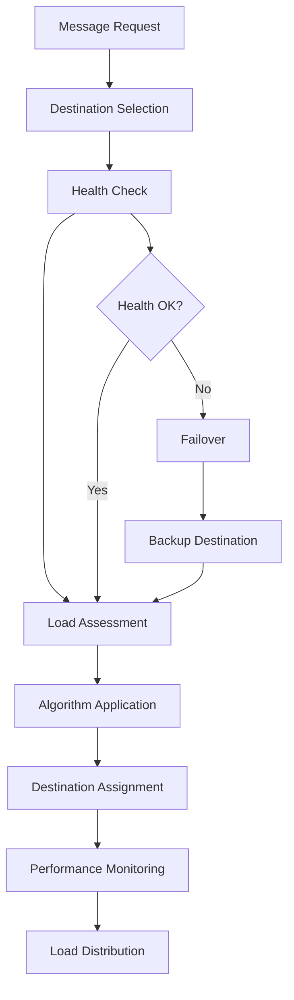
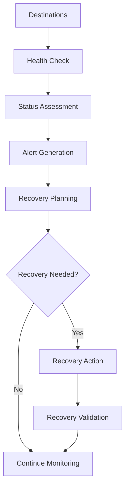

# **Load Balancer**

## **Overview**

The Load Balancer module provides intelligent message load balancing and distribution capabilities for the kOS ecosystem. This module distributes message load across multiple destinations to optimize performance, ensure reliability, and maintain system health.

## **Core Principles**

### **Intelligent Distribution**
- **Multi-Algorithm Support**: Support for various load balancing algorithms
- **Health Monitoring**: Continuous health monitoring of destinations
- **Dynamic Adjustment**: Dynamic load adjustment based on real-time conditions
- **Performance Optimization**: Optimize performance through intelligent distribution

### **High Availability**
- **Failover Support**: Automatic failover on destination failure
- **Redundancy**: Multiple destination support for reliability
- **Health Checking**: Continuous health checking and monitoring
- **Recovery Management**: Automatic recovery and restoration

### **Performance & Scalability**
- **High Performance**: High-performance load balancing with minimal overhead
- **Scalability**: Horizontal and vertical scaling for high-volume load balancing
- **Resource Efficiency**: Efficient resource usage for load balancing operations
- **Optimization**: Continuous optimization for load balancing performance

## **Function Specifications**

### **Core Functions**

#### **01. Load Balancing**
```typescript
interface LoadBalancingConfig {
  algorithm: LoadBalancingAlgorithm;
  healthChecking: boolean;
  dynamicAdjustment: boolean;
  failover: boolean;
  performanceMonitoring: boolean;
}

interface LoadBalancingResult {
  selectedDestination: Destination;
  loadDistribution: LoadDistribution;
  healthStatus: HealthStatus;
  performance: PerformanceMetrics;
  recommendations: LoadBalancingRecommendation[];
}

function balanceLoad(destinations: Destination[], config: LoadBalancingConfig): Promise<LoadBalancingResult>
```

**Purpose**: Balance load across multiple destinations with health monitoring and performance optimization.

**Parameters**:
- `destinations`: Available destinations for load balancing
- `config`: Load balancing configuration and algorithm

**Returns**: Load balancing result with selected destination and metrics

**Error Handling**:
- Load balancing algorithm failures
- Health check errors
- Performance degradation
- Destination failures

#### **02. Health Monitoring**
```typescript
interface HealthMonitoringConfig {
  checkInterval: number;
  timeout: number;
  failureThreshold: number;
  recoveryThreshold: number;
}

interface HealthMonitoringResult {
  healthStatus: HealthStatus;
  destinations: DestinationHealth[];
  alerts: HealthAlert[];
  recommendations: HealthRecommendation[];
}

function monitorHealth(destinations: Destination[], config: HealthMonitoringConfig): Promise<HealthMonitoringResult>
```

**Purpose**: Monitor health of destinations and provide health status and recommendations.

**Parameters**:
- `destinations`: Destinations to monitor
- `config`: Health monitoring configuration and settings

**Returns**: Health monitoring result with status and recommendations

**Error Handling**:
- Health check failures
- Timeout errors
- Alert generation failures
- Recovery failures

#### **03. Performance Monitoring**
```typescript
interface PerformanceMonitoringConfig {
  metrics: PerformanceMetric[];
  thresholds: PerformanceThreshold[];
  alerting: boolean;
  optimization: boolean;
}

interface PerformanceMonitoringResult {
  performance: PerformanceMetrics;
  trends: PerformanceTrend[];
  alerts: PerformanceAlert[];
  optimization: OptimizationRecommendation[];
}

function monitorPerformance(destinations: Destination[], config: PerformanceMonitoringConfig): Promise<PerformanceMonitoringResult>
```

**Purpose**: Monitor performance of destinations and provide optimization recommendations.

**Parameters**:
- `destinations`: Destinations to monitor
- `config`: Performance monitoring configuration and settings

**Returns**: Performance monitoring result with metrics and recommendations

**Error Handling**:
- Performance monitoring failures
- Metric collection errors
- Alert generation failures
- Optimization failures

#### **04. Dynamic Adjustment**
```typescript
interface DynamicAdjustmentConfig {
  adjustmentInterval: number;
  performanceThreshold: number;
  healthThreshold: number;
  learning: boolean;
}

interface DynamicAdjustmentResult {
  adjustments: LoadAdjustment[];
  performance: PerformanceMetrics;
  health: HealthStatus;
  learning: LearningResult;
}

function adjustLoad(destinations: Destination[], config: DynamicAdjustmentConfig): Promise<DynamicAdjustmentResult>
```

**Purpose**: Dynamically adjust load distribution based on performance and health.

**Parameters**:
- `destinations`: Destinations to adjust
- `config`: Dynamic adjustment configuration and settings

**Returns**: Dynamic adjustment result with adjustments and metrics

**Error Handling**:
- Adjustment algorithm failures
- Performance degradation
- Health deterioration
- Learning failures

## **Integration Patterns**

### **Load Balancing Flow**


### **Health Monitoring Flow**


## **Capabilities**

### **Load Balancing Algorithms**
- **Round Robin**: Simple round-robin distribution
- **Weighted Round Robin**: Weighted round-robin with priority
- **Least Connections**: Route to destination with least connections
- **Response Time**: Route based on response time
- **Health-Based**: Route based on destination health
- **Custom Algorithms**: Extensible custom algorithm support

### **Health Monitoring Features**
- **Continuous Monitoring**: Continuous health monitoring of destinations
- **Health Checks**: Regular health checks with configurable intervals
- **Failure Detection**: Automatic failure detection and alerting
- **Recovery Management**: Automatic recovery and restoration
- **Health Metrics**: Comprehensive health metrics and reporting

### **Performance Features**
- **Performance Monitoring**: Real-time performance monitoring
- **Performance Metrics**: Comprehensive performance metrics
- **Performance Optimization**: Performance optimization and tuning
- **Performance Alerts**: Performance-based alerting and notifications
- **Performance Trends**: Performance trend analysis and reporting

## **Configuration Examples**

### **Basic Load Balancing**
```yaml
load_balancer:
  algorithm: "round_robin"
  health_checking: true
  dynamic_adjustment: false
  failover: true
  performance_monitoring: false
  health_monitoring:
    check_interval: "30s"
    timeout: "5s"
    failure_threshold: 3
    recovery_threshold: 2
  performance:
    timeout: "5s"
    caching: true
    parallel_processing: true
  quality:
    error_recovery: true
    failover_support: true
    quality_metrics: true
```

### **Advanced Load Balancing**
```yaml
load_balancer:
  algorithm: "weighted_least_connections"
  health_checking: true
  dynamic_adjustment: true
  failover: true
  performance_monitoring: true
  health_monitoring:
    check_interval: "15s"
    timeout: "3s"
    failure_threshold: 2
    recovery_threshold: 1
    alerting: true
    recovery_management: true
  performance_monitoring:
    metrics: ["response_time", "throughput", "error_rate", "availability"]
    thresholds:
      response_time: "100ms"
      throughput: "1000/s"
      error_rate: "1%"
      availability: "99.9%"
    alerting: true
    optimization: true
  dynamic_adjustment:
    adjustment_interval: "60s"
    performance_threshold: 0.8
    health_threshold: 0.9
    learning: true
  performance:
    timeout: "10s"
    caching: true
    parallel_processing: true
    optimization: true
  quality:
    error_recovery: true
    failover_support: true
    quality_metrics: true
    learning: true
```

## **Performance Considerations**

### **Load Balancing Speed**
- **Optimized Algorithms**: Use optimized load balancing algorithms for speed
- **Caching**: Cache load balancing decisions for repeated patterns
- **Parallel Processing**: Use parallel processing for multiple destinations
- **Early Termination**: Early termination for obvious destinations

### **Health Monitoring Optimization**
- **Efficient Health Checks**: Use efficient health check mechanisms
- **Parallel Health Checks**: Parallel health checks for multiple destinations
- **Caching**: Cache health status for improved performance
- **Optimization**: Optimize health check intervals and timeouts

### **Resource Management**
- **Memory Efficiency**: Optimize memory usage for load balancing operations
- **CPU Optimization**: Optimize CPU usage for load balancing algorithms
- **Network Efficiency**: Minimize network overhead for health checks
- **Storage Optimization**: Optimize storage for load balancing models

## **Security Considerations**

### **Load Balancing Security**
- **Destination Security**: Ensure destination security and authentication
- **Health Check Security**: Secure health checks without exposing sensitive data
- **Performance Security**: Secure performance monitoring and metrics
- **Failover Security**: Secure failover mechanisms

### **Access Control**
- **Load Balancer Access**: Control access to load balancing decisions
- **Destination Access**: Control access to destinations
- **Health Monitoring Access**: Control access to health monitoring
- **Performance Monitoring Access**: Control access to performance monitoring

## **Monitoring & Observability**

### **Load Balancing Metrics**
- **Load Distribution**: Track load distribution across destinations
- **Load Balancing Accuracy**: Monitor load balancing accuracy and effectiveness
- **Algorithm Performance**: Track algorithm performance and efficiency
- **Failover Usage**: Monitor failover usage and performance

### **Health Monitoring Metrics**
- **Health Status**: Track health status of destinations
- **Health Check Performance**: Monitor health check performance and accuracy
- **Recovery Performance**: Track recovery performance and success rates
- **Alert Performance**: Monitor alert generation and response

### **Performance Metrics**
- **Response Time**: Track response time across destinations
- **Throughput**: Monitor throughput and load handling capacity
- **Error Rates**: Track error rates and failure patterns
- **Resource Usage**: Monitor CPU, memory, and network usage

---

**Version**: 1.0  
**Module**: Load Balancer  
**Status**: ✅ **COMPLETE** - Comprehensive module specification ready for implementation  
**Focus**: Message load balancing and distribution for optimal performance and reliability 