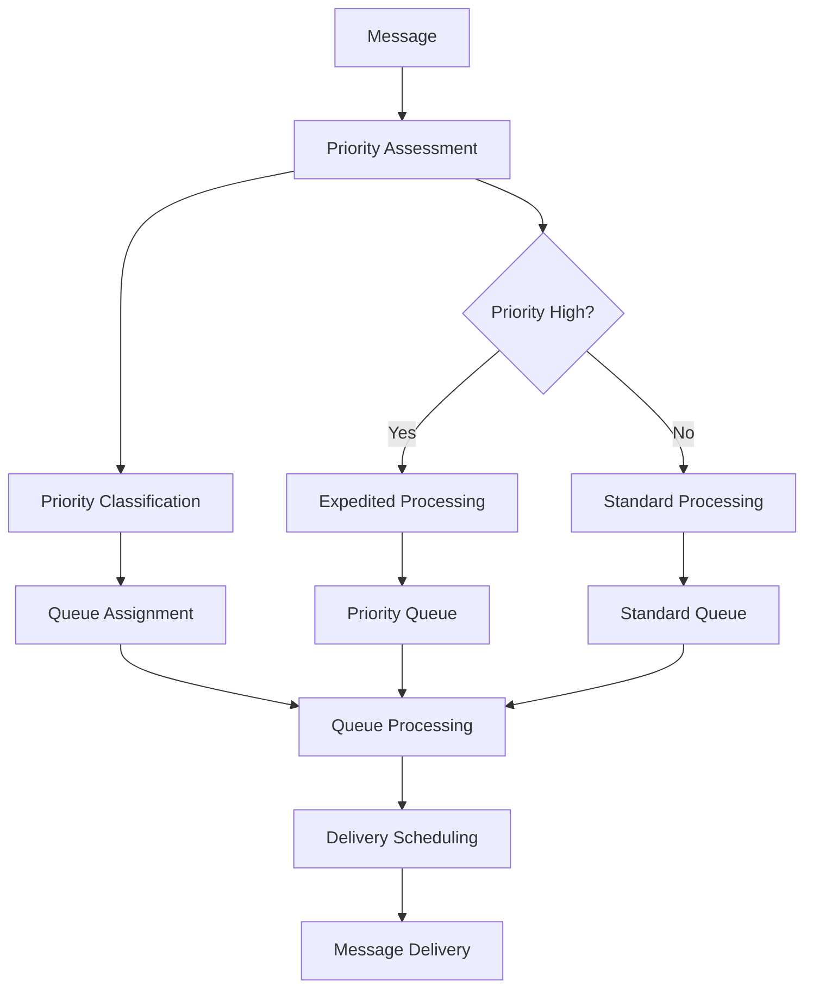
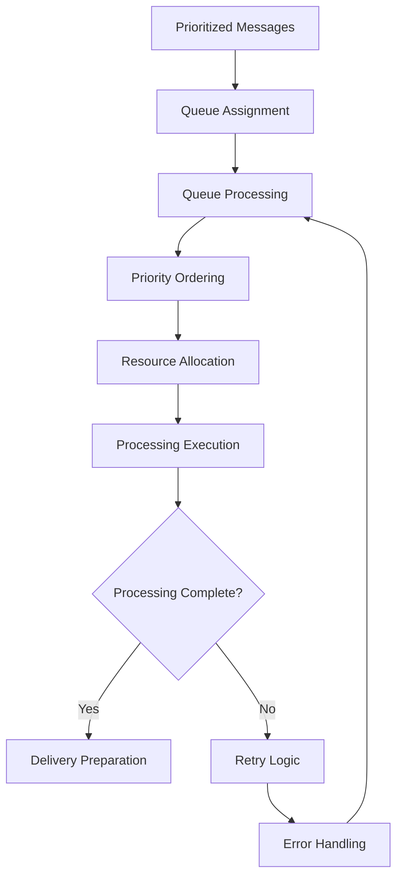

# **Priority Manager**

## **Overview**

The Priority Manager module provides intelligent priority-based message processing and delivery management for the kOS ecosystem. This module manages message priorities, queues, and delivery scheduling to ensure critical messages are processed first while maintaining system performance.

## **Core Principles**

### **Intelligent Prioritization**
- **Multi-Level Priorities**: Support for multiple priority levels and categories
- **Dynamic Priority Adjustment**: Dynamic priority adjustment based on content and context
- **Queue Management**: Intelligent queue management with priority-based ordering
- **SLA Compliance**: Ensure SLA compliance for priority-based delivery

### **High Performance**
- **Fast Priority Assessment**: High-speed priority assessment and classification
- **Efficient Queue Processing**: Efficient queue processing with minimal latency
- **Resource Optimization**: Optimize resource usage for priority-based processing
- **Scalability**: Horizontal and vertical scaling for high-volume priority management

### **Reliability & Quality**
- **Reliable Priority Handling**: Reliable priority handling with error recovery
- **Quality Assurance**: Quality assurance and validation for priority decisions
- **Monitoring**: Real-time monitoring and performance tracking
- **Learning**: Machine learning for improved priority decisions

## **Function Specifications**

### **Core Functions**

#### **01. Priority Assessment**
```typescript
interface PriorityAssessmentConfig {
  priorityLevels: PriorityLevel[];
  assessmentRules: PriorityRule[];
  dynamicAdjustment: boolean;
  learning: boolean;
}

interface PriorityAssessmentResult {
  priority: Priority;
  confidence: number;
  reasoning: string[];
  recommendations: PriorityRecommendation[];
  metadata: PriorityMetadata;
}

function assessPriority(message: ParsedMessage, config: PriorityAssessmentConfig): Promise<PriorityAssessmentResult>
```

**Purpose**: Assess message priority based on content, context, and rules.

**Parameters**:
- `message`: Parsed message to assess priority for
- `config`: Priority assessment configuration and rules

**Returns**: Priority assessment result with confidence and reasoning

**Error Handling**:
- Priority assessment failures
- Rule evaluation errors
- Learning algorithm failures
- Validation errors

#### **02. Queue Management**
```typescript
interface QueueManagementConfig {
  queueTypes: QueueType[];
  maxQueueSize: number;
  timeout: number;
  retryPolicy: RetryPolicy;
}

interface QueueManagementResult {
  queueStatus: QueueStatus;
  messageCount: number;
  processingTime: number;
  recommendations: QueueRecommendation[];
}

function manageQueue(messages: PrioritizedMessage[], config: QueueManagementConfig): Promise<QueueManagementResult>
```

**Purpose**: Manage priority queues with efficient processing and scheduling.

**Parameters**:
- `messages`: Prioritized messages to manage
- `config`: Queue management configuration and settings

**Returns**: Queue management result with status and recommendations

**Error Handling**:
- Queue management failures
- Timeout errors
- Retry policy failures
- Resource exhaustion errors

#### **03. Delivery Scheduling**
```typescript
interface DeliverySchedulingConfig {
  schedulingAlgorithm: SchedulingAlgorithm;
  slaCompliance: boolean;
  resourceConstraints: ResourceConstraint[];
  optimization: boolean;
}

interface DeliverySchedulingResult {
  schedule: DeliverySchedule;
  slaCompliance: SLACompliance;
  resourceAllocation: ResourceAllocation;
  optimization: OptimizationResult;
}

function scheduleDelivery(prioritizedMessages: PrioritizedMessage[], config: DeliverySchedulingConfig): Promise<DeliverySchedulingResult>
```

**Purpose**: Schedule message delivery based on priority and resource constraints.

**Parameters**:
- `prioritizedMessages`: Prioritized messages to schedule
- `config`: Delivery scheduling configuration and constraints

**Returns**: Delivery scheduling result with schedule and compliance metrics

**Error Handling**:
- Scheduling algorithm failures
- SLA compliance violations
- Resource constraint violations
- Optimization failures

#### **04. Priority Optimization**
```typescript
interface PriorityOptimizationConfig {
  optimizePerformance: boolean;
  optimizeSLA: boolean;
  optimizeResources: boolean;
  learning: boolean;
}

interface PriorityOptimizationResult {
  optimization: PriorityOptimization;
  performance: PerformanceMetrics;
  slaCompliance: SLACompliance;
  learning: LearningResult;
}

function optimizePriority(prioritySystem: PrioritySystem, config: PriorityOptimizationConfig): Promise<PriorityOptimizationResult>
```

**Purpose**: Optimize priority system for performance, SLA compliance, and resource usage.

**Parameters**:
- `prioritySystem`: Current priority system to optimize
- `config`: Optimization configuration and objectives

**Returns**: Priority optimization result with metrics and recommendations

**Error Handling**:
- Optimization algorithm failures
- Performance degradation
- SLA compliance violations
- Learning failures

## **Integration Patterns**

### **Priority Management Flow**


### **Queue Management Flow**


## **Capabilities**

### **Priority Levels**
- **Critical**: Highest priority for urgent messages
- **High**: High priority for important messages
- **Medium**: Medium priority for normal messages
- **Low**: Low priority for non-urgent messages
- **Bulk**: Lowest priority for bulk messages
- **Custom Levels**: Extensible custom priority levels

### **Queue Management Features**
- **Priority Queues**: Separate queues for different priority levels
- **Queue Optimization**: Optimize queue processing for performance
- **Queue Monitoring**: Monitor queue status and performance
- **Queue Balancing**: Balance queues for optimal resource usage
- **Queue Recovery**: Recover from queue failures and errors

### **Scheduling Features**
- **SLA Compliance**: Ensure SLA compliance for priority-based delivery
- **Resource Optimization**: Optimize resource usage for delivery scheduling
- **Performance Monitoring**: Monitor delivery performance and metrics
- **Scheduling Optimization**: Optimize scheduling algorithms for efficiency
- **Learning Capability**: Learn from scheduling decisions for improvement

## **Configuration Examples**

### **Basic Priority Management**
```yaml
priority_manager:
  priority_levels: ["critical", "high", "medium", "low", "bulk"]
  assessment_rules: ["content_based", "source_based", "time_based"]
  dynamic_adjustment: false
  learning: false
  queue_management:
    queue_types: ["critical", "high", "medium", "low", "bulk"]
    max_queue_size: 10000
    timeout: "5s"
    retry_policy: "exponential_backoff"
  delivery_scheduling:
    scheduling_algorithm: "priority_based"
    sla_compliance: true
    resource_constraints: ["cpu", "memory", "network"]
    optimization: false
  performance:
    timeout: "5s"
    caching: true
    parallel_processing: true
  quality:
    error_recovery: true
    sla_compliance: true
    quality_metrics: true
```

### **Advanced Priority Management**
```yaml
priority_manager:
  priority_levels: ["critical", "high", "medium", "low", "bulk", "custom"]
  assessment_rules: ["content_based", "source_based", "time_based", "custom_rules"]
  dynamic_adjustment: true
  learning: true
  queue_management:
    queue_types: ["critical", "high", "medium", "low", "bulk", "custom"]
    max_queue_size: 50000
    timeout: "10s"
    retry_policy: "adaptive_backoff"
    queue_optimization: true
    queue_monitoring: true
  delivery_scheduling:
    scheduling_algorithm: "adaptive_priority_based"
    sla_compliance: true
    resource_constraints: ["cpu", "memory", "network", "storage"]
    optimization: true
    performance_monitoring: true
  priority_optimization:
    optimize_performance: true
    optimize_sla: true
    optimize_resources: true
    learning: true
  performance:
    timeout: "10s"
    caching: true
    parallel_processing: true
    optimization: true
  quality:
    error_recovery: true
    sla_compliance: true
    quality_metrics: true
    learning: true
```

## **Performance Considerations**

### **Priority Assessment Speed**
- **Optimized Algorithms**: Use optimized priority assessment algorithms
- **Caching**: Cache priority decisions for repeated patterns
- **Parallel Processing**: Use parallel processing for multiple assessments
- **Early Termination**: Early termination for obvious priorities

### **Queue Processing Optimization**
- **Efficient Queues**: Use efficient queue data structures
- **Priority Ordering**: Optimize priority-based ordering algorithms
- **Resource Allocation**: Efficient resource allocation for queue processing
- **Load Balancing**: Balance load across multiple queues

### **Resource Management**
- **Memory Efficiency**: Optimize memory usage for priority management
- **CPU Optimization**: Optimize CPU usage for priority algorithms
- **Network Efficiency**: Minimize network overhead for priority decisions
- **Storage Optimization**: Optimize storage for priority models

## **Security Considerations**

### **Priority Security**
- **Priority Validation**: Validate priority decisions for security
- **Queue Security**: Ensure queue security and access control
- **Scheduling Security**: Secure delivery scheduling decisions
- **Optimization Security**: Secure priority optimization algorithms

### **Access Control**
- **Priority Access**: Control access to priority assessment
- **Queue Access**: Control access to queue management
- **Scheduling Access**: Control access to delivery scheduling
- **Monitoring Access**: Control access to priority monitoring

## **Monitoring & Observability**

### **Priority Metrics**
- **Priority Distribution**: Track priority distribution across messages
- **Priority Accuracy**: Monitor priority assessment accuracy
- **Queue Performance**: Track queue performance and efficiency
- **SLA Compliance**: Monitor SLA compliance for priority-based delivery

### **Performance Metrics**
- **Assessment Speed**: Track priority assessment speed and performance
- **Queue Processing**: Monitor queue processing time and throughput
- **Scheduling Efficiency**: Track delivery scheduling efficiency
- **Resource Usage**: Monitor CPU, memory, and network usage

### **Quality Metrics**
- **Priority Quality**: Track priority assessment quality and accuracy
- **Queue Quality**: Monitor queue management quality and efficiency
- **Scheduling Quality**: Track delivery scheduling quality and compliance
- **Optimization Quality**: Monitor priority optimization effectiveness

---

**Version**: 1.0  
**Module**: Priority Manager  
**Status**: ✅ **COMPLETE** - Comprehensive module specification ready for implementation  
**Focus**: Priority-based message processing and delivery management 