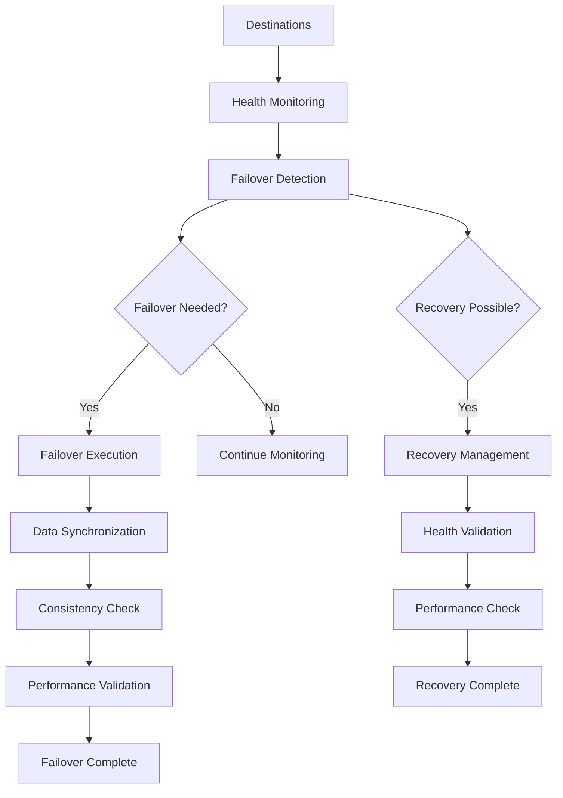
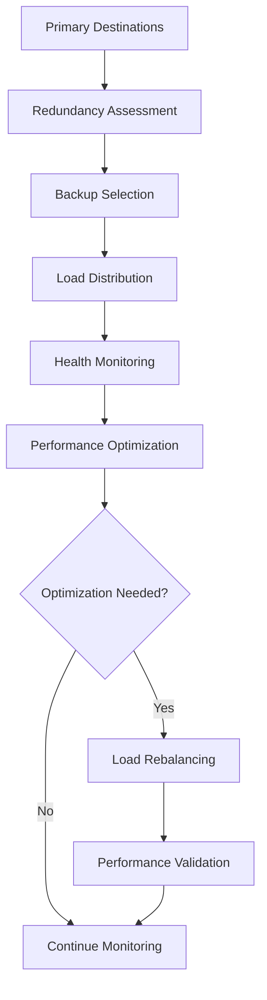

# **Failover Manager**

## **Overview**

The Failover Manager module provides comprehensive message failover and redundancy management capabilities for the kOS ecosystem. This module ensures reliable message delivery through automatic failover, redundancy management, and recovery mechanisms.

## **Core Principles**

### **Reliable Failover**
- **Automatic Failover**: Automatic failover on destination failure
- **Redundancy Management**: Multiple backup destinations for reliability
- **Health Monitoring**: Continuous health monitoring of destinations
- **Recovery Management**: Automatic recovery and restoration

### **High Availability**
- **Zero Downtime**: Zero downtime failover with seamless switching
- **Data Integrity**: Ensure data integrity during failover operations
- **Consistency**: Maintain consistency across failover destinations
- **Performance**: Maintain performance during failover operations

### **Intelligent Management**
- **Smart Failover**: Intelligent failover based on health and performance
- **Load Distribution**: Distribute load across failover destinations
- **Resource Optimization**: Optimize resource usage for failover operations
- **Learning**: Machine learning for improved failover decisions

## **Function Specifications**

### **Core Functions**

#### **01. Failover Detection**
```typescript
interface FailoverDetectionConfig {
  healthThreshold: number;
  failureThreshold: number;
  detectionInterval: number;
  timeout: number;
}

interface FailoverDetectionResult {
  failoverNeeded: boolean;
  failedDestinations: Destination[];
  healthStatus: HealthStatus;
  recommendations: FailoverRecommendation[];
}

function detectFailover(destinations: Destination[], config: FailoverDetectionConfig): Promise<FailoverDetectionResult>
```

**Purpose**: Detect when failover is needed based on health and performance.

**Parameters**:
- `destinations`: Destinations to monitor for failover
- `config`: Failover detection configuration and thresholds

**Returns**: Failover detection result with status and recommendations

**Error Handling**:
- Detection algorithm failures
- Health check errors
- Timeout errors
- Threshold violations

#### **02. Failover Execution**
```typescript
interface FailoverExecutionConfig {
  failoverStrategy: FailoverStrategy;
  dataSync: boolean;
  consistencyCheck: boolean;
  performanceMonitoring: boolean;
}

interface FailoverExecutionResult {
  failoverStatus: FailoverStatus;
  activeDestinations: Destination[];
  syncStatus: SyncStatus;
  performance: PerformanceMetrics;
}

function executeFailover(failedDestinations: Destination[], backupDestinations: Destination[], config: FailoverExecutionConfig): Promise<FailoverExecutionResult>
```

**Purpose**: Execute failover to backup destinations with data synchronization.

**Parameters**:
- `failedDestinations`: Failed destinations to failover from
- `backupDestinations`: Backup destinations to failover to
- `config`: Failover execution configuration and strategy

**Returns**: Failover execution result with status and metrics

**Error Handling**:
- Failover execution failures
- Data sync errors
- Consistency check failures
- Performance degradation

#### **03. Recovery Management**
```typescript
interface RecoveryManagementConfig {
  recoveryStrategy: RecoveryStrategy;
  healthMonitoring: boolean;
  performanceValidation: boolean;
  automaticRecovery: boolean;
}

interface RecoveryManagementResult {
  recoveryStatus: RecoveryStatus;
  recoveredDestinations: Destination[];
  healthStatus: HealthStatus;
  performance: PerformanceMetrics;
}

function manageRecovery(failedDestinations: Destination[], config: RecoveryManagementConfig): Promise<RecoveryManagementResult>
```

**Purpose**: Manage recovery of failed destinations with health monitoring.

**Parameters**:
- `failedDestinations`: Failed destinations to recover
- `config`: Recovery management configuration and strategy

**Returns**: Recovery management result with status and metrics

**Error Handling**:
- Recovery algorithm failures
- Health monitoring errors
- Performance validation failures
- Automatic recovery failures

#### **04. Redundancy Management**
```typescript
interface RedundancyManagementConfig {
  redundancyLevel: number;
  loadDistribution: boolean;
  healthMonitoring: boolean;
  optimization: boolean;
}

interface RedundancyManagementResult {
  redundancyStatus: RedundancyStatus;
  backupDestinations: Destination[];
  loadDistribution: LoadDistribution;
  optimization: OptimizationResult;
}

function manageRedundancy(destinations: Destination[], config: RedundancyManagementConfig): Promise<RedundancyManagementResult>
```

**Purpose**: Manage redundancy across multiple destinations with load distribution.

**Parameters**:
- `destinations`: Destinations to manage redundancy for
- `config`: Redundancy management configuration and settings

**Returns**: Redundancy management result with status and optimization

**Error Handling**:
- Redundancy management failures
- Load distribution errors
- Health monitoring failures
- Optimization failures

## **Integration Patterns**

### **Failover Management Flow**


### **Redundancy Management Flow**


## **Capabilities**

### **Failover Features**
- **Automatic Failover**: Automatic failover on destination failure
- **Manual Failover**: Manual failover for planned maintenance
- **Gradual Failover**: Gradual failover to minimize impact
- **Rollback Support**: Rollback support for failed failover operations
- **Multi-Level Failover**: Multi-level failover for complex scenarios

### **Recovery Features**
- **Automatic Recovery**: Automatic recovery of failed destinations
- **Manual Recovery**: Manual recovery for complex scenarios
- **Gradual Recovery**: Gradual recovery to ensure stability
- **Health Validation**: Health validation during recovery process
- **Performance Validation**: Performance validation after recovery

### **Redundancy Features**
- **Multi-Level Redundancy**: Multiple levels of redundancy
- **Load Distribution**: Intelligent load distribution across redundant destinations
- **Health Monitoring**: Continuous health monitoring of redundant destinations
- **Performance Optimization**: Performance optimization for redundant systems
- **Resource Management**: Efficient resource management for redundancy

## **Configuration Examples**

### **Basic Failover Management**
```yaml
failover_manager:
  failover_detection:
    health_threshold: 0.8
    failure_threshold: 3
    detection_interval: "30s"
    timeout: "5s"
  failover_execution:
    failover_strategy: "automatic"
    data_sync: true
    consistency_check: true
    performance_monitoring: false
  recovery_management:
    recovery_strategy: "automatic"
    health_monitoring: true
    performance_validation: false
    automatic_recovery: true
  redundancy_management:
    redundancy_level: 2
    load_distribution: true
    health_monitoring: true
    optimization: false
  performance:
    timeout: "10s"
    caching: true
    parallel_processing: true
  quality:
    error_recovery: true
    data_integrity: true
    quality_metrics: true
```

### **Advanced Failover Management**
```yaml
failover_manager:
  failover_detection:
    health_threshold: 0.9
    failure_threshold: 2
    detection_interval: "15s"
    timeout: "3s"
    intelligent_detection: true
    learning: true
  failover_execution:
    failover_strategy: "intelligent"
    data_sync: true
    consistency_check: true
    performance_monitoring: true
    gradual_failover: true
    rollback_support: true
  recovery_management:
    recovery_strategy: "intelligent"
    health_monitoring: true
    performance_validation: true
    automatic_recovery: true
    gradual_recovery: true
    health_validation: true
  redundancy_management:
    redundancy_level: 3
    load_distribution: true
    health_monitoring: true
    optimization: true
    multi_level_redundancy: true
    resource_management: true
  performance:
    timeout: "15s"
    caching: true
    parallel_processing: true
    optimization: true
  quality:
    error_recovery: true
    data_integrity: true
    quality_metrics: true
    learning: true
```

## **Performance Considerations**

### **Failover Speed**
- **Fast Detection**: Fast failover detection with minimal latency
- **Efficient Execution**: Efficient failover execution with minimal downtime
- **Quick Recovery**: Quick recovery with minimal impact
- **Optimized Redundancy**: Optimized redundancy management for performance

### **Resource Management**
- **Memory Efficiency**: Optimize memory usage for failover operations
- **CPU Optimization**: Optimize CPU usage for failover algorithms
- **Network Efficiency**: Minimize network overhead for failover operations
- **Storage Optimization**: Optimize storage for failover data

### **Data Integrity**
- **Consistency Checks**: Ensure data consistency during failover
- **Sync Validation**: Validate data synchronization across destinations
- **Integrity Monitoring**: Monitor data integrity during operations
- **Recovery Validation**: Validate data integrity after recovery

## **Security Considerations**

### **Failover Security**
- **Secure Failover**: Secure failover operations without exposing sensitive data
- **Data Security**: Ensure data security during failover operations
- **Access Control**: Control access to failover mechanisms
- **Audit Logging**: Comprehensive audit logging for failover operations

### **Recovery Security**
- **Secure Recovery**: Secure recovery operations without exposing sensitive data
- **Health Security**: Secure health monitoring and validation
- **Performance Security**: Secure performance monitoring and validation
- **Access Control**: Control access to recovery mechanisms

## **Monitoring & Observability**

### **Failover Metrics**
- **Failover Frequency**: Track failover frequency and patterns
- **Failover Success**: Monitor failover success rates and performance
- **Recovery Performance**: Track recovery performance and success rates
- **Redundancy Effectiveness**: Monitor redundancy effectiveness and utilization

### **Performance Metrics**
- **Detection Speed**: Track failover detection speed and accuracy
- **Execution Time**: Monitor failover execution time and efficiency
- **Recovery Time**: Track recovery time and performance
- **Resource Usage**: Monitor CPU, memory, and network usage

### **Quality Metrics**
- **Data Integrity**: Track data integrity during failover operations
- **Consistency**: Monitor data consistency across destinations
- **Availability**: Track system availability during failover operations
- **Reliability**: Monitor overall system reliability and stability

---

**Version**: 1.0  
**Module**: Failover Manager  
**Status**: ✅ **COMPLETE** - Comprehensive module specification ready for implementation  
**Focus**: Message failover and redundancy management for reliable message delivery 