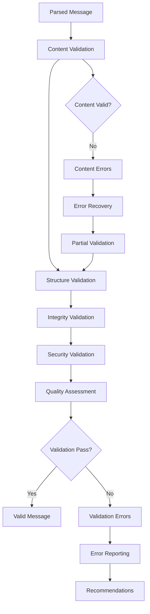
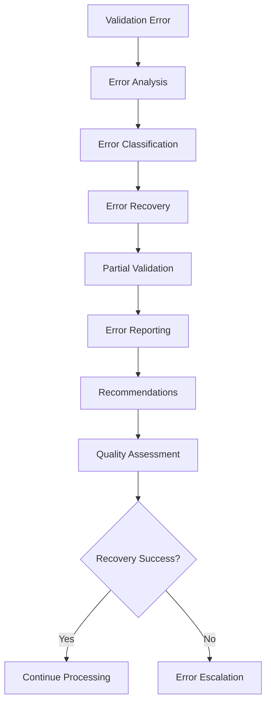

# **Message Validator**

## **Overview**

The Message Validator module provides comprehensive message validation and integrity checking capabilities for the kOS ecosystem. This module validates message content, structure, and integrity to ensure reliable and secure message processing.

## **Core Principles**

### **Comprehensive Validation**
- **Content Validation**: Validate message content for accuracy and completeness
- **Structure Validation**: Validate message structure and format
- **Integrity Validation**: Validate message integrity and authenticity
- **Security Validation**: Validate message security and compliance

### **High Performance**
- **Fast Validation**: High-speed validation with minimal latency
- **Efficient Processing**: Efficient validation processing with optimization
- **Resource Management**: Optimize resource usage for validation operations
- **Scalability**: Horizontal and vertical scaling for high-volume validation

### **Reliability & Quality**
- **Reliable Validation**: Reliable validation with error recovery
- **Quality Assurance**: Quality assurance and validation for all messages
- **Monitoring**: Real-time monitoring and performance tracking
- **Learning**: Machine learning for improved validation accuracy

## **Function Specifications**

### **Core Functions**

#### **01. Message Validation**
```typescript
interface MessageValidationConfig {
  validationTypes: ValidationType[];
  strictMode: boolean;
  errorHandling: ErrorHandlingMode;
  qualityThreshold: number;
}

interface MessageValidationResult {
  isValid: boolean;
  validationErrors: ValidationError[];
  quality: ValidationQuality;
  recommendations: ValidationRecommendation[];
  metadata: ValidationMetadata;
}

function validateMessage(message: ParsedMessage, config: MessageValidationConfig): Promise<MessageValidationResult>
```

**Purpose**: Validate message content, structure, and integrity.

**Parameters**:
- `message`: Parsed message to validate
- `config`: Validation configuration and types

**Returns**: Validation result with errors and quality metrics

**Error Handling**:
- Validation algorithm failures
- Content validation errors
- Structure validation errors
- Integrity validation errors

#### **02. Content Validation**
```typescript
interface ContentValidationConfig {
  contentTypes: ContentType[];
  validationRules: ValidationRule[];
  qualityCheck: boolean;
  learning: boolean;
}

interface ContentValidationResult {
  contentValid: boolean;
  contentErrors: ContentError[];
  quality: ContentQuality;
  recommendations: ContentRecommendation[];
}

function validateContent(message: ParsedMessage, config: ContentValidationConfig): Promise<ContentValidationResult>
```

**Purpose**: Validate message content for accuracy and completeness.

**Parameters**:
- `message`: Parsed message to validate content for
- `config`: Content validation configuration and rules

**Returns**: Content validation result with errors and quality metrics

**Error Handling**:
- Content validation failures
- Rule evaluation errors
- Quality check failures
- Learning algorithm failures

#### **03. Structure Validation**
```typescript
interface StructureValidationConfig {
  schemaValidation: boolean;
  formatValidation: boolean;
  constraintValidation: boolean;
  optimization: boolean;
}

interface StructureValidationResult {
  structureValid: boolean;
  structureErrors: StructureError[];
  schema: SchemaValidation;
  format: FormatValidation;
  constraints: ConstraintValidation;
}

function validateStructure(message: ParsedMessage, config: StructureValidationConfig): Promise<StructureValidationResult>
```

**Purpose**: Validate message structure and format compliance.

**Parameters**:
- `message`: Parsed message to validate structure for
- `config`: Structure validation configuration and settings

**Returns**: Structure validation result with schema and format validation

**Error Handling**:
- Schema validation failures
- Format validation errors
- Constraint validation failures
- Optimization errors

#### **04. Integrity Validation**
```typescript
interface IntegrityValidationConfig {
  checksumValidation: boolean;
  signatureValidation: boolean;
  timestampValidation: boolean;
  securityValidation: boolean;
}

interface IntegrityValidationResult {
  integrityValid: boolean;
  integrityErrors: IntegrityError[];
  checksum: ChecksumValidation;
  signature: SignatureValidation;
  timestamp: TimestampValidation;
  security: SecurityValidation;
}

function validateIntegrity(message: ParsedMessage, config: IntegrityValidationConfig): Promise<IntegrityValidationResult>
```

**Purpose**: Validate message integrity and authenticity.

**Parameters**:
- `message`: Parsed message to validate integrity for
- `config`: Integrity validation configuration and settings

**Returns**: Integrity validation result with checksum and signature validation

**Error Handling**:
- Checksum validation failures
- Signature validation errors
- Timestamp validation failures
- Security validation errors

## **Integration Patterns**

### **Message Validation Flow**


### **Validation Error Handling Flow**


## **Capabilities**

### **Validation Types**
- **Content Validation**: Validate message content for accuracy and completeness
- **Structure Validation**: Validate message structure and format compliance
- **Integrity Validation**: Validate message integrity and authenticity
- **Security Validation**: Validate message security and compliance
- **Custom Validation**: Extensible custom validation support

### **Validation Features**
- **Multi-Level Validation**: Multiple levels of validation for comprehensive checking
- **Quality Assessment**: Quality assessment and scoring for validation results
- **Error Recovery**: Error recovery and partial validation support
- **Learning Capability**: Machine learning for improved validation accuracy
- **Performance Optimization**: Performance optimization for validation operations

### **Security Features**
- **Checksum Validation**: Checksum validation for data integrity
- **Signature Validation**: Digital signature validation for authenticity
- **Timestamp Validation**: Timestamp validation for message freshness
- **Security Compliance**: Security compliance validation and checking
- **Threat Detection**: Threat detection and validation for security

## **Configuration Examples**

### **Basic Message Validation**
```yaml
message_validator:
  validation_types: ["content", "structure", "integrity"]
  strict_mode: false
  error_handling: "graceful"
  quality_threshold: 0.8
  content_validation:
    content_types: ["text", "numeric", "temporal", "url"]
    validation_rules: ["format", "range", "pattern"]
    quality_check: true
    learning: false
  structure_validation:
    schema_validation: true
    format_validation: true
    constraint_validation: false
    optimization: false
  integrity_validation:
    checksum_validation: true
    signature_validation: false
    timestamp_validation: true
    security_validation: false
  performance:
    timeout: "5s"
    caching: true
    parallel_processing: true
  quality:
    error_recovery: true
    partial_validation: true
    quality_metrics: true
```

### **Advanced Message Validation**
```yaml
message_validator:
  validation_types: ["content", "structure", "integrity", "security"]
  strict_mode: true
  error_handling: "strict"
  quality_threshold: 0.9
  content_validation:
    content_types: ["text", "numeric", "temporal", "url", "email", "phone", "address"]
    validation_rules: ["format", "range", "pattern", "semantic", "business"]
    quality_check: true
    learning: true
  structure_validation:
    schema_validation: true
    format_validation: true
    constraint_validation: true
    optimization: true
  integrity_validation:
    checksum_validation: true
    signature_validation: true
    timestamp_validation: true
    security_validation: true
  security_validation:
    threat_detection: true
    compliance_checking: true
    risk_assessment: true
    learning: true
  performance:
    timeout: "10s"
    caching: true
    parallel_processing: true
    optimization: true
  quality:
    error_recovery: true
    partial_validation: true
    quality_metrics: true
    learning: true
```

## **Performance Considerations**

### **Validation Speed**
- **Optimized Algorithms**: Use optimized validation algorithms for speed
- **Caching**: Cache validation results for repeated patterns
- **Parallel Processing**: Use parallel processing for multiple validations
- **Early Termination**: Early termination for obvious validation failures

### **Quality Optimization**
- **Quality Assessment**: Accurate quality assessment for better validation
- **Error Recovery**: Efficient error recovery for partial validation
- **Learning**: Continuous learning for improved validation accuracy
- **Optimization**: Continuous optimization for validation performance

### **Resource Management**
- **Memory Efficiency**: Optimize memory usage for validation operations
- **CPU Optimization**: Optimize CPU usage for validation algorithms
- **Network Efficiency**: Minimize network overhead for validation operations
- **Storage Optimization**: Optimize storage for validation models

## **Security Considerations**

### **Validation Security**
- **Input Validation**: Validate input before validation processing
- **Error Handling**: Secure error handling without exposing sensitive data
- **Learning Security**: Secure learning without exposing sensitive data
- **Validation Security**: Secure validation of sensitive content

### **Access Control**
- **Validation Access**: Control access to validation operations
- **Error Access**: Control access to validation errors and reports
- **Quality Access**: Control access to quality metrics and assessments
- **Monitoring Access**: Control access to validation monitoring

## **Monitoring & Observability**

### **Validation Metrics**
- **Validation Accuracy**: Track validation accuracy and success rates
- **Validation Speed**: Monitor validation time and performance
- **Error Distribution**: Monitor error distribution and patterns
- **Quality Distribution**: Track quality score distribution

### **Performance Metrics**
- **Throughput**: Track message validation throughput
- **Latency**: Monitor validation latency and response times
- **Error Rates**: Track validation error rates and types
- **Resource Usage**: Monitor CPU, memory, and network usage

### **Quality Metrics**
- **Content Quality**: Track content validation quality and accuracy
- **Structure Quality**: Monitor structure validation quality and compliance
- **Integrity Quality**: Track integrity validation quality and reliability
- **Security Quality**: Monitor security validation quality and effectiveness

---

**Version**: 1.0  
**Module**: Message Validator  
**Status**: ✅ **COMPLETE** - Comprehensive module specification ready for implementation  
**Focus**: Message validation and integrity checking for reliable message processing 