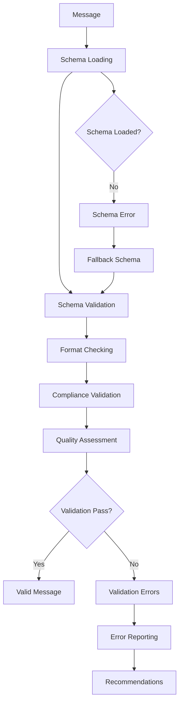
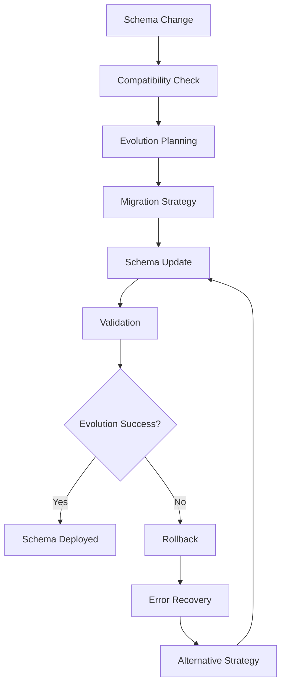

# **Schema Validator**

## **Overview**

The Schema Validator module provides comprehensive schema-based message validation capabilities for the kOS ecosystem. This module validates messages against defined schemas to ensure structured data compliance, format consistency, and data integrity.

## **Core Principles**

### **Schema Compliance**
- **Schema Validation**: Validate messages against defined schemas
- **Format Consistency**: Ensure format consistency across message types
- **Data Integrity**: Maintain data integrity through schema validation
- **Compliance Checking**: Check compliance with industry standards

### **High Performance**
- **Fast Validation**: High-speed schema validation with minimal latency
- **Efficient Processing**: Efficient validation processing with optimization
- **Resource Management**: Optimize resource usage for validation operations
- **Scalability**: Horizontal and vertical scaling for high-volume validation

### **Flexibility & Extensibility**
- **Multiple Schema Formats**: Support for multiple schema formats and standards
- **Dynamic Schema Loading**: Dynamic schema loading and management
- **Custom Schema Support**: Extensible custom schema support
- **Schema Evolution**: Support for schema evolution and versioning

## **Function Specifications**

### **Core Functions**

#### **01. Schema Validation**
```typescript
interface SchemaValidationConfig {
  schema: Schema;
  strictMode: boolean;
  errorHandling: ErrorHandlingMode;
  qualityThreshold: number;
}

interface SchemaValidationResult {
  isValid: boolean;
  validationErrors: SchemaValidationError[];
  quality: SchemaValidationQuality;
  recommendations: SchemaRecommendation[];
  metadata: SchemaValidationMetadata;
}

function validateSchema(message: ParsedMessage, config: SchemaValidationConfig): Promise<SchemaValidationResult>
```

**Purpose**: Validate message against defined schema for compliance.

**Parameters**:
- `message`: Parsed message to validate against schema
- `config`: Schema validation configuration and settings

**Returns**: Schema validation result with errors and quality metrics

**Error Handling**:
- Schema validation failures
- Schema loading errors
- Format compliance errors
- Quality threshold violations

#### **02. Schema Loading**
```typescript
interface SchemaLoadingConfig {
  schemaSource: SchemaSource;
  cacheSchema: boolean;
  validateSchema: boolean;
  versionControl: boolean;
}

interface SchemaLoadingResult {
  schema: Schema;
  version: string;
  metadata: SchemaMetadata;
  validation: SchemaValidation;
}

function loadSchema(schemaId: string, config: SchemaLoadingConfig): Promise<SchemaLoadingResult>
```

**Purpose**: Load schema from various sources with validation and caching.

**Parameters**:
- `schemaId`: Schema identifier to load
- `config`: Schema loading configuration and settings

**Returns**: Loaded schema with version and metadata

**Error Handling**:
- Schema loading failures
- Schema validation errors
- Version control errors
- Cache management errors

#### **03. Schema Management**
```typescript
interface SchemaManagementConfig {
  schemaRegistry: boolean;
  versionControl: boolean;
  caching: boolean;
  optimization: boolean;
}

interface SchemaManagementResult {
  schemas: Schema[];
  registry: SchemaRegistry;
  versions: SchemaVersion[];
  optimization: SchemaOptimization;
}

function manageSchemas(schemas: Schema[], config: SchemaManagementConfig): Promise<SchemaManagementResult>
```

**Purpose**: Manage schema registry, versioning, and optimization.

**Parameters**:
- `schemas`: Schemas to manage
- `config`: Schema management configuration and settings

**Returns**: Schema management result with registry and optimization

**Error Handling**:
- Schema management failures
- Registry errors
- Version control failures
- Optimization errors

#### **04. Schema Evolution**
```typescript
interface SchemaEvolutionConfig {
  evolutionStrategy: EvolutionStrategy;
  backwardCompatibility: boolean;
  migrationSupport: boolean;
  validation: boolean;
}

interface SchemaEvolutionResult {
  evolution: SchemaEvolution;
  compatibility: CompatibilityResult;
  migration: MigrationResult;
  validation: EvolutionValidation;
}

function evolveSchema(oldSchema: Schema, newSchema: Schema, config: SchemaEvolutionConfig): Promise<SchemaEvolutionResult>
```

**Purpose**: Handle schema evolution with backward compatibility and migration.

**Parameters**:
- `oldSchema`: Old schema version
- `newSchema`: New schema version
- `config`: Schema evolution configuration and strategy

**Returns**: Schema evolution result with compatibility and migration

**Error Handling**:
- Evolution algorithm failures
- Compatibility check errors
- Migration failures
- Validation errors

## **Integration Patterns**

### **Schema Validation Flow**


### **Schema Evolution Flow**


## **Capabilities**

### **Schema Formats**
- **JSON Schema**: JSON Schema validation and compliance
- **XML Schema**: XML Schema validation and compliance
- **Protocol Buffers**: Protobuf schema validation and compliance
- **Avro Schema**: Avro schema validation and compliance
- **Custom Schemas**: Extensible custom schema support

### **Validation Features**
- **Multi-Format Validation**: Support for multiple schema formats
- **Strict Validation**: Strict schema validation with error reporting
- **Quality Assessment**: Quality assessment and scoring for validation results
- **Performance Optimization**: Performance optimization for validation operations
- **Learning Capability**: Machine learning for improved validation accuracy

### **Management Features**
- **Schema Registry**: Centralized schema registry and management
- **Version Control**: Schema version control and management
- **Caching**: Intelligent caching for schema loading and validation
- **Optimization**: Schema optimization for performance and efficiency
- **Evolution Support**: Schema evolution and migration support

## **Configuration Examples**

### **Basic Schema Validation**
```yaml
schema_validator:
  schema_validation:
    strict_mode: false
    error_handling: "graceful"
    quality_threshold: 0.8
  schema_loading:
    schema_source: "registry"
    cache_schema: true
    validate_schema: true
    version_control: false
  schema_management:
    schema_registry: true
    version_control: false
    caching: true
    optimization: false
  performance:
    timeout: "5s"
    caching: true
    parallel_processing: true
  quality:
    error_recovery: true
    partial_validation: true
    quality_metrics: true
```

### **Advanced Schema Validation**
```yaml
schema_validator:
  schema_validation:
    strict_mode: true
    error_handling: "strict"
    quality_threshold: 0.9
    multi_format: true
  schema_loading:
    schema_source: "distributed_registry"
    cache_schema: true
    validate_schema: true
    version_control: true
    dynamic_loading: true
  schema_management:
    schema_registry: true
    version_control: true
    caching: true
    optimization: true
    distributed_registry: true
  schema_evolution:
    evolution_strategy: "backward_compatible"
    backward_compatibility: true
    migration_support: true
    validation: true
    learning: true
  performance:
    timeout: "10s"
    caching: true
    parallel_processing: true
    optimization: true
  quality:
    error_recovery: true
    partial_validation: true
    quality_metrics: true
    learning: true
```

## **Performance Considerations**

### **Validation Speed**
- **Optimized Algorithms**: Use optimized schema validation algorithms
- **Caching**: Cache schema definitions and validation results
- **Parallel Processing**: Use parallel processing for multiple validations
- **Early Termination**: Early termination for obvious validation failures

### **Schema Management Optimization**
- **Registry Optimization**: Optimize schema registry for fast access
- **Version Control**: Efficient version control for schema management
- **Caching Strategy**: Intelligent caching strategy for schema loading
- **Optimization**: Continuous optimization for schema management

### **Resource Management**
- **Memory Efficiency**: Optimize memory usage for schema operations
- **CPU Optimization**: Optimize CPU usage for validation algorithms
- **Network Efficiency**: Minimize network overhead for schema loading
- **Storage Optimization**: Optimize storage for schema definitions

## **Security Considerations**

### **Schema Security**
- **Schema Validation**: Validate schema definitions for security
- **Access Control**: Control access to schema definitions and registry
- **Version Security**: Secure schema version control and management
- **Registry Security**: Secure schema registry access and management

### **Validation Security**
- **Input Validation**: Validate input before schema validation
- **Error Handling**: Secure error handling without exposing sensitive data
- **Schema Security**: Secure schema validation of sensitive data
- **Access Control**: Control access to schema validation operations

## **Monitoring & Observability**

### **Validation Metrics**
- **Validation Accuracy**: Track schema validation accuracy and success rates
- **Validation Speed**: Monitor validation time and performance
- **Schema Distribution**: Monitor schema distribution and usage
- **Error Distribution**: Track validation error distribution and patterns

### **Performance Metrics**
- **Throughput**: Track schema validation throughput
- **Latency**: Monitor validation latency and response times
- **Error Rates**: Track validation error rates and types
- **Resource Usage**: Monitor CPU, memory, and network usage

### **Quality Metrics**
- **Schema Quality**: Track schema definition quality and compliance
- **Validation Quality**: Monitor validation quality and accuracy
- **Registry Quality**: Track schema registry quality and efficiency
- **Evolution Quality**: Monitor schema evolution quality and success

---

**Version**: 1.0  
**Module**: Schema Validator  
**Status**: ✅ **COMPLETE** - Comprehensive module specification ready for implementation  
**Focus**: Schema-based message validation for structured data compliance 