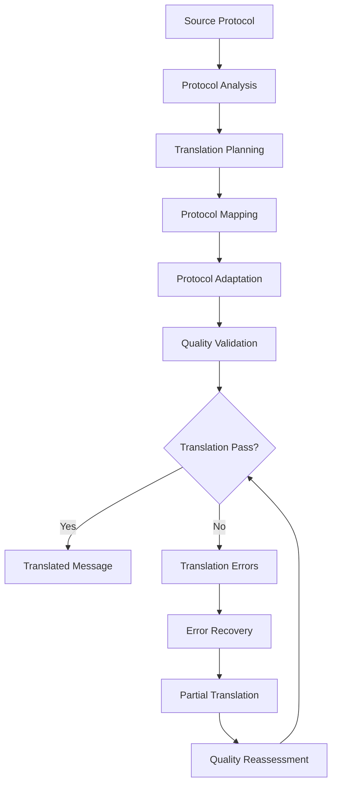
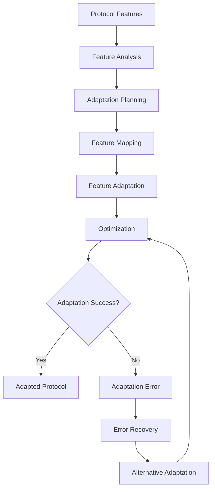

# **Protocol Translator**

## **Overview**

The Protocol Translator module provides comprehensive protocol translation and adaptation capabilities for the kOS ecosystem. This module translates messages between different protocols, adapts protocol-specific features, and ensures seamless communication across diverse protocol environments.

## **Core Principles**

### **Universal Protocol Support**
- **Multi-Protocol Translation**: Support for all major communication protocols
- **Protocol Adaptation**: Protocol-specific feature adaptation and optimization
- **Interoperability**: Ensure interoperability between different protocols
- **Backward Compatibility**: Maintain backward compatibility with legacy protocols

### **High Performance**
- **Fast Translation**: High-speed protocol translation with minimal latency
- **Efficient Processing**: Efficient translation processing with optimization
- **Resource Management**: Optimize resource usage for translation operations
- **Scalability**: Horizontal and vertical scaling for high-volume translation

### **Intelligent Translation**
- **Smart Translation**: Intelligent protocol translation with context awareness
- **Learning Capability**: Machine learning for improved translation accuracy
- **Adaptive Translation**: Adaptive translation based on protocol characteristics
- **Quality Optimization**: Continuous optimization for translation quality

## **Function Specifications**

### **Core Functions**

#### **01. Protocol Translation**
```typescript
interface ProtocolTranslationConfig {
  sourceProtocol: Protocol;
  targetProtocol: Protocol;
  translationRules: TranslationRule[];
  adaptation: boolean;
  qualityThreshold: number;
}

interface ProtocolTranslationResult {
  translatedMessage: TranslatedMessage;
  translationQuality: TranslationQuality;
  adaptation: ProtocolAdaptation;
  metadata: TranslationMetadata;
  recommendations: TranslationRecommendation[];
}

function translateProtocol(message: ParsedMessage, config: ProtocolTranslationConfig): Promise<ProtocolTranslationResult>
```

**Purpose**: Translate messages between different protocols with adaptation.

**Parameters**:
- `message`: Parsed message to translate
- `config`: Protocol translation configuration and rules

**Returns**: Protocol translation result with quality and adaptation

**Error Handling**:
- Protocol translation failures
- Adaptation errors
- Quality threshold violations
- Rule evaluation errors

#### **02. Protocol Adaptation**
```typescript
interface ProtocolAdaptationConfig {
  sourceProtocol: Protocol;
  targetProtocol: Protocol;
  adaptationRules: AdaptationRule[];
  optimization: boolean;
  learning: boolean;
}

interface ProtocolAdaptationResult {
  adaptedMessage: AdaptedMessage;
  adaptationQuality: AdaptationQuality;
  optimization: AdaptationOptimization;
  learning: LearningResult;
}

function adaptProtocol(message: ParsedMessage, config: ProtocolAdaptationConfig): Promise<ProtocolAdaptationResult>
```

**Purpose**: Adapt protocol-specific features and capabilities.

**Parameters**:
- `message`: Parsed message to adapt
- `config`: Protocol adaptation configuration and rules

**Returns**: Protocol adaptation result with quality and optimization

**Error Handling**:
- Protocol adaptation failures
- Rule evaluation errors
- Optimization failures
- Learning algorithm errors

#### **03. Protocol Mapping**
```typescript
interface ProtocolMappingConfig {
  sourceProtocol: Protocol;
  targetProtocol: Protocol;
  mappingRules: MappingRule[];
  validation: boolean;
  optimization: boolean;
}

interface ProtocolMappingResult {
  mappedMessage: MappedMessage;
  mappingQuality: MappingQuality;
  validation: MappingValidation;
  optimization: MappingOptimization;
}

function mapProtocol(message: ParsedMessage, config: ProtocolMappingConfig): Promise<ProtocolMappingResult>
```

**Purpose**: Map protocol-specific structures and semantics.

**Parameters**:
- `message`: Parsed message to map
- `config`: Protocol mapping configuration and rules

**Returns**: Protocol mapping result with quality and validation

**Error Handling**:
- Protocol mapping failures
- Rule evaluation errors
- Validation failures
- Optimization errors

#### **04. Protocol Validation**
```typescript
interface ProtocolValidationConfig {
  protocol: Protocol;
  validationRules: ValidationRule[];
  complianceChecking: boolean;
  qualityAssessment: boolean;
}

interface ProtocolValidationResult {
  isValid: boolean;
  validationErrors: ValidationError[];
  compliance: ComplianceResult;
  quality: QualityAssessment;
}

function validateProtocol(message: ParsedMessage, config: ProtocolValidationConfig): Promise<ProtocolValidationResult>
```

**Purpose**: Validate protocol compliance and quality.

**Parameters**:
- `message`: Parsed message to validate
- `config`: Protocol validation configuration and rules

**Returns**: Protocol validation result with compliance and quality

**Error Handling**:
- Protocol validation failures
- Compliance check errors
- Quality assessment errors
- Rule evaluation failures

## **Integration Patterns**

### **Protocol Translation Flow**


### **Protocol Adaptation Flow**


## **Capabilities**

### **Protocol Support**
- **HTTP**: HTTP protocol translation and adaptation
- **gRPC**: gRPC protocol translation and adaptation
- **WebSocket**: WebSocket protocol translation and adaptation
- **MQTT**: MQTT protocol translation and adaptation
- **AMQP**: AMQP protocol translation and adaptation
- **Custom Protocols**: Extensible custom protocol support

### **Translation Features**
- **Bidirectional Translation**: Bidirectional protocol translation
- **Feature Adaptation**: Protocol-specific feature adaptation
- **Quality Validation**: Quality validation and assessment
- **Performance Optimization**: Performance optimization for translation
- **Learning Capability**: Machine learning for improved translation

### **Adaptation Features**
- **Header Adaptation**: Protocol header adaptation and translation
- **Body Adaptation**: Protocol body adaptation and transformation
- **Metadata Adaptation**: Protocol metadata adaptation and mapping
- **Error Handling**: Protocol-specific error handling and recovery
- **Security Adaptation**: Protocol security feature adaptation

## **Configuration Examples**

### **Basic Protocol Translation**
```yaml
protocol_translator:
  protocol_translation:
    source_protocol: "http"
    target_protocol: "grpc"
    translation_rules: ["basic", "header", "body"]
    adaptation: false
    quality_threshold: 0.8
  protocol_adaptation:
    source_protocol: "http"
    target_protocol: "grpc"
    adaptation_rules: ["basic", "feature", "semantic"]
    optimization: false
    learning: false
  protocol_mapping:
    source_protocol: "http"
    target_protocol: "grpc"
    mapping_rules: ["basic", "structure", "semantic"]
    validation: true
    optimization: false
  performance:
    timeout: "5s"
    caching: true
    parallel_processing: true
  quality:
    error_recovery: true
    partial_translation: true
    quality_metrics: true
```

### **Advanced Protocol Translation**
```yaml
protocol_translator:
  protocol_translation:
    source_protocol: "http"
    target_protocol: "grpc"
    translation_rules: ["advanced", "semantic", "optimized"]
    adaptation: true
    quality_threshold: 0.9
    bidirectional: true
  protocol_adaptation:
    source_protocol: "http"
    target_protocol: "grpc"
    adaptation_rules: ["advanced", "feature", "semantic", "contextual"]
    optimization: true
    learning: true
    adaptive_adaptation: true
  protocol_mapping:
    source_protocol: "http"
    target_protocol: "grpc"
    mapping_rules: ["advanced", "structure", "semantic", "contextual"]
    validation: true
    optimization: true
    schema_validation: true
  protocol_validation:
    protocol: "grpc"
    validation_rules: ["compliance", "quality", "performance"]
    compliance_checking: true
    quality_assessment: true
    real_time_validation: true
  performance:
    timeout: "10s"
    caching: true
    parallel_processing: true
    optimization: true
  quality:
    error_recovery: true
    partial_translation: true
    quality_metrics: true
    learning: true
```

## **Performance Considerations**

### **Translation Speed**
- **Optimized Algorithms**: Use optimized protocol translation algorithms
- **Caching**: Cache translation results for repeated patterns
- **Parallel Processing**: Use parallel processing for multiple translations
- **Early Termination**: Early termination for obvious translations

### **Quality Optimization**
- **Quality Assessment**: Accurate quality assessment for better translation
- **Learning**: Continuous learning for improved translation accuracy
- **Context Awareness**: Context-aware translation for better accuracy
- **Optimization**: Continuous optimization for translation performance

### **Resource Management**
- **Memory Efficiency**: Optimize memory usage for translation operations
- **CPU Optimization**: Optimize CPU usage for translation algorithms
- **Network Efficiency**: Minimize network overhead for translation operations
- **Storage Optimization**: Optimize storage for translation models

## **Security Considerations**

### **Translation Security**
- **Input Validation**: Validate input before translation processing
- **Protocol Security**: Ensure protocol security during translation
- **Adaptation Security**: Secure protocol adaptation and mapping
- **Validation Security**: Secure protocol validation and compliance

### **Access Control**
- **Translation Access**: Control access to protocol translation operations
- **Adaptation Access**: Control access to protocol adaptation operations
- **Mapping Access**: Control access to protocol mapping operations
- **Validation Access**: Control access to protocol validation operations

## **Monitoring & Observability**

### **Translation Metrics**
- **Translation Accuracy**: Track protocol translation accuracy and success rates
- **Translation Speed**: Monitor translation time and performance
- **Protocol Distribution**: Monitor protocol distribution and translation patterns
- **Quality Distribution**: Track quality score distribution

### **Performance Metrics**
- **Throughput**: Track protocol translation throughput
- **Latency**: Monitor translation latency and response times
- **Error Rates**: Track translation error rates and types
- **Resource Usage**: Monitor CPU, memory, and network usage

### **Quality Metrics**
- **Translation Quality**: Track protocol translation quality and accuracy
- **Adaptation Quality**: Monitor protocol adaptation quality and effectiveness
- **Mapping Quality**: Track protocol mapping quality and reliability
- **Validation Quality**: Monitor protocol validation quality and compliance

---

**Version**: 1.0  
**Module**: Protocol Translator  
**Status**: ✅ **COMPLETE** - Comprehensive module specification ready for implementation  
**Focus**: Protocol translation and adaptation for multi-protocol communication 