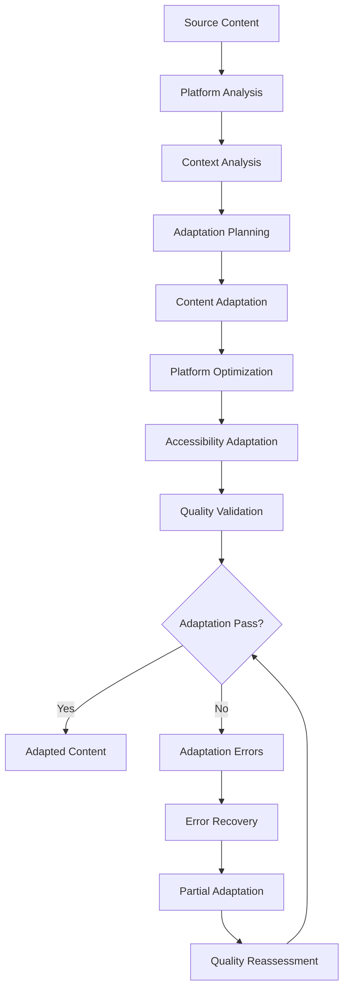
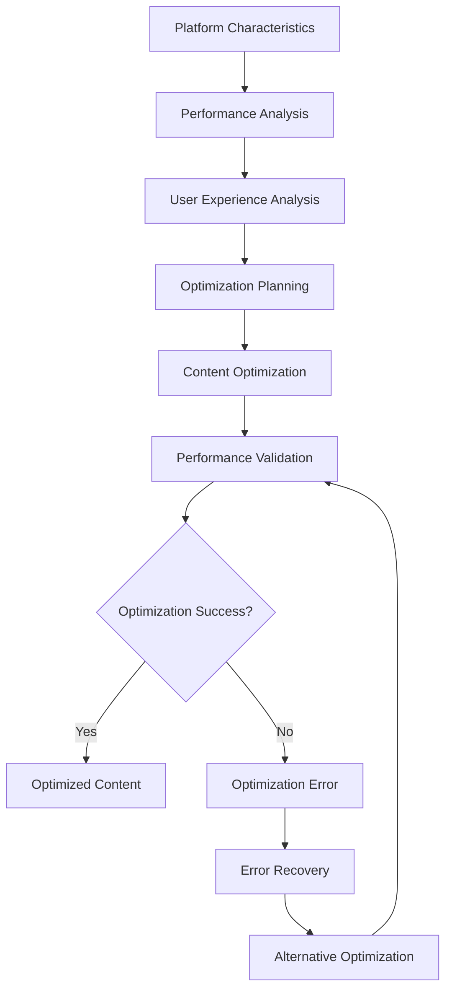

# **Content Adapter**

## **Overview**

The Content Adapter module provides comprehensive content adaptation and optimization capabilities for the kOS ecosystem. This module adapts message content for different platforms, contexts, and delivery channels to ensure optimal presentation and user experience.

## **Core Principles**

### **Universal Content Adaptation**
- **Multi-Platform Support**: Support for all major platforms and delivery channels
- **Context-Aware Adaptation**: Context-aware content adaptation and optimization
- **User Experience Optimization**: Optimize user experience across different platforms
- **Accessibility Support**: Ensure accessibility and inclusivity in content adaptation

### **High Performance**
- **Fast Adaptation**: High-speed content adaptation with minimal latency
- **Efficient Processing**: Efficient adaptation processing with optimization
- **Resource Management**: Optimize resource usage for adaptation operations
- **Scalability**: Horizontal and vertical scaling for high-volume adaptation

### **Intelligent Adaptation**
- **Smart Adaptation**: Intelligent content adaptation with context awareness
- **Learning Capability**: Machine learning for improved adaptation accuracy
- **Adaptive Optimization**: Adaptive optimization based on platform characteristics
- **Quality Optimization**: Continuous optimization for adaptation quality

## **Function Specifications**

### **Core Functions**

#### **01. Content Adaptation**
```typescript
interface ContentAdaptationConfig {
  sourcePlatform: Platform;
  targetPlatform: Platform;
  adaptationRules: AdaptationRule[];
  optimization: boolean;
  qualityThreshold: number;
}

interface ContentAdaptationResult {
  adaptedContent: AdaptedContent;
  adaptationQuality: AdaptationQuality;
  optimization: ContentOptimization;
  metadata: AdaptationMetadata;
  recommendations: AdaptationRecommendation[];
}

function adaptContent(message: ParsedMessage, config: ContentAdaptationConfig): Promise<ContentAdaptationResult>
```

**Purpose**: Adapt message content for different platforms and contexts.

**Parameters**:
- `message`: Parsed message to adapt
- `config`: Content adaptation configuration and rules

**Returns**: Content adaptation result with quality and optimization

**Error Handling**:
- Content adaptation failures
- Platform compatibility errors
- Quality threshold violations
- Rule evaluation errors

#### **02. Platform Optimization**
```typescript
interface PlatformOptimizationConfig {
  platform: Platform;
  optimizationRules: OptimizationRule[];
  performanceOptimization: boolean;
  userExperienceOptimization: boolean;
}

interface PlatformOptimizationResult {
  optimizedContent: OptimizedContent;
  optimizationQuality: OptimizationQuality;
  performance: PerformanceMetrics;
  userExperience: UserExperienceMetrics;
}

function optimizeForPlatform(content: string, config: PlatformOptimizationConfig): Promise<PlatformOptimizationResult>
```

**Purpose**: Optimize content for specific platform characteristics.

**Parameters**:
- `content`: Content to optimize
- `config`: Platform optimization configuration and rules

**Returns**: Platform optimization result with quality and metrics

**Error Handling**:
- Platform optimization failures
- Rule evaluation errors
- Performance degradation
- User experience issues

#### **03. Context Adaptation**
```typescript
interface ContextAdaptationConfig {
  context: Context;
  adaptationRules: ContextAdaptationRule[];
  learning: boolean;
  optimization: boolean;
}

interface ContextAdaptationResult {
  adaptedContent: ContextAdaptedContent;
  contextQuality: ContextQuality;
  learning: LearningResult;
  optimization: ContextOptimization;
}

function adaptForContext(content: string, config: ContextAdaptationConfig): Promise<ContextAdaptationResult>
```

**Purpose**: Adapt content for specific contexts and use cases.

**Parameters**:
- `content`: Content to adapt for context
- `config`: Context adaptation configuration and rules

**Returns**: Context adaptation result with quality and learning

**Error Handling**:
- Context adaptation failures
- Rule evaluation errors
- Learning algorithm failures
- Optimization errors

#### **04. Accessibility Adaptation**
```typescript
interface AccessibilityAdaptationConfig {
  accessibilityStandards: AccessibilityStandard[];
  adaptationLevel: AdaptationLevel;
  validation: boolean;
  optimization: boolean;
}

interface AccessibilityAdaptationResult {
  accessibleContent: AccessibleContent;
  accessibilityQuality: AccessibilityQuality;
  validation: AccessibilityValidation;
  optimization: AccessibilityOptimization;
}

function adaptForAccessibility(content: string, config: AccessibilityAdaptationConfig): Promise<AccessibilityAdaptationResult>
```

**Purpose**: Adapt content for accessibility and inclusivity.

**Parameters**:
- `content`: Content to adapt for accessibility
- `config`: Accessibility adaptation configuration and standards

**Returns**: Accessibility adaptation result with quality and validation

**Error Handling**:
- Accessibility adaptation failures
- Standard compliance errors
- Validation failures
- Optimization errors

## **Integration Patterns**

### **Content Adaptation Flow**


### **Platform Optimization Flow**


## **Capabilities**

### **Platform Support**
- **Web Platforms**: Web platform adaptation and optimization
- **Mobile Platforms**: Mobile platform adaptation and optimization
- **Desktop Platforms**: Desktop platform adaptation and optimization
- **IoT Platforms**: IoT platform adaptation and optimization
- **Custom Platforms**: Extensible custom platform support

### **Adaptation Features**
- **Content Formatting**: Content formatting and structure adaptation
- **Media Adaptation**: Media content adaptation and optimization
- **Layout Adaptation**: Layout and presentation adaptation
- **Interaction Adaptation**: Interaction and user interface adaptation
- **Performance Adaptation**: Performance optimization for different platforms

### **Accessibility Features**
- **Screen Reader Support**: Screen reader compatibility and optimization
- **Keyboard Navigation**: Keyboard navigation support and optimization
- **Color Contrast**: Color contrast and visual accessibility
- **Text Scaling**: Text scaling and readability optimization
- **Alternative Content**: Alternative content and descriptions

## **Configuration Examples**

### **Basic Content Adaptation**
```yaml
content_adapter:
  content_adaptation:
    source_platform: "web"
    target_platform: "mobile"
    adaptation_rules: ["basic", "format", "layout"]
    optimization: false
    quality_threshold: 0.8
  platform_optimization:
    platform: "mobile"
    optimization_rules: ["performance", "user_experience"]
    performance_optimization: true
    user_experience_optimization: false
  context_adaptation:
    context: "general"
    adaptation_rules: ["basic", "format", "content"]
    learning: false
    optimization: false
  accessibility_adaptation:
    accessibility_standards: ["basic", "wcag_2.1"]
    adaptation_level: "basic"
    validation: true
    optimization: false
  performance:
    timeout: "5s"
    caching: true
    parallel_processing: true
  quality:
    error_recovery: true
    partial_adaptation: true
    quality_metrics: true
```

### **Advanced Content Adaptation**
```yaml
content_adapter:
  content_adaptation:
    source_platform: "web"
    target_platform: "mobile"
    adaptation_rules: ["advanced", "semantic", "optimized"]
    optimization: true
    quality_threshold: 0.9
    intelligent_adaptation: true
  platform_optimization:
    platform: "mobile"
    optimization_rules: ["performance", "user_experience", "battery", "data"]
    performance_optimization: true
    user_experience_optimization: true
    adaptive_optimization: true
  context_adaptation:
    context: "professional"
    adaptation_rules: ["advanced", "semantic", "contextual", "personalized"]
    learning: true
    optimization: true
    adaptive_context: true
  accessibility_adaptation:
    accessibility_standards: ["wcag_2.1", "section_508", "aria", "custom"]
    adaptation_level: "comprehensive"
    validation: true
    optimization: true
    continuous_validation: true
  performance:
    timeout: "10s"
    caching: true
    parallel_processing: true
    optimization: true
  quality:
    error_recovery: true
    partial_adaptation: true
    quality_metrics: true
    learning: true
```

## **Performance Considerations**

### **Adaptation Speed**
- **Optimized Algorithms**: Use optimized content adaptation algorithms
- **Caching**: Cache adaptation results for repeated patterns
- **Parallel Processing**: Use parallel processing for multiple adaptations
- **Early Termination**: Early termination for obvious adaptations

### **Quality Optimization**
- **Quality Assessment**: Accurate quality assessment for better adaptation
- **Learning**: Continuous learning for improved adaptation accuracy
- **Context Awareness**: Context-aware adaptation for better accuracy
- **Optimization**: Continuous optimization for adaptation performance

### **Resource Management**
- **Memory Efficiency**: Optimize memory usage for adaptation operations
- **CPU Optimization**: Optimize CPU usage for adaptation algorithms
- **Network Efficiency**: Minimize network overhead for adaptation operations
- **Storage Optimization**: Optimize storage for adaptation models

## **Security Considerations**

### **Adaptation Security**
- **Input Validation**: Validate input before adaptation processing
- **Content Security**: Ensure content security during adaptation
- **Platform Security**: Secure platform optimization and adaptation
- **Accessibility Security**: Secure accessibility adaptation and validation

### **Access Control**
- **Adaptation Access**: Control access to content adaptation operations
- **Platform Access**: Control access to platform optimization operations
- **Context Access**: Control access to context adaptation operations
- **Accessibility Access**: Control access to accessibility adaptation operations

## **Monitoring & Observability**

### **Adaptation Metrics**
- **Adaptation Accuracy**: Track content adaptation accuracy and success rates
- **Adaptation Speed**: Monitor adaptation time and performance
- **Platform Distribution**: Monitor platform distribution and adaptation patterns
- **Quality Distribution**: Track quality score distribution

### **Performance Metrics**
- **Throughput**: Track content adaptation throughput
- **Latency**: Monitor adaptation latency and response times
- **Error Rates**: Track adaptation error rates and types
- **Resource Usage**: Monitor CPU, memory, and network usage

### **Quality Metrics**
- **Adaptation Quality**: Track content adaptation quality and accuracy
- **Platform Quality**: Monitor platform optimization quality and effectiveness
- **Context Quality**: Track context adaptation quality and reliability
- **Accessibility Quality**: Monitor accessibility adaptation quality and compliance

---

**Version**: 1.0  
**Module**: Content Adapter  
**Status**: ✅ **COMPLETE** - Comprehensive module specification ready for implementation  
**Focus**: Content adaptation and optimization for multi-platform message delivery 