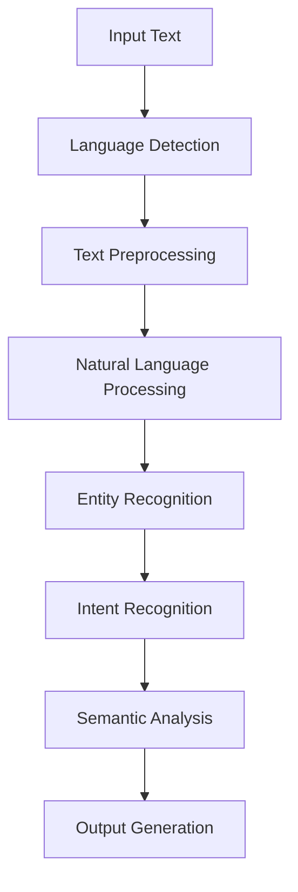
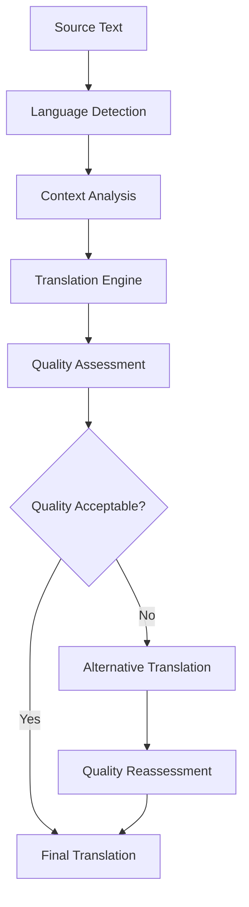
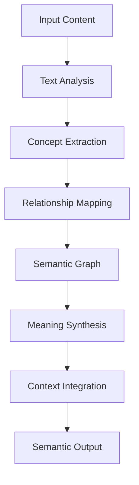

# **Language Services**

## **Overview**

The Language Services subcategory provides comprehensive capabilities for language detection, translation, processing, and semantic analysis. These modules form the foundation for multi-language support and natural language understanding in the kOS ecosystem.

## **Core Principles**

### **Universal Language Support**
- **Multi-Language Coverage**: Support for 100+ languages and dialects
- **Cultural Sensitivity**: Culturally aware language processing and translation
- **Context Awareness**: Context-aware translation and language understanding
- **Quality Assurance**: High-quality translation with accuracy validation

### **Intelligent Processing**
- **Natural Language Understanding**: Advanced NLP with intent recognition
- **Semantic Analysis**: Deep semantic analysis and meaning extraction
- **Entity Recognition**: Automatic entity and concept recognition
- **Sentiment Analysis**: Emotional intelligence and sentiment detection

### **Performance & Scalability**
- **High Performance**: Fast language processing and translation
- **Scalability**: Horizontal and vertical scaling for high-volume processing
- **Caching**: Intelligent caching for frequently used translations
- **Optimization**: Continuous optimization and quality improvement

## **Function Specifications**

### **Language Detection**
- **Purpose**: Automatically detect and classify languages in text content
- **Capabilities**: Multi-language detection, confidence scoring, dialect recognition
- **Integration**: NLP engines, language models, detection algorithms
- **Performance**: < 100ms detection time, 99%+ accuracy

### **Text Translation**
- **Purpose**: Translate text between multiple languages with high quality
- **Capabilities**: Context-aware translation, quality validation, cultural adaptation
- **Integration**: Translation APIs, language models, quality assessment
- **Performance**: < 500ms translation time, professional quality output

### **Language Processing**
- **Purpose**: Process and understand natural language content
- **Capabilities**: NLP, intent recognition, entity extraction, syntax analysis
- **Integration**: NLP engines, machine learning models, linguistic databases
- **Performance**: < 200ms processing time, comprehensive analysis

### **Semantic Analysis**
- **Purpose**: Extract meaning and semantic relationships from text
- **Capabilities**: Meaning extraction, relationship mapping, concept analysis
- **Integration**: Semantic models, knowledge graphs, concept databases
- **Performance**: < 300ms analysis time, deep semantic understanding

## **Integration Patterns**

### **Language Processing Flow**


### **Translation Flow**


### **Semantic Analysis Flow**


## **Capabilities**

### **Language Detection**
- **Multi-Language Support**: Detect 100+ languages and dialects
- **Confidence Scoring**: Provide confidence scores for detections
- **Dialect Recognition**: Recognize regional dialects and variations
- **Mixed Language**: Handle mixed-language content
- **Real-time Detection**: Fast detection for streaming content

### **Translation Services**
- **High-Quality Translation**: Professional-quality translations
- **Context Awareness**: Context-aware translation accuracy
- **Cultural Adaptation**: Cultural adaptation and localization
- **Quality Validation**: Automatic quality assessment and validation
- **Batch Translation**: Efficient batch translation processing

### **Natural Language Processing**
- **Intent Recognition**: Accurate intent recognition and classification
- **Entity Extraction**: Automatic entity and concept extraction
- **Syntax Analysis**: Comprehensive syntax and grammar analysis
- **Sentiment Analysis**: Emotional intelligence and sentiment detection
- **Topic Modeling**: Automatic topic identification and classification

### **Semantic Analysis**
- **Meaning Extraction**: Deep meaning extraction and understanding
- **Relationship Mapping**: Map semantic relationships and connections
- **Concept Analysis**: Analyze concepts and their relationships
- **Context Understanding**: Context-aware semantic analysis
- **Knowledge Integration**: Integrate with knowledge graphs and databases

## **Configuration Examples**

### **Language Detection Configuration**
```yaml
language_detection:
  supported_languages:
    - "en"  # English
    - "es"  # Spanish
    - "fr"  # French
    - "de"  # German
    - "zh"  # Chinese
    - "ja"  # Japanese
    - "ko"  # Korean
    - "ar"  # Arabic
  detection:
    confidence_threshold: 0.8
    mixed_language_support: true
    dialect_recognition: true
  performance:
    cache_enabled: true
    cache_ttl: "1h"
    batch_processing: true
    max_batch_size: 1000
```

### **Translation Configuration**
```yaml
translation:
  engines:
    primary: "google_translate"
    fallback: "microsoft_translate"
    custom: "openai_gpt"
  quality:
    minimum_confidence: 0.85
    quality_validation: true
    cultural_adaptation: true
    context_awareness: true
  languages:
    source_languages: ["en", "es", "fr", "de", "zh", "ja", "ko", "ar"]
    target_languages: ["en", "es", "fr", "de", "zh", "ja", "ko", "ar"]
  performance:
    caching: true
    cache_ttl: "24h"
    batch_translation: true
    parallel_processing: true
```

### **Language Processing Configuration**
```yaml
language_processing:
  nlp_engine: "spacy"
  models:
    intent_recognition: "bert-base"
    entity_extraction: "spacy-large"
    sentiment_analysis: "roberta-base"
  features:
    intent_recognition: true
    entity_extraction: true
    sentiment_analysis: true
    syntax_analysis: true
    topic_modeling: true
  performance:
    model_caching: true
    batch_processing: true
    parallel_workers: 4
    timeout: "30s"
```

### **Semantic Analysis Configuration**
```yaml
semantic_analysis:
  models:
    semantic_model: "sentence-transformers"
    knowledge_graph: "wikidata"
    concept_database: "wordnet"
  analysis:
    meaning_extraction: true
    relationship_mapping: true
    concept_analysis: true
    context_integration: true
  integration:
    knowledge_graphs: ["wikidata", "dbpedia"]
    concept_databases: ["wordnet", "conceptnet"]
    semantic_apis: ["openai", "cohere"]
  performance:
    model_caching: true
    graph_caching: true
    batch_analysis: true
    timeout: "60s"
```

## **Error Handling**

### **Language Detection Errors**
- **Detection Failures**: Fallback to statistical detection methods
- **Low Confidence**: Request human review for low-confidence detections
- **Mixed Language**: Handle mixed-language content gracefully
- **Unknown Language**: Return "unknown" with confidence score

### **Translation Errors**
- **Translation Failures**: Automatic fallback to alternative engines
- **Quality Issues**: Automatic quality assessment and retranslation
- **Context Errors**: Context validation and correction
- **API Failures**: Graceful degradation and error reporting

### **Processing Errors**
- **Model Failures**: Automatic model switching and fallback
- **Processing Timeouts**: Timeout handling and partial results
- **Memory Issues**: Memory management and optimization
- **API Errors**: Error isolation and recovery procedures

### **Semantic Analysis Errors**
- **Analysis Failures**: Graceful degradation with partial results
- **Graph Errors**: Graph validation and repair procedures
- **Concept Errors**: Concept validation and alternative analysis
- **Integration Errors**: Error isolation and recovery mechanisms

## **Performance Considerations**

### **Language Detection Performance**
- **Detection Speed**: < 100ms for most languages
- **Accuracy**: 99%+ accuracy for supported languages
- **Throughput**: 10,000+ detections per second
- **Memory Usage**: Efficient memory management and caching

### **Translation Performance**
- **Translation Speed**: < 500ms for standard translations
- **Quality**: Professional-quality translations with validation
- **Throughput**: 1,000+ translations per minute
- **Caching**: Intelligent caching for improved performance

### **Processing Performance**
- **Processing Speed**: < 200ms for standard processing
- **Accuracy**: High accuracy for intent and entity recognition
- **Throughput**: 5,000+ documents per hour
- **Scalability**: Horizontal scaling for high-volume processing

### **Semantic Analysis Performance**
- **Analysis Speed**: < 300ms for standard analysis
- **Depth**: Deep semantic analysis with comprehensive coverage
- **Throughput**: 2,000+ analyses per hour
- **Integration**: Efficient integration with knowledge sources

## **Monitoring & Observability**

### **Language Detection Metrics**
- **Detection Accuracy**: Accuracy rates by language and confidence
- **Detection Speed**: Average detection time and throughput
- **Error Rates**: Error rates and failure analysis
- **Language Distribution**: Distribution of detected languages

### **Translation Metrics**
- **Translation Quality**: Quality scores and validation results
- **Translation Speed**: Average translation time and throughput
- **Engine Performance**: Performance comparison across engines
- **Error Rates**: Translation error rates and failure analysis

### **Processing Metrics**
- **Processing Accuracy**: Accuracy rates for different processing tasks
- **Processing Speed**: Average processing time and throughput
- **Model Performance**: Performance metrics for different models
- **Error Rates**: Processing error rates and failure analysis

### **Semantic Analysis Metrics**
- **Analysis Quality**: Quality scores for semantic analysis
- **Analysis Speed**: Average analysis time and throughput
- **Integration Performance**: Performance of knowledge integrations
- **Error Rates**: Analysis error rates and failure analysis

## **Security Considerations**

### **Data Privacy**
- **Data Encryption**: End-to-end encryption for all language data
- **Privacy Protection**: Anonymization of sensitive language content
- **Consent Management**: User consent for language processing
- **Data Retention**: Configurable retention policies

### **Access Control**
- **Authentication**: Strong authentication for language services
- **Authorization**: Role-based access control for different services
- **API Security**: Secure API access and rate limiting
- **Audit Logging**: Comprehensive audit trails for all operations

### **Content Security**
- **Content Filtering**: Automatic filtering of inappropriate content
- **Malware Detection**: Detection of malicious content in language data
- **Input Validation**: Comprehensive input validation and sanitization
- **Output Validation**: Validation of processed language output

---

**Version**: 1.0  
**Category**: Communication & Language  
**Subcategory**: Language Services  
**Focus**: Comprehensive language detection, translation, processing, and semantic analysis 