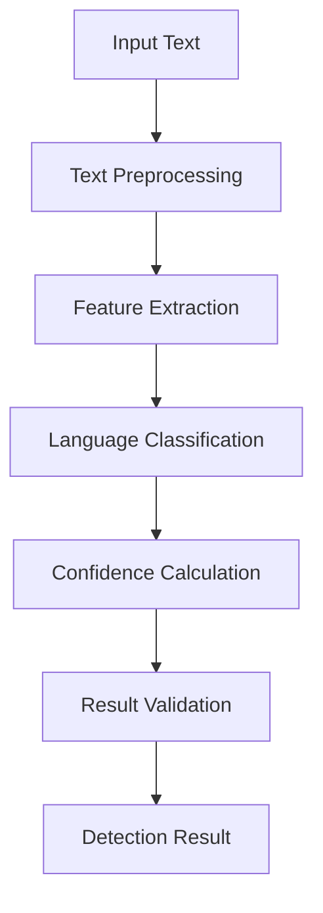
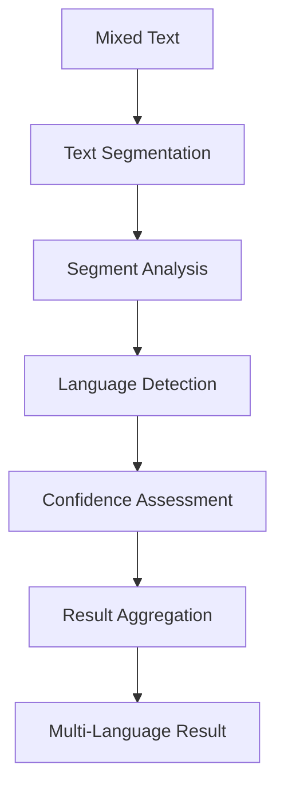
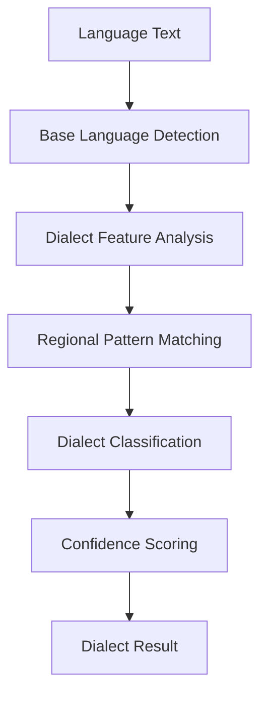

# **Language Detector**

## **Overview**

The Language Detector module provides comprehensive capabilities for automatically detecting and classifying languages in text content. It supports 100+ languages and dialects with high accuracy and confidence scoring, enabling intelligent language-aware processing across the kOS ecosystem.

## **Core Principles**

### **Universal Language Support**
- **Multi-Language Coverage**: Support for 100+ languages and dialects
- **Confidence Scoring**: Provide confidence scores for all detections
- **Dialect Recognition**: Recognize regional dialects and variations
- **Mixed Language**: Handle mixed-language content gracefully

### **High Performance**
- **Fast Detection**: < 100ms detection time for most languages
- **High Accuracy**: 99%+ accuracy for supported languages
- **Real-time Processing**: Real-time detection for streaming content
- **Scalability**: Horizontal and vertical scaling capabilities

### **Intelligent Processing**
- **Context Awareness**: Context-aware language detection
- **Statistical Analysis**: Statistical analysis for improved accuracy
- **Machine Learning**: Machine learning-based detection algorithms
- **Continuous Learning**: Continuous learning and improvement

## **Function Specifications**

### **Primary Functions**

#### **detectLanguage(text: string, options?: DetectionOptions): DetectionResult**
- **Purpose**: Detect the primary language of input text
- **Parameters**:
  - `text`: Input text for language detection
  - `options`: Optional detection configuration
- **Returns**: Detection result with language code, confidence score, and metadata
- **Performance**: < 100ms detection time, 99%+ accuracy

#### **detectLanguages(text: string, options?: MultiDetectionOptions): MultiDetectionResult**
- **Purpose**: Detect multiple languages in mixed-language text
- **Parameters**:
  - `text`: Input text for multi-language detection
  - `options`: Optional multi-detection configuration
- **Returns**: Array of detected languages with confidence scores
- **Performance**: < 200ms detection time, 95%+ accuracy

#### **getConfidenceScore(text: string, language: string): number**
- **Purpose**: Get confidence score for a specific language
- **Parameters**:
  - `text`: Input text for confidence assessment
  - `language`: Target language code
- **Returns**: Confidence score between 0 and 1
- **Performance**: < 50ms calculation time

#### **detectDialect(text: string, language: string): DialectResult**
- **Purpose**: Detect regional dialect within a language
- **Parameters**:
  - `text`: Input text for dialect detection
  - `language`: Base language code
- **Returns**: Dialect information with region and confidence
- **Performance**: < 150ms detection time

### **Configuration Functions**

#### **configureDetection(options: DetectionConfig): void**
- **Purpose**: Configure language detection parameters
- **Parameters**:
  - `options`: Detection configuration object
- **Returns**: void
- **Performance**: < 10ms configuration time

#### **addCustomLanguage(language: CustomLanguage): void**
- **Purpose**: Add custom language detection rules
- **Parameters**:
  - `language`: Custom language configuration
- **Returns**: void
- **Performance**: < 50ms addition time

## **Integration Patterns**

### **Basic Language Detection**


### **Multi-Language Detection**


### **Dialect Detection**


## **Capabilities**

### **Language Detection**
- **100+ Languages**: Support for 100+ languages and dialects
- **Confidence Scoring**: Provide confidence scores for all detections
- **Fast Detection**: < 100ms detection time for most languages
- **High Accuracy**: 99%+ accuracy for supported languages
- **Real-time Processing**: Real-time detection for streaming content

### **Multi-Language Support**
- **Mixed Language**: Handle mixed-language content gracefully
- **Language Boundaries**: Detect language boundaries in mixed text
- **Segment Analysis**: Analyze individual segments for language detection
- **Confidence Aggregation**: Aggregate confidence scores across segments

### **Dialect Recognition**
- **Regional Dialects**: Recognize regional dialects and variations
- **Cultural Variations**: Detect cultural and regional language variations
- **Accent Patterns**: Identify accent and pronunciation patterns
- **Regional Scoring**: Provide regional confidence scores

### **Advanced Features**
- **Context Awareness**: Context-aware language detection
- **Statistical Analysis**: Statistical analysis for improved accuracy
- **Machine Learning**: Machine learning-based detection algorithms
- **Continuous Learning**: Continuous learning and improvement

## **Configuration Examples**

### **Basic Configuration**
```yaml
language_detection:
  supported_languages:
    - "en"  # English
    - "es"  # Spanish
    - "fr"  # French
    - "de"  # German
    - "zh"  # Chinese
    - "ja"  # Japanese
    - "ko"  # Korean
    - "ar"  # Arabic
  detection:
    confidence_threshold: 0.8
    mixed_language_support: true
    dialect_recognition: true
    real_time_processing: true
  performance:
    detection_timeout: "100ms"
    batch_processing: true
    cache_enabled: true
    cache_ttl: "1h"
```

### **Advanced Configuration**
```yaml
language_detection:
  models:
    primary_model: "fasttext"
    fallback_model: "langdetect"
    custom_models: ["custom_rule_based", "ml_ensemble"]
  features:
    n_gram_analysis: true
    character_distribution: true
    word_frequency: true
    syntax_patterns: true
  learning:
    continuous_learning: true
    feedback_integration: true
    model_updates: true
    accuracy_tracking: true
  optimization:
    parallel_processing: true
    memory_optimization: true
    cpu_optimization: true
    gpu_acceleration: false
```

### **Custom Language Configuration**
```yaml
custom_languages:
  - name: "custom_dialect"
    base_language: "en"
    region: "custom_region"
    features:
      - "custom_vocabulary"
      - "regional_patterns"
      - "cultural_terms"
    confidence_threshold: 0.7
    detection_rules:
      - pattern: "custom_pattern"
        weight: 0.8
      - vocabulary: "custom_words"
        weight: 0.6
```

## **Error Handling**

### **Detection Errors**
- **Detection Failures**: Fallback to statistical detection methods
- **Low Confidence**: Request human review for low-confidence detections
- **Unknown Language**: Return "unknown" with confidence score
- **Processing Errors**: Error isolation and recovery procedures

### **Configuration Errors**
- **Invalid Configuration**: Configuration validation and error reporting
- **Model Errors**: Automatic model switching and fallback
- **Resource Errors**: Resource management and optimization
- **Performance Errors**: Performance monitoring and optimization

### **Integration Errors**
- **API Errors**: API error handling and retry mechanisms
- **Timeout Errors**: Timeout handling and fallback procedures
- **Memory Errors**: Memory management and garbage collection
- **Network Errors**: Network error handling and recovery

## **Performance Considerations**

### **Detection Performance**
- **Detection Speed**: < 100ms for most languages
- **Accuracy**: 99%+ accuracy for supported languages
- **Throughput**: 10,000+ detections per second
- **Memory Usage**: Efficient memory management and caching

### **Multi-Language Performance**
- **Detection Speed**: < 200ms for multi-language detection
- **Accuracy**: 95%+ accuracy for mixed-language content
- **Segmentation**: Efficient text segmentation and analysis
- **Aggregation**: Fast confidence score aggregation

### **Dialect Performance**
- **Detection Speed**: < 150ms for dialect detection
- **Accuracy**: 90%+ accuracy for dialect recognition
- **Pattern Matching**: Efficient pattern matching algorithms
- **Regional Analysis**: Fast regional analysis and classification

### **Scalability**
- **Horizontal Scaling**: Horizontal scaling for high-volume processing
- **Vertical Scaling**: Vertical scaling for resource optimization
- **Load Balancing**: Intelligent load balancing and distribution
- **Resource Management**: Efficient resource allocation and management

## **Monitoring & Observability**

### **Detection Metrics**
- **Detection Accuracy**: Accuracy rates by language and confidence
- **Detection Speed**: Average detection time and throughput
- **Error Rates**: Error rates and failure analysis
- **Language Distribution**: Distribution of detected languages

### **Performance Metrics**
- **Processing Speed**: Average processing time and throughput
- **Memory Usage**: Memory usage and optimization metrics
- **CPU Usage**: CPU usage and optimization metrics
- **Throughput**: Overall system throughput and capacity

### **Quality Metrics**
- **Confidence Distribution**: Distribution of confidence scores
- **False Positives**: False positive rates and analysis
- **False Negatives**: False negative rates and analysis
- **Accuracy Trends**: Accuracy improvement trends over time

### **Operational Metrics**
- **System Health**: Overall system health and availability
- **Resource Utilization**: Resource utilization and optimization
- **Error Tracking**: Error tracking and analysis
- **Performance Trends**: Performance trends and optimization

## **Security Considerations**

### **Data Privacy**
- **Text Privacy**: End-to-end encryption for text content
- **Language Privacy**: Privacy protection for language detection data
- **Consent Management**: User consent for language detection
- **Data Retention**: Configurable retention policies

### **Access Control**
- **Authentication**: Strong authentication for language detection services
- **Authorization**: Role-based access control for detection functions
- **API Security**: Secure API access and rate limiting
- **Audit Logging**: Comprehensive audit trails for all operations

### **Content Security**
- **Input Validation**: Comprehensive input validation and sanitization
- **Malware Detection**: Detection of malicious content in text
- **Content Filtering**: Automatic filtering of inappropriate content
- **Output Validation**: Validation of detection outputs and results

---

**Version**: 1.0  
**Category**: Communication & Language  
**Subcategory**: Language Services  
**Focus**: Automatic language detection and classification with high accuracy and performance 