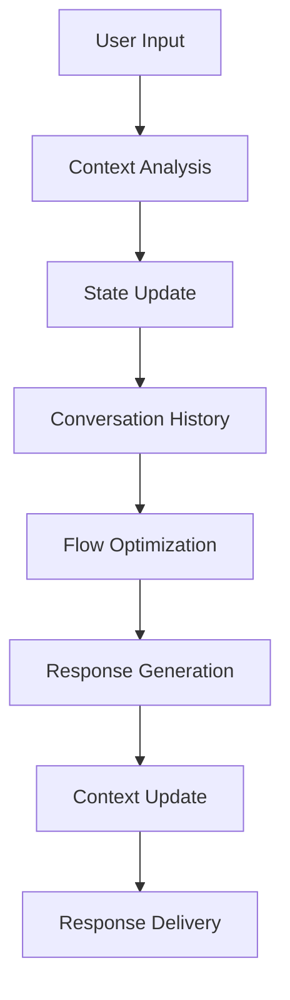
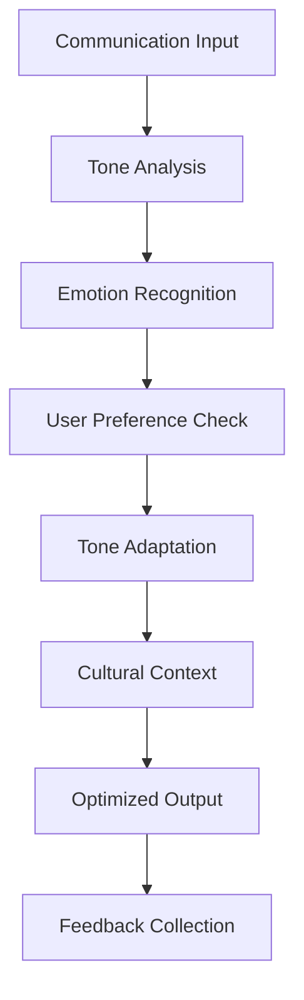
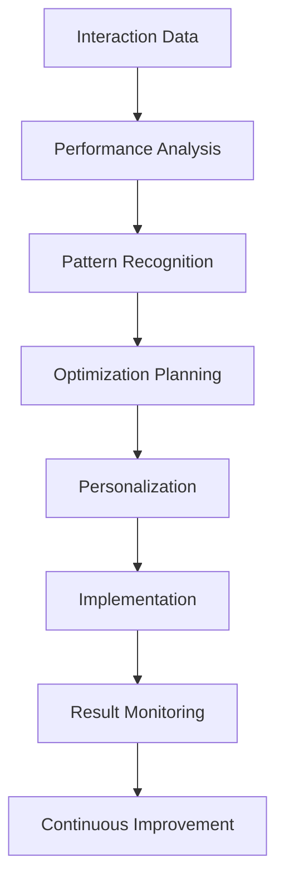
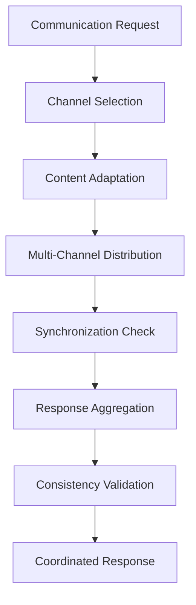

# **Interaction Management**

## **Overview**

The Interaction Management subcategory provides comprehensive capabilities for managing conversations, tone analysis, interaction optimization, and communication coordination. These modules form the foundation for intelligent conversation management and communication flow optimization in the kOS ecosystem.

## **Core Principles**

### **Conversation Intelligence**
- **Context Awareness**: Maintain conversation context across interactions
- **State Management**: Track conversation state and user preferences
- **Flow Optimization**: Optimize conversation flows for better outcomes
- **Personalization**: Personalized interaction based on user history

### **Tone & Emotion Management**
- **Tone Analysis**: Real-time tone analysis and emotional intelligence
- **Emotion Recognition**: Recognize and respond to emotional states
- **Tone Adaptation**: Adapt communication tone to user preferences
- **Cultural Sensitivity**: Culturally sensitive tone management

### **Communication Coordination**
- **Multi-Channel Support**: Coordinate communication across multiple channels
- **Channel Optimization**: Optimize communication for different channels
- **Synchronization**: Synchronize communication across platforms
- **Integration Management**: Manage integration with external communication systems

## **Function Specifications**

### **Conversation Management**
- **Purpose**: Manage conversation flows and maintain context across interactions
- **Capabilities**: Context tracking, state management, flow optimization, personalization
- **Integration**: Conversation engines, state machines, context databases
- **Performance**: < 50ms context switching, persistent state management

### **Tone Management**
- **Purpose**: Analyze and manage communication tone and emotional intelligence
- **Capabilities**: Tone analysis, emotion recognition, tone adaptation, cultural sensitivity
- **Integration**: NLP engines, emotion models, tone analysis algorithms
- **Performance**: < 100ms tone analysis, real-time adaptation

### **Interaction Optimization**
- **Purpose**: Optimize interactions for better user experience and outcomes
- **Capabilities**: Interaction analysis, optimization algorithms, personalization, A/B testing
- **Integration**: Analytics engines, optimization algorithms, personalization models
- **Performance**: < 200ms optimization decisions, continuous improvement

### **Communication Coordination**
- **Purpose**: Coordinate communication across multiple channels and platforms
- **Capabilities**: Multi-channel coordination, channel optimization, synchronization
- **Integration**: Communication APIs, channel managers, synchronization engines
- **Performance**: < 100ms coordination, seamless multi-channel experience

## **Integration Patterns**

### **Conversation Management Flow**


### **Tone Management Flow**


### **Interaction Optimization Flow**


### **Communication Coordination Flow**


## **Capabilities**

### **Conversation Management**
- **Context Tracking**: Track conversation context across multiple interactions
- **State Management**: Manage conversation state and user session data
- **Flow Optimization**: Optimize conversation flows for better outcomes
- **Personalization**: Personalized interactions based on user history and preferences
- **Memory Management**: Intelligent memory management for long conversations

### **Tone Analysis & Management**
- **Real-time Analysis**: Real-time tone analysis and emotional intelligence
- **Emotion Recognition**: Recognize and respond to user emotional states
- **Tone Adaptation**: Adapt communication tone to user preferences and context
- **Cultural Sensitivity**: Culturally sensitive tone management and adaptation
- **Sentiment Tracking**: Track sentiment changes throughout conversations

### **Interaction Optimization**
- **Performance Analysis**: Analyze interaction performance and effectiveness
- **Pattern Recognition**: Recognize patterns in user interactions and preferences
- **Optimization Algorithms**: Apply optimization algorithms for better outcomes
- **Personalization**: Personalized interaction strategies based on user data
- **A/B Testing**: A/B testing for interaction optimization

### **Communication Coordination**
- **Multi-Channel Support**: Coordinate communication across multiple channels
- **Channel Optimization**: Optimize communication for different channels and platforms
- **Synchronization**: Synchronize communication across multiple platforms
- **Integration Management**: Manage integration with external communication systems
- **Consistency Management**: Maintain consistency across all communication channels

## **Configuration Examples**

### **Conversation Management Configuration**
```yaml
conversation_management:
  context:
    max_context_length: 1000
    context_persistence: true
    context_compression: true
    memory_optimization: true
  state_management:
    session_timeout: "30m"
    state_persistence: true
    state_compression: true
    backup_frequency: "5m"
  personalization:
    user_profiles: true
    preference_learning: true
    adaptive_responses: true
    history_tracking: true
  performance:
    context_switching: "< 50ms"
    state_updates: "< 10ms"
    memory_usage: "optimized"
    scalability: "horizontal"
```

### **Tone Management Configuration**
```yaml
tone_management:
  analysis:
    real_time_analysis: true
    emotion_recognition: true
    sentiment_tracking: true
    cultural_adaptation: true
  models:
    tone_model: "bert-base"
    emotion_model: "roberta-base"
    sentiment_model: "distilbert"
    cultural_model: "multilingual-bert"
  adaptation:
    tone_adaptation: true
    emotion_response: true
    cultural_sensitivity: true
    preference_learning: true
  performance:
    analysis_speed: "< 100ms"
    adaptation_speed: "< 50ms"
    accuracy: "95%+"
    real_time: true
```

### **Interaction Optimization Configuration**
```yaml
interaction_optimization:
  analysis:
    performance_tracking: true
    pattern_recognition: true
    user_behavior_analysis: true
    outcome_measurement: true
  optimization:
    algorithm_selection: "adaptive"
    personalization_level: "high"
    a_b_testing: true
    continuous_improvement: true
  learning:
    machine_learning: true
    reinforcement_learning: true
    user_feedback_integration: true
    adaptive_algorithms: true
  performance:
    optimization_speed: "< 200ms"
    learning_rate: "adaptive"
    accuracy_improvement: "continuous"
    scalability: "horizontal"
```

### **Communication Coordination Configuration**
```yaml
communication_coordination:
  channels:
    supported_channels:
      - "web"
      - "mobile"
      - "email"
      - "sms"
      - "voice"
      - "chat"
    channel_optimization: true
    cross_channel_sync: true
  coordination:
    multi_channel_coordination: true
    content_adaptation: true
    response_aggregation: true
    consistency_validation: true
  integration:
    external_apis: true
    platform_integration: true
    synchronization: true
    error_handling: true
  performance:
    coordination_speed: "< 100ms"
    sync_accuracy: "99.9%"
    channel_availability: "99.9%"
    response_time: "< 500ms"
```

## **Error Handling**

### **Conversation Management Errors**
- **Context Loss**: Automatic context recovery and reconstruction
- **State Corruption**: State validation and repair procedures
- **Memory Issues**: Memory optimization and garbage collection
- **Session Failures**: Session recovery and continuity management

### **Tone Management Errors**
- **Analysis Failures**: Fallback to basic tone analysis methods
- **Model Errors**: Automatic model switching and fallback
- **Cultural Errors**: Cultural validation and correction procedures
- **Adaptation Failures**: Graceful degradation with default tone

### **Interaction Optimization Errors**
- **Optimization Failures**: Fallback to standard interaction patterns
- **Learning Errors**: Learning algorithm validation and correction
- **Performance Issues**: Performance monitoring and optimization
- **A/B Testing Errors**: Test validation and result verification

### **Communication Coordination Errors**
- **Channel Failures**: Automatic channel failover and recovery
- **Sync Errors**: Synchronization validation and repair
- **Integration Errors**: Integration error isolation and recovery
- **Consistency Errors**: Consistency validation and correction

## **Performance Considerations**

### **Conversation Management Performance**
- **Context Switching**: < 50ms for context switching operations
- **State Management**: < 10ms for state updates and persistence
- **Memory Usage**: Efficient memory management and optimization
- **Scalability**: Horizontal scaling for high-volume conversations

### **Tone Management Performance**
- **Analysis Speed**: < 100ms for real-time tone analysis
- **Adaptation Speed**: < 50ms for tone adaptation decisions
- **Accuracy**: 95%+ accuracy for tone and emotion recognition
- **Real-time Processing**: Real-time processing for live interactions

### **Interaction Optimization Performance**
- **Optimization Speed**: < 200ms for optimization decisions
- **Learning Rate**: Adaptive learning rate for continuous improvement
- **Accuracy Improvement**: Continuous accuracy improvement over time
- **Scalability**: Horizontal scaling for optimization algorithms

### **Communication Coordination Performance**
- **Coordination Speed**: < 100ms for multi-channel coordination
- **Sync Accuracy**: 99.9% accuracy for cross-channel synchronization
- **Channel Availability**: 99.9% availability for all channels
- **Response Time**: < 500ms for coordinated responses

## **Monitoring & Observability**

### **Conversation Management Metrics**
- **Context Performance**: Context switching speed and accuracy
- **State Management**: State update performance and reliability
- **Memory Usage**: Memory usage and optimization metrics
- **User Satisfaction**: User satisfaction and engagement metrics

### **Tone Management Metrics**
- **Analysis Accuracy**: Tone and emotion analysis accuracy rates
- **Adaptation Performance**: Tone adaptation effectiveness metrics
- **Cultural Sensitivity**: Cultural adaptation and sensitivity metrics
- **User Feedback**: User feedback on tone and emotional intelligence

### **Interaction Optimization Metrics**
- **Optimization Effectiveness**: Optimization algorithm effectiveness
- **Learning Performance**: Learning algorithm performance metrics
- **User Engagement**: User engagement and satisfaction improvements
- **Outcome Measurement**: Outcome measurement and success metrics

### **Communication Coordination Metrics**
- **Coordination Performance**: Multi-channel coordination performance
- **Sync Accuracy**: Cross-channel synchronization accuracy
- **Channel Performance**: Individual channel performance metrics
- **Integration Performance**: External integration performance metrics

## **Security Considerations**

### **Data Privacy**
- **Conversation Privacy**: End-to-end encryption for conversation data
- **User Anonymization**: Anonymization of sensitive conversation content
- **Consent Management**: User consent for conversation analysis and optimization
- **Data Retention**: Configurable retention policies for conversation data

### **Access Control**
- **Authentication**: Strong authentication for interaction management services
- **Authorization**: Role-based access control for different management functions
- **API Security**: Secure API access and rate limiting
- **Audit Logging**: Comprehensive audit trails for all interaction operations

### **Content Security**
- **Content Filtering**: Automatic filtering of inappropriate content
- **Malware Detection**: Detection of malicious content in interactions
- **Input Validation**: Comprehensive input validation and sanitization
- **Output Validation**: Validation of interaction outputs and responses

---

**Version**: 1.0  
**Category**: Communication & Language  
**Subcategory**: Interaction Management  
**Focus**: Comprehensive conversation management, tone analysis, and communication coordination 