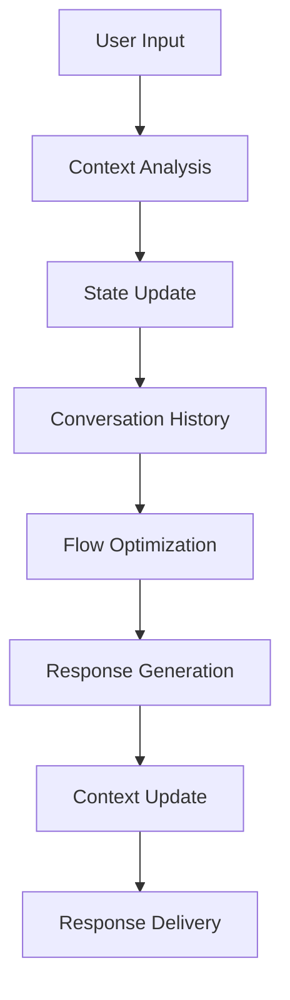
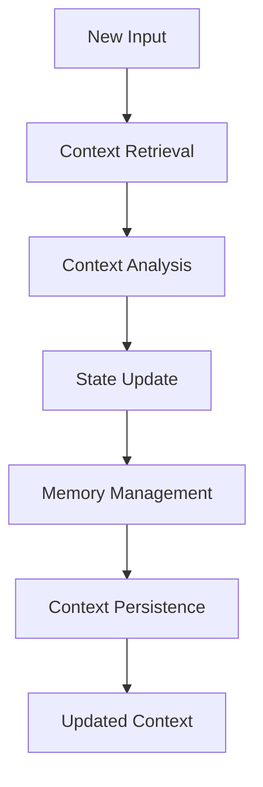
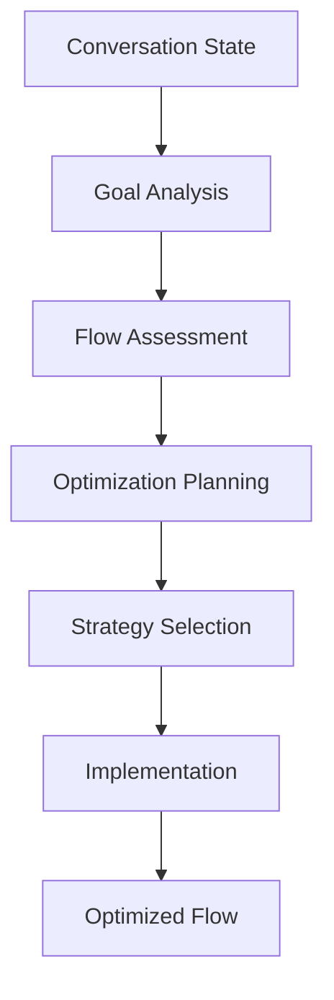

# **Conversation Manager**

## **Overview**

The Conversation Manager module provides comprehensive capabilities for managing conversation flows, maintaining context across interactions, and optimizing conversation outcomes. It enables intelligent conversation management with context awareness and personalized interactions.

## **Core Principles**

### **Context Awareness**
- **Context Tracking**: Track conversation context across multiple interactions
- **State Management**: Manage conversation state and user session data
- **Memory Management**: Intelligent memory management for long conversations
- **Context Persistence**: Persistent context storage and retrieval

### **Flow Optimization**
- **Flow Management**: Optimize conversation flows for better outcomes
- **Personalization**: Personalized interactions based on user history
- **Adaptive Responses**: Adaptive responses based on conversation context
- **Goal Tracking**: Track conversation goals and progress

### **High Performance**
- **Fast Context Switching**: < 50ms context switching time
- **Efficient State Management**: < 10ms state update time
- **Real-time Processing**: Real-time conversation management
- **Scalability**: Horizontal and vertical scaling capabilities

## **Function Specifications**

### **Primary Functions**

#### **manageConversation(input: ConversationInput, context?: ConversationContext): ConversationResult**
- **Purpose**: Manage conversation flow and maintain context
- **Parameters**:
  - `input`: User input for conversation management
  - `context`: Optional conversation context
- **Returns**: Conversation result with response and updated context
- **Performance**: < 50ms context switching, persistent state management

#### **updateContext(context: ConversationContext, input: string): UpdatedContext**
- **Purpose**: Update conversation context with new input
- **Parameters**:
  - `context`: Current conversation context
  - `input`: New user input
- **Returns**: Updated conversation context
- **Performance**: < 10ms context update time

#### **getConversationHistory(userId: string, limit?: number): ConversationHistory**
- **Purpose**: Retrieve conversation history for a user
- **Parameters**:
  - `userId`: User identifier
  - `limit`: Optional limit for history length
- **Returns**: Conversation history with context and metadata
- **Performance**: < 100ms retrieval time

#### **optimizeFlow(conversation: Conversation, goal: ConversationGoal): FlowOptimization**
- **Purpose**: Optimize conversation flow for better outcomes
- **Parameters**:
  - `conversation`: Current conversation state
  - `goal`: Conversation goal or objective
- **Returns**: Flow optimization recommendations
- **Performance**: < 200ms optimization time

### **Configuration Functions**

#### **configureConversation(options: ConversationConfig): void**
- **Purpose**: Configure conversation management parameters
- **Parameters**:
  - `options`: Conversation configuration object
- **Returns**: void
- **Performance**: < 10ms configuration time

#### **addConversationRule(rule: ConversationRule): void**
- **Purpose**: Add custom conversation management rules
- **Parameters**:
  - `rule`: Custom conversation rule
- **Returns**: void
- **Performance**: < 50ms addition time

## **Integration Patterns**

### **Conversation Management Flow**


### **Context Management Flow**


### **Flow Optimization Flow**


## **Capabilities**

### **Conversation Management**
- **Context Tracking**: Track conversation context across multiple interactions
- **State Management**: Manage conversation state and user session data
- **Flow Optimization**: Optimize conversation flows for better outcomes
- **Personalization**: Personalized interactions based on user history and preferences
- **Memory Management**: Intelligent memory management for long conversations

### **Advanced Features**
- **Context Awareness**: Context-aware conversation management
- **Adaptive Responses**: Adaptive responses based on conversation context
- **Goal Tracking**: Track conversation goals and progress
- **Flow Analytics**: Analytics for conversation flow optimization
- **Multi-turn Support**: Support for complex multi-turn conversations

### **Context Management**
- **Context Persistence**: Persistent context storage and retrieval
- **Context Compression**: Intelligent context compression and optimization
- **Context Validation**: Context validation and integrity checking
- **Context Recovery**: Context recovery and reconstruction
- **Context Synchronization**: Context synchronization across sessions

### **Flow Optimization**
- **Flow Analysis**: Analysis of conversation flow effectiveness
- **Optimization Algorithms**: Optimization algorithms for better outcomes
- **Strategy Selection**: Intelligent strategy selection for conversations
- **Performance Monitoring**: Performance monitoring and optimization
- **Continuous Improvement**: Continuous improvement of conversation flows

## **Configuration Examples**

### **Basic Conversation Configuration**
```yaml
conversation_management:
  context:
    max_context_length: 1000
    context_persistence: true
    context_compression: true
    memory_optimization: true
  state_management:
    session_timeout: "30m"
    state_persistence: true
    state_compression: true
    backup_frequency: "5m"
  personalization:
    user_profiles: true
    preference_learning: true
    adaptive_responses: true
    history_tracking: true
  performance:
    context_switching: "< 50ms"
    state_updates: "< 10ms"
    memory_usage: "optimized"
    scalability: "horizontal"
```

### **Advanced Conversation Configuration**
```yaml
conversation_management:
  context:
    hierarchical_context: true
    context_relationships: true
    context_validation: true
    context_recovery: true
  optimization:
    flow_optimization: true
    goal_tracking: true
    strategy_selection: true
    performance_monitoring: true
  learning:
    conversation_learning: true
    pattern_recognition: true
    adaptive_strategies: true
    continuous_improvement: true
  analytics:
    flow_analytics: true
    performance_metrics: true
    user_behavior_analysis: true
    optimization_insights: true
```

### **Context Management Configuration**
```yaml
context_management:
  storage:
    persistence_type: "database"
    compression_enabled: true
    encryption_enabled: true
    backup_enabled: true
  optimization:
    context_compression: true
    memory_optimization: true
    garbage_collection: true
    cache_management: true
  validation:
    context_validation: true
    integrity_checking: true
    consistency_validation: true
    error_recovery: true
  synchronization:
    cross_session_sync: true
    real_time_sync: true
    conflict_resolution: true
    sync_validation: true
```

## **Error Handling**

### **Conversation Errors**
- **Context Loss**: Automatic context recovery and reconstruction
- **State Corruption**: State validation and repair procedures
- **Memory Issues**: Memory optimization and garbage collection
- **Session Failures**: Session recovery and continuity management

### **Flow Optimization Errors**
- **Optimization Failures**: Fallback to standard conversation flows
- **Goal Conflicts**: Goal conflict resolution and validation
- **Strategy Errors**: Strategy validation and correction
- **Performance Issues**: Performance monitoring and optimization

### **Context Management Errors**
- **Context Corruption**: Context validation and repair procedures
- **Storage Errors**: Storage error handling and recovery
- **Sync Errors**: Synchronization error handling and recovery
- **Validation Errors**: Context validation and correction

### **Configuration Errors**
- **Invalid Configuration**: Configuration validation and error reporting
- **Rule Errors**: Rule validation and correction
- **Resource Errors**: Resource management and optimization
- **Performance Errors**: Performance monitoring and optimization

## **Performance Considerations**

### **Conversation Management Performance**
- **Context Switching**: < 50ms for context switching operations
- **State Management**: < 10ms for state updates and persistence
- **Memory Usage**: Efficient memory management and optimization
- **Scalability**: Horizontal scaling for high-volume conversations

### **Context Management Performance**
- **Context Retrieval**: < 20ms for context retrieval operations
- **Context Persistence**: < 10ms for context persistence operations
- **Memory Optimization**: Efficient memory usage and optimization
- **Storage Performance**: Fast storage and retrieval operations

### **Flow Optimization Performance**
- **Optimization Speed**: < 200ms for flow optimization decisions
- **Strategy Selection**: Fast strategy selection and implementation
- **Performance Monitoring**: Real-time performance monitoring
- **Continuous Improvement**: Efficient continuous improvement processes

### **Scalability**
- **Horizontal Scaling**: Horizontal scaling for high-volume conversations
- **Vertical Scaling**: Vertical scaling for resource optimization
- **Load Balancing**: Intelligent load balancing and distribution
- **Resource Management**: Efficient resource allocation and management

## **Monitoring & Observability**

### **Conversation Metrics**
- **Context Performance**: Context switching speed and accuracy
- **State Management**: State update performance and reliability
- **Memory Usage**: Memory usage and optimization metrics
- **User Satisfaction**: User satisfaction and engagement metrics

### **Flow Optimization Metrics**
- **Optimization Effectiveness**: Flow optimization effectiveness
- **Goal Achievement**: Goal achievement rates and success metrics
- **Strategy Performance**: Strategy performance and effectiveness
- **Performance Improvement**: Performance improvement trends

### **Context Management Metrics**
- **Context Performance**: Context management performance and reliability
- **Storage Performance**: Storage performance and efficiency
- **Sync Performance**: Synchronization performance and accuracy
- **Validation Performance**: Context validation performance and accuracy

### **Operational Metrics**
- **System Health**: Overall system health and availability
- **Resource Utilization**: Resource utilization and optimization
- **Error Tracking**: Error tracking and analysis
- **Performance Trends**: Performance trends and optimization

## **Security Considerations**

### **Data Privacy**
- **Conversation Privacy**: End-to-end encryption for conversation data
- **Context Privacy**: Privacy protection for conversation context
- **User Privacy**: User privacy protection and anonymization
- **Data Retention**: Configurable retention policies

### **Access Control**
- **Authentication**: Strong authentication for conversation services
- **Authorization**: Role-based access control for conversation functions
- **API Security**: Secure API access and rate limiting
- **Audit Logging**: Comprehensive audit trails for all operations

### **Content Security**
- **Input Validation**: Comprehensive input validation and sanitization
- **Content Filtering**: Automatic filtering of inappropriate content
- **Context Security**: Context security and integrity protection
- **Output Validation**: Validation of conversation outputs and responses

---

**Version**: 1.0  
**Category**: Communication & Language  
**Subcategory**: Interaction Management  
**Focus**: Intelligent conversation management with context awareness and flow optimization 