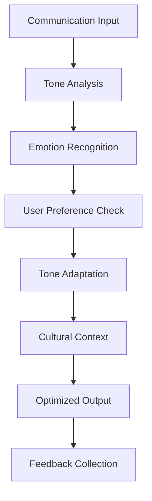
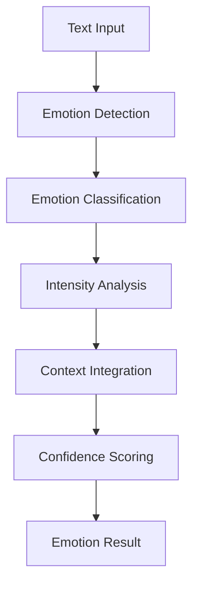
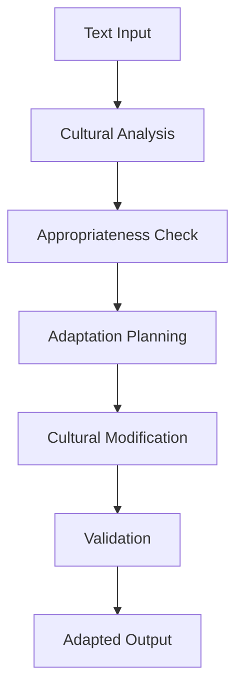

# **Tone Manager**

## **Overview**

The Tone Manager module provides comprehensive capabilities for analyzing communication tone, recognizing emotions, adapting tone to user preferences, and ensuring culturally sensitive communication. It enables intelligent tone management with real-time analysis and adaptation.

## **Core Principles**

### **Emotional Intelligence**
- **Tone Analysis**: Real-time tone analysis and emotional intelligence
- **Emotion Recognition**: Recognize and respond to emotional states
- **Tone Adaptation**: Adapt communication tone to user preferences
- **Cultural Sensitivity**: Culturally sensitive tone management

### **Real-time Processing**
- **Fast Analysis**: < 100ms tone analysis time
- **Real-time Adaptation**: Real-time tone adaptation and adjustment
- **High Accuracy**: 95%+ accuracy for tone and emotion recognition
- **Continuous Learning**: Continuous learning and improvement

### **Cultural Awareness**
- **Cultural Adaptation**: Cultural adaptation and sensitivity
- **Regional Variations**: Regional tone and communication variations
- **Cultural Validation**: Cultural validation and appropriateness
- **Multicultural Support**: Support for multiple cultures and regions

## **Function Specifications**

### **Primary Functions**

#### **analyzeTone(text: string, context?: ToneContext): ToneAnalysisResult**
- **Purpose**: Analyze tone and emotional content of text
- **Parameters**:
  - `text`: Input text for tone analysis
  - `context`: Optional context for tone analysis
- **Returns**: Tone analysis result with emotional content and confidence
- **Performance**: < 100ms analysis time, 95%+ accuracy

#### **recognizeEmotion(text: string, emotionTypes?: string[]): EmotionRecognitionResult**
- **Purpose**: Recognize emotional states in communication
- **Parameters**:
  - `text`: Input text for emotion recognition
  - `emotionTypes`: Optional emotion types to recognize
- **Returns**: Recognized emotions with confidence scores
- **Performance**: < 80ms recognition time, high accuracy

#### **adaptTone(text: string, targetTone: string, userPreferences?: UserPreferences): ToneAdaptationResult**
- **Purpose**: Adapt communication tone to target tone and user preferences
- **Parameters**:
  - `text`: Input text for tone adaptation
  - `targetTone`: Target tone for adaptation
  - `userPreferences`: Optional user preferences
- **Returns**: Tone-adapted text with adaptation notes
- **Performance**: < 50ms adaptation time

#### **validateCulturalAppropriateness(text: string, culture: string): CulturalValidationResult**
- **Purpose**: Validate cultural appropriateness of communication
- **Parameters**:
  - `text`: Input text for cultural validation
  - `culture`: Target culture for validation
- **Returns**: Cultural validation result with appropriateness score
- **Performance**: < 120ms validation time

### **Configuration Functions**

#### **configureTone(options: ToneConfig): void**
- **Purpose**: Configure tone analysis and management parameters
- **Parameters**:
  - `options`: Tone configuration object
- **Returns**: void
- **Performance**: < 10ms configuration time

#### **addCulturalRule(rule: CulturalRule): void**
- **Purpose**: Add custom cultural tone rules
- **Parameters**:
  - `rule`: Custom cultural rule
- **Returns**: void
- **Performance**: < 50ms addition time

## **Integration Patterns**

### **Tone Analysis Flow**


### **Emotion Recognition Flow**


### **Cultural Adaptation Flow**


## **Capabilities**

### **Tone Analysis**
- **Real-time Analysis**: Real-time tone analysis and emotional intelligence
- **Emotion Recognition**: Recognize and track emotional states and changes
- **Tone Tracking**: Track tone changes throughout conversations
- **Sentiment Analysis**: Sentiment analysis and emotional intelligence
- **Predictive Tone**: Predictive tone analysis for future communications

### **Tone Adaptation**
- **Tone Adaptation**: Adapt communication tone to user preferences and context
- **Emotion Response**: Emotion-aware response generation
- **Cultural Sensitivity**: Culturally sensitive tone management and adaptation
- **Preference Learning**: Learning and adaptation to user tone preferences
- **Context Awareness**: Context-aware tone adaptation

### **Cultural Intelligence**
- **Cultural Adaptation**: Cultural adaptation and sensitivity
- **Regional Variations**: Regional tone and communication variations
- **Cultural Validation**: Cultural validation and appropriateness checking
- **Multicultural Support**: Support for multiple cultures and regions
- **Cultural Learning**: Learning and adaptation to cultural differences

### **Advanced Features**
- **Multi-language Tone**: Multi-language tone analysis and adaptation
- **Voice Tone**: Voice tone analysis and adaptation
- **Visual Tone**: Visual tone analysis for images and videos
- **Cross-modal Tone**: Cross-modal tone analysis and adaptation
- **Tone Analytics**: Analytics for tone effectiveness and improvement

## **Configuration Examples**

### **Basic Tone Configuration**
```yaml
tone_management:
  analysis:
    real_time_analysis: true
    emotion_recognition: true
    sentiment_tracking: true
    cultural_adaptation: true
  models:
    tone_model: "bert-base"
    emotion_model: "roberta-base"
    sentiment_model: "distilbert"
    cultural_model: "multilingual-bert"
  adaptation:
    tone_adaptation: true
    emotion_response: true
    cultural_sensitivity: true
    preference_learning: true
  performance:
    analysis_speed: "< 100ms"
    adaptation_speed: "< 50ms"
    accuracy: "95%+"
    real_time: true
```

### **Advanced Tone Configuration**
```yaml
tone_management:
  models:
    primary_model: "transformer"
    emotion_model: "lstm"
    cultural_model: "multilingual"
    adaptive_model: "reinforcement_learning"
  features:
    multi_language: true
    voice_tone: true
    visual_tone: true
    cross_modal: true
  learning:
    continuous_learning: true
    feedback_integration: true
    preference_learning: true
    cultural_learning: true
  analytics:
    tone_analytics: true
    effectiveness_tracking: true
    improvement_insights: true
    performance_metrics: true
```

### **Cultural Intelligence Configuration**
```yaml
cultural_intelligence:
  cultures:
    supported_cultures:
      - "en-US"
      - "en-GB"
      - "es-ES"
      - "es-MX"
      - "fr-FR"
      - "fr-CA"
      - "de-DE"
      - "zh-CN"
      - "ja-JP"
      - "ko-KR"
  adaptation:
    cultural_sensitivity: true
    regional_variations: true
    appropriateness_checking: true
    cultural_validation: true
  learning:
    cultural_learning: true
    feedback_integration: true
    adaptation_improvement: true
    cultural_insights: true
```

## **Error Handling**

### **Tone Analysis Errors**
- **Analysis Failures**: Fallback to basic tone analysis methods
- **Model Errors**: Automatic model switching and fallback
- **Cultural Errors**: Cultural validation and correction procedures
- **Adaptation Failures**: Graceful degradation with default tone

### **Emotion Recognition Errors**
- **Recognition Failures**: Fallback to statistical recognition methods
- **Low Confidence**: Request clarification for low-confidence emotions
- **Emotion Conflicts**: Emotion conflict resolution and validation
- **Context Errors**: Context validation and correction

### **Cultural Adaptation Errors**
- **Cultural Failures**: Cultural validation and fallback procedures
- **Appropriateness Errors**: Appropriateness validation and correction
- **Regional Errors**: Regional validation and adaptation
- **Learning Errors**: Learning algorithm validation and correction

### **Configuration Errors**
- **Invalid Configuration**: Configuration validation and error reporting
- **Rule Errors**: Rule validation and correction
- **Resource Errors**: Resource management and optimization
- **Performance Errors**: Performance monitoring and optimization

## **Performance Considerations**

### **Tone Analysis Performance**
- **Analysis Speed**: < 100ms for real-time tone analysis
- **Adaptation Speed**: < 50ms for tone adaptation decisions
- **Accuracy**: 95%+ accuracy for tone and emotion recognition
- **Real-time Processing**: Real-time processing for live interactions

### **Emotion Recognition Performance**
- **Recognition Speed**: < 80ms for emotion recognition
- **Accuracy**: High accuracy for emotion classification
- **Intensity Analysis**: Fast intensity analysis and scoring
- **Context Integration**: Fast context integration and analysis

### **Cultural Adaptation Performance**
- **Adaptation Speed**: < 120ms for cultural adaptation
- **Validation Speed**: Fast cultural validation and checking
- **Learning Rate**: Adaptive learning rate for cultural improvement
- **Cross-cultural**: Efficient cross-cultural adaptation

### **Scalability**
- **Horizontal Scaling**: Horizontal scaling for high-volume processing
- **Vertical Scaling**: Vertical scaling for resource optimization
- **Load Balancing**: Intelligent load balancing and distribution
- **Resource Management**: Efficient resource allocation and management

## **Monitoring & Observability**

### **Tone Analysis Metrics**
- **Analysis Accuracy**: Tone and emotion analysis accuracy rates
- **Adaptation Performance**: Tone adaptation effectiveness metrics
- **Cultural Sensitivity**: Cultural adaptation and sensitivity metrics
- **User Feedback**: User feedback on tone and emotional intelligence

### **Performance Metrics**
- **Processing Speed**: Average processing time and throughput
- **Memory Usage**: Memory usage and optimization metrics
- **CPU Usage**: CPU usage and optimization metrics
- **Throughput**: Overall system throughput and capacity

### **Quality Metrics**
- **Tone Accuracy**: Tone analysis accuracy and precision
- **Emotion Recognition**: Emotion recognition accuracy and precision
- **Cultural Appropriateness**: Cultural appropriateness and sensitivity
- **User Satisfaction**: User satisfaction with tone management

### **Operational Metrics**
- **System Health**: Overall system health and availability
- **Resource Utilization**: Resource utilization and optimization
- **Error Tracking**: Error tracking and analysis
- **Performance Trends**: Performance trends and optimization

## **Security Considerations**

### **Data Privacy**
- **Tone Privacy**: End-to-end encryption for tone analysis data
- **Emotion Privacy**: Privacy protection for emotion recognition data
- **Cultural Privacy**: Privacy protection for cultural adaptation data
- **Data Retention**: Configurable retention policies

### **Access Control**
- **Authentication**: Strong authentication for tone management services
- **Authorization**: Role-based access control for tone functions
- **API Security**: Secure API access and rate limiting
- **Audit Logging**: Comprehensive audit trails for all operations

### **Content Security**
- **Input Validation**: Comprehensive input validation and sanitization
- **Content Filtering**: Automatic filtering of inappropriate content
- **Cultural Sensitivity**: Cultural sensitivity and appropriateness checking
- **Output Validation**: Validation of tone management outputs and results

---

**Version**: 1.0  
**Category**: Communication & Language  
**Subcategory**: Interaction Management  
**Focus**: Intelligent tone analysis and management with cultural sensitivity 