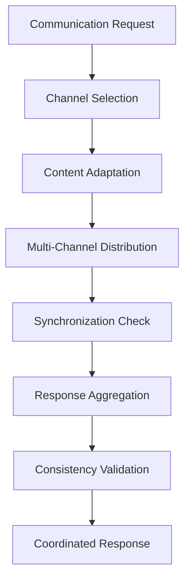
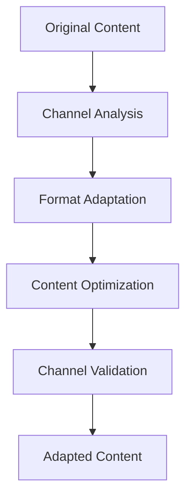
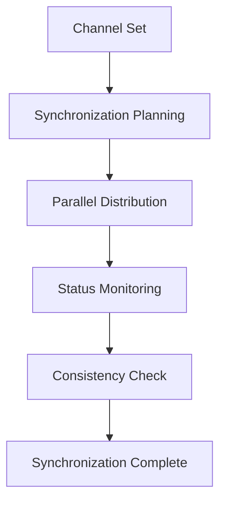

# **Communication Coordinator**

## **Overview**

The Communication Coordinator module provides comprehensive capabilities for coordinating communication across multiple channels, optimizing communication for different platforms, and ensuring consistency across all communication touchpoints. It enables seamless multi-channel communication management.

## **Core Principles**

### **Multi-Channel Coordination**
- **Channel Management**: Coordinate communication across multiple channels
- **Content Adaptation**: Adapt content for different channels and platforms
- **Synchronization**: Synchronize communication across platforms
- **Consistency Management**: Maintain consistency across all channels

### **Platform Optimization**
- **Channel Optimization**: Optimize communication for different channels
- **Platform Integration**: Integration with external communication platforms
- **Channel Selection**: Intelligent channel selection for optimal delivery
- **Performance Monitoring**: Monitor performance across all channels

### **High Performance**
- **Fast Coordination**: < 100ms coordination time
- **Real-time Sync**: Real-time synchronization across channels
- **High Availability**: 99.9% availability for all channels
- **Scalability**: Horizontal and vertical scaling capabilities

## **Function Specifications**

### **Primary Functions**

#### **coordinateCommunication(request: CommunicationRequest): CoordinationResult**
- **Purpose**: Coordinate communication across multiple channels
- **Parameters**:
  - `request`: Communication request with content and channels
- **Returns**: Coordination result with delivery status and metrics
- **Performance**: < 100ms coordination, seamless multi-channel experience

#### **adaptContent(content: Content, channel: Channel): AdaptedContent**
- **Purpose**: Adapt content for specific channel requirements
- **Parameters**:
  - `content`: Original content for adaptation
  - `channel`: Target channel for adaptation
- **Returns**: Channel-adapted content with optimization notes
- **Performance**: < 50ms adaptation time

#### **synchronizeChannels(channels: Channel[]): SynchronizationResult**
- **Purpose**: Synchronize communication across multiple channels
- **Parameters**:
  - `channels`: Array of channels to synchronize
- **Returns**: Synchronization result with status and consistency metrics
- **Performance**: < 100ms synchronization time

#### **validateConsistency(content: Content, channels: Channel[]): ConsistencyResult**
- **Purpose**: Validate consistency across all communication channels
- **Parameters**:
  - `content`: Content for consistency validation
  - `channels`: Channels to validate consistency across
- **Returns**: Consistency validation result with recommendations
- **Performance**: < 80ms validation time

### **Configuration Functions**

#### **configureCoordination(options: CoordinationConfig): void**
- **Purpose**: Configure communication coordination parameters
- **Parameters**:
  - `options`: Coordination configuration object
- **Returns**: void
- **Performance**: < 10ms configuration time

#### **addChannel(channel: Channel): void**
- **Purpose**: Add new communication channel
- **Parameters**:
  - `channel`: Channel configuration
- **Returns**: void
- **Performance**: < 50ms addition time

## **Integration Patterns**

### **Communication Coordination Flow**


### **Content Adaptation Flow**


### **Channel Synchronization Flow**


## **Capabilities**

### **Multi-Channel Support**
- **Channel Management**: Coordinate communication across multiple channels
- **Channel Optimization**: Optimize communication for different channels and platforms
- **Synchronization**: Synchronize communication across multiple platforms
- **Integration Management**: Manage integration with external communication systems
- **Consistency Management**: Maintain consistency across all communication channels

### **Content Adaptation**
- **Format Adaptation**: Adapt content format for different channels
- **Content Optimization**: Optimize content for channel-specific requirements
- **Channel Validation**: Validate content suitability for specific channels
- **Performance Optimization**: Optimize content for channel performance
- **Accessibility**: Ensure accessibility across all channels

### **Platform Integration**
- **API Integration**: Integration with communication platform APIs
- **Protocol Support**: Support for multiple communication protocols
- **Authentication**: Secure authentication for platform access
- **Rate Limiting**: Intelligent rate limiting and throttling
- **Error Handling**: Comprehensive error handling and recovery

### **Advanced Features**
- **Intelligent Routing**: Intelligent routing based on channel performance
- **Load Balancing**: Load balancing across communication channels
- **Failover Support**: Automatic failover to alternative channels
- **Performance Monitoring**: Real-time performance monitoring
- **Analytics Integration**: Integration with communication analytics

## **Configuration Examples**

### **Basic Coordination Configuration**
```yaml
communication_coordination:
  channels:
    supported_channels:
      - "web"
      - "mobile"
      - "email"
      - "sms"
      - "voice"
      - "chat"
    channel_optimization: true
    cross_channel_sync: true
  coordination:
    multi_channel_coordination: true
    content_adaptation: true
    response_aggregation: true
    consistency_validation: true
  integration:
    external_apis: true
    platform_integration: true
    synchronization: true
    error_handling: true
  performance:
    coordination_speed: "< 100ms"
    sync_accuracy: "99.9%"
    channel_availability: "99.9%"
    response_time: "< 500ms"
```

### **Advanced Coordination Configuration**
```yaml
communication_coordination:
  routing:
    intelligent_routing: true
    load_balancing: true
    failover_support: true
    performance_based_routing: true
  optimization:
    content_optimization: true
    channel_optimization: true
    performance_optimization: true
    accessibility_optimization: true
  monitoring:
    real_time_monitoring: true
    performance_tracking: true
    error_monitoring: true
    analytics_integration: true
  security:
    authentication: true
    encryption: true
    rate_limiting: true
    audit_logging: true
```

### **Channel Configuration**
```yaml
channel_configuration:
  web:
    enabled: true
    optimization: true
    performance_monitoring: true
    error_handling: true
  mobile:
    enabled: true
    push_notifications: true
    in_app_messaging: true
    performance_optimization: true
  email:
    enabled: true
    smtp_integration: true
    template_system: true
    delivery_tracking: true
  sms:
    enabled: true
    sms_gateway: true
    delivery_confirmation: true
    rate_limiting: true
  voice:
    enabled: true
    voice_api: true
    call_routing: true
    quality_monitoring: true
  chat:
    enabled: true
    chat_platforms: ["slack", "teams", "discord"]
    real_time_messaging: true
    bot_integration: true
```

## **Error Handling**

### **Coordination Errors**
- **Channel Failures**: Automatic channel failover and recovery
- **Sync Errors**: Synchronization validation and repair
- **Integration Errors**: Integration error isolation and recovery
- **Consistency Errors**: Consistency validation and correction

### **Content Adaptation Errors**
- **Adaptation Failures**: Fallback to standard content formats
- **Validation Errors**: Content validation and correction
- **Format Errors**: Format validation and repair
- **Optimization Errors**: Optimization error handling and recovery

### **Platform Integration Errors**
- **API Errors**: API error handling and retry mechanisms
- **Authentication Errors**: Authentication error handling and recovery
- **Rate Limit Errors**: Rate limit handling and throttling
- **Network Errors**: Network error handling and recovery

### **Configuration Errors**
- **Invalid Configuration**: Configuration validation and error reporting
- **Channel Errors**: Channel validation and correction
- **Resource Errors**: Resource management and optimization
- **Performance Errors**: Performance monitoring and optimization

## **Performance Considerations**

### **Coordination Performance**
- **Coordination Speed**: < 100ms for multi-channel coordination
- **Sync Accuracy**: 99.9% accuracy for cross-channel synchronization
- **Channel Availability**: 99.9% availability for all channels
- **Response Time**: < 500ms for coordinated responses

### **Content Adaptation Performance**
- **Adaptation Speed**: < 50ms for content adaptation
- **Format Optimization**: Fast format optimization and validation
- **Channel Validation**: Fast channel validation and checking
- **Performance Optimization**: Efficient performance optimization

### **Platform Integration Performance**
- **API Performance**: Fast API integration and communication
- **Authentication Speed**: Fast authentication and authorization
- **Rate Limiting**: Intelligent rate limiting and throttling
- **Error Recovery**: Fast error recovery and fallback

### **Scalability**
- **Horizontal Scaling**: Horizontal scaling for high-volume communication
- **Vertical Scaling**: Vertical scaling for resource optimization
- **Load Balancing**: Intelligent load balancing and distribution
- **Resource Management**: Efficient resource allocation and management

## **Monitoring & Observability**

### **Coordination Metrics**
- **Coordination Performance**: Multi-channel coordination performance
- **Sync Accuracy**: Cross-channel synchronization accuracy
- **Channel Performance**: Individual channel performance metrics
- **Integration Performance**: External integration performance metrics

### **Performance Metrics**
- **Processing Speed**: Average processing time and throughput
- **Memory Usage**: Memory usage and optimization metrics
- **CPU Usage**: CPU usage and optimization metrics
- **Throughput**: Overall system throughput and capacity

### **Quality Metrics**
- **Consistency Quality**: Consistency across channels and platforms
- **Adaptation Quality**: Content adaptation quality and effectiveness
- **Channel Quality**: Individual channel quality and performance
- **Integration Quality**: Platform integration quality and reliability

### **Operational Metrics**
- **System Health**: Overall system health and availability
- **Resource Utilization**: Resource utilization and optimization
- **Error Tracking**: Error tracking and analysis
- **Performance Trends**: Performance trends and optimization

## **Security Considerations**

### **Data Privacy**
- **Communication Privacy**: End-to-end encryption for communication data
- **Content Privacy**: Privacy protection for communication content
- **Channel Privacy**: Privacy protection for channel-specific data
- **Data Retention**: Configurable retention policies

### **Access Control**
- **Authentication**: Strong authentication for coordination services
- **Authorization**: Role-based access control for coordination functions
- **API Security**: Secure API access and rate limiting
- **Audit Logging**: Comprehensive audit trails for all operations

### **Content Security**
- **Input Validation**: Comprehensive input validation and sanitization
- **Content Filtering**: Automatic filtering of inappropriate content
- **Channel Security**: Channel-specific security and validation
- **Output Validation**: Validation of coordination outputs and results

---

**Version**: 1.0  
**Category**: Communication & Language  
**Subcategory**: Interaction Management  
**Focus**: Multi-channel communication coordination with platform integration 